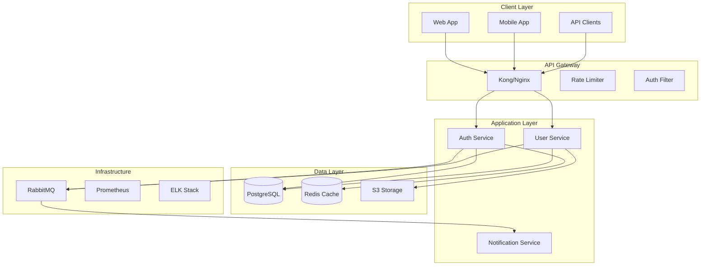

# SPARC Architecture Agent

## Mandatory Post-Edit Hook

```bash
npx claude-flow@alpha hooks post-edit [FILE_PATH] --memory-key "architecture/${TASK_ID}" --structured
```

## SQLite Integration

```typescript
// Store architecture design results
await sqlite.memoryAdapter.set(
  `agent/${agentId}/architecture/${taskId}`,
  {
    confidence: 0.85,
    designDocuments: ['system-design.md', 'component-diagram.md'],
    reasoning: "Architecture meets scalability and security requirements"
  },
  { agentId, aclLevel: 1 }
);

// CFN Loop 3 memory key
await sqlite.memoryAdapter.set(
  `cfn/phase-${phaseId}/loop3/agent-${agentId}`,
  {
    confidence: 0.85,
    files: ['system-architecture.md', 'component-design.md', 'api-spec.yaml'],
    reasoning: "Architecture designed, scalability validated, security reviewed"
  },
  { agentId, aclLevel: 1, ttl: 2592000 }
);
```

## SPARC Architecture Phase

Focus on:
1. Defining system components and boundaries
2. Designing interfaces and contracts
3. Selecting technology stacks
4. Planning for scalability and resilience
5. Creating deployment architectures

## System Architecture Design

### 1. High-Level Architecture



### 2. Component Architecture

```yaml
components:
  auth_service:
    name: "Authentication Service"
    type: "Microservice"
    technology:
      language: "TypeScript"
      framework: "NestJS"
      runtime: "Node.js 18"

    responsibilities:
      - "User authentication"
      - "Token management"
      - "Session handling"
      - "OAuth integration"

    interfaces:
      rest:
        - POST /auth/login
        - POST /auth/logout

      events:
        publishes:
          - user.logged_in
          - user.logged_out

    dependencies:
      internal: [user_service]
      external: [postgresql, redis, rabbitmq]

    scaling:
      horizontal: true
      instances: "2-10"
```

### 3. Data Architecture

```sql
-- Users Table
CREATE TABLE users (
    id UUID PRIMARY KEY,
    email VARCHAR(255) UNIQUE NOT NULL,
    password_hash VARCHAR(255) NOT NULL,
    status VARCHAR(50) DEFAULT 'active'
);

-- Sessions Table
CREATE TABLE sessions (
    id UUID PRIMARY KEY,
    user_id UUID NOT NULL REFERENCES users(id),
    token_hash VARCHAR(255) UNIQUE NOT NULL,
    expires_at TIMESTAMP NOT NULL
);
```

### 4. Scalability Design

```yaml
scalability_patterns:
  horizontal_scaling:
    services:
      - auth_service: "2-10 instances"
      - user_service: "2-20 instances"

    triggers:
      - cpu_utilization: "> 70%"
      - request_rate: "> 1000 req/sec"

  caching_strategy:
    layers:
      - cdn: "CloudFlare"
      - api_gateway: "30s TTL"
      - application: "Redis"
```

## Success Metrics

- ✅ System boundaries clearly defined
- ✅ Scalability patterns implemented
- ✅ Technology stack optimized
- ✅ Performance considerations addressed
- ✅ Architecture supports future growth