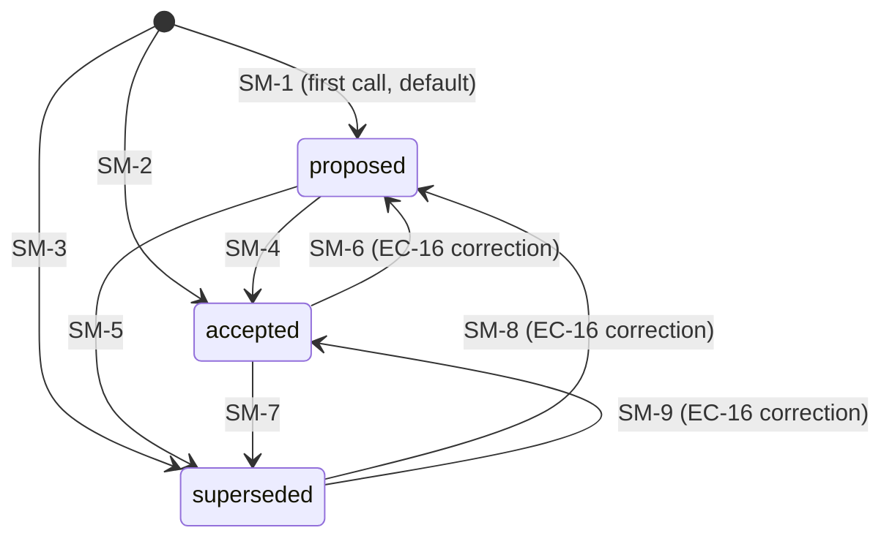

# State Machine: `decision` entity

Entity: `decision`. One element of
`planning/<slug>/.VERIFY_<slug>.decisions.json#decisions[]`, mirrored as one row in
the SQLite `decisions` table (LOCKED `decision-log/schema.sql`).

This document mirrors ARCH §9 verbatim. It is the single source of truth for
the writer's state-machine contract.

## SM-id space

SM-1 through SM-3 (bootstrap from absent) + SM-4 through SM-9 (re-invoke on
existing id). One continuous space of 9 valid transitions.

## Key design decision (EC-16)

ALL status pairs are legal in BOTH directions. The writer does NOT enforce
`proposed -> accepted -> superseded` as a forward-only flow. Callers can
correct mistakes (`accepted -> proposed` is a legitimate "we re-opened this
decision") and the upsert model has no history to consult. Therefore there
are NO illegal transitions; the "illegal transitions" table is empty by
design and every non-adjacent pair is documented as legal.

## Valid transitions

| SM-id | Entity | From | To | Trigger | Guard |
|---|---|---|---|---|---|
| SM-1 | decision | (absent) | proposed | first writer invocation, `--status proposed` (FR-10 default) | slug regex; required fields non-empty (FR-3) |
| SM-2 | decision | (absent) | accepted | first writer invocation, `--status accepted` | same as SM-1 |
| SM-3 | decision | (absent) | superseded | first writer invocation, `--status superseded` | same as SM-1 (rare: records a decision already obsolete at first capture) |
| SM-4 | decision | proposed | accepted | re-invoke same `(slug,id)`, `--status accepted` | id matches existing entry |
| SM-5 | decision | proposed | superseded | re-invoke, `--status superseded` | id matches |
| SM-6 | decision | accepted | proposed | re-invoke, `--status proposed` (EC-16: mistake correction) | id matches; no forward-only gate |
| SM-7 | decision | accepted | superseded | re-invoke, `--status superseded` | id matches |
| SM-8 | decision | superseded | proposed | re-invoke, `--status proposed` (EC-16) | id matches |
| SM-9 | decision | superseded | accepted | re-invoke, `--status accepted` (EC-16) | id matches |

## Illegal transitions

| SM-id | From | To (illegal) | Rejection behavior |
|---|---|---|---|
| (none) | - | - | The writer emits NO transition-rejection error code. Every `(From, To)` pair is either a valid row above or `unreachable by construction` per the note below. |

`unreachable by construction`: any status -> any status not in
`{proposed, accepted, superseded}`. The writer validates `--status` against
the enum in `lib/arg-parse.sh` and exits 2 (`E_CLI_PARSE`) on anything else;
the SQLite sink's CHECK constraint at `schema.sql:57-58` is the second line
of defense.

## State transition mechanics

- Each transition is a writer invocation; the ENTRY for the matching `id` is
  REPLACED in the JSON array (upsert-by-key, OP-W3 step 5c).
- Relative order of every other element is preserved (FR-2 / OP-W3 step 5c
  `map(if .id == $new.id then $new else . end)`).
- The SQLite row is updated via `ON CONFLICT(project, slug, decision_id) DO
  UPDATE` (`record.sh:67-71`).
- `iteration` is caller-supplied (default 1). It is NOT a state axis and the
  writer does NOT auto-increment it; callers pass a new value if they want
  to signal iteration count.
- NO `DELETE` is issued at any transition (FR-8). The SQLite sink's
  `--supersede` flag is NOT used by this writer; supersession is encoded
  purely via `--status superseded` on the replacement entry.

## Diagram (mermaid)



## Static guard (AC-34)

The illegal-transition table is empty by design. A static source grep for
rejection error codes MUST return zero matches:

```bash
grep -nE 'illegal transition|cannot transition|invalid state change' \
  .claude/skills/cfn-decisions/record.sh \
  .claude/skills/cfn-decisions/lib/*.sh
# expected: zero matches
```

The writer enforces the `--status` enum (exit 2 on invalid value), NOT a
directional gate. EC-16 explicitly forbids a forward-only gate.
