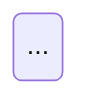

# Feature-Status + State-Machines Doc Contract

Canonical schema for the two commit-time docs. Single source of truth.
Humans read this. The `cfn-doc-lint` skill (`execute.sh`) enforces it.
Global `~/.claude/CLAUDE.md` "Commit-Time Documentation" references this file.

Why this exists: a 28-project audit found the same rot everywhere. Changelog
dumped into status docs (not status), status vocab drifting per project so no
grep works, duplicate state-machine files contradicting each other, prose walls
in table cells, and good docs hidden by singular filenames. This contract
kills all five failure modes.

## Filenames (closed)

Both docs live at `readme/` in every project, exact names:

- `readme/feature-status.md`
- `readme/state-machines.md` (plural, with the s)

Singular (`state-machine.md`) and domain-prefixed (`capacity-planning-state-machine.md`)
variants are non-conforming. Rename them. A project with no stateful surfaces
still ships a `state-machines.md` that says so explicitly.

## Status vocabulary (closed enum, all projects)

Five tokens, lowercase, exact:

| Token | Meaning |
|-------|---------|
| `prod` | Live, verified, monitored. Real users. |
| `beta` | Feature-complete, under verification. Usable but not trusted. |
| `dev` | In development. Not verifiable end-to-end. |
| `stub` | Scaffold only. Returns placeholder. Not real. |
| `deprecated` | Still present, scheduled for removal. Do not build on. |

Collapse legacy values to these:

- `Done`, `Ready`, `Shipped`, `Deployed`, `live`, `Production` -> `prod`
- `MVP`, `Partial`, `in-development` -> `beta` (or `dev` if not feature-complete)
- `Mock` -> `stub`
- `wired`, `experimental` -> `dev`
- `planned`, `not built`, `deferred` -> `stub` or `dev` (be honest which)

One token per Status cell. No prose in the cell. An emoji may prefix the token
(`✅ prod`) but the token must appear verbatim.

## feature-status.md contract

Top of file (first 15 lines):

- `**Last Updated:** YYYY-MM-DD (one-sentence reason)` (one line, not an essay)
- A status legend listing all five tokens with meanings (the table above is fine)

Required columns (closed set, this order):

| Feature | Status | Description | Dependencies | Known Limitations |
|---------|--------|-------------|--------------|-------------------|

Optional columns allowed: `Last Verified`, `Tests`, `Location`. Add them after
the required five, not interleaved.

Rules:

- **Description cell length.** Aim for 280 characters or fewer (one to two
  sentences). Over 800 characters is a wall and fails the lint; 280-800 is
  verbose and gets a warning. Walls are changelog or design note leaking into
  the cell. Move that detail to a linked sub-doc or fold the signal into
  `Known Limitations`.
- Status cell = exactly one vocab token.
- No changelog, diary, wave narrative, merge logs, or audit-history prose.
  History goes in `readme/CHANGELOG.md`. The header "Last Updated" line is the
  only history this file holds, and it is one sentence.
- If the file has > 300 lines, put a summary count table at top (rollup of
  features by status) so a human or script can answer "what is in prod?" in one
  glance.

## state-machines.md contract

Top of file:

- `**Last Updated:** YYYY-MM-DD (one-line reason)`
- If the file has > 300 lines, an anchor-link table of contents listing every
  entity.

Per entity, one H2, this skeleton:

```
## N. Entity Name

**Source:** table.column  OR  path/to/file.ext:line

### States
| State | Meaning |
|-------|---------|
| ...   | ...     |

### Transitions
| From | To | Trigger | Guard |
|------|----|---------|-------|
| ...  | .. | ...     | ...   |

### Diagram

```

Rules:

- One canonical H2 per entity. **Never prepend a dated copy** (`## Entity (2026-06-27)`)
  instead of editing the existing one. Edit in place. Duplicate entity names fail
  the lint.
- States are a closed enum. List deprecated states inline and label them.
- Transitions table columns: `From | To | Trigger`. `Guard` is optional but
  encouraged (the invariant that admits the transition).
- One diagram style per file: mermaid OR ASCII. Do not mix.
- No implementation commentary, code-review prose, or bug-fix history inside an
  entity. That belongs in an ADR or an inline code comment. The state-machines
  doc is a lifecycle contract: states, valid transitions, triggers, guards.
- `**Source:**` line grounds every entity to a table/column or a source file
  with line number. A state machine floating free of the code rots.

## CHANGELOG split

`readme/CHANGELOG.md` holds: dated change narratives, wave/diary entries, merge
logs, audit-history prose, "config fixes applied on" entries, feature-status
"Last Updated" essays. feature-status and state-machines hold current truth only.
