# Architecture Diagrams

**Version:** 1.0
**Last Updated:** 2025-11-16
**Status:** Complete

## Overview

This document contains comprehensive Mermaid diagrams visualizing the standardized integration system architecture, data flows, and component interactions.

---

## 1. System Architecture Overview

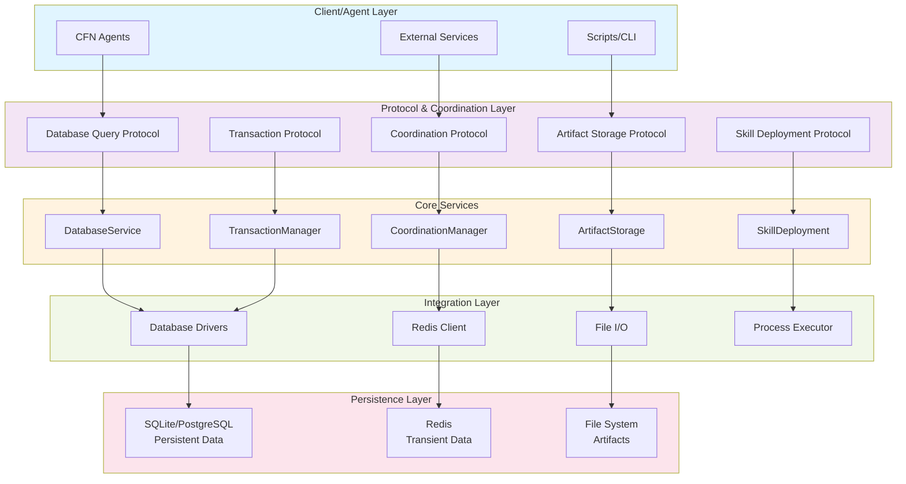

---

## 2. Query Execution Data Flow

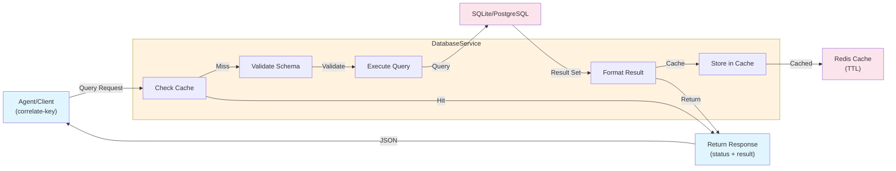

---

## 3. Coordination Signal Flow (Broadcast)

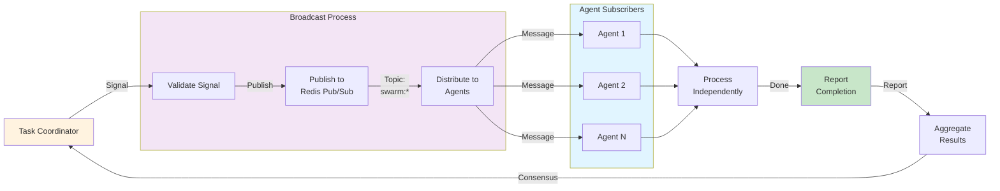

---

## 4. Transaction Execution with Savepoints

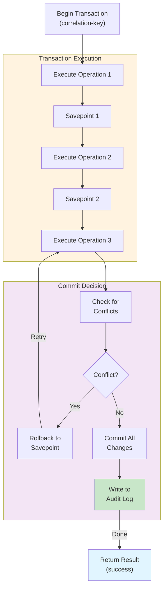

---

## 5. Artifact Versioning Timeline

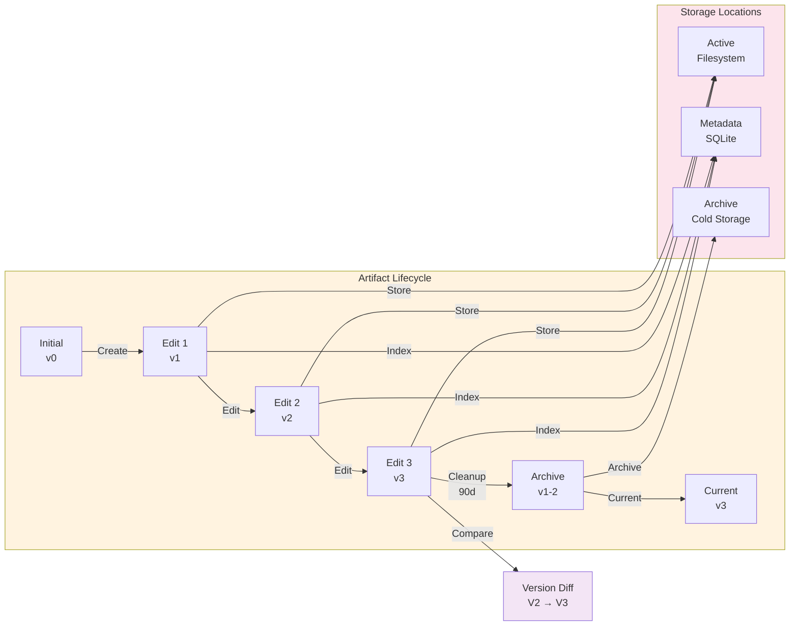

---

## 6. Skill Deployment Process

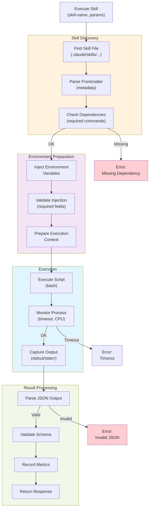

---

## 7. Schema Mapping Cross-Database Query

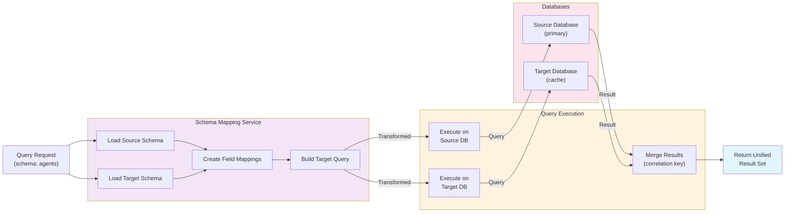

---

## 8. Correlation Key Lifecycle

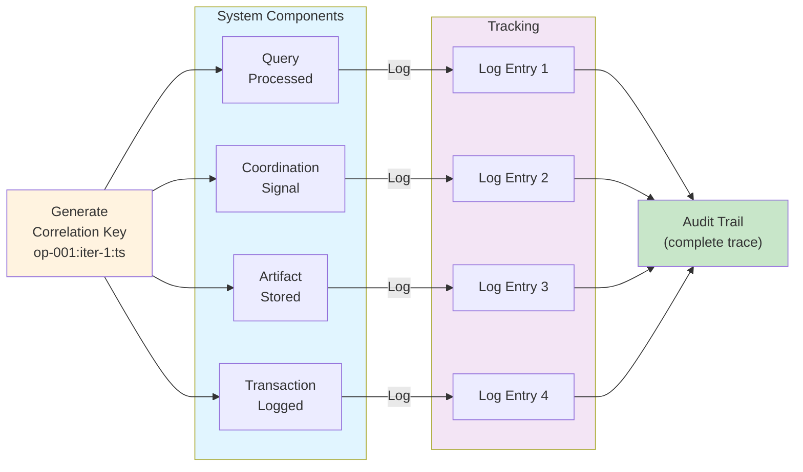

---

## 9. Error Handling and Retry Pattern

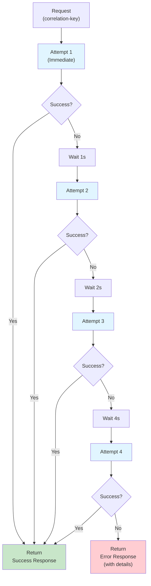

---

## 10. Deployment Architecture

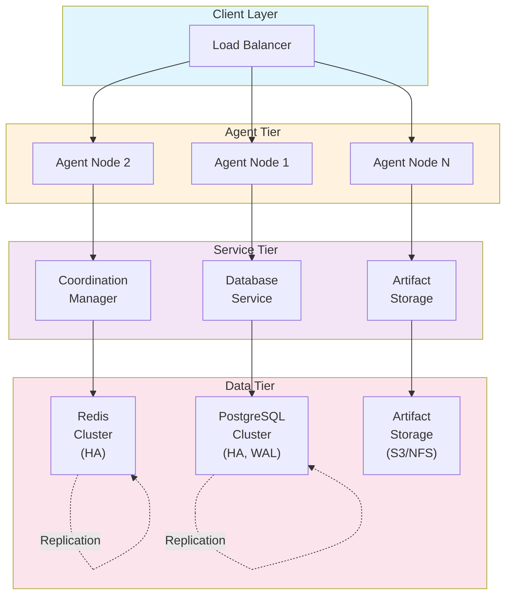

---

## 11. Cache Hit/Miss Pattern

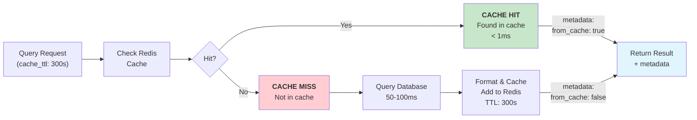

---

## 12. Integration Point Matrix

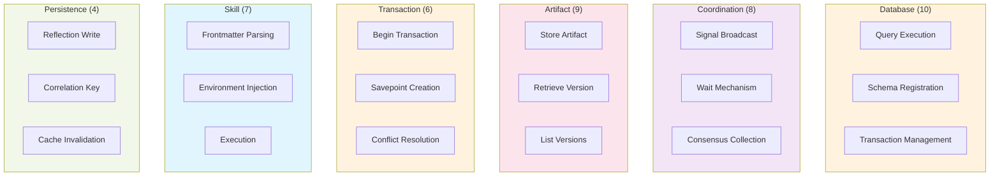

---

**Document Reference:** ARCHITECTURE_DIAGRAMS.md
**Maintained By:** API Documentation Specialist
**Last Reviewed:** 2025-11-16

All diagrams use Mermaid syntax and can be viewed with:
- GitHub markdown rendering
- Mermaid online editor: https://mermaid.live
- Visual Studio Code with Mermaid extension
- Any Mermaid-compatible documentation system
