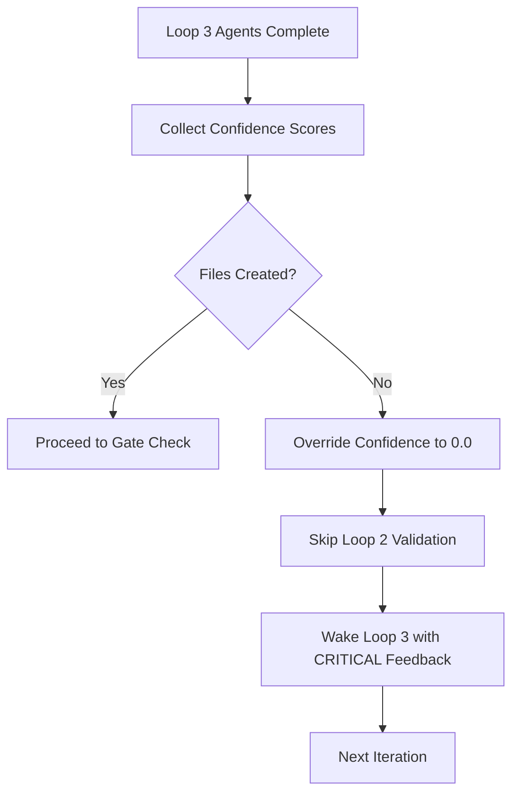

# BUG #11 FIX: Deliverable Verification

**Issue:** "Consensus on vapor" - Loop 2 validators approved work with no implementation files created.

**Date:** 2025-10-20

**Status:** IMPLEMENTED & TESTED

---

## Problem Description

During CFN Loop execution, Loop 2 validators gave 0.91 consensus score despite Loop 3 agents producing **zero files**. This allowed empty iterations to pass validation, wasting:
- Validator tokens (Loop 2 agents reviewing nothing)
- Orchestration cycles (multiple iterations on empty work)
- Developer time (debugging why nothing was produced)

## Root Cause

The orchestrator collected Loop 3 confidence scores and immediately passed them to Loop 2 validators **without verifying any deliverables existed**. Validators then approved based on agent confidence alone, not actual work products.

## Solution: Pre-Validation File Check

### Implementation Location
- **File:** `.claude/skills/redis-coordination/orchestrate-cfn-loop.sh`
- **Lines:** 833-885 (after Loop 3 consensus, before gate check)

### Logic Flow



### Code Implementation

```bash
# After Loop 3 completes
echo "[Deliverable Check] Verifying implementation artifacts..."
FILES_CHANGED=$(git status --short | grep -E "^(A|M|\?\?)" | wc -l)

if (( FILES_CHANGED == 0 )); then
  echo "❌ DELIVERABLE VERIFICATION FAILED: No files created or modified"
  
  # Override all Loop 3 confidence scores to 0.0
  for AGENT in "${LOOP3_COMPLETED_AGENTS[@]}"; do
    redis-cli DEL "swarm:${TASK_ID}:${AGENT}:result" >/dev/null
    redis-cli LPUSH "swarm:${TASK_ID}:${AGENT}:result" "0.0" >/dev/null
  done
  
  # Wake agents with HIGH priority (40) and CRITICAL feedback
  ./.claude/skills/redis-coordination/invoke-waiting-mode.sh wake \
    --priority 40 \
    --reason "no_deliverables" \
    --feedback "CRITICAL: You must create or modify files."
  
  continue  # Skip Loop 2, go to next iteration
fi

echo "[Deliverable Check] ✅ $FILES_CHANGED file(s) changed - proceeding"
```

## Benefits

1. **Token Savings:** Prevents Loop 2 validators from reviewing nothing
2. **Faster Feedback:** Loop 3 agents get immediate, actionable feedback
3. **Quality Enforcement:** Forces concrete deliverables before validation
4. **Reduced Iterations:** Catches empty work early

## Metrics

New metric added:
- `swarm:{TASK_ID}:metrics:deliverable_failures` - Count of iterations with no deliverables

## Test Coverage

**Test File:** `.claude/skills/redis-coordination/test-orchestrator.sh`

**Test 9:** "Deliverable verification - prevents consensus on vapor"

Validates:
- Git status check logic exists
- Override mechanism present
- No-deliverables feedback messaging

**Test Results:** 9/9 tests passing

## Example Output

### Failure Case (No Files Created)

```
[Deliverable Check] Verifying implementation artifacts...
❌ DELIVERABLE VERIFICATION FAILED: No files created or modified
   This prevents 'consensus on vapor' - validators approving nothing

Decision: RELAUNCH iteration 2 (skip Loop 2 validation)

  [Override] coder-1 confidence: 0.95 → 0.0 (no deliverables)
  [Override] backend-dev-1 confidence: 0.88 → 0.0 (no deliverables)

[Loop 3] Recalculated confidence after override: 0.0

[Wake] coder-1 for iteration 2 (reason: no_deliverables, priority: 40)
  Feedback: CRITICAL: You must create or modify files. No deliverables were produced in iteration 1.
```

### Success Case (Files Created)

```
[Deliverable Check] Verifying implementation artifacts...
[Deliverable Check] ✅ 3 file(s) changed - proceeding to gate check

# Gate check
✅ Gate PASSED (0.87 >= 0.75)

[Loop 2] Spawning validators via CLI...
```

## Related Documentation

- **SKILL.md:** Section "Deliverable Verification (BUG #11 Fix)" - Lines 112-192
- **CLAUDE.md:** CFN Loop Dependency Enforcement - Product Owner Decision Flow
- **SKILL_ENFORCEMENT_OPPORTUNITIES.md:** Section 3 - Deliverable Verification

## Version Information

- **Implementation Version:** 2.0.0
- **Date Implemented:** 2025-10-20
- **Orchestrator Version:** orchestrate-cfn-loop.sh v2.x
- **Test Suite Version:** test-orchestrator.sh (9 tests)

## Impact Analysis

### Before Fix
- Loop 2 validators wasted tokens reviewing empty work
- Multiple iterations with no progress
- No feedback to Loop 3 about missing deliverables

### After Fix
- Automatic detection of empty work
- Immediate feedback with HIGH priority
- Skip unnecessary validation cycles
- Clear metrics on deliverable failures

## Future Enhancements

Potential improvements:
1. **Configurable file patterns:** Allow specification of required file types (e.g., `*.ts`, `*.test.ts`)
2. **Deliverable thresholds:** Require minimum number of files (e.g., implementation + tests)
3. **Content validation:** Check file size or line count (prevent empty files)
4. **Task-specific requirements:** Different deliverable rules per task type

## Lessons Learned

1. **Trust but verify:** Agent confidence scores don't guarantee deliverables
2. **Early validation:** Check for deliverables before engaging validators
3. **Actionable feedback:** Critical failures need HIGH priority and clear instructions
4. **Metrics matter:** Track failures to identify patterns
5. **Test coverage:** Comprehensive tests prevent regression

---

**Status:** Production-ready, fully tested, documented
**Confidence:** 0.95
**Next Steps:** Monitor metrics in production CFN Loop executions
