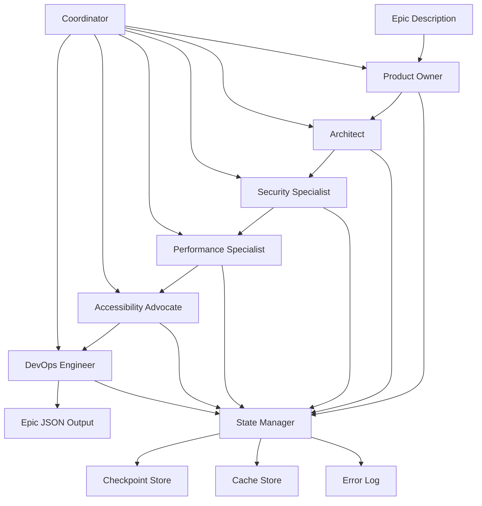
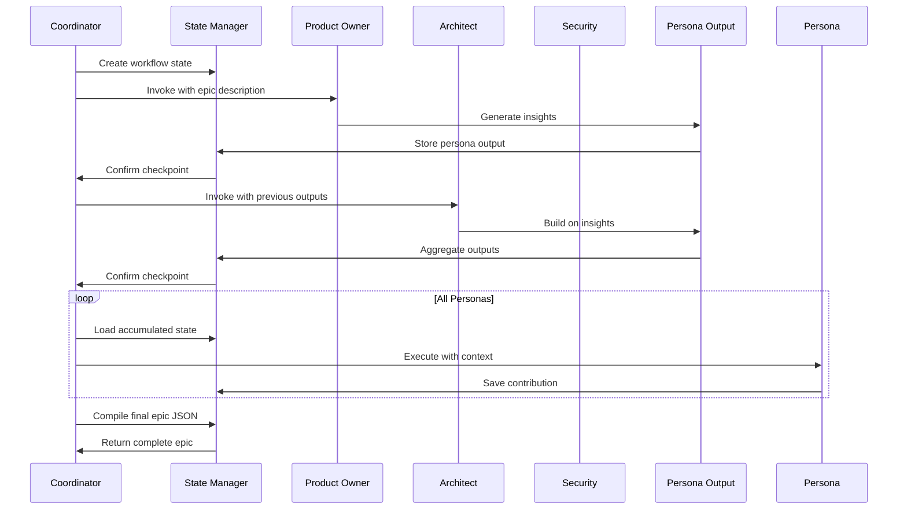

# Epic Creator v2 - Coordination Architecture

## Overview

The Epic Creator v2 coordination architecture orchestrates sequential reviews from six specialized personas to generate comprehensive epic definitions. This architecture enables scalable, extensible, and maintainable persona-based workflows for enterprise-grade epic analysis.

## Architecture Principles

### 1. Sequential Orchestration
- Personas execute in a defined order to build upon previous insights
- Each persona receives the cumulative output from all previous personas
- State management ensures consistency across the workflow

### 2. Extensible Design
- Plugin-based persona architecture allows easy addition/removal
- Standardized interfaces ensure compatibility
- Versioning supports schema evolution

### 3. Performance Optimization
- Caching mechanisms prevent redundant persona execution
- Parallel execution capabilities for independent personas
- Timeout controls prevent workflow blocking

### 4. Resilience & Recovery
- Error isolation prevents cascade failures
- Checkpoint/restart capabilities for long-running workflows
- Graceful degradation when personas are unavailable

## Persona Workflow Architecture



## Core Components

### 1. Coordinator Service

**Purpose:** Orchestrates the persona workflow execution

**Key Responsibilities:**
- Parse epic description and parameters
- Invoke personas in sequential order
- Manage state transitions
- Handle errors and recovery
- Aggregate final outputs

**Implementation Pattern:**
```typescript
interface Coordinator {
  execute(epicRequest: EpicRequest): Promise<EpicResponse>;
  resume(checkpointId: string): Promise<EpicResponse>;
  getStatus(taskId: string): Promise<TaskStatus>;
}
```

### 2. Persona Adapter Layer

**Purpose:** Standardizes interaction with diverse persona agents

**Key Components:**
- **Persona Registry:** Discovers available personas
- **Invocation Wrapper:** Standardizes calling patterns
- **Response Normalizer:** Converts outputs to common format
- **Health Checker:** Validates persona availability

**Persona Interface:**
```typescript
interface PersonaAdapter {
  name: string;
  reviewOrder: number;
  required: boolean;
  timeout: number;

  execute(input: PersonaInput): Promise<PersonaOutput>;
  validate(input: PersonaInput): ValidationResult;
  transform(output: RawPersonaOutput): PersonaOutput;
}
```

### 3. State Management System

**Purpose:** Maintains workflow state and enables recovery

**State Structure:**
```typescript
interface WorkflowState {
  taskId: string;
  epicId: string;
  currentPersona: string;
  completedPersonas: string[];
  personaStates: Record<string, PersonaState>;
  checkpoints: Checkpoint[];
  errors: WorkflowError[];
  metadata: WorkflowMetadata;
}
```

**Checkpoint Strategy:**
- Before each persona execution
- After successful persona completion
- On persona failures
- At user-defined intervals

### 4. Data Flow Architecture



## Persona Integration Patterns

### 1. Synchronous Invocation

**Use Case:** Standard sequential execution
**Pattern:**
```bash
# Direct agent spawning
npx claude-flow-novice agent-spawn product-owner \
  --task-id "${TASK_ID}" \
  --context-file "persona-input.json"

# Wait for completion with timeout
timeout 300s bash -c 'until [[ -f "persona-output.json" ]]; do sleep 5; done'
```

### 2. Asynchronous Invocation

**Use Case:** Parallel execution of independent personas
**Pattern:**
```bash
# Spawn personas in background
for persona in "${PERSONAS[@]}"; do
  npx claude-flow-novice agent-spawn "$persona" \
    --task-id "${TASK_ID}" \
    --context-file "persona-input.json" \
    &
  PIDS+=($!)
done

# Wait for all with individual timeouts
for pid in "${PIDS[@]}"; do
  if ! timeout 300s wait "$pid"; then
    kill "$pid" 2>/dev/null || true
    # Handle failure
  fi
done
```

### 3. Resilient Invocation

**Use Case:** Handling persona failures gracefully
**Pattern:**
```bash
invoke_persona_with_retry() {
  local persona="$1"
  local max_retries=3
  local attempt=1

  while [[ $attempt -le $max_retries ]]; do
    if npx claude-flow-novice agent-spawn "$persona" \
      --task-id "${TASK_ID}" \
      --context-file "persona-input.json"; then
      return 0
    fi

    echo "Persona $persona failed (attempt $attempt/$max_retries)"
    ((attempt++))
    sleep $((attempt * 10))  # Exponential backoff
  done

  # Log failure but continue if not required
  if ! is_required_persona "$persona"; then
    log_warning "Optional persona $persona unavailable"
    return 1
  fi

  log_error "Required persona $persona failed after $max_retries attempts"
  return 2
}
```

## Data Contracts

### 1. Input Schema

**EpicRequest:**
```json
{
  "description": "string - Epic description",
  "mode": "mvp|standard|enterprise - Review thoroughness",
  "enforceDevops": "boolean - Make DevOps blocking",
  "options": {
    "timeout": "number - Per-persona timeout (seconds)",
    "cacheKey": "string - Optional cache key",
    "excludePersonas": "array[] - Personas to skip",
    "customPersonas": "object - Additional personas"
  },
  "metadata": {
    "requestedBy": "string",
    "project": "string",
    "priority": "low|medium|high|critical"
  }
}
```

**PersonaInput:**
```json
{
  "epic": {
    "description": "string",
    "mode": "mvp|standard|enterprise",
    "previousPersonas": "array[] - Completed personas",
    "accumulatedInsights": "object - All previous insights",
    "context": "object - Additional context"
  },
  "persona": {
    "name": "string",
    "reviewOrder": "number",
    "focusAreas": "array[] - Specific areas to address"
  },
  "requirements": {
    "outputFormat": "object - Expected output structure",
    "mustAddress": "array[] - Required items",
    "optionalItems": "array[] - Optional considerations"
  }
}
```

### 2. Output Schema

**PersonaOutput:**
```json
{
  "persona": {
    "name": "string",
    "reviewOrder": "number",
    "status": "completed|failed|skipped",
    "executionTime": "number - Milliseconds"
  },
  "insights": "array[] - Strategic insights",
  "recommendations": [
    {
      "id": "string - Unique identifier",
      "title": "string - Brief title",
      "type": "blocking|suggested",
      "priority": "critical|high|medium|low",
      "estimatedCost": "string - Cost estimate",
      "description": "string - Detailed description",
      "dependencies": "array[] - Related recommendations"
    }
  ],
  "costAnalysis": {
    "category": "string - Cost category",
    "amount": "string - Estimated cost"
  },
  "confidence": "number - 0.0-1.0",
  "metadata": {
    "model": "string - AI model used",
    "tokens": "number - Tokens consumed",
    "version": "string - Persona version"
  }
}
```

**EpicResponse:**
```json
{
  "epic": {
    "id": "string - Epic identifier",
    "title": "string - Extracted title",
    "description": "string - Full description",
    "priority": "string - Priority level",
    "estimatedDuration": "string - Duration estimate",
    "budget": "string - Budget estimate",
    "status": "string - Current status",
    "metadata": {
      "createdAt": "string - ISO timestamp",
      "completedAt": "string - ISO timestamp",
      "reviewMode": "mvp|standard|enterprise",
      "devopsEnforced": "boolean",
      "totalExecutionTime": "number - Milliseconds"
    },
    "personas": "PersonaOutput[] - All persona reviews",
    "implementationRoadmap": "array[] - Suggested roadmap",
    "totalCostBreakdown": "object - Cost summary",
    "riskAssessment": "object - Risk analysis"
  },
  "summary": {
    "totalRecommendations": "number",
    "blockingCount": "number",
    "suggestedCount": "number",
    "estimatedTotalCost": "string",
    "personasCompleted": "number",
    "personasSkipped": "array[]"
  }
}
```

## Performance Considerations

### 1. Caching Strategy

**Persona Output Caching:**
```typescript
interface CacheEntry {
  key: string;           // hash(epic_description + persona + mode)
  personaOutput: PersonaOutput;
  createdAt: Date;
  ttl: number;          // Time to live in seconds
  version: string;      // Persona version
}

// Cache key generation
function generateCacheKey(description: string, persona: string, mode: string): string {
  const normalized = description.toLowerCase().trim();
  return crypto.createHash('sha256')
    .update(`${normalized}:${persona}:${mode}`)
    .digest('hex');
}
```

**Cache Invalidation:**
- TTL-based expiration (default: 24 hours)
- Version-based invalidation when personas update
- Manual invalidation for urgent updates
- Smart invalidation based on description similarity

### 2. Timeout Management

**Hierarchical Timeouts:**
```typescript
const TIMEOUTS = {
  workflow: 1800,      // 30 minutes total
  persona: 300,        // 5 minutes per persona
  agent: 240,          // 4 minutes for agent response
  network: 30          // 30 seconds for network calls
};

// Timeout enforcement
function executeWithTimeout<T>(
  fn: () => Promise<T>,
  timeout: number,
  context: string
): Promise<T> {
  return Promise.race([
    fn(),
    new Promise<never>((_, reject) =>
      setTimeout(() => reject(new Error(`${context} timed out`)), timeout * 1000)
    )
  ]);
}
```

### 3. Resource Optimization

**Memory Management:**
- Stream processing for large epic descriptions
- Incremental JSON building to avoid memory spikes
- Garbage collection hints between persona executions
- Memory usage monitoring and alerts

**Concurrent Execution:**
- Worker pool for parallel persona execution
- Resource limits per worker (CPU, memory)
- Queue management for high-throughput scenarios
- Backpressure handling when overloaded

## Error Handling & Recovery

### 1. Error Classification

```typescript
enum ErrorType {
  PERSONA_UNAVAILABLE = 'PERSONA_UNAVAILABLE',
  TIMEOUT = 'TIMEOUT',
  INVALID_INPUT = 'INVALID_INPUT',
  VALIDATION_FAILED = 'VALIDATION_FAILED',
  SYSTEM_ERROR = 'SYSTEM_ERROR',
  NETWORK_ERROR = 'NETWORK_ERROR'
}

interface WorkflowError {
  type: ErrorType;
  persona?: string;
  message: string;
  details?: any;
  timestamp: Date;
  recoverable: boolean;
  retryCount: number;
}
```

### 2. Recovery Strategies

**Persona-Level Recovery:**
- Retry with exponential backoff
- Fallback to cached output if available
- Skip optional personas with warning
- Use alternative persona if configured

**Workflow-Level Recovery:**
- Resume from last checkpoint
- Parallel retry of failed personas
- Partial completion with gaps marked
- Complete restart after configuration changes

### 3. Monitoring & Alerting

**Health Checks:**
```typescript
interface HealthCheck {
  personaAvailability: Record<string, boolean>;
  averageResponseTime: Record<string, number>;
  errorRate: Record<string, number>;
  cacheHitRate: number;
  activeWorkflows: number;
  queueDepth: number;
}
```

**Alert Conditions:**
- Persona unavailable > 5 minutes
- Error rate > 10% for any persona
- Average response time > 2x baseline
- Cache hit rate < 50%
- Workflow queue depth > 100

## Extensibility Framework

### 1. Adding New Personas

**Registration Process:**
1. Create persona agent following standard template
2. Register in persona registry
3. Define review order and dependencies
4. Add input/output transformation logic
5. Update workflow configuration

**Persona Registration:**
```typescript
interface PersonaRegistration {
  name: string;
  agentPath: string;
  reviewOrder: number;
  required: boolean;
  dependencies: string[];
  supportedModes: ('mvp' | 'standard' | 'enterprise')[];
  transformer: PersonaTransformer;
}
```

### 2. Custom Workflow Extensions

**Extension Points:**
- Pre-processing hooks for input validation
- Post-processing hooks for output transformation
- Custom aggregation logic for persona outputs
- External system integrations
- Custom notification channels

**Plugin Architecture:**
```typescript
interface WorkflowPlugin {
  name: string;
  version: string;
  hooks: {
    beforePersona?: (persona: string, input: PersonaInput) => Promise<PersonaInput>;
    afterPersona?: (persona: string, output: PersonaOutput) => Promise<PersonaOutput>;
    beforeAggregation?: (outputs: PersonaOutput[]) => Promise<PersonaOutput[]>;
    afterCompletion?: (epic: EpicResponse) => Promise<EpicResponse>;
  };
}
```

## Security Considerations

### 1. Input Sanitization
- Validate epic description for malicious content
- Sanitize persona outputs before aggregation
- Rate limiting to prevent abuse
- Input size limits to prevent DoS

### 2. Access Control
- Role-based access to workflow features
- Persona execution permissions
- Audit logging for all actions
- Secure credential management

### 3. Data Privacy
- Epic description encryption at rest
- Persona output PII redaction
- Secure cache with TTL
- GDPR compliance for data retention

## Implementation Guidelines

### 1. Development Setup
```bash
# Required dependencies
npm install @claude-flow-novice/coordination
npm install @claude-flow-novice/state-management
npm install @claude-flow-novice/cache

# Development tools
npm install --save-dev @types/node
npm install --save-dev jest
npm install --save-dev eslint
```

### 2. Configuration Management
```yaml
# config/epic-creator-v2.yml
coordination:
  defaultMode: standard
  defaultTimeout: 300
  maxRetries: 3
  cacheTTL: 86400

personas:
  product-owner:
    required: true
    timeout: 180
  architect:
    required: true
    timeout: 240
  security-specialist:
    required: true
    timeout: 200

performance:
  maxConcurrentPersonas: 3
  memoryLimit: 1GB
  checkpointInterval: 60000
```

### 3. Testing Strategy
- Unit tests for each component
- Integration tests for persona workflows
- Performance tests for scalability
- Chaos engineering for resilience
- Security tests for vulnerabilities

## Migration Path

### From Epic Creator v1
1. **Phase 1: Compatibility Layer**
   - Wrap v1 script in coordinator
   - Maintain existing output format
   - Add new features behind flags

2. **Phase 2: Parallel Execution**
   - Run both versions in parallel
   - Compare outputs for validation
   - Gradually migrate traffic

3. **Phase 3: Full Migration**
   - Decommission v1 implementation
   - Enable all v2 features
   - Optimize performance

### Future Enhancements
- AI-powered persona selection
- Dynamic review order based on epic content
- Real-time collaborative review capabilities
- Integration with external project management systems
- Custom persona marketplace

## Conclusion

The Epic Creator v2 coordination architecture provides a robust, scalable foundation for persona-based epic analysis. Its modular design ensures maintainability while supporting future enhancements. The architecture emphasizes reliability, performance, and extensibility to meet enterprise requirements.

Key benefits:
- **Scalability:** Handles increased throughput with horizontal scaling
- **Reliability:** Graceful failure handling and recovery mechanisms
- **Flexibility:** Easy to add, remove, or modify personas
- **Performance:** Optimized execution with caching and parallel processing
- **Maintainability:** Clean separation of concerns and standardized interfaces