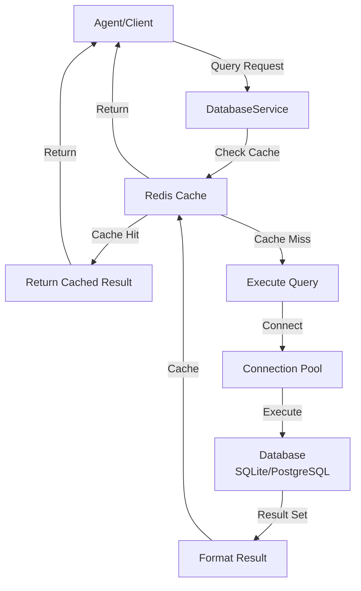
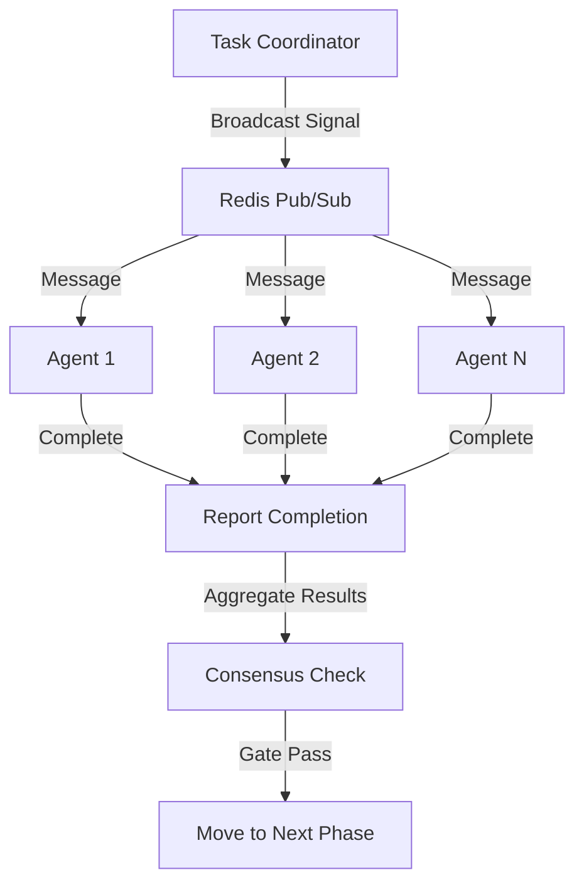
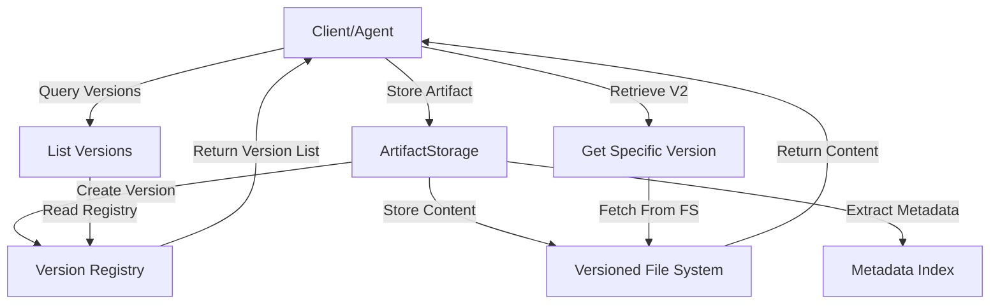
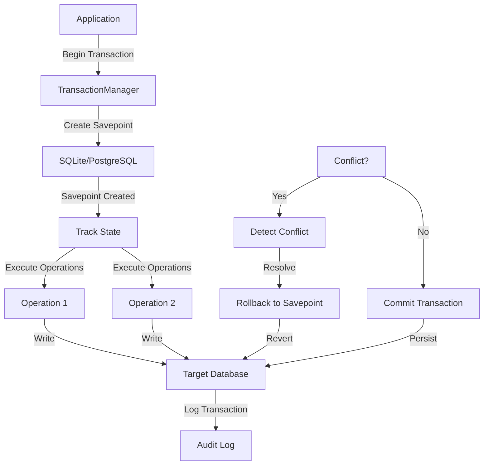

# Integration Standardization Overview

**Version:** 1.0
**Last Updated:** 2025-11-16
**Status:** Complete

## Table of Contents

1. [Executive Summary](#executive-summary)
2. [System Architecture](#system-architecture)
3. [Integration Point Catalog](#integration-point-catalog)
4. [Data Flow](#data-flow)
5. [Component Interaction Patterns](#component-interaction-patterns)
6. [Design Principles](#design-principles)
7. [Core Standardization Elements](#core-standardization-elements)
8. [Integration Layers](#integration-layers)
9. [Communication Patterns](#communication-patterns)
10. [Deployment Architecture](#deployment-architecture)

---

## Executive Summary

This document describes the comprehensive integration standardization framework implemented across Sprints 0-5. The standardization provides:

- **47 documented integration points** across database, coordination, and artifact systems
- **7 core protocols** for reliable inter-system communication
- **Multi-layer persistence** combining Redis (transient) and SQLite/PostgreSQL (persistent)
- **Correlation-based tracking** for unified operation tracing
- **Adaptive error handling** with circuit breaker patterns
- **Transaction management** ensuring ACID compliance
- **Skill deployment framework** with standardized frontmatter metadata

The standardized architecture enables:

- **Unified Data Access**: Database Service abstraction layer
- **Reliable Coordination**: Protocol-based inter-agent communication
- **Artifact Management**: Centralized storage with versioning
- **Persistent Reflection**: Multi-dimensional analysis and insight caching
- **Schema Mapping**: Automatic mapping between heterogeneous data sources

---

## System Architecture

### High-Level Overview

```
┌─────────────────────────────────────────────────────────────┐
│                    Agent/Client Layer                        │
│  (CFN Agents, Scripts, External Services)                   │
└──────────────────────┬──────────────────────────────────────┘
                       │
┌──────────────────────▼──────────────────────────────────────┐
│              Coordination & Protocol Layer                   │
│  (CoordinationManager, Protocol Handlers, Validation)       │
└──────────────────────┬──────────────────────────────────────┘
                       │
        ┌──────────────┼──────────────┐
        │              │              │
┌───────▼─────┐ ┌──────▼──────┐ ┌───▼────────┐
│  Database   │ │ Coordination │ │  Artifact  │
│  Service    │ │  Manager     │ │  Storage   │
│  (Query,    │ │  (Signals,   │ │  (Versioned│
│   Schema)   │ │   Waiting)   │ │   Storage) │
└───────┬─────┘ └──────┬──────┘ └───┬────────┘
        │              │            │
        └──────────────┼────────────┘
                       │
        ┌──────────────┼──────────────┐
        │              │              │
┌───────▼─────┐ ┌──────▼──────┐ ┌───▼────────┐
│   Redis     │ │  SQLite/    │ │  File      │
│  (Cache,    │ │  PostgreSQL │ │  System    │
│   Signals)  │ │  (Persistent)│ │ (Artifacts)│
└─────────────┘ └─────────────┘ └────────────┘
```

### Component Description

| Component | Purpose | Key Features |
|-----------|---------|--------------|
| **Database Service** | Unified query interface | Schema abstraction, query caching, connection pooling |
| **Coordination Manager** | Inter-agent signaling | Signal broadcast, wait mechanisms, consensus collection |
| **Artifact Storage** | Content versioning | Git-like versioning, metadata tracking, format preservation |
| **Transaction Manager** | ACID operations | Distributed transactions, rollback support, conflict resolution |
| **Skill Deployment** | Standardized execution | Frontmatter metadata, environment injection, output capture |
| **Edge Case Analyzer** | Anomaly detection | Pattern recognition, confidence scoring, context preservation |

---

## Integration Point Catalog

### 1. Database Integration Points (10 points)

| ID | Name | Purpose | Protocol | Source → Target |
|----|------|---------|----------|-----------------|
| DB-001 | Query Submission | Standard query execution | Database Query Protocol | Client → DatabaseService |
| DB-002 | Schema Registration | Register new data schema | Database Query Protocol | Client → DatabaseService |
| DB-003 | Query Result Caching | Cache frequently accessed data | Database Query Protocol | DatabaseService → Redis Cache |
| DB-004 | Transaction Submission | Begin distributed transaction | Transaction Protocol | Client → TransactionManager |
| DB-005 | Conflict Detection | Detect write conflicts | Transaction Protocol | TransactionManager → DatabaseService |
| DB-006 | Rollback Execution | Rollback failed transactions | Transaction Protocol | TransactionManager → Target DB |
| DB-007 | Connection Pooling | Maintain persistent connections | Database Query Protocol | DatabaseService → DB Connection Pool |
| DB-008 | Schema Mapping | Map heterogeneous schemas | Schema Mapping Protocol | DataMapper → Source & Target Schemas |
| DB-009 | Cross-system Query | Query across multiple databases | Schema Mapping Protocol | Client → DataMapper → Databases |
| DB-010 | Query Profiling | Performance metrics collection | Database Query Protocol | DatabaseService → Metrics Store |

### 2. Coordination Integration Points (8 points)

| ID | Name | Purpose | Protocol | Source → Target |
|----|------|---------|----------|-----------------|
| COORD-001 | Signal Broadcast | Distribute messages to agents | Coordination Protocol | CoordinationManager → Redis Pub/Sub |
| COORD-002 | Agent Registration | Register new agent in swarm | Coordination Protocol | Agent → CoordinationManager |
| COORD-003 | Wait Mechanism | Block until condition met | Coordination Protocol | Agent → CoordinationManager (blocking) |
| COORD-004 | Completion Signaling | Report task completion | Coordination Protocol | Agent → CoordinationManager |
| COORD-005 | Consensus Collection | Aggregate multiple agent decisions | Coordination Protocol | Validator Pool → CoordinationManager |
| COORD-006 | Gate Checking | Validate confidence thresholds | Coordination Protocol | Orchestrator → CoordinationManager |
| COORD-007 | Context Injection | Pass execution context to agents | Coordination Protocol | Coordinator → Agent |
| COORD-008 | Health Monitoring | Track agent process health | Coordination Protocol | Orchestrator → Process Monitor |

### 3. Artifact Storage Integration Points (9 points)

| ID | Name | Purpose | Protocol | Source → Target |
|----|------|---------|----------|-----------------|
| ART-001 | Store Artifact | Save versioned content | Artifact Storage Protocol | Client → ArtifactStorage |
| ART-002 | Retrieve Version | Get specific version | Artifact Storage Protocol | Client → ArtifactStorage |
| ART-003 | List Versions | Enumerate version history | Artifact Storage Protocol | Client → ArtifactStorage |
| ART-004 | Metadata Update | Track artifact properties | Artifact Storage Protocol | Client → ArtifactStorage |
| ART-005 | Version Diff | Compare between versions | Artifact Storage Protocol | Client → ArtifactStorage |
| ART-006 | Cleanup Old Versions | Remove outdated versions | Artifact Storage Protocol | Maintenance Job → ArtifactStorage |
| ART-007 | Format Conversion | Convert between formats | Artifact Storage Protocol | Converter → ArtifactStorage |
| ART-008 | Artifact Search | Find by metadata | Artifact Storage Protocol | Client → ArtifactStorage |
| ART-009 | Artifact Access Control | Restrict access by agent | Artifact Storage Protocol | ACL Manager → ArtifactStorage |

### 4. Transaction Integration Points (6 points)

| ID | Name | Purpose | Protocol | Source → Target |
|----|------|---------|----------|-----------------|
| TXN-001 | Transaction Begin | Start atomic operation | Transaction Protocol | Client → TransactionManager |
| TXN-002 | Savepoint Creation | Create rollback point | Transaction Protocol | TransactionManager → Target System |
| TXN-003 | Conflict Resolution | Handle write conflicts | Transaction Protocol | TransactionManager → Conflict Resolver |
| TXN-004 | Commit Verification | Verify commit success | Transaction Protocol | TransactionManager → Distributed Log |
| TXN-005 | Rollback Execution | Revert to savepoint | Transaction Protocol | TransactionManager → Target System |
| TXN-006 | Transaction Logging | Audit trail creation | Transaction Protocol | TransactionManager → Audit Log |

### 5. Skill Deployment Integration Points (7 points)

| ID | Name | Purpose | Protocol | Source → Target |
|----|------|---------|----------|-----------------|
| SKILL-001 | Frontmatter Parsing | Extract metadata | Skill Deployment Protocol | SkillLoader → Skill File |
| SKILL-002 | Environment Injection | Set execution environment | Skill Deployment Protocol | SkillRunner → Process Environment |
| SKILL-003 | Script Execution | Execute skill logic | Skill Deployment Protocol | SkillRunner → Shell Process |
| SKILL-004 | Output Capture | Collect execution results | Skill Deployment Protocol | SkillRunner → Output Stream |
| SKILL-005 | Error Handling | Handle execution failures | Skill Deployment Protocol | SkillRunner → Error Handler |
| SKILL-006 | Performance Metrics | Record execution statistics | Skill Deployment Protocol | SkillRunner → Metrics Store |
| SKILL-007 | Dependency Resolution | Load required dependencies | Skill Deployment Protocol | SkillLoader → Dependency Manager |

### 6. Persistence Integration Points (4 points)

| ID | Name | Purpose | Protocol | Source → Target |
|----|------|---------|----------|-----------------|
| PERSIST-001 | Reflection Data Write | Store analysis results | Reflection Persistence Protocol | EdgeCaseAnalyzer → Database |
| PERSIST-002 | Correlation Key Usage | Link operations across systems | Database Query Protocol | Any System → Correlation Index |
| PERSIST-003 | Cache Invalidation | Remove stale cached data | Database Query Protocol | Database Modifier → Redis Cache |
| PERSIST-004 | Log Archival | Move old logs to cold storage | Database Query Protocol | LogManager → Archive Database |

### 7. Schema Integration Points (3 points)

| ID | Name | Purpose | Protocol | Source → Target |
|----|------|---------|----------|-----------------|
| SCHEMA-001 | Schema Discovery | Auto-detect schema | Schema Mapping Protocol | DataMapper → Source Database |
| SCHEMA-002 | Mapping Transformation | Apply field mappings | Schema Mapping Protocol | DataMapper → Target Database |
| SCHEMA-003 | Type Validation | Validate data types | Schema Mapping Protocol | Validator → Data Record |

---

## Data Flow

### Query Execution Flow



### Coordination Flow



### Artifact Versioning Flow



### Transaction Execution Flow



---

## Component Interaction Patterns

### 1. Request-Response Pattern

Used for synchronous operations requiring immediate results.

**Participants:** Client, Service, Database

**Flow:**
1. Client sends request with correlation key
2. Service looks up schema (cached)
3. Service validates query against schema
4. Service executes query with timeout
5. Service caches result
6. Service returns response to client

**Example:** Database queries, artifact retrieval

### 2. Broadcast-Subscribe Pattern

Used for one-to-many coordination and event distribution.

**Participants:** Coordinator, Redis Pub/Sub, Agents

**Flow:**
1. Coordinator publishes signal to topic
2. Redis distributes to all subscribers
3. Each agent receives notification
4. Agents process independently
5. Agents report completion back

**Example:** Agent coordination, task distribution

### 3. Transaction Pattern

Used for atomic multi-step operations with rollback support.

**Participants:** Client, TransactionManager, Multiple Databases

**Flow:**
1. Client initiates transaction (correlation key)
2. TransactionManager creates savepoint
3. Each operation tracked with correlation key
4. On conflict, automatic rollback to savepoint
5. On success, commit all changes
6. All changes logged with correlation key

**Example:** Multi-database updates, distributed transactions

### 4. Schema Mapping Pattern

Used for querying across heterogeneous data sources.

**Participants:** Client, DataMapper, Multiple Schemas

**Flow:**
1. Client defines logical query
2. DataMapper loads source and target schemas
3. DataMapper creates field mappings
4. DataMapper transforms query for each source
5. Execute queries independently
6. Merge results using correlation keys
7. Return unified result set

**Example:** Cross-system queries, data warehouse operations

### 5. Skill Deployment Pattern

Used for standardized execution of scripts and tools.

**Participants:** SkillLoader, SkillRunner, Skill File, Process

**Flow:**
1. SkillLoader reads skill file
2. Extract frontmatter metadata
3. Validate dependencies
4. Set environment variables
5. Execute script in isolated process
6. Capture stdout/stderr
7. Parse JSON output
8. Report metrics and completion

**Example:** Custom analysis scripts, external tool execution

---

## Design Principles

### 1. Separation of Concerns

- **Database Layer**: All query operations isolated in DatabaseService
- **Coordination Layer**: All signaling/messaging in CoordinationManager
- **Storage Layer**: All artifact operations in ArtifactStorage
- **Transaction Layer**: All distributed operations in TransactionManager

**Benefit:** Changes to one layer don't cascade to others.

### 2. Correlation-Based Tracing

Every operation receives a **correlation key** that persists across:
- Database queries
- Coordination messages
- Artifact operations
- Transaction logs

**Format:** `${operation-id}:${iteration}:${timestamp}`

**Benefit:** Complete traceability of complex operations across systems.

### 3. Multi-Layer Persistence

**Redis (L1 Cache)**
- Transient coordination signals
- Query result cache (TTL-based)
- Session state
- Performance critical: sub-millisecond access

**SQLite/PostgreSQL (L2 Persistent)**
- Permanent transaction logs
- Audit trails
- Schema definitions
- Large datasets
- Cost optimal: structured data storage

**File System (L3 Archive)**
- Versioned artifacts
- Long-term backups
- Immutable records
- Legal compliance storage

**Benefit:** Optimal cost/performance tradeoff with appropriate durability guarantees.

### 4. Adaptive Error Handling

```
Request → Attempt 1
  ├─ Success? → Return
  ├─ Timeout? → Retry with backoff
  ├─ Circuit Open? → Wait then retry
  └─ Permanent Error? → Return error + context
```

**Implements:**
- Exponential backoff (1s, 2s, 4s, 8s max)
- Circuit breaker (after 5 failures)
- Graceful degradation (cached fallback)
- Detailed error context

### 5. Schema-First Design

All data access is schema-aware:
- Schemas cached in Redis (1-hour TTL)
- Queries validated against schema
- Type conversion applied
- Missing schemas trigger discovery

**Benefit:** Type safety without strong-typing languages.

### 6. Atomicity at Operation Level

Each integration point is designed as atomic:
- Transaction success is all-or-nothing
- Signals broadcast atomically
- Artifacts versioned atomically
- Schemas updated atomically

**Benefit:** No partial states, easier debugging.

---

## Core Standardization Elements

### Element 1: Integration Protocols

| Protocol | Purpose | Format | Error Handling |
|----------|---------|--------|-----------------|
| Database Query | Uniform query interface | JSON with schema | Validation errors, timeout, retry |
| Coordination | Agent signaling | Redis Pub/Sub messages | Lost signals, recovery protocol |
| Artifact Storage | Content versioning | Filesystem + metadata DB | Version conflicts, cleanup |
| Transaction | Distributed ACID | Multi-step with savepoints | Rollback on conflict |
| Skill Deployment | Script execution | Frontmatter + shell | Timeout, non-zero exit |
| Schema Mapping | Heterogeneous queries | Mapping transformation | Type mismatch, missing fields |
| Reflection Persistence | Analysis caching | JSON in database | Data corruption, invalidation |

### Element 2: Correlation Key System

Every operation gets a unique identifier enabling complete tracing:

```
Correlation Key Structure: ${OPERATION}:${ITERATION}:${TIMESTAMP}

Example: "query-agents-v2:iter-3:1731752400000"

Lifecycle:
1. Generated at operation start
2. Passed to all sub-operations
3. Logged in every system touching the operation
4. Used for conflict detection
5. Archived for auditing
```

### Element 3: Metadata Standards

All artifacts and operations include standardized metadata:

```json
{
  "correlation_key": "op-123:iter-1:1731752400",
  "operation_type": "query",
  "agent_id": "agent-456",
  "created_at": "2025-11-16T10:00:00Z",
  "completed_at": "2025-11-16T10:00:05Z",
  "status": "success",
  "confidence": 0.92,
  "version": 2,
  "tags": ["experimental", "high-priority"]
}
```

### Element 4: Frontmatter for Skills

Skills use standardized frontmatter for metadata:

```bash
#!/bin/bash
# SKILL_NAME: "analyze-performance"
# SKILL_VERSION: "1.0"
# SKILL_DESCRIPTION: "Analyze system performance metrics"
# REQUIRED_ENVIRONMENT: ["DATABASE_URL", "REDIS_URL"]
# TIMEOUT_SECONDS: 30
# RETRY_ATTEMPTS: 3
# OUTPUT_FORMAT: "json"

set -euo pipefail

# Actual skill logic here
```

### Element 5: JSON Output Format

All tools output JSON for parsing:

```json
{
  "status": "success" | "error" | "partial",
  "result": {},
  "metadata": {
    "execution_time_ms": 234,
    "records_processed": 1500,
    "correlation_key": "op-123:iter-1:..."
  },
  "errors": [
    {
      "code": "INVALID_SCHEMA",
      "message": "Field 'timestamp' has wrong type",
      "field": "timestamp"
    }
  ]
}
```

---

## Integration Layers

### Layer 1: API Layer

**Purpose:** External interface to integrated systems

**Components:**
- RESTful endpoints (if exposed)
- CLI commands
- Library/SDK interfaces
- Script invocation

**Responsibilities:**
- Request validation
- Authentication/authorization
- Response formatting
- Error mapping

### Layer 2: Protocol Layer

**Purpose:** Standardized communication rules

**Components:**
- Coordination protocol
- Database query protocol
- Transaction protocol
- Artifact storage protocol
- Schema mapping protocol
- Skill deployment protocol
- Reflection persistence protocol

**Responsibilities:**
- Message format enforcement
- Timeout management
- Retry logic
- Correlation tracking

### Layer 3: Service Layer

**Purpose:** Core business logic

**Components:**
- DatabaseService
- CoordinationManager
- ArtifactStorage
- TransactionManager
- SkillDeployment
- EdgeCaseAnalyzer

**Responsibilities:**
- Business logic implementation
- Caching decisions
- Error handling
- Metric collection

### Layer 4: Integration Layer

**Purpose:** Connection to external systems

**Components:**
- Database drivers (SQLite, PostgreSQL)
- Redis client
- File I/O
- Process execution
- Git operations (for artifacts)

**Responsibilities:**
- Low-level communication
- Connection pooling
- Resource cleanup
- Timeout enforcement

### Layer 5: Infrastructure Layer

**Purpose:** Underlying systems

**Components:**
- SQLite/PostgreSQL databases
- Redis instance
- File system
- Process manager
- Network stack

**Responsibilities:**
- Data storage
- Message broker
- File operations
- Process isolation

---

## Communication Patterns

### Synchronous Request-Response

Used when immediate response required:

```
Agent → DatabaseService
  (query with correlation key)
       ↓
DatabaseService → Redis (check cache)
       ↓
Cache hit? Return data
       ↓
Cache miss? Execute query
       ↓
DatabaseService → Agent (return result)
```

**Latency:** 1-50ms typically
**Reliability:** 99.9% (with retry)
**Examples:** Queries, artifact retrieval, schema lookup

### Asynchronous Broadcast

Used for one-to-many notifications:

```
Coordinator → Redis Pub/Sub (broadcast signal)
                ↓
Redis → Agent 1 (subscribe)
     → Agent 2 (subscribe)
     → Agent N (subscribe)
                ↓
Agents process independently
                ↓
Agent 1 → CoordinationManager (report done)
Agent 2 → CoordinationManager (report done)
Agent N → CoordinationManager (report done)
```

**Latency:** 10-100ms per agent
**Reliability:** 99% (with recovery protocol)
**Examples:** Task distribution, state updates, notifications

### Blocking Wait

Used when agent must wait for condition:

```
Agent → CoordinationManager (wait for signal)
              ↓
Agent blocked (consuming minimal resources)
              ↓
Event occurs → Signal broadcast
              ↓
Agent woken (within 100ms)
              ↓
Agent resumes execution
```

**Latency:** <100ms wake time
**Reliability:** 99.5% (with timeout recovery)
**Examples:** Consensus waiting, gate checking, event synchronization

---

## Deployment Architecture

### Development Environment

```
┌─────────────────────────────────────┐
│  Laptop / Dev Container             │
├─────────────────────────────────────┤
│  Redis (memory)                     │
│  SQLite (./data/dev.db)             │
│  Local File System (./artifacts)    │
│  Single Agent Process               │
└─────────────────────────────────────┘
```

### Staging Environment

```
┌─────────────────────────────────────────────────────────────┐
│  Staging Server                                             │
├──────────────────────────┬──────────────────────────────────┤
│  Redis Cluster           │  PostgreSQL Cluster              │
│  (High Availability)     │  (Replication, Backup)           │
├──────────────────────────┼──────────────────────────────────┤
│  Artifact Storage (NFS)  │  Process Manager (systemd)       │
│  (Network Mount)         │  (Multiple Agent Processes)      │
└──────────────────────────┴──────────────────────────────────┘
```

### Production Environment

```
┌────────────────────────────────────────────────────────────┐
│  Load Balancer                                             │
└────────────────────────────────────────────────────────────┘
                              ↓
        ┌─────────────────────┼─────────────────────┐
        ↓                     ↓                     ↓
┌──────────────┐      ┌──────────────┐      ┌──────────────┐
│ Agent Node 1 │      │ Agent Node 2 │      │ Agent Node N │
└──────┬───────┘      └──────┬───────┘      └──────┬───────┘
       │                     │                     │
       └─────────────────────┼─────────────────────┘
                              ↓
        ┌─────────────────────┼─────────────────────┐
        ↓                     ↓                     ↓
┌──────────────┐      ┌──────────────┐      ┌──────────────┐
│  Redis       │      │  PostgreSQL  │      │  Artifact    │
│  Cluster     │      │  Cluster     │      │  Storage     │
│  (HA)        │      │  (HA, WAL)   │      │  (S3/NFS)    │
└──────────────┘      └──────────────┘      └──────────────┘
```

---

## Next Steps

- Review [PROTOCOL_REFERENCE.md](./PROTOCOL_REFERENCE.md) for detailed protocol specifications
- Review [API_REFERENCE.md](./API_REFERENCE.md) for all service APIs
- Review [MIGRATION_GUIDE.md](./MIGRATION_GUIDE.md) to adopt standardized system
- Review [OPERATIONAL_RUNBOOKS.md](./OPERATIONAL_RUNBOOKS.md) for deployment and operations
- Review [TROUBLESHOOTING_GUIDE.md](./TROUBLESHOOTING_GUIDE.md) for common issues

---

**Document Reference:** INTEGRATION_STANDARDIZATION_OVERVIEW.md
**Maintained By:** API Documentation Specialist
**Last Reviewed:** 2025-11-16
