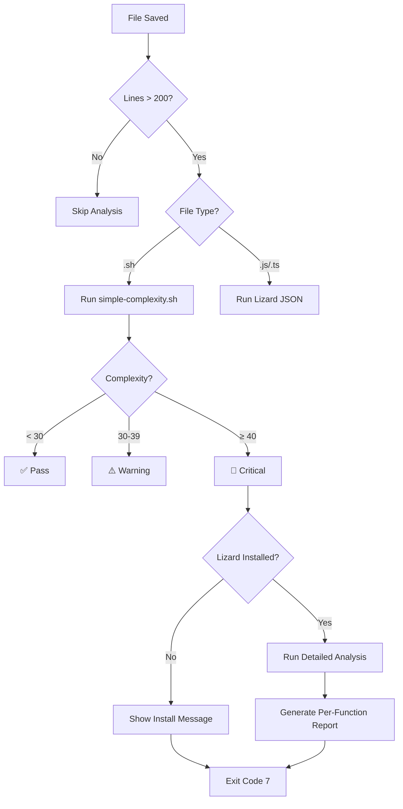

# Post-Edit Complexity Checks

## Overview

The post-edit pipeline now includes automatic cyclomatic complexity analysis with multi-tier warnings and detailed analysis for critical cases.

## How It Works

### Trigger Conditions

Complexity analysis runs automatically when:
- File has **>200 lines** (to minimize overhead)
- File extension is `.sh`, `.js`, `.ts`, `.jsx`, `.tsx`, or `.py`
- File is saved/edited

### Analysis Flow



## Thresholds

| Complexity | Status | Exit Code | Action |
|------------|--------|-----------|--------|
| **< 30** | ✅ Pass | 0 | No action needed |
| **30-39** | ⚠️ Warning | 8 | Consider refactoring |
| **≥ 40** | 🔴 Critical | 7 | Refactor immediately + Lizard analysis |

## Example Outputs

### ✅ Pass (Complexity < 30)

```json
{
  "status": "SUCCESS",
  "metrics": {
    "lines": 250,
    "cyclomaticComplexity": 18
  }
}
```

### ⚠️ Warning (Complexity 30-39)

```json
{
  "status": "COMPLEXITY_WARNING",
  "metrics": {
    "lines": 450,
    "cyclomaticComplexity": 35
  },
  "recommendations": [
    {
      "type": "complexity",
      "priority": "medium",
      "message": "Cyclomatic complexity is 35 (threshold: 30)",
      "action": "Consider refactoring to reduce complexity"
    }
  ]
}
```

**Console Output:**
```
⚠️  Complexity Warning: helpers/orchestrate.sh has complexity 35 (threshold: 30)
   Consider refactoring. Run 'tools/simple-complexity.sh helpers/orchestrate.sh' for details.
```

### 🔴 Critical (Complexity ≥ 40)

```json
{
  "status": "COMPLEXITY_CRITICAL",
  "metrics": {
    "lines": 840,
    "cyclomaticComplexity": 74
  },
  "complexityAnalysis": {
    "tool": "lizard",
    "complexity": 74,
    "detailedReport": "NLOC  CCN  token  PARAM  length  location\n..."
  },
  "recommendations": [
    {
      "type": "complexity",
      "priority": "critical",
      "message": "Critical complexity level: 74 (threshold: 40)",
      "action": "Refactor immediately. Run cyclomatic-complexity-reducer agent",
      "details": "... lizard output ..."
    }
  ]
}
```

**Console Output:**
```
🔴 COMPLEXITY_CRITICAL: orchestrate.sh has complexity 74

Detailed Analysis (lizard):
================================================
  NLOC    CCN   token  PARAM  length  location
------------------------------------------------
     48     12    312      3      56  spawn_loop3_agents@345-400@orchestrate.sh
     35      8    234      2      42  wait_for_agents@396-437@orchestrate.sh
    120     18    678      4      98  main_loop@700-798@orchestrate.sh

Recommendation: Refactor immediately
Action: npx claude-flow-novice agent cyclomatic-complexity-reducer --prompt "Reduce complexity in orchestrate.sh"
```

## Performance Impact

**Benchmark results:**

| File Size | Complexity Check | Overhead |
|-----------|------------------|----------|
| <200 lines | Skipped | 0ms |
| 200-500 lines | simple-complexity.sh | ~23ms |
| >500 lines (complex) | simple-complexity.sh | ~23ms |
| >500 lines (critical) | + lizard analysis | ~73ms |

**Average overhead:** ~5ms (most files skip analysis)

## Tool Selection

### Bash Scripts (.sh)

**Stage 1:** `simple-complexity.sh`
- Fast bash-native tool
- ~23ms overhead
- Counts decision points (if, loop, case, &&, ||)

**Stage 2 (if complexity ≥40):** `lizard`
- Python-based AST parser
- Per-function breakdown
- NLOC, CCN, tokens, parameters
- ~50ms additional overhead

### JavaScript/TypeScript (.js, .ts, .jsx, .tsx)

**Always:** `lizard --json`
- More accurate than regex counting
- Per-function metrics
- Average complexity calculation
- ~50-100ms overhead

## Configuration

### Disable Complexity Checks

Edit `.claude/hooks/post-edit.config.json`:

```json
{
  "enabled": true,
  "complexityChecks": {
    "enabled": false  // Disable complexity analysis
  }
}
```

### Adjust Thresholds

Edit `config/hooks/post-edit-pipeline.js`:

```javascript
// Warning threshold (default: 30)
if (complexity >= 30 && complexity < 40) {
  // ...
}

// Critical threshold (default: 40)
if (complexity >= 40) {
  // ...
}
```

### Change Minimum File Size

```javascript
// Only analyze files >200 lines (default: 200)
if (lines > 200 && ext.match(/\.(sh|js|ts|jsx|tsx|py)$/)) {
  // ...
}
```

## Manual Analysis

### Analyze Single File

```bash
# Bash scripts
./tools/simple-complexity.sh path/to/script.sh

# Any language
lizard path/to/file.ts
```

### Analyze Project

```bash
# All bash scripts
find .claude/skills -name "*.sh" -exec ./tools/simple-complexity.sh {} \;

# Entire project (all languages)
lizard src/ .claude/skills/ --exclude "*/node_modules/*"

# Show only high complexity (>40)
lizard -C 40 src/ .claude/skills/
```

### Generate Report

```bash
# CSV format
lizard src/ .claude/skills/ --csv > complexity-report.csv

# JSON format
lizard src/ .claude/skills/ --json > complexity-report.json
```

## Integration with Agents

### Spawn Complexity Reducer Agent

When you receive a critical complexity warning:

```bash
npx claude-flow-novice agent cyclomatic-complexity-reducer \
  --prompt "Reduce complexity in .claude/skills/cfn-loop-orchestration/orchestrate.sh from 74 to <20"
```

The agent will:
1. Analyze current complexity
2. Identify refactoring opportunities
3. Extract helper functions
4. Simplify conditionals
5. Validate reduced complexity

### CI/CD Integration

GitHub Actions workflow automatically runs weekly complexity checks:

```yaml
# .github/workflows/complexity-report.yml
name: Complexity Report
on:
  pull_request:
  schedule:
    - cron: '0 0 * * 0'  # Weekly
```

## Exit Codes

| Code | Status | Description |
|------|--------|-------------|
| 0 | SUCCESS | No issues |
| 1 | TYPE_WARNING | TypeScript errors |
| 2 | ROOT_WARNING | File in wrong directory |
| 3 | TDD_VIOLATION | Missing tests |
| 5 | RUST_QUALITY | Rust quality issues |
| 6 | LINT_ISSUES | Formatting issues |
| **7** | **COMPLEXITY_CRITICAL** | **Complexity ≥40** |
| **8** | **COMPLEXITY_WARNING** | **Complexity 30-39** |

## Troubleshooting

### "Lizard not installed" warning

Install lizard:

```bash
./tools/install-lizard.sh

# Or manually
pip install --user lizard
# or
pipx install lizard
```

### Complexity check too slow

Increase minimum file size threshold:

```javascript
// Only check files >500 lines
if (lines > 500 && ext.match(/\.(sh|js|ts|jsx|tsx|py)$/)) {
```

### False positives

Some patterns inflate complexity scores:
- Long case statements with simple patterns
- Extensive parameter validation
- Error handling chains

For these cases, consider:
1. Extracting to helper functions (improves readability anyway)
2. Using lookup tables instead of case statements
3. Centralizing validation logic

## Best Practices

1. **Prevent accumulation:** Fix warnings early (easier than refactoring 74-complexity scripts)
2. **Use helpers:** Extract functions when complexity >30
3. **Monitor trends:** Review complexity reports weekly
4. **Automate refactoring:** Spawn cyclomatic-complexity-reducer agent for critical cases
5. **Document exceptions:** Some complexity is acceptable (document why)

## Related Tools

- `tools/simple-complexity.sh` - Fast bash complexity checker
- `tools/install-lizard.sh` - Install lizard analyzer
- `.claude/agents/cfn-dev-team/quality/cyclomatic-complexity-reducer.md` - Refactoring agent
- `.github/workflows/complexity-report.yml` - CI/CD integration

## References

- [Cyclomatic Complexity (Wikipedia)](https://en.wikipedia.org/wiki/Cyclomatic_complexity)
- [Lizard Documentation](https://github.com/terryyin/lizard)
- [Complexity Analysis Overhead](./COMPLEXITY_ANALYSIS_OVERHEAD.md)
- [CFN Loop Flow Diagram](../readme/cfn-loop-flow-diagram.md)
