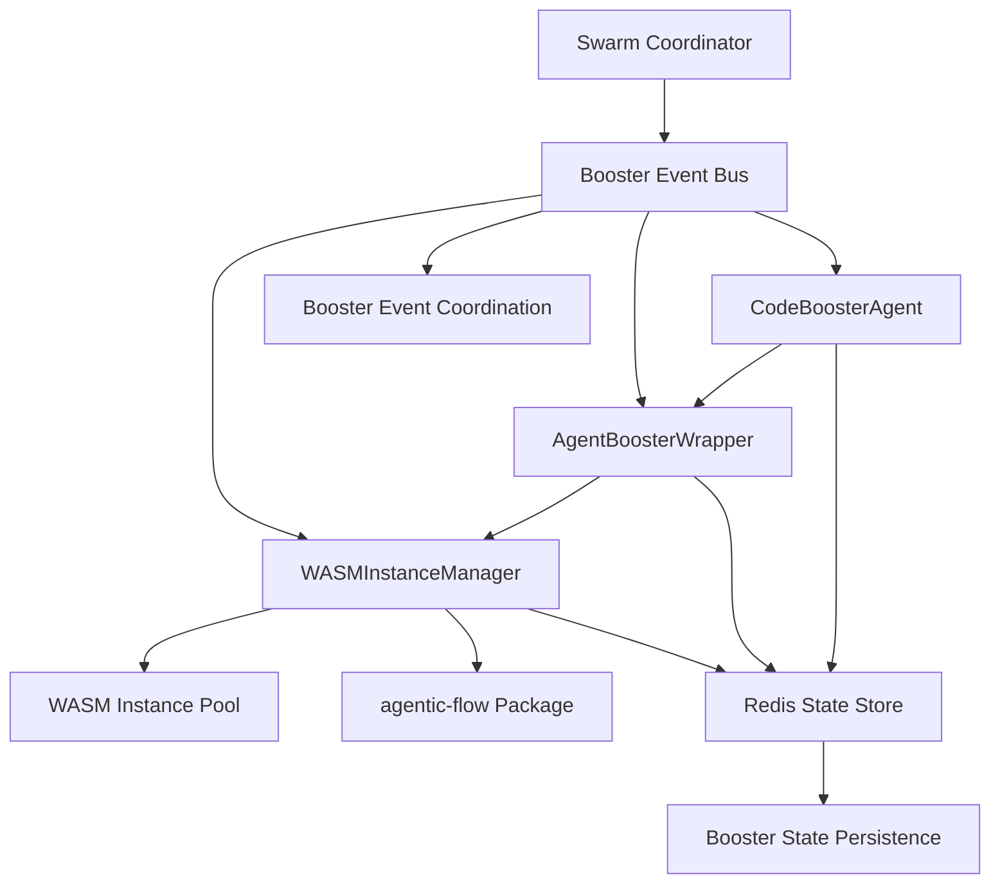

# Agent-Booster Integration Architecture

## Overview

This document outlines the architecture for integrating agent-booster WASM instances with the Claude Flow Novice swarm system using Redis-backed coordination and persistence.

## System Architecture

### Core Components

1. **WASMInstanceManager** - Manages WASM instance pool and lifecycle
2. **AgentBoosterWrapper** - Interface between agents and agentic-flow package
3. **CodeBoosterAgent** - Specialized agent type with booster capabilities
4. **Redis Booster State** - Persistent storage for booster states
5. **Booster Event Bus** - Redis pub/sub for booster coordination

### Integration Flow



## Technical Specifications

### WASM Instance Management

- **Pool Size**: 5-10 concurrent booster instances
- **Memory Limit**: 512MB per instance
- **Task Timeout**: 30000ms
- **Fallback**: Regular agent fallback on WASM failure
- **Recovery**: Graceful WASM panic recovery

### Redis Schema

#### Booster State Storage
```
Key: swarm:phase-5:booster:{boosterId}
Type: Hash
Fields:
  - instanceId: WASM instance identifier
  - status: (initializing|ready|busy|error|recovered)
  - lastActivity: Timestamp
  - memoryUsage: Current memory usage
  - taskHistory: JSON array of completed tasks
  - errorCount: Number of errors encountered
  - performanceMetrics: Performance statistics
```

#### Booster Instance Pool
```
Key: swarm:phase-5:pool
Type: Set
Members: Available booster instance IDs

Key: swarm:phase-5:pool:{instanceId}
Type: Hash
Fields:
  - wasmInstance: WASM instance reference
  - createdAt: Instance creation timestamp
  - lastUsed: Last usage timestamp
  - healthStatus: (healthy|degraded|unhealthy)
  - memoryUsage: Current memory usage
```

#### Event Channels
```
Channel: swarm:phase-5:booster
Events:
  - booster.requested
  - booster.allocated
  - booster.task.completed
  - booster.error
  - booster.recovered
  - booster.pool.updated
```

### Agent-Booster Integration

#### Agent Type Registration
```javascript
const CodeBoosterAgent = {
  type: 'code-booster',
  capabilities: [
    'code-generation',
    'code-optimization',
    'performance-analysis',
    'wasm-acceleration'
  ],
  requirements: {
    wasmSupport: true,
    memoryLimit: '512MB',
    timeout: 30000
  }
};
```

#### Task Execution Flow
1. Agent receives task requiring booster capabilities
2. Request booster instance from pool via Redis
3. Initialize WASM instance if needed
4. Execute task through agentic-flow package
5. Store results and performance metrics
6. Return instance to pool or mark for recovery

## Implementation Strategy

### Phase 1: Core Infrastructure
1. WASMInstanceManager implementation
2. Redis schema setup
3. Basic booster wrapper

### Phase 2: Agent Integration
1. CodeBoosterAgent implementation
2. Agent registry integration
3. Task routing logic

### Phase 3: Advanced Features
1. Performance monitoring
2. Adaptive pool sizing
3. Error recovery mechanisms

## Error Handling & Recovery

### WASM Panic Recovery
- Detect WASM instance failures
- Isolate failed instances
- Spin up replacement instances
- Maintain task queue during recovery

### Redis Failure Handling
- Connection retry logic
- Local state caching
- Graceful degradation to regular agents

### Performance Monitoring
- Instance health checks
- Memory usage tracking
- Task completion metrics
- Automatic pool optimization

## Security Considerations

### WASM Sandbox
- Restricted memory access
- Limited system calls
- Isolated execution environment
- Resource usage monitoring

### Redis Security
- Authentication requirements
- Access control lists
- Data encryption at rest
- Network security policies

## Configuration

### Environment Variables
```bash
WASM_POOL_SIZE=10
WASM_MEMORY_LIMIT=512MB
WASM_TASK_TIMEOUT=30000
REDIS_BOoster_TTL=3600
BOOSTER_HEALTH_CHECK_INTERVAL=30000
```

### Configuration File
```json
{
  "wasm": {
    "poolSize": 10,
    "memoryLimit": "512MB",
    "taskTimeout": 30000,
    "maxRetries": 3
  },
  "redis": {
    "keyPrefix": "swarm:phase-5:",
    "ttl": 3600,
    "healthCheckInterval": 30000
  },
  "booster": {
    "fallbackEnabled": true,
    "performanceTracking": true,
    "autoRecovery": true
  }
}
```

## Performance Metrics

### Key Indicators
- Task completion time
- WASM instance utilization
- Memory usage efficiency
- Error recovery rate
- Pool availability percentage

### Monitoring Dashboard
- Real-time instance status
- Performance trend analysis
- Error rate tracking
- Resource utilization graphs

## Testing Strategy

### Unit Tests
- WASMInstanceManager functionality
- Redis state management
- Booster wrapper operations
- Error handling scenarios

### Integration Tests
- End-to-end task execution
- Redis coordination
- Pool management
- Recovery procedures

### Performance Tests
- Load testing with pool limits
- Memory usage validation
- Concurrent task execution
- Recovery time measurement

## Future Enhancements

### Advanced Features
- Dynamic pool sizing based on load
- Predictive instance provisioning
- Cross-instance task distribution
- Advanced performance optimization

### Integration Opportunities
- Multi-language WASM support
- Cloud deployment options
- Advanced monitoring tools
- Machine learning optimization