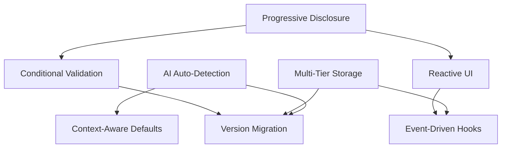

# Architecture Decision Records (ADRs)
## Intelligent Configuration System - Checkpoint 1.3

This document contains the architectural decisions made for the Intelligent Configuration System, providing context, rationale, and trade-offs for each major design choice.

---

## ADR-001: Progressive Disclosure Pattern

**Status**: Accepted
**Date**: 2025-09-25
**Deciders**: System Architecture Team

### Context

The claude-flow-novice project needs a configuration system that serves both complete beginners and advanced users without overwhelming novices or limiting experts. Traditional approaches either oversimplify (limiting power users) or overcomplicate (overwhelming beginners).

### Decision

We will implement a **layered configuration model with progressive disclosure**, revealing complexity gradually based on user experience and project needs.

**Configuration Levels**:
- **Auto**: Zero configuration with AI-driven setup
- **Novice**: Essential settings only (5-8 options)
- **Intermediate**: Grouped functionality (15-20 options)
- **Advanced**: Full configuration access (50+ options)
- **Enterprise**: Organization and compliance features (100+ options)

### Rationale

1. **Reduces Cognitive Load**: Beginners see only what they need to get started
2. **Maintains Power**: Advanced users retain full control when needed
3. **Gradual Learning**: Users can progress naturally through complexity levels
4. **Context-Aware**: System adapts based on project type and user behavior
5. **Non-Destructive**: Users can always access more advanced features

### Consequences

**Positive**:
- Excellent user experience for beginners
- No feature limitations for advanced users
- Natural learning progression
- Reduced support burden
- Higher adoption rates

**Negative**:
- Increased implementation complexity
- More sophisticated UI requirements
- Additional storage and migration logic
- Potential confusion about feature availability

**Alternatives Considered**:
- **Single Complex Interface**: Rejected due to cognitive overload for beginners
- **Separate Tools by Level**: Rejected due to fragmentation and migration issues
- **Wizard-Only Approach**: Rejected due to lack of flexibility for power users

---

## ADR-002: AI-Driven Auto-Detection and Setup

**Status**: Accepted
**Date**: 2025-09-25
**Deciders**: AI/ML Team, UX Team

### Context

Manual configuration is a significant barrier to entry for novice users. Even simplified configuration requires domain knowledge about agent types, topologies, and feature interactions.

### Decision

We will implement **ML-enhanced project analysis with automatic configuration generation**, combining rule-based heuristics with pattern recognition.

**Components**:
- **Multi-Phase Analysis**: File structure, dependencies, code patterns, Git metadata
- **Project Type Classification**: Web-app, API, CLI, library, mobile, ML, data, etc.
- **Decision Tree Execution**: Generate optimal configuration based on detected patterns
- **Confidence Scoring**: Transparent confidence levels with fallback options
- **Continuous Learning**: Improve accuracy from user feedback and corrections

### Rationale

1. **Eliminates Setup Friction**: Zero-configuration for common project types
2. **Leverages Domain Knowledge**: Codifies best practices into automatic setup
3. **Scales with Ecosystem**: Can adapt to new frameworks and patterns
4. **Provides Transparency**: Users understand and can modify generated configuration
5. **Learns from Usage**: Improves over time with real-world data

### Consequences

**Positive**:
- Dramatically reduced time-to-first-success
- Consistent best-practice configurations
- Scalable to new project types
- Self-improving system
- Reduced documentation and support needs

**Negative**:
- Complex implementation with multiple analysis phases
- Potential for incorrect detection in edge cases
- Dependency on training data quality
- Performance overhead for analysis
- Privacy considerations for code analysis

**Implementation Strategy**:
- Rule-based fallback for reliability
- Local analysis for privacy preservation
- Confidence thresholds for automated decisions
- User feedback loops for continuous improvement

---

## ADR-003: Multi-Tier Storage with Hierarchical Override

**Status**: Accepted
**Date**: 2025-09-25
**Deciders**: Storage Team, DevOps Team

### Context

Different users and organizations have varying storage requirements: individual developers need local configuration, teams need shared settings, enterprises need compliance and auditability, and organizations need policy enforcement.

### Decision

We will implement a **hierarchical storage system with four tiers** that cascade configuration with proper override semantics.

**Storage Tiers** (lowest to highest precedence):
1. **Local Storage** (`~/.claude-flow/config.json`): User-specific preferences
2. **Project Storage** (`.claude-flow/config.json`): Project-specific settings
3. **Team Storage** (Git repository/cloud): Shared team configuration
4. **Cloud Storage**: Cross-device synchronization and backup

**Override Behavior**:
- Higher tiers override lower tiers for conflicting values
- Configuration merges intelligently (objects merge, primitives override)
- Policy enforcement at team/organization level
- Conflict resolution with user prompts when needed

### Rationale

1. **Supports All Use Cases**: Individual, team, and enterprise scenarios
2. **Familiar Model**: Similar to Git config, CSS cascade, and other hierarchical systems
3. **Flexible Collaboration**: Teams can share while preserving individual preferences
4. **Enterprise Ready**: Supports compliance, auditing, and policy enforcement
5. **Backup and Sync**: Cross-device configuration with conflict resolution

### Consequences

**Positive**:
- Flexible configuration inheritance
- Natural collaboration model
- Enterprise compliance capabilities
- Automatic backup and synchronization
- Familiar override semantics

**Negative**:
- Complex implementation with multiple storage providers
- Potential configuration conflicts requiring resolution
- Network dependencies for team/cloud features
- Security considerations for shared storage
- Synchronization complexity for offline scenarios

**Security Measures**:
- Client-side encryption for cloud storage
- Fine-grained access controls for team sharing
- Audit logging for compliance requirements
- Secure key management and rotation

---

## ADR-004: Event-Driven Hook Integration

**Status**: Accepted
**Date**: 2025-09-25
**Deciders**: Integration Team, Architecture Team

### Context

The configuration system must integrate seamlessly with the existing claude-flow hook ecosystem for automation, agent coordination, and workflow orchestration. Tight coupling would reduce flexibility, while loose coupling might miss important coordination opportunities.

### Decision

We will implement **event-driven integration with the hook system** using a dedicated coordination layer that translates configuration events into appropriate hook executions.

**Integration Points**:
- **Pre-Task Hooks**: Session restoration, resource preparation, agent initialization
- **Post-Configuration Hooks**: Memory storage, agent coordination, metrics updates
- **Migration Hooks**: Backup, validation, verification
- **Level Change Hooks**: UI adaptation, feature visibility, agent reconfiguration
- **Auto-Setup Hooks**: Project analysis notification, agent spawning, optimization

**Communication Pattern**:
- Configuration system emits structured events
- Hook integration layer translates events to hook commands
- Asynchronous execution with retry and error handling
- Bidirectional communication for feedback and coordination

### Rationale

1. **Loose Coupling**: Configuration system remains independent of hook implementation
2. **Event Transparency**: Clear audit trail of all integration points
3. **Flexible Coordination**: Can adapt to changes in hook system without core changes
4. **Parallel Execution**: Multiple hooks can run concurrently where appropriate
5. **Error Resilience**: Failures in hooks don't break configuration functionality

### Consequences

**Positive**:
- Clean separation of concerns
- Flexible integration patterns
- Robust error handling
- Clear event semantics
- Testable integration points

**Negative**:
- Additional complexity with event translation layer
- Potential for event ordering issues
- Network overhead for remote hooks
- Debugging complexity across system boundaries
- Dependency on hook system availability

**Implementation Notes**:
- Use EventEmitter pattern for internal events
- Implement retry logic with exponential backoff
- Cache hook results where appropriate
- Provide manual override for hook failures

---

## ADR-005: JSON Schema with Conditional Validation

**Status**: Accepted
**Date**: 2025-09-25
**Deciders**: Validation Team, UX Team

### Context

The progressive disclosure system requires different validation rules at different complexity levels. A single schema would either be too restrictive for advanced users or too permissive for novices.

### Decision

We will use **JSON Schema with conditional validation** that adapts based on the configuration mode and user level.

**Schema Design**:
- **Base Schema**: Core required fields for all levels
- **Conditional Schemas**: Additional validation based on mode/level
- **Progressive Properties**: Properties that appear/disappear by level
- **Cross-Field Validation**: Dependencies between configuration sections
- **Custom Validators**: Business logic validation for complex rules

**Validation Strategy**:
- Real-time validation for immediate feedback
- Progressive validation that becomes stricter with higher levels
- Context-aware error messages appropriate for user level
- Validation warnings vs. errors based on criticality

### Rationale

1. **Level-Appropriate Validation**: Beginners get simpler validation, experts get comprehensive checks
2. **Standard Technology**: JSON Schema is well-understood and tooled
3. **Extensible**: Can add new validation rules without breaking existing schemas
4. **Performance**: Fast validation with good error reporting
5. **Interoperable**: Works with external tools and documentation generation

### Consequences

**Positive**:
- Context-appropriate validation messages
- Progressive complexity matching user level
- Standard, well-documented approach
- Good tooling ecosystem
- Extensible validation system

**Negative**:
- Complex schema with many conditional branches
- Potential for schema inconsistencies
- Performance overhead for complex validations
- Learning curve for schema maintenance
- Debugging challenges with conditional logic

**Implementation Details**:
- Use `if/then/else` constructs for conditional validation
- Implement custom keyword extensions for business logic
- Generate user-friendly error messages from schema violations
- Cache compiled schemas for performance

---

## ADR-006: Version-Aware Migration with Rollback

**Status**: Accepted
**Date**: 2025-09-25
**Deciders**: Migration Team, DevOps Team

### Context

Configuration schemas will evolve over time with new features, deprecations, and breaking changes. Users need seamless migration paths that preserve their customizations while enabling new capabilities.

### Decision

We will implement **automatic migration with rollback support** that handles version transitions transparently while preserving user data.

**Migration System**:
- **Version Detection**: Automatic identification of configuration schema version
- **Migration Paths**: Direct and multi-hop migration routes between versions
- **Atomic Operations**: All-or-nothing migrations with automatic rollback on failure
- **Backup Creation**: Automatic backups before every migration
- **Change Tracking**: Detailed logging of all migration changes
- **Validation**: Pre- and post-migration validation with schema checking

### Rationale

1. **User Experience**: Seamless updates without manual intervention
2. **Data Preservation**: No loss of user customizations during upgrades
3. **Safety**: Rollback capability for failed migrations
4. **Transparency**: Clear reporting of what changed and why
5. **Flexibility**: Support for both breaking and non-breaking changes

### Consequences

**Positive**:
- Smooth upgrade experience
- Data safety with automatic backups
- Transparent change tracking
- Support for complex schema evolution
- Confidence in system upgrades

**Negative**:
- Complex migration logic for version transitions
- Storage overhead for backup retention
- Potential for migration failures in complex scenarios
- Performance impact during migration operations
- Testing complexity for all migration paths

**Migration Strategy**:
- Prefer additive changes over breaking changes
- Implement gradual deprecation for removed features
- Provide clear migration notes and warnings
- Test migration paths extensively
- Maintain backward compatibility where possible

---

## ADR-007: Context-Aware Default Generation

**Status**: Accepted
**Date**: 2025-09-25
**Deciders**: AI Team, UX Team

### Context

Default configuration values should not be static but should adapt to the user's project, environment, team size, and historical preferences. Generic defaults often require immediate customization, creating friction.

### Decision

We will implement **intelligent default generation** that creates context-appropriate starting configurations based on project analysis, user preferences, and organizational policies.

**Context Factors**:
- **Project Type**: Web app, API, CLI, library, mobile, ML, data pipeline
- **Technology Stack**: Programming language, frameworks, build tools
- **Team Size**: Individual, small team, large team, enterprise
- **Environment**: Development, staging, production
- **User Experience**: Novice, intermediate, advanced, expert
- **Historical Patterns**: Previous project configurations and outcomes

**Default Generation Process**:
1. **Multi-Modal Analysis**: Combine file system, dependency, and metadata analysis
2. **Template Matching**: Select base template for detected project type
3. **Context Adaptation**: Adjust defaults based on environment and team
4. **Policy Application**: Apply organizational policies and constraints
5. **Optimization**: Fine-tune for performance and resource constraints

### Rationale

1. **Reduced Setup Time**: Defaults that work immediately for the specific context
2. **Best Practice Encoding**: Capture expert knowledge in default generation
3. **Personalization**: Learn from user preferences and adapt over time
4. **Organization Consistency**: Enforce standards while allowing customization
5. **Performance Optimization**: Context-appropriate resource allocation

### Consequences

**Positive**:
- Excellent out-of-box experience
- Consistent application of best practices
- Reduced need for documentation and training
- Self-improving system through learning
- Organization-wide consistency

**Negative**:
- Complex analysis and generation algorithms
- Potential for incorrect assumptions in edge cases
- Privacy considerations for learning systems
- Performance overhead for analysis phase
- Dependency on quality training data

**Privacy Safeguards**:
- Local-only analysis for sensitive projects
- Opt-out mechanisms for data collection
- Anonymized learning data aggregation
- Clear disclosure of data usage

---

## ADR-008: Reactive UI with State Synchronization

**Status**: Accepted
**Date**: 2025-09-25
**Deciders**: UI Team, Frontend Team

### Context

The progressive disclosure UI must remain synchronized with configuration state across multiple interaction modes (CLI, web UI, API) while providing real-time feedback and smooth transitions between complexity levels.

### Decision

We will implement a **reactive UI architecture** with centralized state management that automatically synchronizes across all interaction methods.

**Architecture Components**:
- **State Manager**: Single source of truth for configuration state
- **Event System**: Reactive updates when configuration changes
- **UI Adapters**: Transform state for different presentation layers
- **Transition Engine**: Smooth animations between complexity levels
- **Validation Bridge**: Real-time validation feedback in UI
- **Persistence Layer**: Automatic state persistence and restoration

### Rationale

1. **Consistency**: All interfaces show the same configuration state
2. **Real-time Updates**: Immediate feedback for configuration changes
3. **Smooth Transitions**: Professional user experience with level changes
4. **Multi-Modal Support**: Works with CLI, web UI, and programmatic access
5. **Offline Capability**: State preserved across sessions and network interruptions

### Consequences

**Positive**:
- Consistent experience across all interfaces
- Real-time validation and feedback
- Smooth, professional user experience
- Multi-device configuration editing
- Robust offline support

**Negative**:
- Complex state synchronization logic
- Performance overhead for real-time updates
- Potential for state conflicts in multi-user scenarios
- Additional complexity for UI testing
- Memory overhead for state management

**Implementation Notes**:
- Use immutable state patterns for consistency
- Implement optimistic updates with rollback
- Batch updates to reduce UI thrashing
- Provide clear conflict resolution for multi-user scenarios

---

## Summary of Trade-offs

| Decision | Primary Benefit | Primary Cost | Risk Mitigation |
|----------|----------------|--------------|-----------------|
| Progressive Disclosure | Excellent UX for all levels | Implementation complexity | Extensive user testing, iterative refinement |
| AI Auto-Detection | Zero-config setup | Analysis complexity | Rule-based fallbacks, confidence thresholds |
| Multi-Tier Storage | Flexible collaboration | Storage complexity | Clear override semantics, extensive testing |
| Event-Driven Hooks | Loose coupling | Translation overhead | Retry logic, manual overrides |
| Conditional Validation | Level-appropriate validation | Schema complexity | Schema versioning, automated testing |
| Version Migration | Seamless upgrades | Migration complexity | Extensive testing, rollback capability |
| Context-Aware Defaults | Perfect starting point | Generation complexity | Privacy safeguards, user override capability |
| Reactive UI | Real-time consistency | State sync complexity | Immutable patterns, conflict resolution |

## Decision Dependencies

These decisions form a cohesive architecture that balances simplicity for novices with power for experts, while maintaining consistency, reliability, and excellent user experience across all interaction modes.

## Future Considerations

1. **Machine Learning Enhancement**: More sophisticated project classification and preference learning
2. **Plugin Architecture**: Third-party extensions for specialized project types
3. **Cloud-Native Features**: Enhanced team collaboration and enterprise features
4. **Performance Optimization**: Reduce analysis time and memory overhead
5. **Accessibility**: Enhanced support for users with disabilities
6. **Internationalization**: Multi-language support for global adoption

## Review Schedule

These ADRs should be reviewed quarterly to ensure they remain relevant as the system evolves. Significant changes to user feedback, performance characteristics, or ecosystem developments may trigger early reviews of specific decisions.