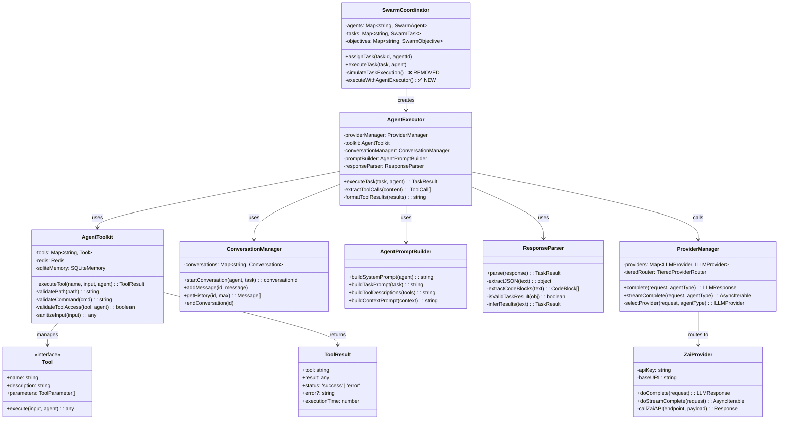
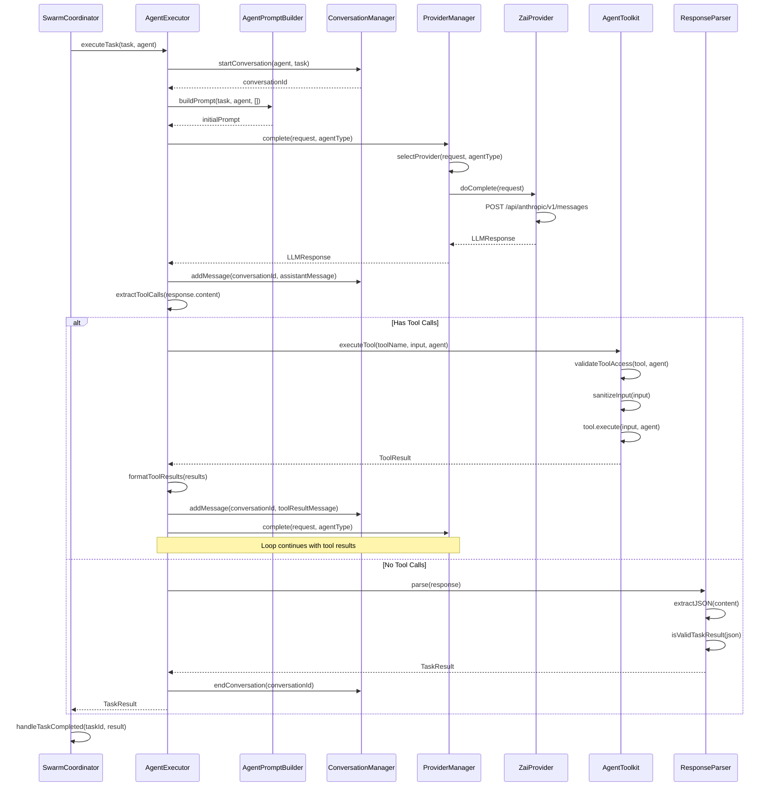
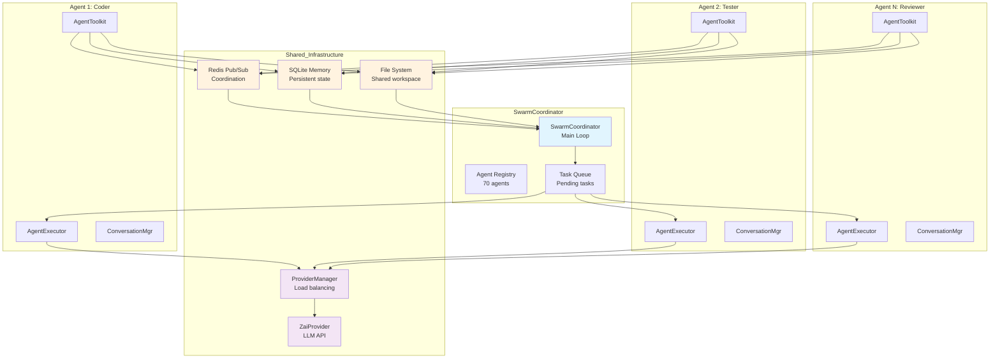
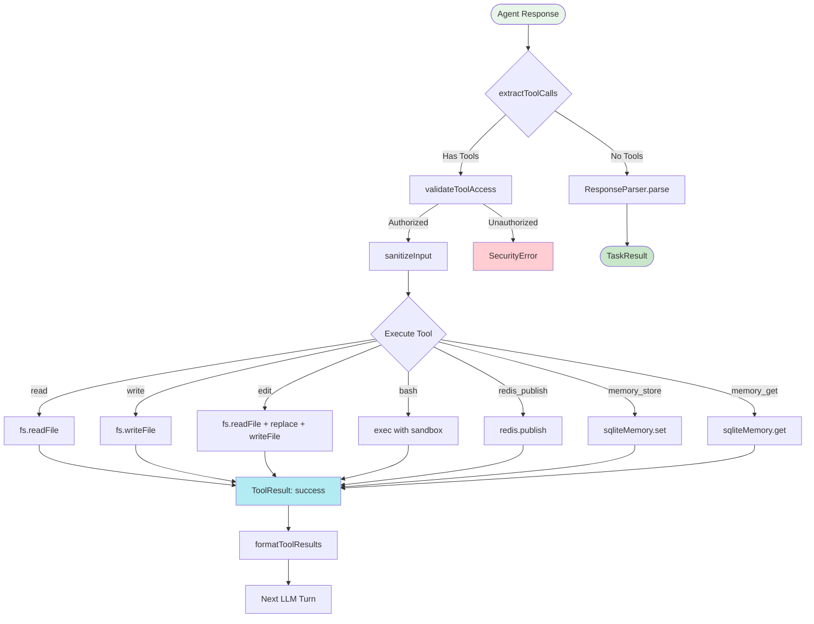
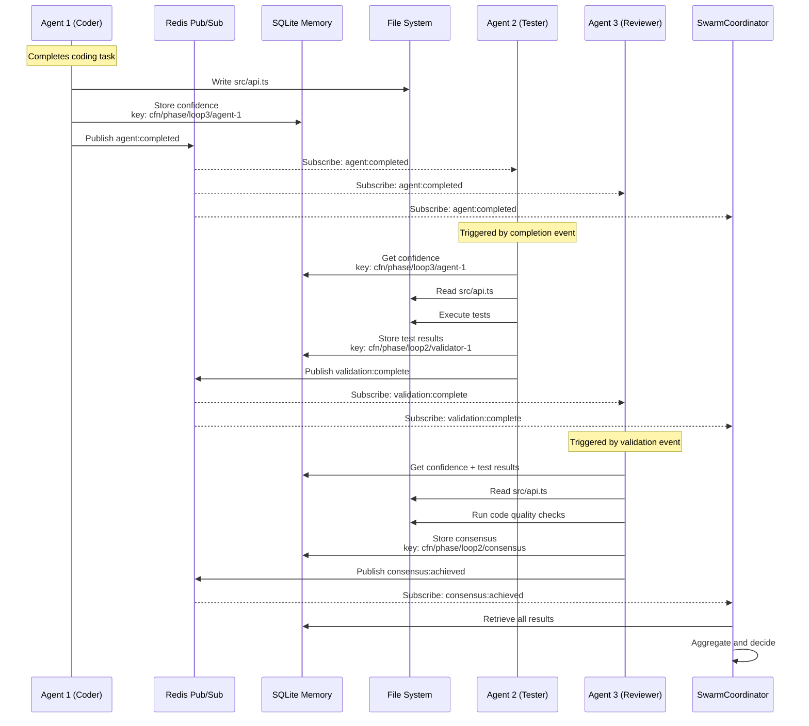
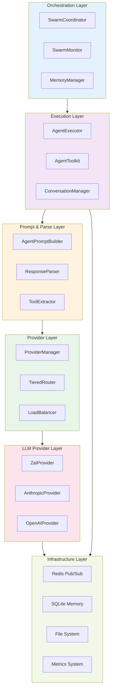
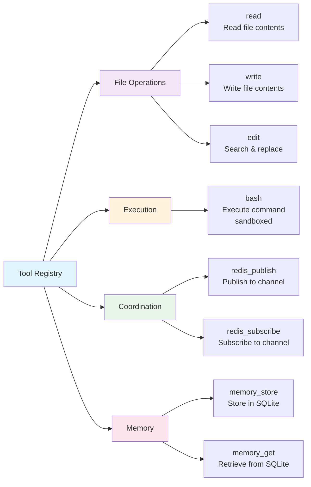
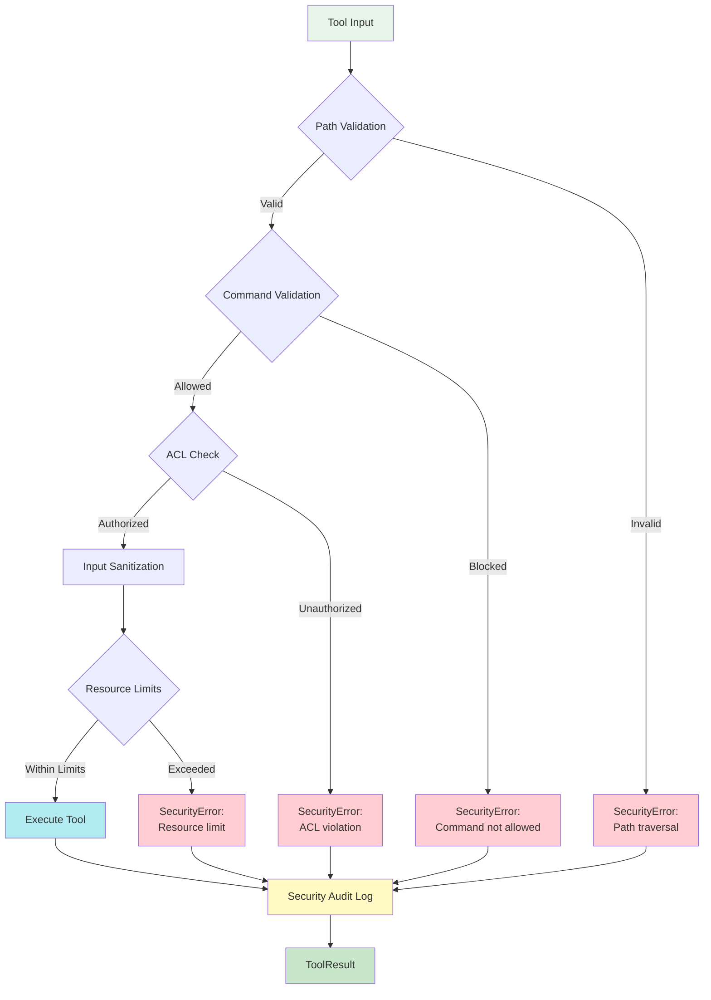

# SwarmCoordinator + ProviderManager Integration - Visual Diagrams

## Class Diagram

## Sequence Diagram: Task Execution Flow

## Data Flow Diagram: 70-Agent Mesh Coordination

## Tool Execution Flow Diagram

## Agent Coordination Message Flow

## Architecture Layers Diagram

## Tool Specification Structure

## Security Control Flow

