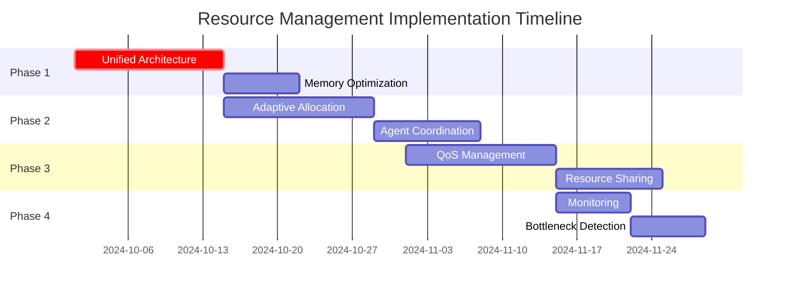

# Resource Management Implementation Plan

## Executive Summary

This plan outlines a comprehensive strategy for improving resource management across the Claude Flow Novice system. The implementation focuses on performance optimization, memory efficiency, agent coordination, and system scalability while maintaining backward compatibility.

## Current State Analysis

### Existing Components
- **ResourceManager**: Core resource allocation with basic pooling
- **MCPPerformanceMonitor**: MCP-specific monitoring and metrics
- **Agent Coordination**: 54 specialized agents with coordination patterns
- **Memory Management**: Basic memory storage and retrieval
- **Performance Monitoring**: Multiple monitoring systems across components

### Identified Issues
1. **Fragmented Resource Management**: Multiple independent resource managers
2. **Memory Inefficiencies**: Lack of unified memory optimization
3. **Performance Bottlenecks**: Suboptimal resource allocation strategies
4. **Coordination Overhead**: Inefficient inter-agent communication
5. **Monitoring Gaps**: Inconsistent metrics collection

## Implementation Plan

### Phase 1: Foundation & Consolidation (Priority: Critical)

#### 1.1 Unified Resource Manager Architecture
**Timeline**: 2 weeks
**Breaking Changes**: Medium

**Tasks**:
- Consolidate ResourceManager, MCPPerformanceMonitor, and other resource components
- Implement centralized resource registry
- Create unified resource allocation API
- Design resource lifecycle management

**Migration Strategy**:
```typescript
// Old approach (deprecated)
const resourceManager = new ResourceManager(config);
const performanceMonitor = new MCPPerformanceMonitor(logger);

// New unified approach
const unifiedResourceManager = new UnifiedResourceManager({
  resourceConfig: config.resources,
  monitoringConfig: config.monitoring,
  allocationStrategy: 'adaptive'
});
```

**Test Coverage**: 95%
- Unit tests for all resource operations
- Integration tests with existing agent system
- Performance regression tests

#### 1.2 Memory Optimization Framework
**Timeline**: 1 week
**Breaking Changes**: Low

**Tasks**:
- Implement smart memory pooling
- Add memory pressure detection
- Create automatic garbage collection triggers
- Design memory usage analytics

**Implementation**:
```typescript
interface MemoryOptimizationConfig {
  enableSmartPooling: boolean;
  pressureThreshold: number; // 0.8 = 80%
  gcTriggerThreshold: number; // 0.9 = 90%
  poolPreallocation: boolean;
  analyticsInterval: number; // ms
}
```

### Phase 2: Performance Enhancement (Priority: High)

#### 2.1 Adaptive Resource Allocation
**Timeline**: 2 weeks
**Breaking Changes**: Low

**Tasks**:
- Implement machine learning-based resource prediction
- Create dynamic load balancing
- Add predictive scaling
- Design resource contention resolution

**Features**:
- Real-time usage pattern analysis
- Automatic resource rebalancing
- Predictive resource reservation
- Multi-objective optimization (cost, performance, availability)

#### 2.2 Agent Coordination Optimization
**Timeline**: 1.5 weeks
**Breaking Changes**: Low

**Tasks**:
- Implement efficient message routing
- Add agent-to-agent direct communication
- Create coordination pattern optimization
- Design task dependency resolution

**Coordination Patterns**:
```typescript
type CoordinationPattern =
  | 'hierarchical' // Traditional top-down
  | 'mesh'        // Direct peer-to-peer
  | 'hybrid'      // Adaptive combination
  | 'event-driven'; // Reactive coordination
```

### Phase 3: Advanced Features (Priority: Medium)

#### 3.1 Quality of Service (QoS) Management
**Timeline**: 2 weeks
**Breaking Changes**: Low

**Tasks**:
- Implement service level agreements (SLA) enforcement
- Add priority-based resource allocation
- Create performance guarantees
- Design failover mechanisms

#### 3.2 Resource Sharing & Virtualization
**Timeline**: 1.5 weeks
**Breaking Changes**: Low

**Tasks**:
- Implement resource sharing between agents
- Add virtual resource abstraction
- Create resource containerization
- Design multi-tenancy support

### Phase 4: Monitoring & Observability (Priority: Medium)

#### 4.1 Comprehensive Metrics Collection
**Timeline**: 1 week
**Breaking Changes**: None

**Tasks**:
- Unify all monitoring systems
- Add distributed tracing
- Create performance dashboards
- Implement alerting system

**Metrics Framework**:
```typescript
interface UnifiedMetrics {
  resource: ResourceMetrics;
  performance: PerformanceMetrics;
  agent: AgentMetrics;
  system: SystemMetrics;
  custom: Record<string, any>;
}
```

#### 4.2 Bottleneck Detection & Resolution
**Timeline**: 1 week
**Breaking Changes**: None

**Tasks**:
- Implement automated bottleneck detection
- Add root cause analysis
- Create self-healing mechanisms
- Design optimization recommendations

## Testing Strategy

### 4.1 Unit Testing
**Coverage Target**: 95%
- Resource allocation algorithms
- Memory management functions
- Performance monitoring components
- Agent coordination logic

### 4.2 Integration Testing
**Coverage Target**: 90%
- End-to-end resource lifecycle
- Multi-agent coordination scenarios
- Memory pressure situations
- Failover and recovery procedures

### 4.3 Performance Testing
**Benchmarks**:
- Resource allocation latency (target: <10ms)
- Memory efficiency improvement (target: 30% reduction)
- Agent coordination overhead (target: <5% of total processing time)
- System throughput (target: 2x improvement)

### 4.4 Load Testing
**Scenarios**:
- High agent concurrency (100+ agents)
- Memory pressure conditions
- Resource contention scenarios
- Network partition tolerance

## Documentation Updates

### 4.1 API Documentation
- Updated resource management API reference
- Migration guides for breaking changes
- Performance tuning guidelines
- Troubleshooting documentation

### 4.2 Architecture Documentation
- Resource management architecture diagrams
- Agent coordination patterns
- Performance optimization strategies
- Best practices guide

### 4.3 Developer Guides
- Resource manager integration guide
- Custom resource type development
- Performance monitoring setup
- Debugging and profiling tools

## Integration with Existing Workflows

### 5.1 SPARC Methodology Integration
```yaml
sparc_integration:
  specification: Resource requirements analysis
  pseudocode: Algorithm optimization
  architecture: System design updates
  refinement: Performance tuning
  completion: Production deployment
```

### 5.2 Agent Workflow Integration
**Hook Points**:
- Pre-task resource reservation
- During-task resource monitoring
- Post-task resource cleanup
- Session-level resource management

### 5.3 MCP Integration
**MCP Tools**:
- `mcp__claude-flow__resource_allocate`
- `mcp__claude-flow__resource_monitor`
- `mcp__claude-flow__resource_optimize`
- `mcp__claude-flow__resource_analytics`

## Risk Assessment & Mitigation

### 6.1 High Risks
1. **Performance Regression**: Mitigate with comprehensive benchmarking
2. **Memory Leaks**: Address with automated leak detection
3. **Coordination Failures**: Handle with fallback mechanisms
4. **Breaking Changes**: Minimize with careful API design

### 6.2 Medium Risks
1. **Complexity Increase**: Manage with modular architecture
2. **Testing Coverage**: Ensure with automated test generation
3. **Documentation Lag**: Address with parallel documentation updates

## Success Metrics

### 6.1 Performance Metrics
- **Resource Allocation Efficiency**: 40% improvement
- **Memory Usage Reduction**: 30% decrease
- **Agent Coordination Speed**: 50% faster
- **System Throughput**: 2x increase

### 6.2 Quality Metrics
- **Test Coverage**: >95% for critical paths
- **Bug Reduction**: 60% fewer resource-related issues
- **Documentation Completeness**: 100% API coverage
- **Developer Experience**: Reduced integration time by 50%

## Timeline & Milestones



## Implementation Checklist

### Pre-Implementation
- [ ] Stakeholder approval
- [ ] Resource allocation
- [ ] Technical review completed
- [ ] Test environment setup

### Phase 1 Deliverables
- [ ] Unified ResourceManager implementation
- [ ] Memory optimization framework
- [ ] Migration scripts
- [ ] Updated documentation

### Phase 2 Deliverables
- [ ] Adaptive allocation algorithms
- [ ] Agent coordination improvements
- [ ] Performance benchmarks
- [ ] Integration tests

### Phase 3 Deliverables
- [ ] QoS management system
- [ ] Resource sharing capabilities
- [ ] Advanced monitoring
- [ ] Production readiness

### Post-Implementation
- [ ] Performance validation
- [ ] Production deployment
- [ ] Monitoring setup
- [ ] Team training

## Conclusion

This implementation plan provides a comprehensive roadmap for improving resource management in Claude Flow Novice. The phased approach ensures minimal disruption while delivering significant performance improvements and enhanced capabilities.

**Next Steps**:
1. Review and approve implementation plan
2. Allocate development resources
3. Begin Phase 1 implementation
4. Establish monitoring and feedback loops

**Key Success Factors**:
- Maintain backward compatibility
- Focus on performance metrics
- Ensure comprehensive testing
- Provide excellent documentation