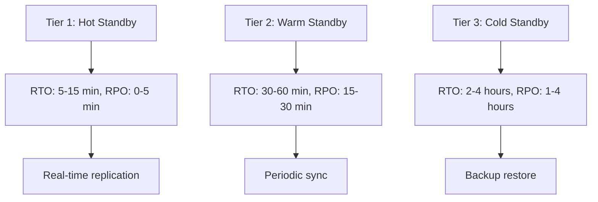
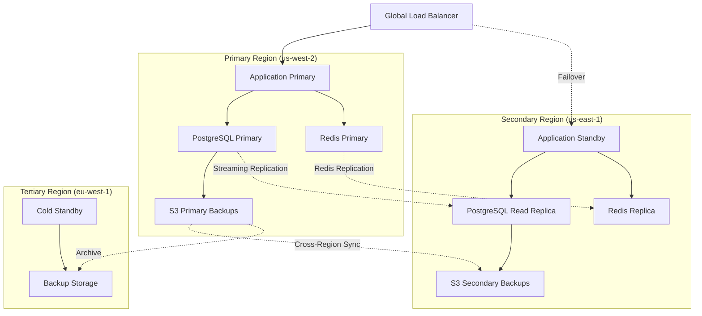

# Disaster Recovery & Backup Strategies - Claude Flow Novice

## Overview

Comprehensive disaster recovery and backup strategies for Claude Flow Novice ensuring business continuity, data protection, and rapid recovery from various failure scenarios.

## Table of Contents
1. [Recovery Planning](#recovery-planning)
2. [Backup Strategies](#backup-strategies)
3. [Multi-Region Setup](#multi-region-setup)
4. [Database Recovery](#database-recovery)
5. [Application State Recovery](#application-state-recovery)
6. [Monitoring & Alerting](#monitoring--alerting)
7. [Testing & Validation](#testing--validation)
8. [Incident Response](#incident-response)

---

## Recovery Planning

### Recovery Time & Point Objectives

| Scenario | RTO (Recovery Time) | RPO (Recovery Point) | Impact Level |
|----------|--------------------|--------------------|--------------|
| **Application Crash** | < 5 minutes | 0 seconds | Low |
| **Database Failure** | < 15 minutes | < 5 minutes | Medium |
| **Zone Failure** | < 30 minutes | < 15 minutes | High |
| **Region Failure** | < 2 hours | < 1 hour | Critical |
| **Complete Outage** | < 4 hours | < 4 hours | Critical |

### Disaster Recovery Tiers



---

## Backup Strategies

### Automated Backup System

```typescript
// src/backup/backup-manager.ts
import * as AWS from 'aws-sdk';
import { Pool } from 'pg';
import * as redis from 'redis';
import * as fs from 'fs/promises';
import * as path from 'path';
import { createGzip } from 'zlib';
import { pipeline } from 'stream/promises';

export interface BackupConfig {
  databases: {
    postgresql: {
      connectionString: string;
      s3Bucket: string;
      retentionDays: number;
    };
    redis: {
      host: string;
      port: number;
      s3Bucket: string;
      retentionDays: number;
    };
  };
  applicationData: {
    paths: string[];
    s3Bucket: string;
    retentionDays: number;
  };
  schedule: {
    full: string; // cron expression
    incremental: string; // cron expression
  };
}

export class BackupManager {
  private s3: AWS.S3;
  private config: BackupConfig;

  constructor(config: BackupConfig) {
    this.config = config;
    this.s3 = new AWS.S3({
      region: process.env.AWS_REGION || 'us-west-2',
    });
  }

  async performFullBackup(): Promise<string> {
    const backupId = `full-${Date.now()}`;
    const timestamp = new Date().toISOString();

    console.log(`Starting full backup: ${backupId}`);

    try {
      // Backup PostgreSQL
      const dbBackupPath = await this.backupPostgreSQL(backupId);
      console.log(`PostgreSQL backup completed: ${dbBackupPath}`);

      // Backup Redis
      const redisBackupPath = await this.backupRedis(backupId);
      console.log(`Redis backup completed: ${redisBackupPath}`);

      // Backup application data
      const appDataBackupPath = await this.backupApplicationData(backupId);
      console.log(`Application data backup completed: ${appDataBackupPath}`);

      // Create backup manifest
      const manifest = {
        backupId,
        timestamp,
        type: 'full',
        components: {
          database: dbBackupPath,
          redis: redisBackupPath,
          applicationData: appDataBackupPath,
        },
        checksums: await this.generateChecksums([
          dbBackupPath,
          redisBackupPath,
          appDataBackupPath,
        ]),
      };

      await this.uploadManifest(backupId, manifest);
      await this.cleanupOldBackups();

      console.log(`Full backup completed successfully: ${backupId}`);
      return backupId;
    } catch (error) {
      console.error(`Full backup failed: ${error.message}`);
      throw error;
    }
  }

  async performIncrementalBackup(): Promise<string> {
    const backupId = `incremental-${Date.now()}`;
    const timestamp = new Date().toISOString();

    console.log(`Starting incremental backup: ${backupId}`);

    try {
      // Get last backup timestamp
      const lastBackupTime = await this.getLastBackupTimestamp();

      // Backup only changed data since last backup
      const dbChanges = await this.backupPostgreSQLIncremental(backupId, lastBackupTime);
      const appDataChanges = await this.backupApplicationDataIncremental(backupId, lastBackupTime);

      const manifest = {
        backupId,
        timestamp,
        type: 'incremental',
        basedOn: lastBackupTime,
        components: {
          databaseChanges: dbChanges,
          applicationDataChanges: appDataChanges,
        },
      };

      await this.uploadManifest(backupId, manifest);

      console.log(`Incremental backup completed successfully: ${backupId}`);
      return backupId;
    } catch (error) {
      console.error(`Incremental backup failed: ${error.message}`);
      throw error;
    }
  }

  private async backupPostgreSQL(backupId: string): Promise<string> {
    const pg = new Pool({
      connectionString: this.config.databases.postgresql.connectionString,
    });

    try {
      // Create database dump
      const dumpPath = `/tmp/postgres-${backupId}.sql`;
      const { spawn } = require('child_process');

      const pgDump = spawn('pg_dump', [
        this.config.databases.postgresql.connectionString,
        '--format=custom',
        '--compress=9',
        '--file',
        dumpPath,
      ]);

      await new Promise((resolve, reject) => {
        pgDump.on('close', (code: number) => {
          if (code === 0) resolve(void 0);
          else reject(new Error(`pg_dump exited with code ${code}`));
        });
      });

      // Compress and upload to S3
      const s3Key = `postgresql/${backupId}/database.dump`;
      const gzipPath = `${dumpPath}.gz`;

      await pipeline(
        await fs.open(dumpPath, 'r').then(handle => handle.createReadStream()),
        createGzip({ level: 9 }),
        await fs.open(gzipPath, 'w').then(handle => handle.createWriteStream())
      );

      await this.uploadToS3(
        this.config.databases.postgresql.s3Bucket,
        s3Key,
        gzipPath
      );

      // Cleanup local files
      await fs.unlink(dumpPath);
      await fs.unlink(gzipPath);

      return s3Key;
    } finally {
      await pg.end();
    }
  }

  private async backupRedis(backupId: string): Promise<string> {
    const client = redis.createClient({
      host: this.config.databases.redis.host,
      port: this.config.databases.redis.port,
    });

    try {
      await client.connect();

      // Trigger background save
      await client.bgsave();

      // Wait for save to complete
      let lastSave = await client.lastsave();
      const startTime = Date.now();

      while (true) {
        await new Promise(resolve => setTimeout(resolve, 1000));
        const currentSave = await client.lastsave();

        if (currentSave > lastSave) {
          break;
        }

        if (Date.now() - startTime > 300000) { // 5 minute timeout
          throw new Error('Redis backup timeout');
        }
      }

      // Copy RDB file and upload to S3
      const rdbPath = '/var/lib/redis/dump.rdb'; // Default Redis RDB path
      const backupPath = `/tmp/redis-${backupId}.rdb`;
      const gzipPath = `${backupPath}.gz`;

      await fs.copyFile(rdbPath, backupPath);

      await pipeline(
        await fs.open(backupPath, 'r').then(handle => handle.createReadStream()),
        createGzip({ level: 9 }),
        await fs.open(gzipPath, 'w').then(handle => handle.createWriteStream())
      );

      const s3Key = `redis/${backupId}/dump.rdb.gz`;
      await this.uploadToS3(
        this.config.databases.redis.s3Bucket,
        s3Key,
        gzipPath
      );

      // Cleanup
      await fs.unlink(backupPath);
      await fs.unlink(gzipPath);

      return s3Key;
    } finally {
      await client.disconnect();
    }
  }

  private async backupApplicationData(backupId: string): Promise<string> {
    const tarPath = `/tmp/appdata-${backupId}.tar.gz`;
    const { spawn } = require('child_process');

    // Create tar archive of application data
    const tar = spawn('tar', [
      '-czf',
      tarPath,
      ...this.config.applicationData.paths,
    ]);

    await new Promise((resolve, reject) => {
      tar.on('close', (code: number) => {
        if (code === 0) resolve(void 0);
        else reject(new Error(`tar exited with code ${code}`));
      });
    });

    const s3Key = `application-data/${backupId}/data.tar.gz`;
    await this.uploadToS3(
      this.config.applicationData.s3Bucket,
      s3Key,
      tarPath
    );

    await fs.unlink(tarPath);
    return s3Key;
  }

  private async uploadToS3(bucket: string, key: string, filePath: string): Promise<void> {
    const fileStream = await fs.open(filePath, 'r').then(handle => handle.createReadStream());
    const fileStats = await fs.stat(filePath);

    const uploadParams = {
      Bucket: bucket,
      Key: key,
      Body: fileStream,
      ContentLength: fileStats.size,
      ServerSideEncryption: 'AES256',
      Metadata: {
        'backup-timestamp': new Date().toISOString(),
        'backup-source': 'claude-flow-novice',
      },
    };

    await this.s3.upload(uploadParams).promise();
  }

  private async uploadManifest(backupId: string, manifest: any): Promise<void> {
    const manifestKey = `manifests/${backupId}/manifest.json`;

    await this.s3.putObject({
      Bucket: this.config.applicationData.s3Bucket,
      Key: manifestKey,
      Body: JSON.stringify(manifest, null, 2),
      ContentType: 'application/json',
      ServerSideEncryption: 'AES256',
    }).promise();
  }

  private async generateChecksums(filePaths: string[]): Promise<Record<string, string>> {
    const crypto = require('crypto');
    const checksums: Record<string, string> = {};

    for (const filePath of filePaths) {
      const hash = crypto.createHash('sha256');
      const fileBuffer = await fs.readFile(filePath);
      hash.update(fileBuffer);
      checksums[filePath] = hash.digest('hex');
    }

    return checksums;
  }

  private async cleanupOldBackups(): Promise<void> {
    // Implementation to cleanup old backups based on retention policy
    const cutoffDate = new Date();
    cutoffDate.setDate(cutoffDate.getDate() - this.config.databases.postgresql.retentionDays);

    // List and delete old backups from S3
    // Implementation details...
  }

  private async getLastBackupTimestamp(): Promise<Date> {
    // Get timestamp of last successful backup
    // Implementation details...
    return new Date();
  }

  private async backupPostgreSQLIncremental(backupId: string, since: Date): Promise<string> {
    // Implementation for incremental PostgreSQL backup using WAL
    // This would typically involve copying WAL files
    return `postgresql/${backupId}/incremental.wal`;
  }

  private async backupApplicationDataIncremental(backupId: string, since: Date): Promise<string> {
    // Implementation for incremental application data backup
    // Using rsync or similar tools to copy only changed files
    return `application-data/${backupId}/incremental.tar.gz`;
  }
}
```

### Backup Automation with Kubernetes CronJobs

```yaml
# k8s/backup/backup-cronjobs.yaml
apiVersion: batch/v1
kind: CronJob
metadata:
  name: full-backup
  namespace: production
spec:
  # Daily at 2 AM
  schedule: "0 2 * * *"
  jobTemplate:
    spec:
      template:
        spec:
          restartPolicy: OnFailure
          serviceAccountName: backup-service-account
          containers:
          - name: backup-runner
            image: claude-flow-backup:latest
            command:
            - /bin/sh
            - -c
            - |
              echo "Starting full backup..."
              node /app/backup/full-backup.js
              echo "Full backup completed"
            env:
            - name: BACKUP_TYPE
              value: "full"
            - name: DATABASE_URL
              valueFrom:
                secretKeyRef:
                  name: backup-secrets
                  key: database-url
            - name: REDIS_URL
              valueFrom:
                secretKeyRef:
                  name: backup-secrets
                  key: redis-url
            - name: AWS_ACCESS_KEY_ID
              valueFrom:
                secretKeyRef:
                  name: backup-secrets
                  key: aws-access-key-id
            - name: AWS_SECRET_ACCESS_KEY
              valueFrom:
                secretKeyRef:
                  name: backup-secrets
                  key: aws-secret-access-key
            volumeMounts:
            - name: backup-storage
              mountPath: /tmp/backups
            resources:
              requests:
                memory: "1Gi"
                cpu: "500m"
              limits:
                memory: "2Gi"
                cpu: "1000m"
          volumes:
          - name: backup-storage
            emptyDir:
              sizeLimit: 10Gi
---
apiVersion: batch/v1
kind: CronJob
metadata:
  name: incremental-backup
  namespace: production
spec:
  # Every 4 hours
  schedule: "0 */4 * * *"
  jobTemplate:
    spec:
      template:
        spec:
          restartPolicy: OnFailure
          serviceAccountName: backup-service-account
          containers:
          - name: backup-runner
            image: claude-flow-backup:latest
            command:
            - /bin/sh
            - -c
            - |
              echo "Starting incremental backup..."
              node /app/backup/incremental-backup.js
              echo "Incremental backup completed"
            env:
            - name: BACKUP_TYPE
              value: "incremental"
            # ... other env vars same as full backup
```

---

## Multi-Region Setup

### Cross-Region Replication Architecture



### Multi-Region Terraform Configuration

```hcl
# terraform/multi-region/main.tf
module "primary_region" {
  source = "../modules/claude-flow-region"

  region      = "us-west-2"
  environment = var.environment
  is_primary  = true

  # Database configuration
  database_config = {
    instance_class = "db.r6g.large"
    backup_retention_period = 7
    multi_az = true
  }

  # Redis configuration
  redis_config = {
    node_type = "cache.r6g.large"
    num_cache_clusters = 3
  }

  # S3 cross-region replication
  enable_cross_region_replication = true
  replication_destination_bucket = module.secondary_region.backup_bucket_id
}

module "secondary_region" {
  source = "../modules/claude-flow-region"

  region      = "us-east-1"
  environment = var.environment
  is_primary  = false

  # Read replica configuration
  database_config = {
    source_db_identifier = module.primary_region.database_identifier
    instance_class = "db.r6g.large"
    auto_minor_version_upgrade = false
  }

  # Redis replica configuration
  redis_config = {
    replication_group_id = module.primary_region.redis_replication_group_id
    global_replication_group_id = "claude-flow-global"
  }
}

# Route 53 health checks and failover
resource "aws_route53_health_check" "primary" {
  fqdn                            = module.primary_region.load_balancer_dns
  port                            = 443
  type                            = "HTTPS_STR_MATCH"
  resource_path                   = "/health"
  failure_threshold               = "3"
  request_interval                = "30"
  search_string                   = "healthy"
  cloudwatch_alarm_region         = "us-west-2"
  cloudwatch_alarm_name           = "claude-flow-primary-health"
  insufficient_data_health_status = "Failure"

  tags = {
    Name = "claude-flow-primary-health-check"
  }
}

resource "aws_route53_record" "primary" {
  zone_id = data.aws_route53_zone.main.zone_id
  name    = "claude-flow.example.com"
  type    = "A"

  set_identifier = "primary"
  failover_routing_policy {
    type = "PRIMARY"
  }

  health_check_id = aws_route53_health_check.primary.id

  alias {
    name                   = module.primary_region.load_balancer_dns
    zone_id                = module.primary_region.load_balancer_zone_id
    evaluate_target_health = true
  }
}

resource "aws_route53_record" "secondary" {
  zone_id = data.aws_route53_zone.main.zone_id
  name    = "claude-flow.example.com"
  type    = "A"

  set_identifier = "secondary"
  failover_routing_policy {
    type = "SECONDARY"
  }

  alias {
    name                   = module.secondary_region.load_balancer_dns
    zone_id                = module.secondary_region.load_balancer_zone_id
    evaluate_target_health = true
  }
}
```

---

## Database Recovery

### PostgreSQL Point-in-Time Recovery

```typescript
// src/recovery/postgres-recovery.ts
import { Pool } from 'pg';
import * as AWS from 'aws-sdk';

export class PostgreSQLRecovery {
  private s3: AWS.S3;
  private rds: AWS.RDS;

  constructor() {
    this.s3 = new AWS.S3();
    this.rds = new AWS.RDS();
  }

  async performPointInTimeRecovery(
    sourceDbIdentifier: string,
    targetDbIdentifier: string,
    restoreTime: Date
  ): Promise<string> {
    console.log(`Starting point-in-time recovery to ${restoreTime.toISOString()}`);

    try {
      // Create new DB instance from backup
      const params: AWS.RDS.RestoreDBInstanceToPointInTimeMessage = {
        SourceDBInstanceIdentifier: sourceDbIdentifier,
        TargetDBInstanceIdentifier: targetDbIdentifier,
        RestoreTime: restoreTime,
        DBSubnetGroupName: 'claude-flow-db-subnet-group',
        VpcSecurityGroupIds: ['sg-backup-recovery'],
        MultiAZ: false, // Single AZ for recovery speed
        PubliclyAccessible: false,
        AutoMinorVersionUpgrade: false,
        Tags: [
          {
            Key: 'Purpose',
            Value: 'disaster-recovery',
          },
          {
            Key: 'RestoreTime',
            Value: restoreTime.toISOString(),
          },
        ],
      };

      const response = await this.rds.restoreDBInstanceToPointInTime(params).promise();
      console.log(`Recovery initiated: ${response.DBInstance?.DBInstanceIdentifier}`);

      // Wait for DB instance to be available
      await this.waitForDBInstance(targetDbIdentifier);

      // Verify data integrity
      await this.verifyDataIntegrity(targetDbIdentifier);

      console.log('Point-in-time recovery completed successfully');
      return response.DBInstance?.Endpoint?.Address || '';
    } catch (error) {
      console.error('Point-in-time recovery failed:', error);
      throw error;
    }
  }

  async restoreFromBackup(backupId: string, targetDbIdentifier: string): Promise<string> {
    console.log(`Restoring database from backup: ${backupId}`);

    try {
      // Download backup from S3
      const backupKey = `postgresql/${backupId}/database.dump.gz`;
      const localBackupPath = `/tmp/restore-${backupId}.dump`;

      await this.downloadFromS3('claude-flow-backups', backupKey, localBackupPath);

      // Decompress backup
      const { spawn } = require('child_process');
      const gunzip = spawn('gunzip', [localBackupPath + '.gz']);

      await new Promise((resolve, reject) => {
        gunzip.on('close', (code: number) => {
          if (code === 0) resolve(void 0);
          else reject(new Error(`gunzip failed with code ${code}`));
        });
      });

      // Create new DB instance
      await this.createRecoveryDBInstance(targetDbIdentifier);

      // Wait for instance to be ready
      await this.waitForDBInstance(targetDbIdentifier);

      // Restore data
      const dbEndpoint = await this.getDBEndpoint(targetDbIdentifier);
      await this.restoreData(dbEndpoint, localBackupPath);

      // Verify restoration
      await this.verifyDataIntegrity(targetDbIdentifier);

      console.log('Database restoration completed successfully');
      return dbEndpoint;
    } catch (error) {
      console.error('Database restoration failed:', error);
      throw error;
    }
  }

  private async waitForDBInstance(dbIdentifier: string): Promise<void> {
    console.log(`Waiting for DB instance ${dbIdentifier} to be available...`);

    const maxAttempts = 60; // 30 minutes with 30s intervals
    let attempts = 0;

    while (attempts < maxAttempts) {
      try {
        const response = await this.rds.describeDBInstances({
          DBInstanceIdentifier: dbIdentifier,
        }).promise();

        const dbInstance = response.DBInstances?.[0];
        if (dbInstance?.DBInstanceStatus === 'available') {
          console.log(`DB instance ${dbIdentifier} is now available`);
          return;
        }

        console.log(`DB instance status: ${dbInstance?.DBInstanceStatus}`);
      } catch (error) {
        console.log(`Error checking DB instance status: ${error.message}`);
      }

      await new Promise(resolve => setTimeout(resolve, 30000)); // Wait 30 seconds
      attempts++;
    }

    throw new Error(`DB instance ${dbIdentifier} did not become available within timeout`);
  }

  private async verifyDataIntegrity(dbIdentifier: string): Promise<void> {
    console.log(`Verifying data integrity for ${dbIdentifier}`);

    const endpoint = await this.getDBEndpoint(dbIdentifier);
    const pool = new Pool({
      host: endpoint,
      port: 5432,
      database: 'claude_flow',
      user: process.env.DB_USER,
      password: process.env.DB_PASSWORD,
    });

    try {
      // Check table counts
      const tableCountQuery = `
        SELECT schemaname, tablename, n_tup_ins, n_tup_upd, n_tup_del
        FROM pg_stat_user_tables
        ORDER BY schemaname, tablename
      `;

      const result = await pool.query(tableCountQuery);
      console.log('Table statistics:', result.rows);

      // Check for critical tables
      const criticalTables = ['users', 'agents', 'tasks', 'neural_models'];
      for (const table of criticalTables) {
        const countResult = await pool.query(`SELECT COUNT(*) FROM ${table}`);
        const count = parseInt(countResult.rows[0].count);
        console.log(`${table}: ${count} rows`);

        if (count === 0) {
          throw new Error(`Critical table ${table} is empty`);
        }
      }

      // Check data consistency
      await this.performConsistencyChecks(pool);

      console.log('Data integrity verification passed');
    } finally {
      await pool.end();
    }
  }

  private async performConsistencyChecks(pool: Pool): Promise<void> {
    // Check foreign key constraints
    const fkCheckQuery = `
      SELECT conname, conrelid::regclass, confrelid::regclass
      FROM pg_constraint
      WHERE contype = 'f'
      AND NOT EXISTS (
        SELECT 1 FROM information_schema.table_constraints
        WHERE constraint_name = conname
        AND constraint_type = 'FOREIGN KEY'
      )
    `;

    const fkResult = await pool.query(fkCheckQuery);
    if (fkResult.rows.length > 0) {
      console.warn('Foreign key constraint violations detected:', fkResult.rows);
    }

    // Check for orphaned records
    const orphanedChecks = [
      {
        name: 'orphaned_tasks',
        query: 'SELECT COUNT(*) FROM tasks WHERE agent_id NOT IN (SELECT id FROM agents)',
      },
      {
        name: 'orphaned_results',
        query: 'SELECT COUNT(*) FROM task_results WHERE task_id NOT IN (SELECT id FROM tasks)',
      },
    ];

    for (const check of orphanedChecks) {
      const result = await pool.query(check.query);
      const count = parseInt(result.rows[0].count);
      if (count > 0) {
        console.warn(`${check.name}: ${count} orphaned records found`);
      }
    }
  }

  private async downloadFromS3(bucket: string, key: string, localPath: string): Promise<void> {
    const params = {
      Bucket: bucket,
      Key: key,
    };

    const file = require('fs').createWriteStream(localPath);
    const s3Stream = this.s3.getObject(params).createReadStream();

    return new Promise((resolve, reject) => {
      s3Stream.pipe(file);
      s3Stream.on('end', resolve);
      s3Stream.on('error', reject);
    });
  }

  private async createRecoveryDBInstance(dbIdentifier: string): Promise<void> {
    const params: AWS.RDS.CreateDBInstanceMessage = {
      DBInstanceIdentifier: dbIdentifier,
      DBInstanceClass: 'db.t3.medium', // Smaller instance for recovery
      Engine: 'postgres',
      EngineVersion: '15.4',
      MasterUsername: process.env.DB_USER || 'claude',
      MasterUserPassword: process.env.DB_PASSWORD,
      AllocatedStorage: 50,
      DBSubnetGroupName: 'claude-flow-db-subnet-group',
      VpcSecurityGroupIds: ['sg-backup-recovery'],
      BackupRetentionPeriod: 0, // No backups for recovery instance
      MultiAZ: false,
      PubliclyAccessible: false,
      Tags: [
        {
          Key: 'Purpose',
          Value: 'disaster-recovery',
        },
      ],
    };

    await this.rds.createDBInstance(params).promise();
  }

  private async getDBEndpoint(dbIdentifier: string): Promise<string> {
    const response = await this.rds.describeDBInstances({
      DBInstanceIdentifier: dbIdentifier,
    }).promise();

    const endpoint = response.DBInstances?.[0]?.Endpoint?.Address;
    if (!endpoint) {
      throw new Error(`Could not get endpoint for DB instance ${dbIdentifier}`);
    }

    return endpoint;
  }

  private async restoreData(endpoint: string, backupPath: string): Promise<void> {
    const { spawn } = require('child_process');

    const pgRestore = spawn('pg_restore', [
      '--host', endpoint,
      '--port', '5432',
      '--username', process.env.DB_USER || 'claude',
      '--dbname', 'claude_flow',
      '--clean',
      '--if-exists',
      '--verbose',
      backupPath,
    ], {
      env: {
        ...process.env,
        PGPASSWORD: process.env.DB_PASSWORD,
      },
    });

    return new Promise((resolve, reject) => {
      pgRestore.on('close', (code: number) => {
        if (code === 0) {
          resolve(void 0);
        } else {
          reject(new Error(`pg_restore failed with code ${code}`));
        }
      });
    });
  }
}
```

---

## Application State Recovery

### State Recovery Manager

```typescript
// src/recovery/state-recovery.ts
import * as redis from 'redis';
import * as AWS from 'aws-sdk';

export interface ApplicationState {
  activeAgents: Record<string, any>;
  pendingTasks: any[];
  neuralModelCache: Record<string, any>;
  userSessions: Record<string, any>;
  systemMetrics: any;
}

export class StateRecoveryManager {
  private redis: redis.RedisClientType;
  private s3: AWS.S3;

  constructor(redisUrl: string) {
    this.redis = redis.createClient({ url: redisUrl });
    this.s3 = new AWS.S3();
  }

  async captureApplicationState(): Promise<string> {
    const stateId = `state-${Date.now()}`;
    console.log(`Capturing application state: ${stateId}`);

    try {
      await this.redis.connect();

      // Capture current application state
      const state: ApplicationState = {
        activeAgents: await this.captureActiveAgents(),
        pendingTasks: await this.capturePendingTasks(),
        neuralModelCache: await this.captureNeuralModelCache(),
        userSessions: await this.captureUserSessions(),
        systemMetrics: await this.captureSystemMetrics(),
      };

      // Save state to S3
      await this.saveStateToS3(stateId, state);

      console.log(`Application state captured successfully: ${stateId}`);
      return stateId;
    } finally {
      await this.redis.disconnect();
    }
  }

  async restoreApplicationState(stateId: string): Promise<void> {
    console.log(`Restoring application state: ${stateId}`);

    try {
      await this.redis.connect();

      // Load state from S3
      const state = await this.loadStateFromS3(stateId);

      // Restore each component
      await this.restoreActiveAgents(state.activeAgents);
      await this.restorePendingTasks(state.pendingTasks);
      await this.restoreNeuralModelCache(state.neuralModelCache);
      await this.restoreUserSessions(state.userSessions);
      await this.restoreSystemMetrics(state.systemMetrics);

      console.log('Application state restored successfully');
    } finally {
      await this.redis.disconnect();
    }
  }

  private async captureActiveAgents(): Promise<Record<string, any>> {
    const agents: Record<string, any> = {};
    const agentKeys = await this.redis.keys('agent:*');

    for (const key of agentKeys) {
      const agentData = await this.redis.hGetAll(key);
      const agentId = key.replace('agent:', '');
      agents[agentId] = agentData;
    }

    return agents;
  }

  private async capturePendingTasks(): Promise<any[]> {
    const tasks: any[] = [];
    const taskKeys = await this.redis.keys('task:pending:*');

    for (const key of taskKeys) {
      const taskData = await this.redis.get(key);
      if (taskData) {
        tasks.push(JSON.parse(taskData));
      }
    }

    return tasks;
  }

  private async captureNeuralModelCache(): Promise<Record<string, any>> {
    const cache: Record<string, any> = {};
    const cacheKeys = await this.redis.keys('neural:model:*');

    for (const key of cacheKeys) {
      const modelData = await this.redis.get(key);
      if (modelData) {
        const modelId = key.replace('neural:model:', '');
        cache[modelId] = JSON.parse(modelData);
      }
    }

    return cache;
  }

  private async captureUserSessions(): Promise<Record<string, any>> {
    const sessions: Record<string, any> = {};
    const sessionKeys = await this.redis.keys('session:*');

    for (const key of sessionKeys) {
      const sessionData = await this.redis.get(key);
      if (sessionData) {
        const sessionId = key.replace('session:', '');
        sessions[sessionId] = JSON.parse(sessionData);
      }
    }

    return sessions;
  }

  private async captureSystemMetrics(): Promise<any> {
    const metrics = await this.redis.hGetAll('system:metrics');
    return metrics;
  }

  private async saveStateToS3(stateId: string, state: ApplicationState): Promise<void> {
    const key = `application-state/${stateId}/state.json`;

    await this.s3.putObject({
      Bucket: 'claude-flow-disaster-recovery',
      Key: key,
      Body: JSON.stringify(state, null, 2),
      ContentType: 'application/json',
      ServerSideEncryption: 'AES256',
      Metadata: {
        'capture-timestamp': new Date().toISOString(),
        'state-version': '1.0',
      },
    }).promise();
  }

  private async loadStateFromS3(stateId: string): Promise<ApplicationState> {
    const key = `application-state/${stateId}/state.json`;

    const response = await this.s3.getObject({
      Bucket: 'claude-flow-disaster-recovery',
      Key: key,
    }).promise();

    if (!response.Body) {
      throw new Error(`State not found: ${stateId}`);
    }

    return JSON.parse(response.Body.toString());
  }

  private async restoreActiveAgents(agents: Record<string, any>): Promise<void> {
    console.log(`Restoring ${Object.keys(agents).length} active agents`);

    for (const [agentId, agentData] of Object.entries(agents)) {
      const key = `agent:${agentId}`;
      await this.redis.hSet(key, agentData);
      await this.redis.expire(key, 3600); // 1 hour TTL
    }
  }

  private async restorePendingTasks(tasks: any[]): Promise<void> {
    console.log(`Restoring ${tasks.length} pending tasks`);

    for (const task of tasks) {
      const key = `task:pending:${task.id}`;
      await this.redis.set(key, JSON.stringify(task));
      await this.redis.expire(key, 86400); // 24 hour TTL
    }
  }

  private async restoreNeuralModelCache(cache: Record<string, any>): Promise<void> {
    console.log(`Restoring ${Object.keys(cache).length} neural models`);

    for (const [modelId, modelData] of Object.entries(cache)) {
      const key = `neural:model:${modelId}`;
      await this.redis.set(key, JSON.stringify(modelData));
      await this.redis.expire(key, 7200); // 2 hour TTL
    }
  }

  private async restoreUserSessions(sessions: Record<string, any>): Promise<void> {
    console.log(`Restoring ${Object.keys(sessions).length} user sessions`);

    for (const [sessionId, sessionData] of Object.entries(sessions)) {
      const key = `session:${sessionId}`;
      await this.redis.set(key, JSON.stringify(sessionData));
      await this.redis.expire(key, 1800); // 30 minute TTL
    }
  }

  private async restoreSystemMetrics(metrics: any): Promise<void> {
    console.log('Restoring system metrics');

    if (Object.keys(metrics).length > 0) {
      await this.redis.hSet('system:metrics', metrics);
    }
  }
}
```

This comprehensive disaster recovery guide provides enterprise-grade backup and recovery strategies with automated systems, multi-region setup, database recovery procedures, and application state management for ensuring business continuity of Claude Flow Novice.