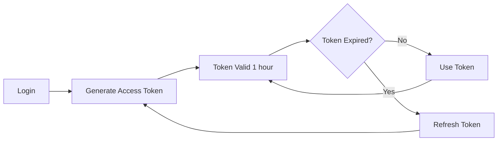

# JWT Authentication API Reference

Comprehensive documentation for JWT-based authentication system in Claude Flow Novice.

## Table of Contents

- [Overview](#overview)
- [Token Structure](#token-structure)
- [Authentication Endpoints](#authentication-endpoints)
- [Token Management](#token-management)
- [Security Features](#security-features)
- [Code Examples](#code-examples)
- [Error Handling](#error-handling)
- [Best Practices](#best-practices)

---

## Overview

Claude Flow Novice uses JWT (JSON Web Tokens) with RS256/ES256 asymmetric signing for secure, stateless authentication across all services including:

- Dashboard access
- Fleet manager operations
- Multi-swarm coordination
- SQLite memory management with ACL
- Real-time monitoring

### Key Features

- **RS256/ES256 Signing**: Asymmetric cryptography for enhanced security
- **Token Pairs**: Access tokens (1h) + Refresh tokens (7d)
- **Session Management**: Redis-backed session tracking
- **Multi-Factor Authentication**: TOTP and backup codes support
- **OAuth2 Support**: Authorization code flow with PKCE
- **Role-Based Access Control**: Fine-grained permissions
- **Automatic Rotation**: Token refresh before expiration

---

## Token Structure

### Access Token Payload

```json
{
  "sub": "user-uuid-123",
  "username": "admin",
  "email": "admin@example.com",
  "roles": ["admin", "fleet-manager"],
  "permissions": [
    "fleet:read",
    "fleet:write",
    "swarm:execute",
    "dashboard:access"
  ],
  "sessionId": "session-uuid-456",
  "scope": "fleet dashboard monitoring",
  "type": "access",
  "iat": 1704816000,
  "exp": 1704819600,
  "iss": "claude-flow-novice",
  "aud": "claude-flow-users",
  "jti": "token-uuid-789"
}
```

### Refresh Token Payload

```json
{
  "sub": "user-uuid-123",
  "sessionId": "session-uuid-456",
  "scope": "fleet dashboard monitoring",
  "type": "refresh",
  "iat": 1704816000,
  "exp": 1705420800,
  "iss": "claude-flow-novice",
  "aud": "claude-flow-users",
  "jti": "refresh-token-uuid-101"
}
```

### Token Claims

| Claim | Description | Example |
|-------|-------------|---------|
| `sub` | Subject (user ID) | `"user-uuid-123"` |
| `username` | User's username | `"admin"` |
| `email` | User's email address | `"admin@example.com"` |
| `roles` | User's roles | `["admin"]` |
| `permissions` | Granular permissions | `["fleet:read"]` |
| `sessionId` | Associated session ID | `"session-uuid-456"` |
| `scope` | Token scope | `"fleet dashboard"` |
| `type` | Token type | `"access"` or `"refresh"` |
| `iat` | Issued at (Unix timestamp) | `1704816000` |
| `exp` | Expires at (Unix timestamp) | `1704819600` |
| `iss` | Issuer | `"claude-flow-novice"` |
| `aud` | Audience | `"claude-flow-users"` |
| `jti` | JWT ID (unique identifier) | `"token-uuid-789"` |

---

## Authentication Endpoints

### POST /api/auth/register

Register a new user account.

**Request:**

```http
POST /api/auth/register
Content-Type: application/json

{
  "username": "newuser",
  "email": "user@example.com",
  "password": "SecurePassword123!@#",
  "firstName": "John",
  "lastName": "Doe",
  "phone": "+1234567890",
  "roles": ["user"],
  "permissions": ["dashboard:access"]
}
```

**Response (201 Created):**

```json
{
  "success": true,
  "user": {
    "id": "user-uuid-123",
    "username": "newuser",
    "email": "user@example.com",
    "firstName": "John",
    "lastName": "Doe",
    "roles": ["user"],
    "permissions": ["dashboard:access"],
    "status": "active",
    "emailVerified": false,
    "mfaEnabled": false,
    "createdAt": "2025-01-09T12:00:00.000Z"
  },
  "emailVerificationToken": "verification-token-uuid",
  "message": "User registered successfully. Please check your email to verify your account."
}
```

**Validation Rules:**

- Username: 3-50 characters, alphanumeric + underscore/hyphen
- Email: Valid email format
- Password: 12-128 characters with uppercase, lowercase, number, special character
- Password cannot contain user information
- Password cannot be common (e.g., "password", "123456")

---

### POST /api/auth/login

Authenticate user and receive token pair.

**Request:**

```http
POST /api/auth/login
Content-Type: application/json

{
  "username": "admin",
  "password": "SecurePassword123!@#",
  "mfaToken": "123456",
  "rememberMe": false
}
```

**Response (200 OK):**

```json
{
  "success": true,
  "user": {
    "id": "user-uuid-123",
    "username": "admin",
    "email": "admin@example.com",
    "roles": ["admin"],
    "permissions": ["fleet:read", "fleet:write", "dashboard:access"],
    "lastLoginAt": "2025-01-09T12:00:00.000Z"
  },
  "session": {
    "id": "session-uuid-456",
    "expiresAt": 1704819600000
  },
  "tokens": {
    "accessToken": "eyJhbGciOiJSUzI1NiIsInR5cCI6IkpXVCIsImtpZCI6ImF1dGgta2V5LTEifQ...",
    "refreshToken": "eyJhbGciOiJSUzI1NiIsInR5cCI6IkpXVCIsImtpZCI6ImF1dGgta2V5LTEifQ..."
  },
  "message": "Authentication successful"
}
```

**MFA Flow Response (200 OK):**

If MFA is enabled and token not provided:

```json
{
  "requiresMFA": true,
  "mfaMethods": ["totp", "backup"],
  "message": "MFA token required"
}
```

**Error Responses:**

- `401 Unauthorized`: Invalid credentials
- `423 Locked`: Account temporarily locked (too many failed attempts)
- `403 Forbidden`: Account not active
- `429 Too Many Requests`: Rate limit exceeded

---

### POST /api/auth/refresh

Refresh access token using refresh token.

**Request:**

```http
POST /api/auth/refresh
Content-Type: application/json

{
  "refreshToken": "eyJhbGciOiJSUzI1NiIsInR5cCI6IkpXVCIsImtpZCI6ImF1dGgta2V5LTEifQ..."
}
```

**Response (200 OK):**

```json
{
  "accessToken": "eyJhbGciOiJSUzI1NiIsInR5cCI6IkpXVCIsImtpZCI6ImF1dGgta2V5LTEifQ...",
  "refreshToken": "eyJhbGciOiJSUzI1NiIsInR5cCI6IkpXVCIsImtpZCI6ImF1dGgta2V5LTEifQ..."
}
```

**Notes:**

- Old refresh token is blacklisted upon successful refresh
- New token pair is generated
- Session validity is checked
- User account status is verified

---

### POST /api/auth/logout

Logout user and invalidate session.

**Request:**

```http
POST /api/auth/logout
Authorization: Bearer <access-token>
Content-Type: application/json

{
  "sessionId": "session-uuid-456",
  "logoutAllDevices": false
}
```

**Response (200 OK):**

```json
{
  "success": true,
  "message": "Logged out successfully"
}
```

**Parameters:**

- `sessionId` (optional): Specific session to logout
- `logoutAllDevices` (boolean): If true, logout all user sessions

---

### POST /api/auth/validate

Validate access token.

**Request:**

```http
POST /api/auth/validate
Content-Type: application/json

{
  "token": "eyJhbGciOiJSUzI1NiIsInR5cCI6IkpXVCIsImtpZCI6ImF1dGgta2V5LTEifQ..."
}
```

**Response (200 OK):**

```json
{
  "valid": true,
  "user": {
    "id": "user-uuid-123",
    "username": "admin",
    "email": "admin@example.com",
    "roles": ["admin"],
    "permissions": ["fleet:read", "fleet:write"]
  },
  "sessionId": "session-uuid-456",
  "scope": "fleet dashboard",
  "type": "access"
}
```

**Invalid Token Response (200 OK):**

```json
{
  "valid": false,
  "error": "Token has been revoked"
}
```

---

## Token Management

### Access Token Lifecycle



### Automatic Token Refresh (Client-Side)

```javascript
class SecureAuthClient {
  constructor() {
    this.token = localStorage.getItem('dashboard_access_token');
    this.refreshToken = localStorage.getItem('dashboard_refresh_token');
    this.scheduleTokenRefresh();
  }

  scheduleTokenRefresh() {
    // Refresh 5 minutes before expiry
    const refreshTime = 55 * 60 * 1000; // 55 minutes

    this.tokenRefreshTimer = setTimeout(async () => {
      try {
        await this.refreshAccessToken();
      } catch (error) {
        console.error('Auto token refresh failed:', error);
        this.showLoginModal();
      }
    }, refreshTime);
  }

  async refreshAccessToken() {
    const response = await fetch('/api/auth/refresh', {
      method: 'POST',
      headers: { 'Content-Type': 'application/json' },
      body: JSON.stringify({ refreshToken: this.refreshToken })
    });

    const data = await response.json();

    if (!response.ok) {
      throw new Error(data.error || 'Token refresh failed');
    }

    this.token = data.accessToken;
    this.refreshToken = data.refreshToken;

    localStorage.setItem('dashboard_access_token', this.token);
    localStorage.setItem('dashboard_refresh_token', this.refreshToken);

    this.scheduleTokenRefresh();
  }
}
```

### Token Blacklisting

Tokens are blacklisted in Redis upon:

- User logout
- Token refresh (old refresh token)
- Manual token revocation
- Account suspension/deletion

```javascript
// Server-side blacklist check
async function isTokenBlacklisted(token) {
  const exists = await redisClient.exists(`blacklist:${token}`);
  return exists === 1;
}

// Blacklist token with TTL matching token expiration
async function blacklistToken(token) {
  const decoded = jwt.decode(token);
  const ttl = Math.max(0, decoded.exp - Math.floor(Date.now() / 1000));

  if (ttl > 0) {
    await redisClient.setEx(`blacklist:${token}`, ttl, '1');
  }
}
```

---

## Security Features

### 1. Asymmetric Key Signing (RS256)

```javascript
// Key generation (done once at service initialization)
const { publicKey, privateKey } = crypto.generateKeyPairSync('rsa', {
  modulusLength: 2048,
  publicKeyEncoding: { type: 'spki', format: 'pem' },
  privateKeyEncoding: { type: 'pkcs8', format: 'pem' }
});

// Signing
const token = jwt.sign(payload, privateKey, {
  algorithm: 'RS256',
  keyid: 'auth-key-1'
});

// Verification
const decoded = jwt.verify(token, publicKey, {
  algorithms: ['RS256'],
  issuer: 'claude-flow-novice',
  audience: 'claude-flow-users'
});
```

### 2. Session Management

Sessions are stored in Redis with automatic expiration:

```javascript
const session = {
  id: 'session-uuid-456',
  userId: 'user-uuid-123',
  clientInfo: {
    ip: '192.168.1.1',
    userAgent: 'Mozilla/5.0...',
    platform: 'Web'
  },
  createdAt: 1704816000000,
  lastActivity: 1704816000000,
  expiresAt: 1704817800000, // 30 minutes from creation
  rememberMe: false
};

// Store with automatic expiration
await redisClient.hSet(`session:${session.id}`, session);
await redisClient.expire(
  `session:${session.id}`,
  Math.floor((session.expiresAt - Date.now()) / 1000)
);
```

### 3. Rate Limiting

Login attempts are rate-limited per user:

```javascript
// Check rate limit before authentication
const attempts = await redisClient.get(`rate_limit:login:${email}`);

if (attempts >= 5) {
  throw new Error('Rate limit exceeded. Try again in 15 minutes.');
}

// Increment attempt counter
await redisClient.incr(`rate_limit:login:${email}`);
await redisClient.expire(`rate_limit:login:${email}`, 900); // 15 minutes
```

### 4. Account Lockout

After 5 failed login attempts, account is temporarily locked:

```javascript
user.loginAttempts++;

if (user.loginAttempts >= 5) {
  user.lockedUntil = Date.now() + (15 * 60 * 1000); // 15 minutes
  await storeUser(user);

  throw new Error('Account temporarily locked due to too many failed login attempts');
}
```

### 5. Password Security

Passwords are hashed using Argon2id (fallback to bcrypt):

```javascript
// Argon2id hashing (recommended)
const hash = await argon2.hash(password, {
  type: argon2.argon2id,
  memoryCost: 2 ** 16, // 64MB
  timeCost: 3,
  parallelism: 1,
  hashLength: 32
});

// Verification
const isValid = await argon2.verify(hash, password);
```

---

## Code Examples

### Backend: Protecting Routes

```javascript
import { EnhancedAuthService } from './src/security/EnhancedAuthService.js';

const authService = new EnhancedAuthService();
await authService.initialize();

// Authentication middleware
async function authenticateToken(req, res, next) {
  const authHeader = req.headers['authorization'];
  const token = authHeader && authHeader.split(' ')[1]; // Bearer TOKEN

  if (!token) {
    return res.status(401).json({ error: 'Authentication required' });
  }

  try {
    const validation = await authService.validateToken(token);

    if (!validation.valid) {
      return res.status(401).json({ error: validation.error });
    }

    req.user = validation.user;
    req.sessionId = validation.sessionId;
    next();
  } catch (error) {
    return res.status(403).json({ error: 'Invalid token' });
  }
}

// Permission middleware
function requirePermission(permission) {
  return (req, res, next) => {
    if (!req.user.permissions.includes(permission)) {
      return res.status(403).json({ error: 'Insufficient permissions' });
    }
    next();
  };
}

// Usage
app.get('/api/fleet/status',
  authenticateToken,
  requirePermission('fleet:read'),
  async (req, res) => {
    // Protected route logic
    const fleetStatus = await getFleetStatus();
    res.json(fleetStatus);
  }
);
```

### Frontend: Dashboard Authentication

```javascript
class SecureAuthClient {
  constructor() {
    this.baseURL = window.location.origin;
    this.token = localStorage.getItem('dashboard_access_token');
    this.refreshToken = localStorage.getItem('dashboard_refresh_token');
    this.user = JSON.parse(localStorage.getItem('dashboard_user') || 'null');
    this.init();
  }

  init() {
    this.setupFetchInterceptor();
    this.scheduleTokenRefresh();
    this.checkAuthStatus();
  }

  setupFetchInterceptor() {
    const originalFetch = window.fetch;

    window.fetch = async (...args) => {
      let [url, options = {}] = args;

      // Add authentication header for API requests
      if (url.startsWith('/api') || url.startsWith(this.baseURL + '/api')) {
        options.headers = {
          ...options.headers,
          'Authorization': `Bearer ${this.token}`,
          'Content-Type': 'application/json'
        };
      }

      const response = await originalFetch(url, options);

      // Handle 401 unauthorized
      if (response.status === 401) {
        await this.handleUnauthorized();
        throw new Error('Authentication required');
      }

      return response;
    };
  }

  async login(username, password) {
    const response = await fetch(`${this.baseURL}/api/auth/login`, {
      method: 'POST',
      headers: { 'Content-Type': 'application/json' },
      body: JSON.stringify({ username, password })
    });

    const data = await response.json();

    if (!response.ok) {
      throw new Error(data.error || 'Login failed');
    }

    this.token = data.tokens.accessToken;
    this.refreshToken = data.tokens.refreshToken;
    this.user = data.user;

    localStorage.setItem('dashboard_access_token', this.token);
    localStorage.setItem('dashboard_refresh_token', this.refreshToken);
    localStorage.setItem('dashboard_user', JSON.stringify(this.user));

    this.scheduleTokenRefresh();
    return data;
  }
}

// Initialize
window.authClient = new SecureAuthClient();
```

### Node.js Client

```javascript
import fetch from 'node-fetch';

class ClaudeFlowClient {
  constructor(baseURL = 'http://localhost:3001') {
    this.baseURL = baseURL;
    this.accessToken = null;
    this.refreshToken = null;
  }

  async login(username, password) {
    const response = await fetch(`${this.baseURL}/api/auth/login`, {
      method: 'POST',
      headers: { 'Content-Type': 'application/json' },
      body: JSON.stringify({ username, password })
    });

    const data = await response.json();

    if (!response.ok) {
      throw new Error(data.error || 'Login failed');
    }

    this.accessToken = data.tokens.accessToken;
    this.refreshToken = data.tokens.refreshToken;

    return data;
  }

  async request(endpoint, options = {}) {
    const url = `${this.baseURL}${endpoint}`;
    const headers = {
      'Content-Type': 'application/json',
      'Authorization': `Bearer ${this.accessToken}`,
      ...options.headers
    };

    const response = await fetch(url, { ...options, headers });

    // Auto-refresh on 401
    if (response.status === 401) {
      await this.refresh();
      return this.request(endpoint, options);
    }

    return response.json();
  }

  async refresh() {
    const response = await fetch(`${this.baseURL}/api/auth/refresh`, {
      method: 'POST',
      headers: { 'Content-Type': 'application/json' },
      body: JSON.stringify({ refreshToken: this.refreshToken })
    });

    const data = await response.json();
    this.accessToken = data.accessToken;
    this.refreshToken = data.refreshToken;
  }
}

// Usage
const client = new ClaudeFlowClient();
await client.login('admin', 'password');

const fleetStatus = await client.request('/api/fleet/status');
console.log(fleetStatus);
```

---

## Error Handling

### Common Error Codes

| Code | Status | Description | Solution |
|------|--------|-------------|----------|
| `AUTH_REQUIRED` | 401 | No token provided | Include Authorization header |
| `TOKEN_EXPIRED` | 401 | Access token expired | Refresh token |
| `TOKEN_INVALID` | 401 | Token signature invalid | Re-authenticate |
| `TOKEN_REVOKED` | 401 | Token has been blacklisted | Re-authenticate |
| `INVALID_CREDENTIALS` | 401 | Wrong username/password | Check credentials |
| `ACCOUNT_LOCKED` | 423 | Too many failed attempts | Wait 15 minutes |
| `ACCOUNT_INACTIVE` | 403 | Account not active | Contact administrator |
| `INSUFFICIENT_PERMISSIONS` | 403 | Missing required permission | Request access |
| `RATE_LIMIT_EXCEEDED` | 429 | Too many requests | Wait and retry |
| `MFA_REQUIRED` | 200 | MFA token needed | Provide MFA token |
| `MFA_INVALID` | 401 | Wrong MFA token | Check authenticator app |
| `SESSION_EXPIRED` | 401 | Session no longer valid | Re-authenticate |

### Error Response Format

```json
{
  "error": "TOKEN_EXPIRED",
  "message": "Access token has expired",
  "code": 401,
  "timestamp": "2025-01-09T12:00:00.000Z",
  "path": "/api/fleet/status"
}
```

### Client-Side Error Handling

```javascript
async function makeAuthenticatedRequest(endpoint) {
  try {
    const response = await fetch(endpoint, {
      headers: {
        'Authorization': `Bearer ${authClient.token}`
      }
    });

    if (response.status === 401) {
      // Try to refresh token
      try {
        await authClient.refreshAccessToken();
        // Retry request
        return makeAuthenticatedRequest(endpoint);
      } catch (refreshError) {
        // Refresh failed, redirect to login
        authClient.showLoginModal();
        throw new Error('Session expired. Please login again.');
      }
    }

    if (response.status === 403) {
      throw new Error('Access denied. Insufficient permissions.');
    }

    if (response.status === 429) {
      const retryAfter = response.headers.get('Retry-After');
      throw new Error(`Rate limit exceeded. Retry after ${retryAfter} seconds.`);
    }

    if (!response.ok) {
      const data = await response.json();
      throw new Error(data.message || 'Request failed');
    }

    return response.json();
  } catch (error) {
    console.error('Request error:', error);
    throw error;
  }
}
```

---

## Best Practices

### 1. Token Storage

**Browser:**
- Store in `localStorage` for persistent sessions
- Consider `sessionStorage` for temporary sessions
- Never store in cookies without `HttpOnly` and `Secure` flags

**Node.js:**
- Store in memory for CLI tools
- Use secure credential storage for long-running services
- Consider environment variables for service accounts

### 2. Token Transmission

```javascript
// Always use HTTPS in production
const headers = {
  'Authorization': `Bearer ${accessToken}`,
  'Content-Type': 'application/json'
};

// Never send tokens in URL parameters
// ❌ Bad: /api/data?token=eyJhbGc...
// ✅ Good: Authorization header
```

### 3. Token Refresh Strategy

```javascript
// Proactive refresh (5 minutes before expiry)
const tokenExpiresIn = 60 * 60 * 1000; // 1 hour
const refreshBefore = 5 * 60 * 1000; // 5 minutes
const refreshTime = tokenExpiresIn - refreshBefore;

setTimeout(() => refreshAccessToken(), refreshTime);
```

### 4. Session Management

```javascript
// Limit concurrent sessions per user
const maxConcurrentSessions = 5;

// Implement absolute session timeout
const absoluteTimeout = 8 * 60 * 60 * 1000; // 8 hours

// Extend session on activity
await updateSessionActivity(sessionId);
```

### 5. Security Headers

```javascript
// Add security headers to responses
app.use((req, res, next) => {
  res.setHeader('X-Content-Type-Options', 'nosniff');
  res.setHeader('X-Frame-Options', 'DENY');
  res.setHeader('X-XSS-Protection', '1; mode=block');
  res.setHeader('Strict-Transport-Security', 'max-age=31536000; includeSubDomains');
  next();
});
```

### 6. Audit Logging

```javascript
// Log all authentication events
await logSecurityEvent('user_authenticated', {
  userId: user.id,
  username: user.username,
  sessionId: session.id,
  ip: req.ip,
  userAgent: req.headers['user-agent'],
  mfaUsed: user.mfaEnabled,
  timestamp: new Date().toISOString()
});
```

---

## Related Documentation

- [Migration Guide: Base64 to JWT](./MIGRATION_BASE64_TO_JWT.md)
- [Security Deployment Checklist](./DEPLOYMENT_CHECKLIST.md)
- [Secrets Management](./SECRETS_MANAGEMENT.md)
- [Redis Authentication](./REDIS_AUTHENTICATION.md)
- [Troubleshooting Guide](../TROUBLESHOOTING.md)

---

## Support

For JWT authentication issues:

1. Check token validity: `/api/auth/validate`
2. Review audit logs: `memory/security/audit-report.json`
3. Test with curl:
   ```bash
   curl -X POST http://localhost:3001/api/auth/login \
     -H "Content-Type: application/json" \
     -d '{"username":"admin","password":"password"}'
   ```
4. Enable debug logging: `DEBUG=claude-flow:auth npm start`

**Last Updated**: 2025-01-09
**Version**: 1.6.6
