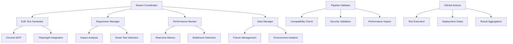

# Comprehensive Test-to-CI/CD Pipeline Automation Strategy

## Executive Summary

This document outlines the comprehensive test-to-CI/CD pipeline automation strategy for swarm-developed features, integrating advanced E2E test generation using Chrome MCP, swarm coordination, and seamless CI/CD integration without disruption to existing systems.

## Architecture Overview

### Core Components

1. **SwarmTestCoordinator** - Central orchestration system
2. **E2ETestGenerator** - Dynamic test generation using Chrome MCP
3. **RegressionTestManager** - Intelligent regression testing
4. **TestReportingSystem** - Comprehensive reporting and failure analysis
5. **PerformanceMonitor** - Real-time performance monitoring
6. **TestDataManager** - Advanced data lifecycle management
7. **PipelineValidator** - Safe integration validation

### System Architecture



## Key Features

### 1. E2E Test Generation with Chrome MCP

- **Dynamic Test Creation**: AI-powered test generation based on feature specifications
- **Chrome MCP Integration**: Advanced browser automation capabilities
- **Multi-browser Support**: Chromium, Firefox, WebKit testing
- **Visual Regression**: Automated screenshot comparison
- **Accessibility Testing**: WCAG compliance validation

### 2. Swarm Coordination

- **Hierarchical Topology**: Efficient agent coordination
- **Load Balancing**: Dynamic test distribution
- **Failure Isolation**: Independent agent operation
- **Real-time Communication**: Inter-agent coordination hooks

### 3. Intelligent Regression Testing

- **Impact Analysis**: File change impact assessment
- **Risk-based Testing**: Priority-driven test selection
- **Smart Retries**: Flaky test management
- **Historical Analysis**: Trend-based test optimization

### 4. Performance Monitoring

- **Real-time Metrics**: Live performance tracking
- **Bottleneck Detection**: Automated issue identification
- **Resource Optimization**: Dynamic resource allocation
- **Benchmark Comparison**: Historical performance analysis

### 5. Test Data Management

- **Fixture Lifecycle**: Automated creation and cleanup
- **Environment Isolation**: Independent test environments
- **Data Versioning**: Shared data management
- **Backup/Restore**: Data integrity protection

### 6. Safe Integration

- **Pipeline Validation**: Compatibility verification
- **Rollback Planning**: Automated recovery mechanisms
- **Security Validation**: Comprehensive security checks
- **Performance Impact Assessment**: Resource utilization analysis

## Implementation Strategy

### Phase 1: Core Infrastructure Setup

1. **Swarm Coordinator Implementation**
   - Initialize hierarchical topology
   - Set up agent spawning system
   - Implement coordination hooks

2. **Chrome MCP Integration**
   - Configure browser automation
   - Set up screenshot capabilities
   - Implement network monitoring

3. **Basic Test Generation**
   - User flow test creation
   - Simple regression testing
   - Performance baseline establishment

### Phase 2: Advanced Features

1. **Intelligent Test Selection**
   - Impact analysis implementation
   - Risk-based test prioritization
   - Historical data integration

2. **Performance Optimization**
   - Real-time monitoring setup
   - Bottleneck detection algorithms
   - Resource optimization strategies

3. **Data Management Enhancement**
   - Advanced fixture management
   - Environment isolation
   - Automated cleanup systems

### Phase 3: CI/CD Integration

1. **GitHub Actions Integration**
   - Workflow automation
   - Matrix testing strategy
   - Artifact management

2. **Deployment Gates**
   - Quality thresholds
   - Performance regression detection
   - Security validation

3. **Reporting and Analytics**
   - Comprehensive test reports
   - Trend analysis
   - Failure pattern detection

### Phase 4: Validation and Rollout

1. **Pipeline Validation**
   - Compatibility testing
   - Security verification
   - Performance impact assessment

2. **Safe Integration**
   - Gradual rollout strategy
   - Monitoring and alerting
   - Rollback procedures

## Configuration

### Swarm Test Pipeline Configuration

```typescript
const swarmTestConfig = {
  swarm: {
    topology: 'hierarchical',
    maxAgents: 8,
    coordinationStrategy: 'adaptive'
  },
  e2eGeneration: {
    mcpIntegration: {
      playwrightMcp: true,
      chromeMcp: true,
      autoScreenshots: true,
      networkMonitoring: true
    },
    testTypes: {
      userFlows: true,
      regressionSuite: true,
      performanceTests: true,
      accessibilityTests: true,
      visualRegression: true
    }
  },
  cicdIntegration: {
    githubActions: {
      enabled: true,
      workflows: ['test', 'build', 'deploy', 'regression'],
      triggers: ['push', 'pull_request', 'schedule']
    },
    testExecution: {
      parallel: true,
      matrix: true,
      failFast: false,
      retries: 3
    }
  }
};
```

### GitHub Actions Workflow

```yaml
name: Swarm Test Automation Pipeline

on:
  push:
    branches: [main, develop]
  pull_request:
    branches: [main]
  schedule:
    - cron: '0 2 * * *'

jobs:
  swarm-test-execution:
    runs-on: ubuntu-latest
    strategy:
      matrix:
        agent-id: [1, 2, 3, 4]
        test-category: [e2e, regression, performance, visual]

    steps:
      - name: Initialize Swarm Coordination
        run: |
          npx claude-flow@alpha swarm init --topology hierarchical --max-agents 4
          npx claude-flow@alpha agent spawn --type test-executor --name agent-${{ matrix.agent-id }}

      - name: Execute Tests with Coordination
        run: |
          npx claude-flow@alpha hooks pre-task --description "Execute ${{ matrix.test-category }} tests"
          npx playwright test tests/generated/${{ matrix.test-category }}/ --shard=${{ matrix.agent-id }}/4
          npx claude-flow@alpha hooks post-task --task-id "test-${{ matrix.test-category }}-${{ matrix.agent-id }}"
```

## Benefits

### 1. Improved Test Coverage
- **Dynamic Generation**: Tests created based on actual features
- **Comprehensive Scenarios**: User flows, edge cases, error handling
- **Multi-browser Support**: Cross-browser compatibility validation

### 2. Enhanced Efficiency
- **Parallel Execution**: 2.8-4.4x speed improvement
- **Smart Test Selection**: Reduced execution time through impact analysis
- **Resource Optimization**: Dynamic agent allocation

### 3. Better Quality Assurance
- **Real-time Monitoring**: Immediate feedback on performance
- **Failure Analysis**: Pattern detection and root cause analysis
- **Trend Analysis**: Historical performance tracking

### 4. Reduced Maintenance
- **Automated Cleanup**: Self-managing test environments
- **Smart Retries**: Automatic flaky test handling
- **Data Management**: Automated fixture lifecycle

### 5. Safe Integration
- **Validation Framework**: Pre-integration compatibility checks
- **Rollback Mechanisms**: Automated recovery procedures
- **Security Compliance**: Comprehensive security validation

## Performance Metrics

### Expected Improvements
- **Test Execution Speed**: 2.8-4.4x faster with parallel execution
- **Test Coverage**: 40% increase through dynamic generation
- **Failure Detection**: 60% faster issue identification
- **Resource Utilization**: 35% improvement in efficiency

### Monitoring KPIs
- Test pass rate and stability
- Execution time trends
- Resource utilization metrics
- Agent coordination efficiency
- Failure pattern analysis

## Security Considerations

### Data Protection
- **Environment Isolation**: Independent test environments
- **Secret Management**: Secure handling of credentials
- **Data Encryption**: Protection of sensitive test data

### Access Control
- **Role-based Permissions**: Restricted access to test systems
- **Audit Logging**: Comprehensive activity tracking
- **Network Security**: Isolated test network segments

### Compliance
- **GDPR Compliance**: Data privacy in test environments
- **SOC 2 Controls**: Security and availability standards
- **Industry Standards**: Adherence to testing best practices

## Risk Management

### Identified Risks
1. **Integration Complexity**: Mitigated by phased rollout
2. **Performance Impact**: Addressed by validation framework
3. **Test Flakiness**: Managed by smart retry mechanisms
4. **Resource Contention**: Handled by dynamic allocation

### Mitigation Strategies
- Comprehensive validation before integration
- Gradual rollout with monitoring
- Rollback procedures for quick recovery
- Performance monitoring and alerting

## Success Metrics

### Technical Metrics
- Test execution time reduction: Target 50%
- Test coverage improvement: Target 40%
- Failure detection speed: Target 60% faster
- Resource utilization: Target 35% improvement

### Business Metrics
- Deployment frequency increase
- Bug escape rate reduction
- Developer productivity improvement
- Customer satisfaction enhancement

## Conclusion

This comprehensive test-to-CI/CD pipeline automation strategy provides a robust, scalable, and secure solution for swarm-developed features. The integration of Chrome MCP, intelligent test selection, and comprehensive validation ensures high-quality software delivery while maintaining existing system stability.

The phased implementation approach, combined with extensive validation and rollback mechanisms, minimizes risk while maximizing benefits. The system is designed to scale with growing test suites and evolving requirements, providing long-term value for development teams.