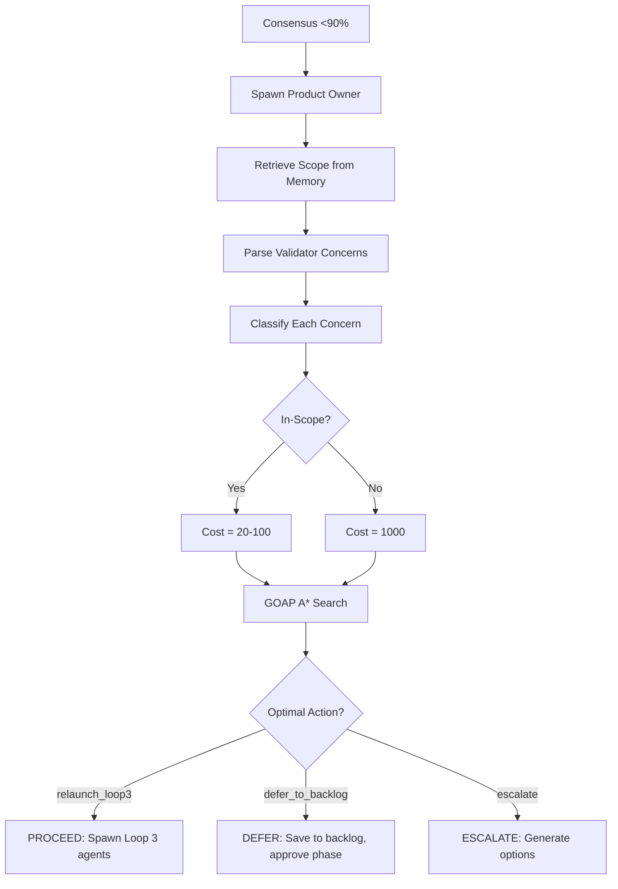

# CFN Loop Scope Control System

## Overview

The Scope Control System enables the Product Owner agent to enforce project boundaries using GOAP (Goal-Oriented Action Planning) cost functions. It prevents scope creep by assigning prohibitive costs to out-of-scope work while allowing in-scope fixes to proceed autonomously.

## Quick Start

### 1. Initialize Scope at Project Start

```javascript
// Using MCP memory_usage tool
mcp__claude-flow-novice__memory_usage({
  action: "store",
  namespace: "scope-control",
  key: "project-boundaries",
  value: JSON.stringify({
    primary_goal: "Implement help coordinator system",
    in_scope: [
      "help routing via MessageBroker",
      "agent capability matching",
      "waiting pool management",
      "state machine integration"
    ],
    out_of_scope: [
      "ML-based help suggestions",
      "External API integrations",
      "Advanced analytics",
      "JWT authentication"
    ],
    risk_profile: "internal-only-low-risk",
    decision_authority_config: {
      auto_approve_threshold: 0.90,
      auto_relaunch_max_iteration: 10,
      escalation_criteria: [
        "Breaking changes to public API",
        "Security model changes affecting other systems"
      ]
    }
  })
})
```

### 2. Product Owner Retrieves Scope

```javascript
// In Product Owner agent
Task("Product Owner", `
  RETRIEVE SCOPE FROM MEMORY:
  mcp__claude-flow-novice__memory_usage({
    action: "retrieve",
    namespace: "scope-control",
    key: "project-boundaries"
  })

  // Use scope for GOAP decision making
  // Classify validator concerns
  // Apply cost functions
`, "product-owner")
```

### 3. Scope Classification in Action

**Example 1: Out-of-Scope Concern (Deferred)**
```json
{
  "validator": "security-specialist",
  "concern": "Internal admin process lacks JWT authentication",
  "recommendation": "Add JWT with RS256 encryption",
  "classification": "out-of-scope",
  "reasoning": "JWT authentication not in scope for internal-only tool",
  "cost_penalty": 1000,
  "decision": "DEFER to backlog"
}
```

**Example 2: In-Scope Concern (Addressed)**
```json
{
  "validator": "architect",
  "concern": "MessageBroker routing missing for help.* topics",
  "recommendation": "Implement MessageBroker.route('help.*', handler)",
  "classification": "in-scope",
  "reasoning": "MessageBroker routing is explicitly in-scope",
  "cost_penalty": 50,
  "decision": "PROCEED with Loop 3 relaunch"
}
```

## Scope Control API

### TypeScript Utilities

```typescript
import { ScopeControl } from '../src/cfn-loop/scope-control.js';

// Create scope boundaries
const scope = ScopeControl.createScopeBoundaries({
  primaryGoal: "Implement user authentication",
  inScope: ["user registration", "password hashing", "session management"],
  outOfScope: ["social login", "OAuth", "passwordless auth"],
  riskProfile: "public-facing-medium-risk"
});

// Classify validator concern
const concern = {
  validator: "security-specialist",
  concern: "Add Google OAuth login",
  recommendation: "Integrate Google OAuth provider",
  severity: "medium" as const
};

const classification = ScopeControl.classifyConcern(concern, scope);
// Result: { classification: "out-of-scope", cost_penalty: 1000 }

// Calculate GOAP action cost
const cost = ScopeControl.calculateActionCost({
  name: "expand_scope_oauth",
  baseComplexity: 5,
  scopeImpact: "expands",
  addressesConcerns: [classification]
}, {
  loop2Iteration: 2,
  loop3Iteration: 1,
  criticalBlockers: 0
});
// Result: 1050 (base 50 + scope penalty 1000)
```

## Decision Flow



## Common Scenarios

### Scenario 1: Security Validator Suggests JWT (Out-of-Scope)

**Context**: Internal admin tool, validator suggests JWT authentication

**Scope**:
- In-scope: Basic auth, admin CRUD
- Out-of-scope: JWT, OAuth, encryption

**Product Owner Decision**:
```json
{
  "decision": "DEFER",
  "reasoning": "JWT is out-of-scope for internal-only tool. GOAP assigned cost=1000 to scope expansion vs cost=20 to defer.",
  "action": "defer_to_backlog",
  "deferred_items": ["JWT authentication - Phase 2 candidate"],
  "next_action": "AUTO-TRANSITION to next phase"
}
```

### Scenario 2: Architect Finds Missing Implementation (In-Scope)

**Context**: Help system missing MessageBroker routing

**Scope**:
- In-scope: Help routing, MessageBroker integration
- Out-of-scope: ML suggestions, external APIs

**Product Owner Decision**:
```json
{
  "decision": "PROCEED",
  "reasoning": "MessageBroker routing is in-scope. GOAP assigned cost=50 for targeted fix.",
  "action": "relaunch_loop3_targeted",
  "agents": ["backend-dev", "architect"],
  "focus": [
    "backend-dev: Implement MessageBroker.route('help.*', HelpCoordinator)",
    "architect: Validate routing architecture"
  ],
  "next_action": "IMMEDIATELY spawn Loop 3 Iteration 3/10"
}
```

### Scenario 3: Mixed Concerns (In-Scope + Out-of-Scope)

**Context**: Validator finds 3 in-scope gaps + 2 out-of-scope suggestions

**Product Owner Decision**:
```json
{
  "decision": "PROCEED",
  "reasoning": "3 in-scope blockers require fixing. 2 out-of-scope items deferred to backlog.",
  "action": "relaunch_loop3_targeted",
  "agents": ["backend-dev", "tester", "architect"],
  "focus": [
    "backend-dev: Fix SQL injection (in-scope)",
    "tester: Add integration tests (in-scope)",
    "architect: Validate data flow (in-scope)"
  ],
  "deferred_items": [
    "ML-based recommendations - out of scope",
    "OAuth integration - out of scope"
  ],
  "next_action": "IMMEDIATELY spawn Loop 3 Iteration 4/10"
}
```

## Risk Profiles

### Internal-Only Low-Risk
- **Auto-approve threshold**: 0.90 (90%)
- **Max iterations**: 10
- **Scope flexibility**: Low (strict enforcement)
- **Example**: Internal admin tools, developer utilities

### Public-Facing Medium-Risk
- **Auto-approve threshold**: 0.90 (90%)
- **Max iterations**: 10
- **Escalation criteria**: Security changes, API modifications
- **Example**: User-facing features, public APIs

### Critical High-Risk
- **Auto-approve threshold**: 0.95 (95%)
- **Max iterations**: 8
- **Escalation criteria**: Payment data, PCI DSS, security model changes
- **Example**: Payment processing, healthcare data, financial systems

## Example Scope Templates

### Help System (Internal Tool)
```javascript
{
  primary_goal: "Implement help coordinator system",
  in_scope: [
    "help routing via MessageBroker",
    "agent capability matching",
    "waiting pool management",
    "state machine integration (HELPING state)"
  ],
  out_of_scope: [
    "ML-based help suggestions",
    "External API integrations",
    "Advanced analytics",
    "JWT authentication",
    "OAuth providers"
  ],
  risk_profile: "internal-only-low-risk"
}
```

### User Authentication (Public-Facing)
```javascript
{
  primary_goal: "Build user authentication system",
  in_scope: [
    "user registration and login",
    "password hashing (bcrypt)",
    "session management",
    "basic RBAC (role-based access)"
  ],
  out_of_scope: [
    "social login (Google, Facebook)",
    "passwordless authentication",
    "advanced MFA (hardware tokens)",
    "SSO integration (SAML, LDAP)"
  ],
  risk_profile: "public-facing-medium-risk",
  decision_authority_config: {
    auto_approve_threshold: 0.90,
    auto_relaunch_max_iteration: 10,
    escalation_criteria: [
      "Changes to password storage mechanism",
      "Modifications to session token generation",
      "Security model changes"
    ]
  }
}
```

### Payment Processing (Critical System)
```javascript
{
  primary_goal: "Integrate Stripe payment processing",
  in_scope: [
    "Stripe API integration",
    "payment intent creation",
    "webhook handling",
    "basic refund support"
  ],
  out_of_scope: [
    "multi-currency support",
    "subscription billing",
    "split payments",
    "cryptocurrency"
  ],
  risk_profile: "critical-high-risk",
  decision_authority_config: {
    auto_approve_threshold: 0.95,
    auto_relaunch_max_iteration: 8,
    escalation_criteria: [
      "Changes to payment data handling",
      "Modifications to webhook security",
      "Budget impact >$100 in single phase",
      "PCI DSS compliance concerns"
    ]
  }
}
```

## Memory Namespace Structure

```
scope-control/
  ├── project-boundaries          # Main scope definition
  ├── phase-1-scope              # Phase-specific scope (optional)
  ├── phase-2-scope              # Phase-specific scope (optional)
  └── backlog                    # Deferred out-of-scope items

product-owner-decisions/
  ├── decision-phase1-iter1      # Decision history
  ├── decision-phase1-iter2
  └── decision-phase2-iter1
```

## Integration with CFN Loop

```javascript
// Loop 2: After consensus validation
if (consensusScore < 0.90) {
  // Spawn Product Owner
  Task("Product Owner", `
    GOAP DECISION EXECUTION

    1. RETRIEVE SCOPE:
    const scopeData = await memory_usage({
      action: "retrieve",
      namespace: "scope-control",
      key: "project-boundaries"
    });
    const scope = JSON.parse(scopeData.value);

    2. CLASSIFY CONCERNS:
    - In-scope: ${inScopeConcerns}
    - Out-of-scope: ${outOfScopeConcerns}

    3. EXECUTE A* SEARCH:
    - Action: relaunch_loop3 (cost=70)
    - Action: defer_to_backlog (cost=20)
    - Action: expand_scope (cost=1000) ❌

    4. OUTPUT DECISION (autonomous, no permission)
  `, "product-owner")
}
```

## Benefits

### 1. **Automatic Scope Enforcement**
- GOAP cost functions prevent scope creep automatically
- Out-of-scope work has prohibitive cost (1000+)
- In-scope work proceeds with normal cost (20-100)

### 2. **Autonomous Decision-Making**
- Product Owner makes decisions without human approval
- Optimal path found via A* search
- Consistent, algorithmic decisions

### 3. **Transparent Reasoning**
- All decisions include GOAP cost analysis
- Clear reasoning for PROCEED/DEFER/ESCALATE
- Deferred items saved with context for later phases

### 4. **Flexible Configuration**
- Risk profiles adjust thresholds
- Per-phase scope boundaries (optional)
- Escalation criteria customizable

## Troubleshooting

### Issue: Scope Too Restrictive
**Symptom**: Valid concerns being marked out-of-scope

**Solution**: Refine scope boundaries
```javascript
// Add broader categories to in-scope
in_scope: [
  "help routing via MessageBroker",
  "agent capability matching",
  "message routing infrastructure",  // Broader category
  "state machine updates"            // Broader category
]
```

### Issue: Scope Too Permissive
**Symptom**: Scope creep not being caught

**Solution**: Add specific exclusions to out-of-scope
```javascript
out_of_scope: [
  "ML-based help suggestions",
  "External API integrations",
  "JWT authentication",        // Specific exclusion
  "OAuth providers",          // Specific exclusion
  "advanced analytics features"  // Specific category
]
```

### Issue: Product Owner Always Escalates
**Symptom**: No autonomous decisions being made

**Solution**: Check escalation criteria and thresholds
```javascript
decision_authority_config: {
  auto_approve_threshold: 0.90,  // Lower if too strict (0.85)
  auto_relaunch_max_iteration: 10,  // Increase if hitting limit
  escalation_criteria: [
    // Remove overly broad criteria
    "Security changes"  // ❌ Too broad
    "Changes to authentication mechanism"  // ✅ Specific
  ]
}
```

## Best Practices

1. **Define Scope Early**: Initialize scope boundaries at project start
2. **Be Specific**: Use concrete items in in-scope/out-of-scope lists
3. **Review Backlog**: Periodically review deferred items for future phases
4. **Track Decisions**: Use decision history to refine scope boundaries
5. **Adjust Risk Profiles**: Match risk profile to system criticality

---

**Remember**: Scope control prevents wasted effort by ensuring the team focuses on delivering the defined goal, not expanding into nice-to-have features. The Product Owner agent uses GOAP to enforce this mathematically, not subjectively.
