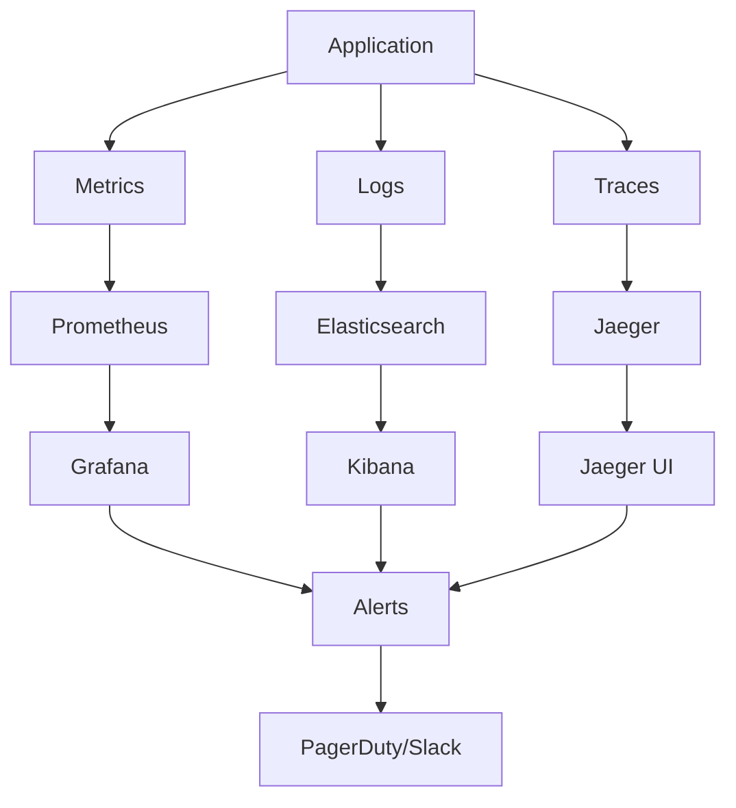

# Monitoring & Observability - Claude Flow Novice

## Overview

Comprehensive monitoring and observability setup for Claude Flow Novice using industry-standard tools including Prometheus, Grafana, ELK Stack, Jaeger, and cloud-native monitoring solutions.

## Table of Contents
1. [Monitoring Architecture](#monitoring-architecture)
2. [Prometheus & Grafana Setup](#prometheus--grafana-setup)
3. [ELK Stack for Logging](#elk-stack-for-logging)
4. [Distributed Tracing](#distributed-tracing)
5. [Application Performance Monitoring](#application-performance-monitoring)
6. [Cloud-Native Monitoring](#cloud-native-monitoring)
7. [Alerting & Incident Response](#alerting--incident-response)
8. [SLI/SLO Management](#slislo-management)

---

## Monitoring Architecture

### Three Pillars of Observability



### Monitoring Stack Components

| Component | Purpose | Technology |
|-----------|---------|------------|
| **Metrics Collection** | Time-series data | Prometheus, CloudWatch |
| **Log Aggregation** | Centralized logging | ELK Stack, Fluentd |
| **Distributed Tracing** | Request tracking | Jaeger, Zipkin |
| **Visualization** | Dashboards & alerts | Grafana, Kibana |
| **APM** | Application performance | New Relic, DataDog |
| **Synthetic Monitoring** | Proactive checks | Pingdom, Synthetic |

---

## Prometheus & Grafana Setup

### Prometheus Configuration

```yaml
# monitoring/prometheus/prometheus.yml
global:
  scrape_interval: 15s
  evaluation_interval: 15s
  external_labels:
    cluster: claude-flow-production
    region: us-west-2

rule_files:
  - "rules/*.yml"

alerting:
  alertmanagers:
    - static_configs:
        - targets:
          - alertmanager:9093

scrape_configs:
  # Claude Flow Application
  - job_name: 'claude-flow-novice'
    static_configs:
      - targets: ['claude-flow-service:3000']
    metrics_path: '/metrics'
    scrape_interval: 5s
    scrape_timeout: 3s
    honor_labels: true
    params:
      format: ['prometheus']

  # Kubernetes API Server
  - job_name: 'kubernetes-apiserver'
    kubernetes_sd_configs:
      - role: endpoints
    scheme: https
    tls_config:
      ca_file: /var/run/secrets/kubernetes.io/serviceaccount/ca.crt
    bearer_token_file: /var/run/secrets/kubernetes.io/serviceaccount/token
    relabel_configs:
      - source_labels: [__meta_kubernetes_namespace, __meta_kubernetes_service_name, __meta_kubernetes_endpoint_port_name]
        action: keep
        regex: default;kubernetes;https

  # Node Exporter
  - job_name: 'node-exporter'
    kubernetes_sd_configs:
      - role: pod
    relabel_configs:
      - source_labels: [__meta_kubernetes_pod_annotation_prometheus_io_scrape]
        action: keep
        regex: true
      - source_labels: [__meta_kubernetes_pod_annotation_prometheus_io_path]
        action: replace
        target_label: __metrics_path__
        regex: (.+)

  # Kubernetes Pods
  - job_name: 'kubernetes-pods'
    kubernetes_sd_configs:
      - role: pod
    relabel_configs:
      - source_labels: [__meta_kubernetes_pod_annotation_prometheus_io_scrape]
        action: keep
        regex: true
      - source_labels: [__meta_kubernetes_pod_annotation_prometheus_io_path]
        action: replace
        target_label: __metrics_path__
        regex: (.+)
      - source_labels: [__address__, __meta_kubernetes_pod_annotation_prometheus_io_port]
        action: replace
        regex: ([^:]+)(?::\d+)?;(\d+)
        replacement: $1:$2
        target_label: __address__
      - action: labelmap
        regex: __meta_kubernetes_pod_label_(.+)

  # cAdvisor
  - job_name: 'kubernetes-cadvisor'
    kubernetes_sd_configs:
      - role: node
    scheme: https
    tls_config:
      ca_file: /var/run/secrets/kubernetes.io/serviceaccount/ca.crt
    bearer_token_file: /var/run/secrets/kubernetes.io/serviceaccount/token
    relabel_configs:
      - action: labelmap
        regex: __meta_kubernetes_node_label_(.+)
      - target_label: __address__
        replacement: kubernetes.default.svc:443
      - source_labels: [__meta_kubernetes_node_name]
        regex: (.+)
        target_label: __metrics_path__
        replacement: /api/v1/nodes/${1}/proxy/metrics/cadvisor

  # Redis
  - job_name: 'redis'
    static_configs:
      - targets: ['redis-exporter:9121']

  # PostgreSQL
  - job_name: 'postgres'
    static_configs:
      - targets: ['postgres-exporter:9187']
```

### Alert Rules

```yaml
# monitoring/prometheus/rules/claude-flow-alerts.yml
groups:
  - name: claude-flow-alerts
    rules:
      # High CPU Usage
      - alert: HighCPUUsage
        expr: cpu_usage_percent > 80
        for: 5m
        labels:
          severity: warning
          service: claude-flow-novice
        annotations:
          summary: "High CPU usage detected"
          description: "CPU usage is above 80% for more than 5 minutes"

      # High Memory Usage
      - alert: HighMemoryUsage
        expr: memory_usage_percent > 85
        for: 5m
        labels:
          severity: warning
          service: claude-flow-novice
        annotations:
          summary: "High memory usage detected"
          description: "Memory usage is above 85% for more than 5 minutes"

      # Application Down
      - alert: ApplicationDown
        expr: up{job="claude-flow-novice"} == 0
        for: 1m
        labels:
          severity: critical
          service: claude-flow-novice
        annotations:
          summary: "Claude Flow application is down"
          description: "Claude Flow application has been down for more than 1 minute"

      # High Error Rate
      - alert: HighErrorRate
        expr: rate(http_requests_total{status=~"5.."}[5m]) > 0.1
        for: 2m
        labels:
          severity: critical
          service: claude-flow-novice
        annotations:
          summary: "High error rate detected"
          description: "Error rate is above 10% for more than 2 minutes"

      # High Response Time
      - alert: HighResponseTime
        expr: histogram_quantile(0.95, rate(http_request_duration_seconds_bucket[5m])) > 2
        for: 5m
        labels:
          severity: warning
          service: claude-flow-novice
        annotations:
          summary: "High response time detected"
          description: "95th percentile response time is above 2 seconds"

      # Database Connection Issues
      - alert: DatabaseConnectionIssues
        expr: database_connections_active / database_connections_max > 0.8
        for: 3m
        labels:
          severity: warning
          service: claude-flow-database
        annotations:
          summary: "Database connection pool near capacity"
          description: "Database connection usage is above 80%"

      # Redis Connection Issues
      - alert: RedisConnectionIssues
        expr: redis_connected_clients > 1000
        for: 5m
        labels:
          severity: warning
          service: claude-flow-redis
        annotations:
          summary: "High Redis connection count"
          description: "Redis has more than 1000 connected clients"

      # Pod Restart Frequency
      - alert: PodRestartingFrequently
        expr: rate(kube_pod_container_status_restarts_total[15m]) > 0
        for: 5m
        labels:
          severity: warning
          service: claude-flow-novice
        annotations:
          summary: "Pod restarting frequently"
          description: "Pod {{ $labels.pod }} is restarting frequently"

      # Disk Space Low
      - alert: DiskSpaceLow
        expr: disk_free_percent < 20
        for: 5m
        labels:
          severity: warning
          service: infrastructure
        annotations:
          summary: "Low disk space"
          description: "Disk space is below 20%"

      # Neural Network Inference Latency
      - alert: NeuralInferenceLatencyHigh
        expr: neural_inference_duration_seconds > 5
        for: 2m
        labels:
          severity: warning
          service: claude-flow-ml
        annotations:
          summary: "Neural network inference latency high"
          description: "Neural network inference is taking more than 5 seconds"
```

### Kubernetes Deployment

```yaml
# monitoring/k8s/prometheus-deployment.yaml
apiVersion: apps/v1
kind: Deployment
metadata:
  name: prometheus
  namespace: monitoring
spec:
  replicas: 1
  selector:
    matchLabels:
      app: prometheus
  template:
    metadata:
      labels:
        app: prometheus
    spec:
      serviceAccountName: prometheus
      containers:
      - name: prometheus
        image: prom/prometheus:v2.45.0
        args:
          - '--config.file=/etc/prometheus/prometheus.yml'
          - '--storage.tsdb.path=/prometheus/'
          - '--web.console.libraries=/etc/prometheus/console_libraries'
          - '--web.console.templates=/etc/prometheus/consoles'
          - '--storage.tsdb.retention.time=15d'
          - '--web.enable-lifecycle'
          - '--web.enable-admin-api'
        ports:
        - containerPort: 9090
        resources:
          requests:
            memory: "2Gi"
            cpu: "1000m"
          limits:
            memory: "4Gi"
            cpu: "2000m"
        volumeMounts:
        - name: prometheus-config
          mountPath: /etc/prometheus/
        - name: prometheus-storage
          mountPath: /prometheus/
      volumes:
      - name: prometheus-config
        configMap:
          name: prometheus-config
      - name: prometheus-storage
        persistentVolumeClaim:
          claimName: prometheus-storage
---
apiVersion: v1
kind: Service
metadata:
  name: prometheus
  namespace: monitoring
spec:
  selector:
    app: prometheus
  ports:
  - port: 9090
    targetPort: 9090
  type: ClusterIP
```

### Grafana Dashboards

```json
{
  "dashboard": {
    "id": null,
    "title": "Claude Flow Novice - Application Overview",
    "tags": ["claude-flow", "application"],
    "timezone": "browser",
    "panels": [
      {
        "id": 1,
        "title": "Request Rate",
        "type": "graph",
        "targets": [
          {
            "expr": "sum(rate(http_requests_total[5m])) by (method, status)",
            "legendFormat": "{{method}} - {{status}}"
          }
        ],
        "yAxes": [
          {
            "label": "Requests/sec",
            "min": 0
          }
        ],
        "gridPos": {
          "h": 8,
          "w": 12,
          "x": 0,
          "y": 0
        }
      },
      {
        "id": 2,
        "title": "Response Time Percentiles",
        "type": "graph",
        "targets": [
          {
            "expr": "histogram_quantile(0.50, rate(http_request_duration_seconds_bucket[5m]))",
            "legendFormat": "50th percentile"
          },
          {
            "expr": "histogram_quantile(0.95, rate(http_request_duration_seconds_bucket[5m]))",
            "legendFormat": "95th percentile"
          },
          {
            "expr": "histogram_quantile(0.99, rate(http_request_duration_seconds_bucket[5m]))",
            "legendFormat": "99th percentile"
          }
        ],
        "yAxes": [
          {
            "label": "Seconds",
            "min": 0
          }
        ],
        "gridPos": {
          "h": 8,
          "w": 12,
          "x": 12,
          "y": 0
        }
      },
      {
        "id": 3,
        "title": "Error Rate",
        "type": "singlestat",
        "targets": [
          {
            "expr": "sum(rate(http_requests_total{status=~\"5..\"}[5m])) / sum(rate(http_requests_total[5m])) * 100",
            "legendFormat": "Error Rate %"
          }
        ],
        "thresholds": "1,5",
        "colorBackground": true,
        "gridPos": {
          "h": 4,
          "w": 6,
          "x": 0,
          "y": 8
        }
      },
      {
        "id": 4,
        "title": "Active Connections",
        "type": "singlestat",
        "targets": [
          {
            "expr": "sum(active_connections)",
            "legendFormat": "Connections"
          }
        ],
        "gridPos": {
          "h": 4,
          "w": 6,
          "x": 6,
          "y": 8
        }
      },
      {
        "id": 5,
        "title": "CPU Usage",
        "type": "graph",
        "targets": [
          {
            "expr": "rate(container_cpu_usage_seconds_total{pod=~\"claude-flow-.*\"}[5m]) * 100",
            "legendFormat": "{{pod}}"
          }
        ],
        "yAxes": [
          {
            "label": "CPU %",
            "min": 0,
            "max": 100
          }
        ],
        "gridPos": {
          "h": 8,
          "w": 12,
          "x": 12,
          "y": 8
        }
      },
      {
        "id": 6,
        "title": "Memory Usage",
        "type": "graph",
        "targets": [
          {
            "expr": "container_memory_usage_bytes{pod=~\"claude-flow-.*\"} / 1024 / 1024",
            "legendFormat": "{{pod}}"
          }
        ],
        "yAxes": [
          {
            "label": "Memory (MB)",
            "min": 0
          }
        ],
        "gridPos": {
          "h": 8,
          "w": 12,
          "x": 0,
          "y": 16
        }
      },
      {
        "id": 7,
        "title": "Neural Network Metrics",
        "type": "graph",
        "targets": [
          {
            "expr": "neural_inference_duration_seconds",
            "legendFormat": "Inference Time"
          },
          {
            "expr": "neural_model_accuracy",
            "legendFormat": "Model Accuracy"
          }
        ],
        "gridPos": {
          "h": 8,
          "w": 12,
          "x": 12,
          "y": 16
        }
      }
    ],
    "time": {
      "from": "now-1h",
      "to": "now"
    },
    "refresh": "5s"
  }
}
```

---

## ELK Stack for Logging

### Elasticsearch Configuration

```yaml
# monitoring/elasticsearch/elasticsearch.yml
cluster.name: claude-flow-logs
node.name: ${HOSTNAME}
network.host: 0.0.0.0
discovery.type: single-node

# Security
xpack.security.enabled: true
xpack.security.enrollment.enabled: true

# Monitoring
xpack.monitoring.collection.enabled: true

# Index lifecycle management
xpack.ilm.enabled: true

# Memory settings
bootstrap.memory_lock: true
```

### Logstash Pipeline

```ruby
# monitoring/logstash/pipeline/claude-flow.conf
input {
  beats {
    port => 5044
  }

  http {
    port => 8080
    codec => json
  }
}

filter {
  if [fields][service] == "claude-flow-novice" {
    grok {
      match => {
        "message" => "%{TIMESTAMP_ISO8601:timestamp} \[%{LOGLEVEL:level}\] %{DATA:logger}: %{GREEDYDATA:message}"
      }
    }

    date {
      match => [ "timestamp", "ISO8601" ]
    }

    if [level] == "ERROR" or [level] == "FATAL" {
      mutate {
        add_tag => ["error"]
      }
    }

    # Parse JSON logs
    if [message] =~ /^\{.*\}$/ {
      json {
        source => "message"
      }
    }

    # Extract request ID for tracing
    if [request_id] {
      mutate {
        add_field => { "trace_id" => "%{request_id}" }
      }
    }

    # Performance metrics extraction
    if [duration] {
      mutate {
        convert => { "duration" => "float" }
        add_tag => ["performance"]
      }
    }
  }

  # Kubernetes metadata enrichment
  if [kubernetes] {
    mutate {
      add_field => {
        "k8s_namespace" => "%{[kubernetes][namespace]}"
        "k8s_pod" => "%{[kubernetes][pod][name]}"
        "k8s_container" => "%{[kubernetes][container][name]}"
      }
    }
  }
}

output {
  elasticsearch {
    hosts => ["elasticsearch:9200"]
    index => "claude-flow-logs-%{+YYYY.MM.dd}"
    template_name => "claude-flow"
    template => "/usr/share/logstash/templates/claude-flow-template.json"
    template_overwrite => true
  }

  # Error logs to separate index
  if "error" in [tags] {
    elasticsearch {
      hosts => ["elasticsearch:9200"]
      index => "claude-flow-errors-%{+YYYY.MM.dd}"
    }
  }

  # Performance logs
  if "performance" in [tags] {
    elasticsearch {
      hosts => ["elasticsearch:9200"]
      index => "claude-flow-performance-%{+YYYY.MM.dd}"
    }
  }

  # Debug output
  stdout {
    codec => rubydebug
  }
}
```

### Filebeat Configuration

```yaml
# monitoring/filebeat/filebeat.yml
filebeat.inputs:
- type: container
  paths:
    - /var/log/containers/*claude-flow*.log
  processors:
  - add_kubernetes_metadata:
      host: ${NODE_NAME}
      matchers:
      - logs_path:
          logs_path: "/var/log/containers/"

- type: log
  enabled: true
  paths:
    - /var/log/claude-flow/*.log
  fields:
    service: claude-flow-novice
    environment: production
  fields_under_root: true
  multiline.pattern: '^\d{4}-\d{2}-\d{2}'
  multiline.negate: true
  multiline.match: after

output.logstash:
  hosts: ["logstash:5044"]

logging.level: info
logging.to_files: true
logging.files:
  path: /var/log/filebeat
  name: filebeat
  keepfiles: 7
  permissions: 0644

processors:
- add_host_metadata:
    when.not.contains.tags: forwarded
- add_cloud_metadata: ~
- add_docker_metadata: ~
```

### Kibana Dashboards

```json
{
  "version": "8.11.0",
  "objects": [
    {
      "id": "claude-flow-overview",
      "type": "dashboard",
      "attributes": {
        "title": "Claude Flow - Log Overview",
        "panelsJSON": "[{\"version\":\"8.11.0\",\"gridData\":{\"x\":0,\"y\":0,\"w\":24,\"h\":15,\"i\":\"1\"},\"panelIndex\":\"1\",\"embeddableConfig\":{},\"panelRefName\":\"panel_1\"}]",
        "timeRestore": false,
        "kibanaSavedObjectMeta": {
          "searchSourceJSON": "{\"query\":{\"match_all\":{}},\"filter\":[]}"
        }
      }
    }
  ]
}
```

---

## Distributed Tracing

### Jaeger Configuration

```yaml
# monitoring/jaeger/jaeger-all-in-one.yaml
apiVersion: apps/v1
kind: Deployment
metadata:
  name: jaeger
  namespace: monitoring
spec:
  replicas: 1
  selector:
    matchLabels:
      app: jaeger
  template:
    metadata:
      labels:
        app: jaeger
    spec:
      containers:
      - name: jaeger
        image: jaegertracing/all-in-one:1.49
        env:
        - name: COLLECTOR_OTLP_ENABLED
          value: "true"
        - name: QUERY_BASE_PATH
          value: /jaeger
        ports:
        - containerPort: 16686
          name: ui
        - containerPort: 14268
          name: collector
        - containerPort: 4317
          name: otlp-grpc
        - containerPort: 4318
          name: otlp-http
        resources:
          requests:
            memory: "1Gi"
            cpu: "500m"
          limits:
            memory: "2Gi"
            cpu: "1000m"
---
apiVersion: v1
kind: Service
metadata:
  name: jaeger
  namespace: monitoring
spec:
  selector:
    app: jaeger
  ports:
  - port: 16686
    targetPort: 16686
    name: ui
  - port: 14268
    targetPort: 14268
    name: collector
  - port: 4317
    targetPort: 4317
    name: otlp-grpc
  - port: 4318
    targetPort: 4318
    name: otlp-http
```

### OpenTelemetry Configuration

```yaml
# monitoring/otel/otel-collector.yaml
apiVersion: v1
kind: ConfigMap
metadata:
  name: otel-collector-config
  namespace: monitoring
data:
  config.yaml: |
    receivers:
      otlp:
        protocols:
          grpc:
            endpoint: 0.0.0.0:4317
          http:
            endpoint: 0.0.0.0:4318
      prometheus:
        config:
          scrape_configs:
          - job_name: 'claude-flow-otel'
            static_configs:
            - targets: ['claude-flow-service:3000']

    processors:
      batch:
        timeout: 1s
        send_batch_size: 1024
      memory_limiter:
        limit_mib: 512
      resource:
        attributes:
        - key: service.name
          value: claude-flow-novice
          action: upsert
        - key: service.version
          value: v1.0.0
          action: upsert

    exporters:
      jaeger:
        endpoint: jaeger:14250
        tls:
          insecure: true
      prometheus:
        endpoint: "0.0.0.0:8889"
      logging:
        loglevel: debug

    extensions:
      health_check:
      pprof:
        endpoint: :1777
      zpages:
        endpoint: :55679

    service:
      extensions: [health_check, pprof, zpages]
      pipelines:
        traces:
          receivers: [otlp]
          processors: [memory_limiter, batch, resource]
          exporters: [jaeger, logging]
        metrics:
          receivers: [otlp, prometheus]
          processors: [memory_limiter, batch, resource]
          exporters: [prometheus, logging]
---
apiVersion: apps/v1
kind: Deployment
metadata:
  name: otel-collector
  namespace: monitoring
spec:
  replicas: 1
  selector:
    matchLabels:
      app: otel-collector
  template:
    metadata:
      labels:
        app: otel-collector
    spec:
      containers:
      - name: otel-collector
        image: otel/opentelemetry-collector-contrib:0.88.0
        args:
          - --config=/etc/otel-collector-config/config.yaml
        volumeMounts:
        - name: config
          mountPath: /etc/otel-collector-config
        ports:
        - containerPort: 4317
          name: otlp-grpc
        - containerPort: 4318
          name: otlp-http
        - containerPort: 8889
          name: prometheus
      volumes:
      - name: config
        configMap:
          name: otel-collector-config
```

---

## Application Performance Monitoring

### Application Instrumentation

```typescript
// src/monitoring/instrumentation.ts
import { NodeSDK } from '@opentelemetry/sdk-node';
import { getNodeAutoInstrumentations } from '@opentelemetry/auto-instrumentations-node';
import { Resource } from '@opentelemetry/resources';
import { SemanticResourceAttributes } from '@opentelemetry/semantic-conventions';
import { PeriodicExportingMetricReader } from '@opentelemetry/sdk-metrics';
import { PrometheusExporter } from '@opentelemetry/exporter-prometheus';
import { JaegerExporter } from '@opentelemetry/exporter-jaeger';

// Initialize OpenTelemetry SDK
const sdk = new NodeSDK({
  resource: new Resource({
    [SemanticResourceAttributes.SERVICE_NAME]: 'claude-flow-novice',
    [SemanticResourceAttributes.SERVICE_VERSION]: process.env.SERVICE_VERSION || '1.0.0',
    [SemanticResourceAttributes.SERVICE_NAMESPACE]: 'claude-flow',
    [SemanticResourceAttributes.DEPLOYMENT_ENVIRONMENT]: process.env.NODE_ENV || 'development',
  }),

  traceExporter: new JaegerExporter({
    endpoint: process.env.JAEGER_ENDPOINT || 'http://jaeger:14268/api/traces',
  }),

  metricReader: new PeriodicExportingMetricReader({
    exporter: new PrometheusExporter({
      port: 9090,
      endpoint: '/metrics',
    }),
    exportIntervalMillis: 5000,
  }),

  instrumentations: [
    getNodeAutoInstrumentations({
      // Disable filesystem instrumentation in production
      '@opentelemetry/instrumentation-fs': {
        enabled: false,
      },
      // Configure HTTP instrumentation
      '@opentelemetry/instrumentation-http': {
        ignoreIncomingRequestHook: (req) => {
          return req.url?.includes('/health') || req.url?.includes('/metrics');
        },
      },
    }),
  ],
});

sdk.start();

export default sdk;
```

### Custom Metrics Collection

```typescript
// src/monitoring/metrics.ts
import { metrics } from '@opentelemetry/api';
import prometheus from 'prom-client';

// Create a registry
const register = new prometheus.Registry();

// Add default metrics
prometheus.collectDefaultMetrics({ register });

// Custom metrics
const httpRequestDuration = new prometheus.Histogram({
  name: 'http_request_duration_seconds',
  help: 'Duration of HTTP requests in seconds',
  labelNames: ['method', 'route', 'status'],
  buckets: [0.001, 0.005, 0.015, 0.05, 0.1, 0.2, 0.3, 0.4, 0.5, 1.0, 2.0, 5.0],
});

const httpRequestTotal = new prometheus.Counter({
  name: 'http_requests_total',
  help: 'Total number of HTTP requests',
  labelNames: ['method', 'route', 'status'],
});

const activeConnections = new prometheus.Gauge({
  name: 'active_connections',
  help: 'Number of active connections',
});

const databaseConnectionPool = new prometheus.Gauge({
  name: 'database_connections_active',
  help: 'Number of active database connections',
});

const neuralInferenceDuration = new prometheus.Histogram({
  name: 'neural_inference_duration_seconds',
  help: 'Duration of neural network inference in seconds',
  labelNames: ['model', 'operation'],
  buckets: [0.1, 0.5, 1.0, 2.0, 5.0, 10.0, 30.0],
});

const memoryUsage = new prometheus.Gauge({
  name: 'memory_usage_bytes',
  help: 'Memory usage in bytes',
  labelNames: ['type'],
});

// Register metrics
register.registerMetric(httpRequestDuration);
register.registerMetric(httpRequestTotal);
register.registerMetric(activeConnections);
register.registerMetric(databaseConnectionPool);
register.registerMetric(neuralInferenceDuration);
register.registerMetric(memoryUsage);

// OpenTelemetry metrics
const meter = metrics.getMeter('claude-flow-novice', '1.0.0');

const requestCounter = meter.createCounter('requests_total', {
  description: 'Total number of requests',
});

const responseTimeHistogram = meter.createHistogram('response_time', {
  description: 'Response time in milliseconds',
});

export class MetricsCollector {
  static recordHttpRequest(method: string, route: string, status: number, duration: number): void {
    httpRequestDuration.labels(method, route, status.toString()).observe(duration);
    httpRequestTotal.labels(method, route, status.toString()).inc();

    requestCounter.add(1, {
      method,
      route,
      status: status.toString(),
    });

    responseTimeHistogram.record(duration * 1000, {
      method,
      route,
      status: status.toString(),
    });
  }

  static setActiveConnections(count: number): void {
    activeConnections.set(count);
  }

  static setDatabaseConnections(count: number): void {
    databaseConnectionPool.set(count);
  }

  static recordNeuralInference(model: string, operation: string, duration: number): void {
    neuralInferenceDuration.labels(model, operation).observe(duration);
  }

  static updateMemoryUsage(): void {
    const usage = process.memoryUsage();
    memoryUsage.labels('rss').set(usage.rss);
    memoryUsage.labels('heapTotal').set(usage.heapTotal);
    memoryUsage.labels('heapUsed').set(usage.heapUsed);
    memoryUsage.labels('external').set(usage.external);
  }

  static getRegistry(): prometheus.Registry {
    return register;
  }
}

// Start memory monitoring
setInterval(() => {
  MetricsCollector.updateMemoryUsage();
}, 10000); // Every 10 seconds
```

### Express Middleware for Monitoring

```typescript
// src/monitoring/middleware.ts
import { Request, Response, NextFunction } from 'express';
import { trace, context, SpanStatusCode } from '@opentelemetry/api';
import { MetricsCollector } from './metrics';

const tracer = trace.getTracer('claude-flow-novice');

export function monitoringMiddleware(req: Request, res: Response, next: NextFunction): void {
  const startTime = Date.now();

  // Create a span for this request
  const span = tracer.startSpan(`${req.method} ${req.route?.path || req.path}`);

  // Add request attributes to span
  span.setAttributes({
    'http.method': req.method,
    'http.url': req.url,
    'http.route': req.route?.path || req.path,
    'http.user_agent': req.get('User-Agent') || '',
    'user.id': req.user?.id || 'anonymous',
  });

  // Wrap the request in the span context
  context.with(trace.setSpan(context.active(), span), () => {
    res.on('finish', () => {
      const duration = (Date.now() - startTime) / 1000;

      // Record metrics
      MetricsCollector.recordHttpRequest(
        req.method,
        req.route?.path || req.path,
        res.statusCode,
        duration
      );

      // Update span with response information
      span.setAttributes({
        'http.status_code': res.statusCode,
        'http.response_size': res.get('content-length') || 0,
        'response.time': duration,
      });

      // Set span status based on response code
      if (res.statusCode >= 400) {
        span.setStatus({
          code: SpanStatusCode.ERROR,
          message: `HTTP ${res.statusCode}`,
        });
      }

      span.end();
    });

    next();
  });
}

export function errorTrackingMiddleware(err: Error, req: Request, res: Response, next: NextFunction): void {
  const span = trace.getActiveSpan();

  if (span) {
    span.recordException(err);
    span.setStatus({
      code: SpanStatusCode.ERROR,
      message: err.message,
    });
  }

  // Log error with structured data
  console.error('Request error:', {
    error: err.message,
    stack: err.stack,
    method: req.method,
    url: req.url,
    userAgent: req.get('User-Agent'),
    timestamp: new Date().toISOString(),
    traceId: span?.spanContext().traceId,
  });

  next(err);
}
```

---

## Cloud-Native Monitoring

### AWS CloudWatch Integration

```typescript
// src/monitoring/cloudwatch.ts
import AWS from 'aws-sdk';

const cloudWatch = new AWS.CloudWatch({
  region: process.env.AWS_REGION || 'us-west-2',
});

export class CloudWatchMetrics {
  static async putMetric(metricName: string, value: number, unit: string = 'Count', namespace: string = 'ClaudeFlow'): Promise<void> {
    const params: AWS.CloudWatch.PutMetricDataRequest = {
      Namespace: namespace,
      MetricData: [
        {
          MetricName: metricName,
          Value: value,
          Unit: unit,
          Timestamp: new Date(),
          Dimensions: [
            {
              Name: 'Environment',
              Value: process.env.NODE_ENV || 'development',
            },
            {
              Name: 'Service',
              Value: 'claude-flow-novice',
            },
          ],
        },
      ],
    };

    try {
      await cloudWatch.putMetricData(params).promise();
    } catch (error) {
      console.error('Failed to put CloudWatch metric:', error);
    }
  }

  static async putCustomMetrics(metrics: Array<{ name: string; value: number; unit?: string }>): Promise<void> {
    const metricData = metrics.map(metric => ({
      MetricName: metric.name,
      Value: metric.value,
      Unit: metric.unit || 'Count',
      Timestamp: new Date(),
      Dimensions: [
        {
          Name: 'Environment',
          Value: process.env.NODE_ENV || 'development',
        },
        {
          Name: 'Service',
          Value: 'claude-flow-novice',
        },
      ],
    }));

    const params: AWS.CloudWatch.PutMetricDataRequest = {
      Namespace: 'ClaudeFlow',
      MetricData: metricData,
    };

    try {
      await cloudWatch.putMetricData(params).promise();
    } catch (error) {
      console.error('Failed to put CloudWatch metrics:', error);
    }
  }
}
```

### Health Check Endpoints

```typescript
// src/monitoring/health.ts
import { Request, Response } from 'express';
import { createHash } from 'crypto';

interface HealthCheck {
  name: string;
  status: 'healthy' | 'unhealthy' | 'degraded';
  latency?: number;
  error?: string;
  details?: any;
}

interface HealthStatus {
  status: 'healthy' | 'unhealthy' | 'degraded';
  timestamp: string;
  version: string;
  environment: string;
  uptime: number;
  checks: HealthCheck[];
  system: {
    memory: {
      used: number;
      total: number;
      percentage: number;
    };
    cpu: {
      usage: number;
    };
    disk: {
      usage: number;
    };
  };
}

export class HealthChecker {
  private static startTime = Date.now();

  static async performHealthCheck(): Promise<HealthStatus> {
    const checks: HealthCheck[] = [];

    // Database health check
    const dbCheck = await this.checkDatabase();
    checks.push(dbCheck);

    // Redis health check
    const redisCheck = await this.checkRedis();
    checks.push(redisCheck);

    // External API health check
    const apiCheck = await this.checkExternalAPIs();
    checks.push(apiCheck);

    // Determine overall status
    const overallStatus = this.determineOverallStatus(checks);

    // System metrics
    const memoryUsage = process.memoryUsage();
    const cpuUsage = process.cpuUsage();

    return {
      status: overallStatus,
      timestamp: new Date().toISOString(),
      version: process.env.SERVICE_VERSION || '1.0.0',
      environment: process.env.NODE_ENV || 'development',
      uptime: Date.now() - this.startTime,
      checks,
      system: {
        memory: {
          used: memoryUsage.heapUsed,
          total: memoryUsage.heapTotal,
          percentage: (memoryUsage.heapUsed / memoryUsage.heapTotal) * 100,
        },
        cpu: {
          usage: (cpuUsage.user + cpuUsage.system) / 1000000, // Convert to seconds
        },
        disk: {
          usage: 0, // Would need additional library for disk usage
        },
      },
    };
  }

  private static async checkDatabase(): Promise<HealthCheck> {
    const startTime = Date.now();

    try {
      // Replace with actual database connection check
      // await database.query('SELECT 1');

      return {
        name: 'database',
        status: 'healthy',
        latency: Date.now() - startTime,
      };
    } catch (error) {
      return {
        name: 'database',
        status: 'unhealthy',
        latency: Date.now() - startTime,
        error: error.message,
      };
    }
  }

  private static async checkRedis(): Promise<HealthCheck> {
    const startTime = Date.now();

    try {
      // Replace with actual Redis connection check
      // await redis.ping();

      return {
        name: 'redis',
        status: 'healthy',
        latency: Date.now() - startTime,
      };
    } catch (error) {
      return {
        name: 'redis',
        status: 'unhealthy',
        latency: Date.now() - startTime,
        error: error.message,
      };
    }
  }

  private static async checkExternalAPIs(): Promise<HealthCheck> {
    const startTime = Date.now();

    try {
      // Check external API dependencies
      const response = await fetch('https://api.anthropic.com/health', {
        method: 'GET',
        timeout: 5000,
      });

      if (response.ok) {
        return {
          name: 'external-apis',
          status: 'healthy',
          latency: Date.now() - startTime,
        };
      } else {
        return {
          name: 'external-apis',
          status: 'degraded',
          latency: Date.now() - startTime,
          error: `HTTP ${response.status}`,
        };
      }
    } catch (error) {
      return {
        name: 'external-apis',
        status: 'unhealthy',
        latency: Date.now() - startTime,
        error: error.message,
      };
    }
  }

  private static determineOverallStatus(checks: HealthCheck[]): 'healthy' | 'unhealthy' | 'degraded' {
    const unhealthyChecks = checks.filter(check => check.status === 'unhealthy');
    const degradedChecks = checks.filter(check => check.status === 'degraded');

    if (unhealthyChecks.length > 0) {
      return 'unhealthy';
    } else if (degradedChecks.length > 0) {
      return 'degraded';
    } else {
      return 'healthy';
    }
  }
}

// Express route handlers
export async function healthHandler(req: Request, res: Response): Promise<void> {
  try {
    const healthStatus = await HealthChecker.performHealthCheck();

    const statusCode = healthStatus.status === 'healthy' ? 200 :
                      healthStatus.status === 'degraded' ? 200 : 503;

    res.status(statusCode).json(healthStatus);
  } catch (error) {
    res.status(503).json({
      status: 'unhealthy',
      error: error.message,
      timestamp: new Date().toISOString(),
    });
  }
}

export async function readinessHandler(req: Request, res: Response): Promise<void> {
  try {
    const healthStatus = await HealthChecker.performHealthCheck();

    // Ready if healthy or degraded
    if (healthStatus.status === 'healthy' || healthStatus.status === 'degraded') {
      res.status(200).json({ status: 'ready' });
    } else {
      res.status(503).json({ status: 'not ready' });
    }
  } catch (error) {
    res.status(503).json({
      status: 'not ready',
      error: error.message,
    });
  }
}

export async function livenessHandler(req: Request, res: Response): Promise<void> {
  // Simple liveness check - just return 200 if the process is running
  res.status(200).json({
    status: 'alive',
    timestamp: new Date().toISOString(),
    uptime: Date.now() - HealthChecker.startTime,
  });
}
```

This comprehensive monitoring and observability setup provides full visibility into Claude Flow Novice with metrics, logs, traces, health checks, and alerting across development, staging, and production environments.