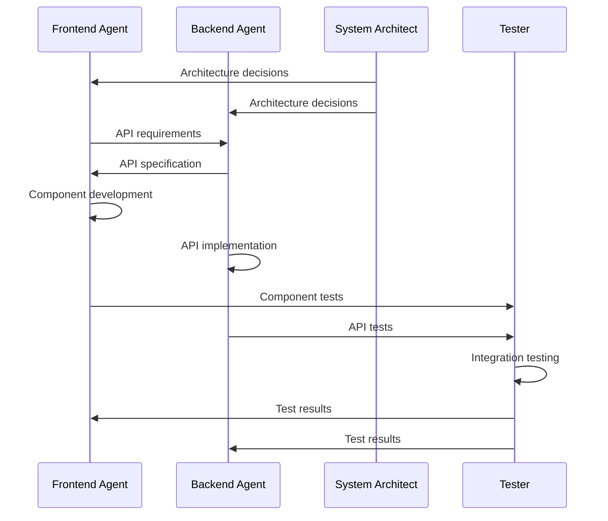
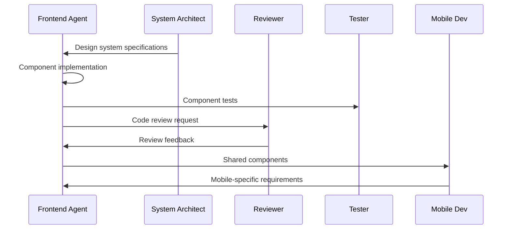

# Frontend Agent Ecosystem Integration Strategy

**Version**: 1.0.0
**Date**: September 25, 2025
**Purpose**: Integration strategy for React Frontend Agent with existing claude-flow-novice agent ecosystem

## Executive Summary

This document outlines the comprehensive integration strategy for the React Frontend Developer Agent (`frontend-dev`) with the existing claude-flow-novice agent ecosystem. The strategy ensures seamless collaboration while maintaining the system's core principles of simplicity for novice users and powerful capabilities for advanced workflows.

## Current Agent Ecosystem Analysis

### Core Development Agents (High Priority Integration)
```javascript
const coreIntegration = {
  'backend-dev': {
    priority: 'Critical',
    sharedArtifacts: ['API contracts', 'data models', 'authentication'],
    coordinationMethod: 'Memory + Hooks',
    examples: ['Full-stack app development', 'API-first design']
  },
  'system-architect': {
    priority: 'High',
    sharedArtifacts: ['Architecture decisions', 'component design', 'data flow'],
    coordinationMethod: 'Architecture Decision Records',
    examples: ['Micro-frontend architecture', 'Design system creation']
  },
  'tester': {
    priority: 'High',
    sharedArtifacts: ['Test plans', 'coverage reports', 'integration tests'],
    coordinationMethod: 'Test coordination protocols',
    examples: ['E2E test scenarios', 'Component testing strategies']
  },
  'reviewer': {
    priority: 'High',
    sharedArtifacts: ['Code quality standards', 'best practices', 'review checklists'],
    coordinationMethod: 'Quality gates and standards',
    examples: ['Code review automation', 'Quality metrics tracking']
  }
};
```

### Specialized Development Agents (Medium Priority)
```javascript
const specializedIntegration = {
  'mobile-dev': {
    priority: 'Medium',
    sharedArtifacts: ['React Native components', 'shared business logic'],
    coordinationMethod: 'Component library synchronization',
    examples: ['Cross-platform development', 'Shared design systems']
  },
  'api-docs': {
    priority: 'Medium',
    sharedArtifacts: ['API documentation', 'component documentation'],
    coordinationMethod: 'Documentation generation pipelines',
    examples: ['Interactive API docs', 'Component story generation']
  },
  'cicd-engineer': {
    priority: 'Medium',
    sharedArtifacts: ['Build pipelines', 'deployment configs'],
    coordinationMethod: 'Pipeline coordination',
    examples: ['Frontend deployment automation', 'Testing pipeline integration']
  }
};
```

### Performance and Optimization Agents (Medium Priority)
```javascript
const performanceIntegration = {
  'perf-analyzer': {
    priority: 'Medium',
    sharedArtifacts: ['Performance metrics', 'optimization recommendations'],
    coordinationMethod: 'Performance monitoring integration',
    examples: ['Bundle analysis', 'Runtime performance optimization']
  },
  'performance-benchmarker': {
    priority: 'Low',
    sharedArtifacts: ['Benchmark results', 'performance baselines'],
    coordinationMethod: 'Automated benchmarking',
    examples: ['Core Web Vitals tracking', 'Render performance testing']
  }
};
```

## Integration Patterns

### 1. Memory-Based Coordination Pattern
```javascript
// Frontend agent coordination namespace structure
const frontendMemoryNamespace = {
  'swarm/frontend/components': {
    structure: 'Component specifications and metadata',
    access: ['system-architect', 'reviewer', 'tester'],
    examples: {
      'Button': {
        type: 'atom',
        props: 'ButtonProps',
        tests: 'Button.test.tsx',
        stories: 'Button.stories.tsx'
      }
    }
  },
  'swarm/frontend/state': {
    structure: 'State management architecture',
    access: ['backend-dev', 'system-architect'],
    examples: {
      strategy: 'zustand',
      stores: ['userStore', 'appStore'],
      apiIntegration: 'tanstack-query'
    }
  },
  'swarm/frontend/api-requirements': {
    structure: 'Frontend API requirements and contracts',
    access: ['backend-dev', 'api-docs'],
    examples: {
      endpoints: ['/api/users', '/api/auth'],
      realTimeFeatures: ['notifications', 'live-updates'],
      authStrategy: 'jwt'
    }
  }
};
```

### 2. Hook-Based Event Coordination
```bash
# Frontend agent lifecycle hooks
npx claude-flow@alpha hooks pre-task --description "Frontend component development"
npx claude-flow@alpha hooks notify --message "Component library updated" --target "reviewer,tester"
npx claude-flow@alpha hooks post-edit --file "src/components/UserProfile.tsx" --memory-key "swarm/frontend/components/UserProfile"
```

### 3. Artifact Sharing Protocol
```typescript
interface ArtifactSharingProtocol {
  componentLibrary: {
    location: 'src/components/',
    format: 'TypeScript + Storybook',
    consumers: ['mobile-dev', 'tester', 'reviewer'],
    updateTriggers: ['component-created', 'component-modified']
  };
  typeDefinitions: {
    location: 'shared/types/',
    format: 'TypeScript definitions',
    consumers: ['backend-dev', 'mobile-dev', 'api-docs'],
    updateTriggers: ['api-contract-changed', 'data-model-updated']
  };
  testSpecs: {
    location: 'tests/',
    format: 'Jest + RTL + Cypress',
    consumers: ['tester', 'cicd-engineer'],
    updateTriggers: ['component-tested', 'integration-test-added']
  };
}
```

## Coordination Workflows

### 1. Full-Stack Development Workflow


### 2. Component Library Development


## Agent Coordination Configurations

### 1. Swarm Topology Integration
```javascript
// Optimal swarm topology for frontend-heavy projects
const frontendSwarmConfig = {
  topology: 'hierarchical',
  coordinator: 'frontend-dev',
  specialists: ['backend-dev', 'system-architect'],
  workers: ['tester', 'reviewer', 'perf-analyzer'],
  maxAgents: 6,
  autoScaling: true,
  coordinationStrategy: 'memory-based'
};

// Alternative mesh topology for complex projects
const meshSwarmConfig = {
  topology: 'mesh',
  coreAgents: ['frontend-dev', 'backend-dev', 'system-architect'],
  supportAgents: ['tester', 'reviewer'],
  coordinationStrategy: 'hook-based'
};
```

### 2. Task Orchestration Patterns
```javascript
const taskOrchestrationPatterns = {
  'component-development': {
    agents: ['frontend-dev', 'tester', 'reviewer'],
    strategy: 'sequential',
    coordination: 'memory-based',
    artifacts: ['component', 'tests', 'stories']
  },
  'full-stack-feature': {
    agents: ['system-architect', 'frontend-dev', 'backend-dev', 'tester'],
    strategy: 'parallel-then-sequential',
    coordination: 'memory + hooks',
    artifacts: ['architecture', 'frontend', 'backend', 'integration-tests']
  },
  'performance-optimization': {
    agents: ['frontend-dev', 'perf-analyzer', 'reviewer'],
    strategy: 'iterative',
    coordination: 'metrics-based',
    artifacts: ['optimizations', 'benchmarks', 'reports']
  }
};
```

## Quality Gate Integration

### 1. Code Quality Standards Coordination
```typescript
interface QualityGateIntegration {
  eslintConfig: {
    extends: ['@typescript-eslint/recommended', 'react-hooks/recommended'],
    coordination: 'Shared with reviewer agent',
    enforcement: 'pre-commit hooks'
  };
  testingStandards: {
    coverage: {
      minimum: 85,
      enforcement: 'CI pipeline',
      coordination: 'Shared with tester agent'
    },
    patterns: {
      unitTests: 'Jest + RTL',
      integrationTests: 'Cypress',
      coordination: 'Test plan synchronization'
    }
  };
  performanceStandards: {
    budgets: {
      bundleSize: '250kb gzipped',
      firstContentfulPaint: '1.5s',
      cumulativeLayoutShift: '0.1'
    },
    monitoring: 'perf-analyzer integration',
    enforcement: 'CI performance checks'
  };
}
```

### 2. Deployment Coordination
```yaml
# Coordinated deployment pipeline
deployment_coordination:
  stages:
    - name: quality-gates
      agents: [frontend-dev, reviewer, tester]
      tasks:
        - lint-check
        - type-check
        - unit-tests
        - integration-tests

    - name: build-optimization
      agents: [frontend-dev, perf-analyzer]
      tasks:
        - bundle-analysis
        - performance-audit
        - optimization-recommendations

    - name: deployment
      agents: [frontend-dev, cicd-engineer]
      tasks:
        - build-production
        - deploy-staging
        - smoke-tests
        - deploy-production
```

## Communication Protocols

### 1. Inter-Agent Messaging
```typescript
interface InterAgentMessage {
  from: string;
  to: string[];
  type: 'notification' | 'request' | 'response' | 'update';
  payload: {
    action: string;
    data: any;
    context: {
      taskId: string;
      timestamp: string;
      priority: 'low' | 'medium' | 'high' | 'critical';
    };
  };
}

// Example: Frontend agent requesting API specification
const apiSpecRequest: InterAgentMessage = {
  from: 'frontend-dev',
  to: ['backend-dev'],
  type: 'request',
  payload: {
    action: 'provide-api-specification',
    data: {
      endpoints: ['/api/users', '/api/auth'],
      features: ['pagination', 'filtering', 'real-time-updates']
    },
    context: {
      taskId: 'user-dashboard-development',
      timestamp: new Date().toISOString(),
      priority: 'high'
    }
  }
};
```

### 2. Event-Driven Coordination
```typescript
// Frontend agent event emissions
interface FrontendAgentEvents {
  'component:created': {
    componentName: string;
    type: 'atom' | 'molecule' | 'organism';
    dependencies: string[];
    tests: boolean;
  };
  'api:requirements-changed': {
    endpoints: string[];
    changes: Array<{
      type: 'added' | 'modified' | 'removed';
      endpoint: string;
      details: any;
    }>;
  };
  'performance:issue-detected': {
    issue: string;
    severity: 'low' | 'medium' | 'high';
    recommendations: string[];
    metrics: Record<string, number>;
  };
}

// Event handling by other agents
const eventHandlers = {
  'backend-dev': {
    'api:requirements-changed': (event) => {
      updateAPISpecification(event.endpoints, event.changes);
      notifyAPIDocumentationAgent(event);
    }
  },
  'tester': {
    'component:created': (event) => {
      generateComponentTests(event.componentName, event.type);
      updateTestSuite(event);
    }
  },
  'perf-analyzer': {
    'performance:issue-detected': (event) => {
      analyzePerformanceIssue(event.issue, event.metrics);
      generateOptimizationPlan(event.recommendations);
    }
  }
};
```

## Advanced Integration Scenarios

### 1. Micro-Frontend Architecture
```typescript
interface MicroFrontendIntegration {
  shells: {
    'main-shell': {
      agent: 'system-architect',
      responsibilities: ['routing', 'shared-state', 'authentication']
    };
  };
  microfrontends: {
    'user-management': {
      agent: 'frontend-dev',
      technology: 'React',
      integration: 'module-federation'
    };
    'analytics-dashboard': {
      agent: 'frontend-dev',
      technology: 'React',
      integration: 'single-spa'
    };
  };
  coordination: {
    sharedDependencies: 'Coordinated by system-architect',
    communication: 'Event bus pattern',
    deployment: 'Independent pipelines with integration tests'
  };
}
```

### 2. Design System Integration
```typescript
interface DesignSystemIntegration {
  designTokens: {
    source: 'design-system-agent',
    format: 'JSON tokens',
    consumption: 'CSS custom properties + TypeScript types'
  };
  components: {
    source: 'frontend-dev',
    documentation: 'Storybook + api-docs agent',
    testing: 'Visual regression + tester agent'
  };
  crossPlatform: {
    web: 'frontend-dev agent',
    mobile: 'mobile-dev agent',
    coordination: 'Shared component API'
  };
}
```

## Monitoring and Metrics Integration

### 1. Performance Monitoring Coordination
```typescript
interface PerformanceMonitoringIntegration {
  realTimeMetrics: {
    collection: 'Frontend agent + performance-benchmarker',
    analysis: 'perf-analyzer agent',
    alerts: 'Automated agent notifications'
  };
  buildTimeMetrics: {
    bundleSize: 'CI pipeline + cicd-engineer',
    buildTime: 'Development metrics',
    optimization: 'perf-analyzer recommendations'
  };
  runtimeMetrics: {
    coreWebVitals: 'Browser-based collection',
    userExperience: 'Real user monitoring',
    analysis: 'Performance trending and alerts'
  };
}
```

### 2. Quality Metrics Coordination
```typescript
interface QualityMetricsIntegration {
  codeQuality: {
    coverage: 'tester agent coordination',
    complexity: 'reviewer agent analysis',
    maintainability: 'Shared quality standards'
  };
  userExperience: {
    accessibility: 'WCAG compliance checking',
    performance: 'Core Web Vitals monitoring',
    usability: 'User feedback integration'
  };
  businessMetrics: {
    conversionRates: 'Analytics integration',
    userEngagement: 'Feature usage tracking',
    errorRates: 'Error monitoring coordination'
  };
}
```

## Implementation Roadmap

### Phase 1: Core Integration (Week 1-2)
- [x] Memory-based coordination with backend-dev, system-architect, tester, reviewer
- [x] Basic hook integration for lifecycle events
- [x] Artifact sharing protocols
- [ ] Quality gate integration

### Phase 2: Advanced Coordination (Week 3-4)
- [ ] Event-driven coordination patterns
- [ ] Performance monitoring integration
- [ ] CI/CD pipeline coordination
- [ ] Cross-platform development support

### Phase 3: Ecosystem Optimization (Week 5-6)
- [ ] Intelligent agent selection based on project needs
- [ ] Adaptive coordination strategies
- [ ] Advanced metrics and monitoring
- [ ] Community pattern integration

## Success Metrics

### Integration Success Indicators
```typescript
interface IntegrationSuccessMetrics {
  coordinationEfficiency: {
    agentCommunication: 'Message response time < 100ms',
    artifactSharing: 'Sync delay < 1s',
    memoryConsistency: '99.9% consistency'
  };
  developmentVelocity: {
    featureDelivery: '2x faster full-stack development',
    bugReduction: '50% fewer integration issues',
    codeQuality: '15% improvement in quality metrics'
  };
  userExperience: {
    simplicity: 'Single command full-stack development',
    progressVisibility: 'Real-time coordination status',
    errorRecovery: 'Automatic conflict resolution'
  };
}
```

## Conclusion

This integration strategy ensures that the React Frontend Developer Agent seamlessly fits into the existing claude-flow-novice ecosystem while enhancing the overall development experience. Through memory-based coordination, hook-driven communication, and intelligent artifact sharing, the frontend agent provides professional-grade capabilities while maintaining the simplicity that novice users expect.

The phased implementation approach allows for gradual adoption and refinement based on real-world usage patterns and feedback from the developer community.