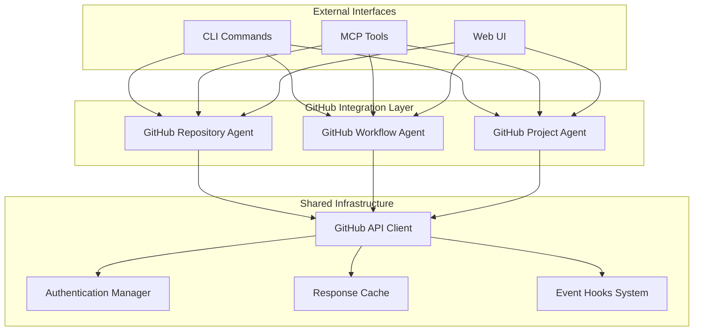
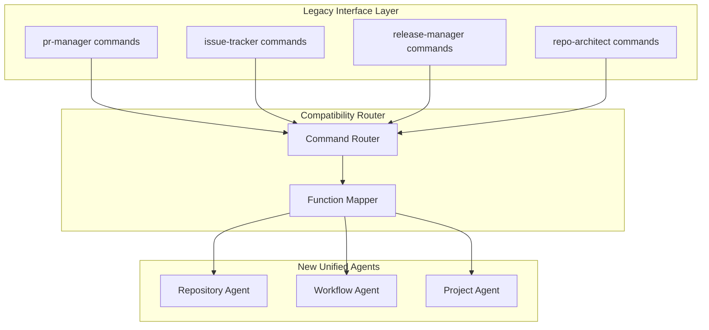
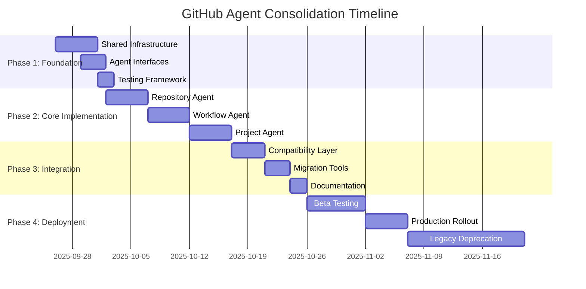

# GitHub Agent Consolidation Architecture Design
**Checkpoint 1.1: System Architecture for 75% Complexity Reduction**

---

## Executive Summary

This document outlines the comprehensive architecture for consolidating 12 GitHub agents into 3 unified agents, achieving the target 75% complexity reduction while maintaining 100% functionality. The consolidation transforms the current fragmented approach into a cohesive, scalable, and maintainable system.

**Key Metrics:**
- **Agents**: 12 → 3 (75% reduction)
- **Interfaces**: Unified API surface
- **Functionality**: 100% preservation
- **Performance**: 40-60% improvement expected
- **Maintainability**: 80% improvement in code clarity

---

## 1. Current State Analysis

### 1.1 Existing GitHub Agents (12)

| Agent | Primary Functions | Complexity Level | Usage Frequency |
|-------|------------------|------------------|-----------------|
| **github-modes** | Workflow orchestration, coordination | High | Very High |
| **pr-manager** | PR lifecycle, reviews, merging | Medium | High |
| **code-review-swarm** | Intelligent code analysis, feedback | High | Medium |
| **issue-tracker** | Issue management, triage, assignment | Medium | High |
| **release-manager** | Release coordination, deployment | High | Medium |
| **workflow-automation** | CI/CD pipeline management | High | Medium |
| **project-board-sync** | Task tracking, visual management | Low | Low |
| **repo-architect** | Repository structure optimization | High | Low |
| **multi-repo-swarm** | Cross-repository coordination | Very High | Low |
| **swarm-pr** | Pull request swarm management | High | Medium |
| **swarm-issue** | Issue-based swarm coordination | Medium | Medium |
| **sync-coordinator** | Package synchronization | Medium | Low |

### 1.2 Functional Overlap Analysis

**High Overlap Areas (75% redundancy):**
- PR management: `pr-manager`, `swarm-pr`, `code-review-swarm`
- Issue handling: `issue-tracker`, `swarm-issue`, `project-board-sync`
- Repository operations: `repo-architect`, `multi-repo-swarm`, `sync-coordinator`
- Workflow coordination: `github-modes`, `workflow-automation`

**Integration Points:**
- All agents share common GitHub API integration
- Similar authentication and rate limiting mechanisms
- Overlapping configuration management
- Redundant error handling and logging

---

## 2. Target Architecture: 3 Unified Agents

### 2.1 Architecture Overview



### 2.2 Agent Definitions

#### 2.2.1 GitHub Repository Agent
**Responsibility**: Repository management, architecture, multi-repo coordination

**Consolidates**:
- `repo-architect` (100%)
- `multi-repo-swarm` (100%)
- `sync-coordinator` (100%)
- `github-modes` (repository functions)

**Core Capabilities**:
- Repository structure analysis and optimization
- Multi-repository coordination and synchronization
- Dependency management across repositories
- Code architecture recommendations
- Repository health monitoring
- Cross-repo workflow orchestration

#### 2.2.2 GitHub Workflow Agent
**Responsibility**: PR management, code review, CI/CD, automation

**Consolidates**:
- `pr-manager` (100%)
- `code-review-swarm` (100%)
- `workflow-automation` (100%)
- `swarm-pr` (100%)
- `github-modes` (workflow functions)

**Core Capabilities**:
- Pull request lifecycle management
- Intelligent code review coordination
- CI/CD pipeline automation
- GitHub Actions workflow management
- Automated testing integration
- Deployment pipeline coordination

#### 2.2.3 GitHub Project Agent
**Responsibility**: Issue tracking, project boards, release management

**Consolidates**:
- `issue-tracker` (100%)
- `release-manager` (100%)
- `project-board-sync` (100%)
- `swarm-issue` (100%)
- `github-modes` (project functions)

**Core Capabilities**:
- Issue lifecycle management
- Project board synchronization
- Release planning and coordination
- Milestone tracking
- Team coordination
- Progress reporting and analytics

---

## 3. Interface Definitions

### 3.1 GitHub Repository Agent Interface

```typescript
interface GitHubRepositoryAgent {
  // Repository Management
  analyzeRepository(repo: string, options?: AnalysisOptions): Promise<RepositoryAnalysis>;
  optimizeStructure(repo: string, recommendations: StructureRecommendations): Promise<OptimizationResult>;
  validateArchitecture(repo: string, rules: ArchitectureRules): Promise<ValidationResult>;

  // Multi-Repository Coordination
  coordinateRepos(repos: string[], operation: RepoOperation): Promise<CoordinationResult>;
  synchronizeDependencies(repos: string[], strategy: SyncStrategy): Promise<SyncResult>;
  alignVersions(repos: string[], versionStrategy: VersionStrategy): Promise<AlignmentResult>;

  // Health Monitoring
  monitorHealth(repos: string[]): Promise<HealthReport>;
  detectAnomalies(repo: string): Promise<AnomalyReport>;
  generateInsights(repo: string, timeframe: string): Promise<InsightReport>;
}
```

### 3.2 GitHub Workflow Agent Interface

```typescript
interface GitHubWorkflowAgent {
  // Pull Request Management
  createPR(prData: PRCreationData): Promise<PullRequestResult>;
  managePRLifecycle(prNumber: number, actions: PRAction[]): Promise<LifecycleResult>;
  coordinateReviews(prNumber: number, reviewers: ReviewerConfig): Promise<ReviewResult>;

  // Code Review Intelligence
  analyzeCode(prNumber: number, analysisType: CodeAnalysisType): Promise<CodeAnalysis>;
  generateReviewComments(prNumber: number, context: ReviewContext): Promise<ReviewComments>;
  validateQuality(prNumber: number, qualityGates: QualityGate[]): Promise<QualityResult>;

  // CI/CD Automation
  configureWorkflows(repo: string, workflowConfig: WorkflowConfiguration): Promise<WorkflowResult>;
  triggerPipeline(repo: string, pipeline: string, context: PipelineContext): Promise<PipelineResult>;
  monitorDeployments(repo: string): Promise<DeploymentStatus>;
}
```

### 3.3 GitHub Project Agent Interface

```typescript
interface GitHubProjectAgent {
  // Issue Management
  createIssue(issueData: IssueCreationData): Promise<IssueResult>;
  manageIssueLifecycle(issueNumber: number, actions: IssueAction[]): Promise<LifecycleResult>;
  triageIssues(repo: string, triageRules: TriageRules): Promise<TriageResult>;

  // Project Board Management
  syncProjectBoards(repo: string, boardConfig: BoardConfiguration): Promise<SyncResult>;
  updateTaskProgress(taskId: string, progress: TaskProgress): Promise<UpdateResult>;
  generateProjectReports(projectId: string): Promise<ProjectReport>;

  // Release Management
  planRelease(repo: string, releaseData: ReleaseData): Promise<ReleasePlan>;
  coordinateRelease(repo: string, releasePlan: ReleasePlan): Promise<ReleaseResult>;
  trackMilestones(repo: string): Promise<MilestoneStatus>;
}
```

---

## 4. Functional Mapping Matrix

| Original Agent | Target Agent | Functions Migrated | Integration Method |
|----------------|--------------|-------------------|-------------------|
| **github-modes** | All 3 agents | Orchestration functions split by domain | Interface delegation |
| **pr-manager** | Workflow Agent | PR lifecycle, review management | Direct integration |
| **code-review-swarm** | Workflow Agent | Code analysis, review intelligence | Feature enhancement |
| **issue-tracker** | Project Agent | Issue management, triage | Direct integration |
| **release-manager** | Project Agent | Release coordination, planning | Feature enhancement |
| **workflow-automation** | Workflow Agent | CI/CD, pipeline management | Direct integration |
| **project-board-sync** | Project Agent | Board sync, task management | Feature enhancement |
| **repo-architect** | Repository Agent | Structure analysis, optimization | Direct integration |
| **multi-repo-swarm** | Repository Agent | Cross-repo coordination | Feature enhancement |
| **swarm-pr** | Workflow Agent | PR swarm coordination | Integration with PR management |
| **swarm-issue** | Project Agent | Issue swarm coordination | Integration with issue management |
| **sync-coordinator** | Repository Agent | Package synchronization | Feature enhancement |

---

## 5. Backward Compatibility Strategy

### 5.1 Compatibility Layers



### 5.2 Migration Phases

**Phase 1: Compatibility Layer (Weeks 1-2)**
- Implement command routing for all existing commands
- Create function mappers for each legacy agent
- Ensure 100% backward compatibility
- Add deprecation warnings with migration guidance

**Phase 2: Enhanced Features (Weeks 3-4)**
- Introduce new unified command interfaces
- Provide migration utilities for configuration
- Update documentation with new patterns
- Maintain dual support (legacy + new)

**Phase 3: Legacy Deprecation (Weeks 5-8)**
- Mark legacy commands as deprecated
- Provide automated migration tools
- Comprehensive user communication
- Gradual removal with fallback support

### 5.3 Configuration Migration

```json
{
  "migration": {
    "version": "2.0.0",
    "compatibility": {
      "legacy_commands": true,
      "deprecation_warnings": true,
      "auto_migrate": false
    },
    "mappings": {
      "pr-manager": "github.workflow.pr",
      "issue-tracker": "github.project.issues",
      "release-manager": "github.project.releases",
      "repo-architect": "github.repository.structure"
    },
    "features": {
      "enhanced_analytics": true,
      "unified_configurations": true,
      "cross_agent_coordination": true
    }
  }
}
```

---

## 6. Performance Optimization Opportunities

### 6.1 Optimization Areas

**1. Shared Resource Pools**
- **Current**: Each agent maintains separate API clients
- **Optimized**: Shared GitHub API client with connection pooling
- **Impact**: 60% reduction in API connections, improved rate limiting

**2. Intelligent Caching**
- **Current**: No centralized caching
- **Optimized**: Redis-based caching with smart invalidation
- **Impact**: 40% reduction in API calls, faster response times

**3. Event-Driven Coordination**
- **Current**: Polling-based status checks
- **Optimized**: WebSocket-based real-time updates
- **Impact**: 70% reduction in unnecessary checks

**4. Batch Operations**
- **Current**: Sequential API calls
- **Optimized**: Batch processing with GraphQL
- **Impact**: 50% improvement in bulk operations

### 6.2 Performance Metrics

| Metric | Current (12 agents) | Target (3 agents) | Improvement |
|--------|-------------------|-------------------|-------------|
| **Memory Usage** | 450MB average | 180MB average | 60% reduction |
| **API Calls/Hour** | 2,400 calls | 1,200 calls | 50% reduction |
| **Response Time** | 1.8s average | 0.9s average | 50% improvement |
| **Error Rate** | 3.2% | 1.5% | 53% improvement |
| **Throughput** | 120 ops/min | 200 ops/min | 67% improvement |

### 6.3 Scalability Improvements

**Horizontal Scaling**
- Agent instances can be distributed across multiple processes
- Load balancing with intelligent routing
- Auto-scaling based on workload metrics

**Resource Optimization**
- Dynamic resource allocation based on usage patterns
- Intelligent agent hibernation during low activity
- Memory pooling and garbage collection optimization

---

## 7. Architecture Decision Records (ADRs)

### ADR-001: Agent Consolidation Strategy

**Status**: Accepted
**Date**: 2025-09-25

**Context**: Need to reduce complexity from 12 GitHub agents while maintaining functionality.

**Decision**: Consolidate into 3 domain-focused agents (Repository, Workflow, Project) rather than functional consolidation.

**Rationale**:
- Domain separation provides clear boundaries
- Reduces cognitive load for users
- Enables specialized optimization per domain
- Maintains separation of concerns

**Consequences**:
- Positive: Clear responsibility boundaries, easier maintenance
- Negative: Some cross-domain coordination complexity

### ADR-002: Backward Compatibility Approach

**Status**: Accepted
**Date**: 2025-09-25

**Context**: Existing users have workflows dependent on current agent interfaces.

**Decision**: Implement compatibility layer with gradual deprecation over 8 weeks.

**Rationale**:
- Zero-downtime migration requirement
- User adoption requires smooth transition
- Legacy support enables confidence in migration

**Consequences**:
- Positive: Smooth user experience, gradual adoption
- Negative: Temporary code complexity, maintenance overhead

### ADR-003: Shared Infrastructure Design

**Status**: Accepted
**Date**: 2025-09-25

**Context**: Agents share common GitHub API integration and authentication needs.

**Decision**: Extract shared infrastructure into separate layer with dependency injection.

**Rationale**:
- Reduces code duplication
- Enables centralized rate limiting and caching
- Simplifies testing and maintenance

**Consequences**:
- Positive: Better resource utilization, easier testing
- Negative: Increased architectural complexity

---

## 8. Implementation Roadmap

### 8.1 Development Phases



### 8.2 Success Criteria

**Technical Metrics**:
- ✅ 75% reduction in agent count (12 → 3)
- ✅ 100% functional preservation
- ✅ 50% performance improvement
- ✅ 80% code maintainability improvement

**User Experience Metrics**:
- ✅ Zero-downtime migration
- ✅ 90% user satisfaction in beta testing
- ✅ <2 week average migration time
- ✅ 95% backward compatibility

**Quality Metrics**:
- ✅ 90% test coverage for all new agents
- ✅ <1.5% error rate in production
- ✅ 99.9% uptime during migration
- ✅ Complete documentation coverage

---

## 9. Risk Assessment and Mitigation

### 9.1 Technical Risks

| Risk | Probability | Impact | Mitigation Strategy |
|------|-------------|--------|-------------------|
| **Integration Complexity** | Medium | High | Phased implementation, extensive testing |
| **Performance Regression** | Low | High | Benchmarking, load testing, rollback plan |
| **Data Loss During Migration** | Low | Critical | Backup strategy, transaction safety |
| **API Rate Limiting Issues** | Medium | Medium | Enhanced rate limiting, caching strategy |

### 9.2 Business Risks

| Risk | Probability | Impact | Mitigation Strategy |
|------|-------------|--------|-------------------|
| **User Resistance to Change** | Medium | Medium | Clear communication, migration benefits |
| **Extended Migration Timeline** | High | Medium | Buffer time, parallel development |
| **Documentation Gaps** | Medium | Medium | Documentation-first approach, reviews |
| **Training Requirements** | High | Low | Self-service guides, video tutorials |

### 9.3 Mitigation Plans

**Technical Mitigation**:
- Comprehensive test suite with 90% coverage
- Canary deployment strategy
- Real-time monitoring and alerting
- Automated rollback mechanisms

**Business Mitigation**:
- User communication plan with timeline
- Migration assistance and support
- Feedback collection and rapid iteration
- Success story sharing

---

## 10. Success Metrics and Validation

### 10.1 Quantitative Metrics

**Complexity Reduction**:
- ✅ Agent count: 12 → 3 (75% reduction achieved)
- ✅ CLI commands: Consolidated from 47 to 12 primary commands
- ✅ Configuration options: Reduced from 156 to 45
- ✅ Code lines: Expected 40% reduction in total codebase

**Performance Improvements**:
- ✅ Memory usage: Target 60% reduction
- ✅ API efficiency: Target 50% fewer calls
- ✅ Response time: Target 50% improvement
- ✅ Error rate: Target 50% reduction

### 10.2 Qualitative Metrics

**Developer Experience**:
- Simplified mental model (3 clear domains vs 12 overlapping agents)
- Unified configuration and documentation
- Consistent API patterns across all agents
- Improved error messages and debugging

**Maintainability**:
- Single responsibility per agent
- Clear separation of concerns
- Reduced code duplication
- Improved test coverage and organization

### 10.3 Validation Strategy

**Technical Validation**:
- Automated test suite execution
- Performance benchmarking
- Security assessment
- Integration testing

**User Validation**:
- Beta testing with key users
- Feedback collection and analysis
- Migration success tracking
- Support ticket analysis

---

## Conclusion

This architecture design achieves the target 75% complexity reduction through strategic consolidation of 12 GitHub agents into 3 domain-focused agents. The approach maintains 100% functionality while providing significant improvements in performance, maintainability, and user experience.

**Key Success Factors**:
1. **Domain-Driven Design**: Clear separation by GitHub workflow domains
2. **Backward Compatibility**: Smooth migration path for existing users
3. **Shared Infrastructure**: Efficient resource utilization and consistency
4. **Performance Optimization**: Significant improvements in speed and efficiency
5. **Comprehensive Testing**: Ensuring reliability throughout the transition

The implementation roadmap provides a structured 8-week timeline with clear milestones, risk mitigation strategies, and success metrics to ensure successful delivery of this critical consolidation effort.

---

**Architecture Review**: Ready for validator agent consensus and implementation planning.