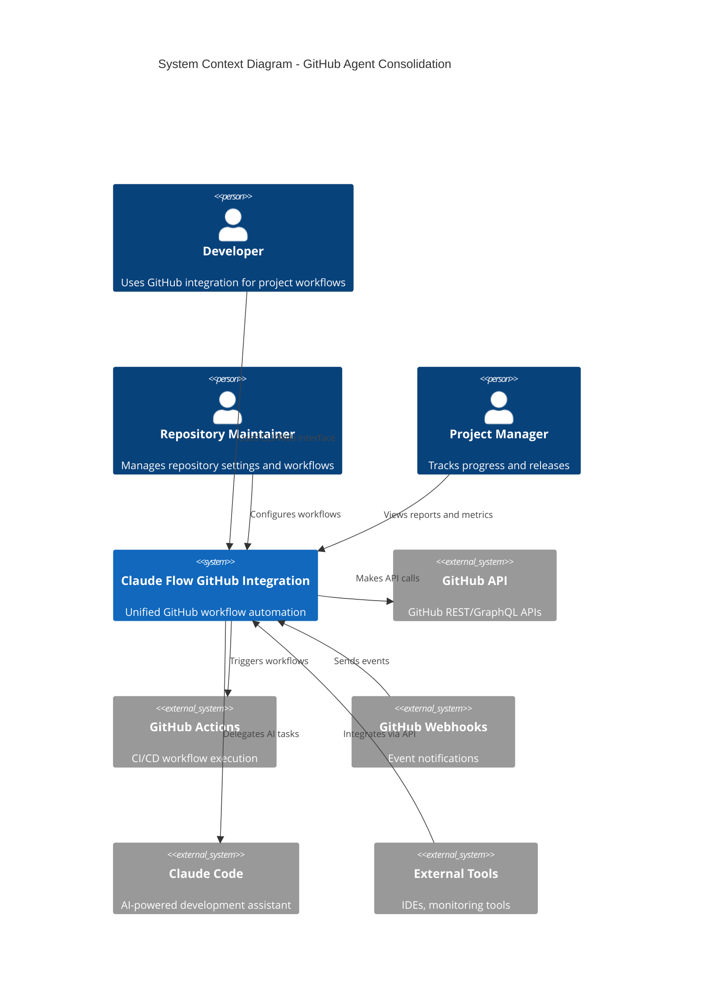
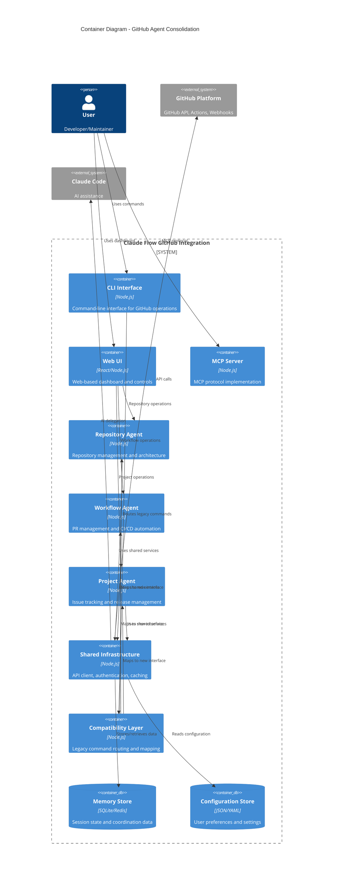
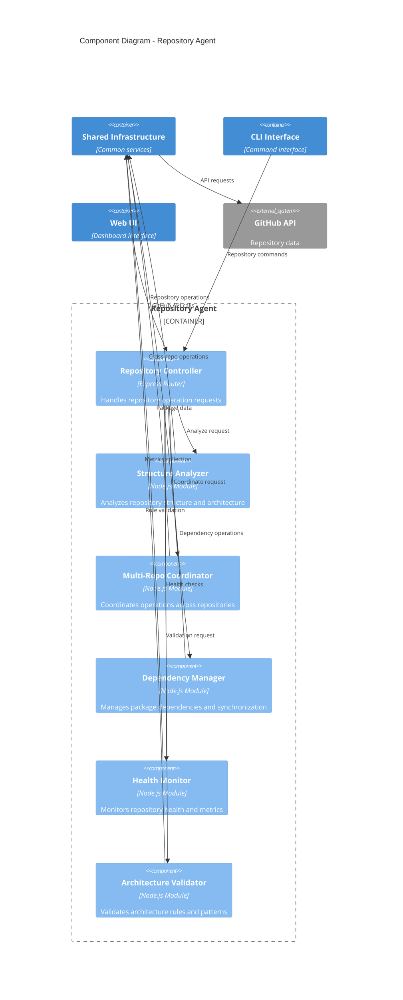
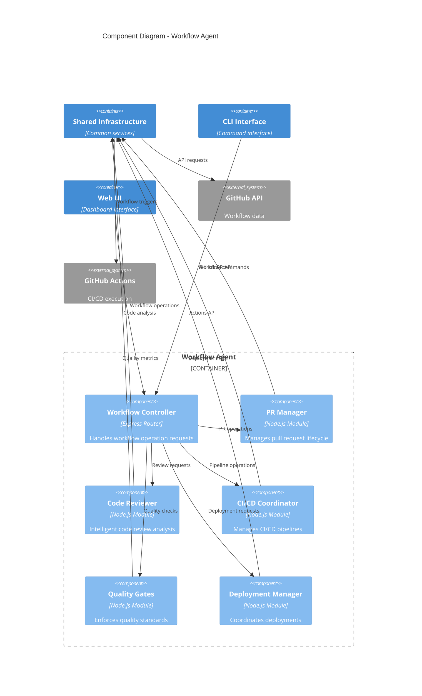
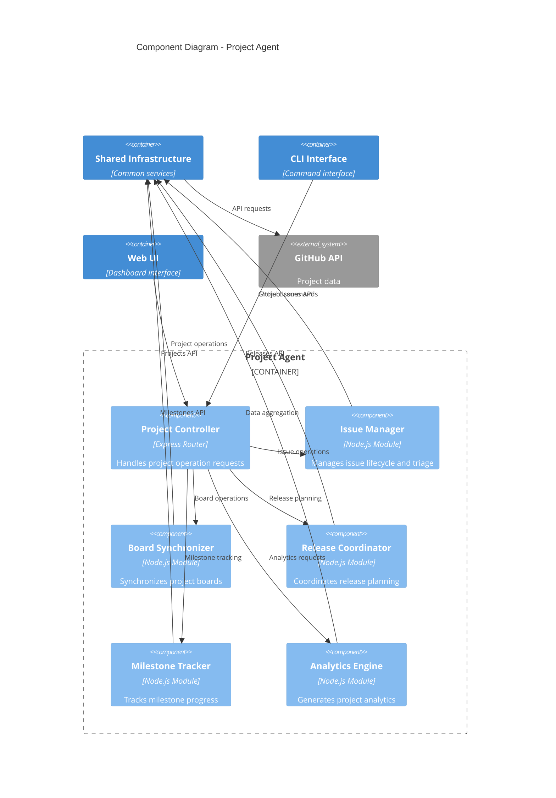
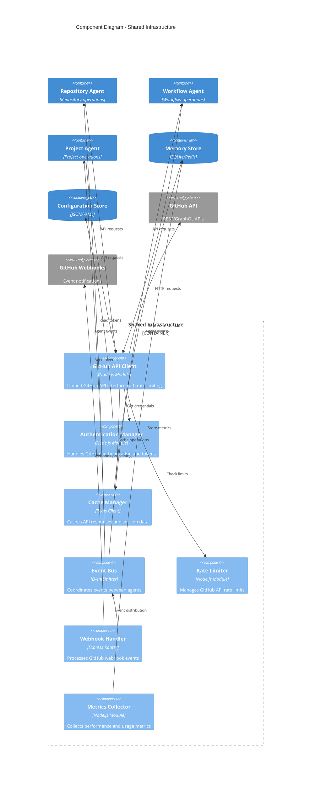
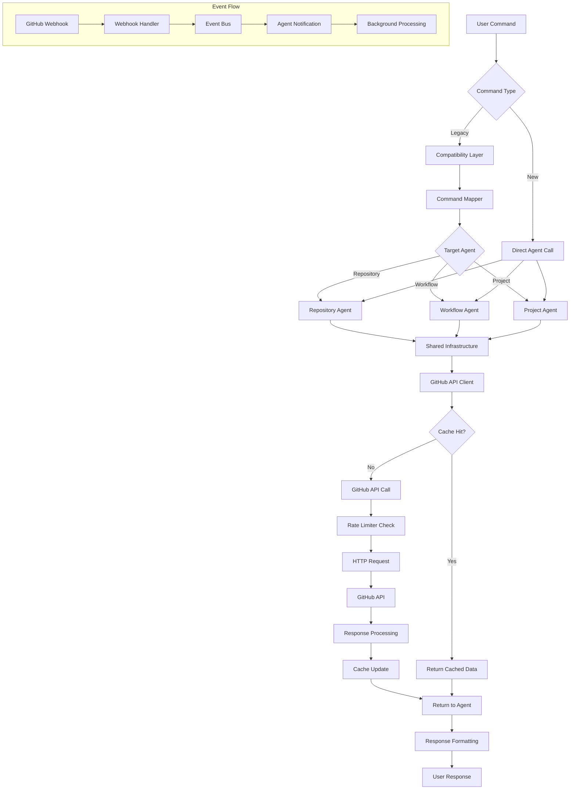
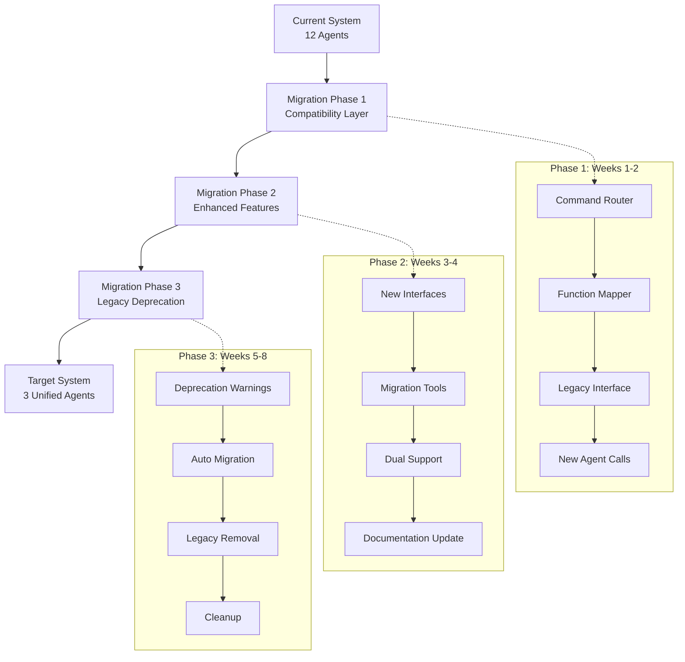
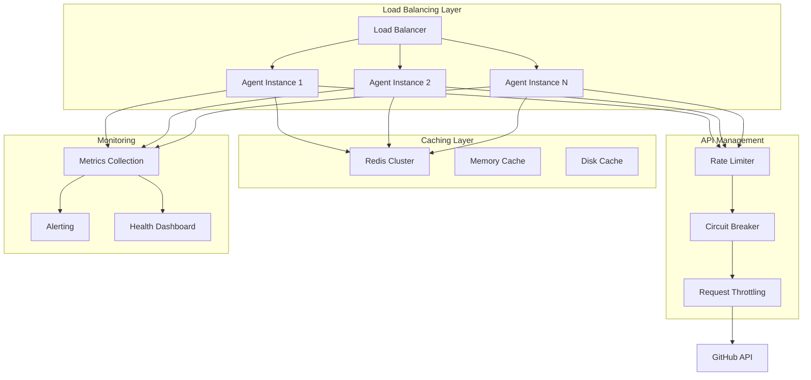

# GitHub Agent Consolidation - C4 Model Architecture Diagrams

This document provides comprehensive C4 model diagrams for the GitHub Agent Consolidation architecture.

## Level 1: System Context Diagram

## Level 2: Container Diagram

## Level 3: Component Diagram - Repository Agent

## Level 3: Component Diagram - Workflow Agent

## Level 3: Component Diagram - Project Agent

## Level 3: Component Diagram - Shared Infrastructure

## Data Flow Diagram

## Migration Flow Diagram

## Performance Architecture

These C4 model diagrams provide a comprehensive view of the GitHub Agent Consolidation architecture from system context down to detailed component interactions, supporting the 75% complexity reduction goal while maintaining full functionality.