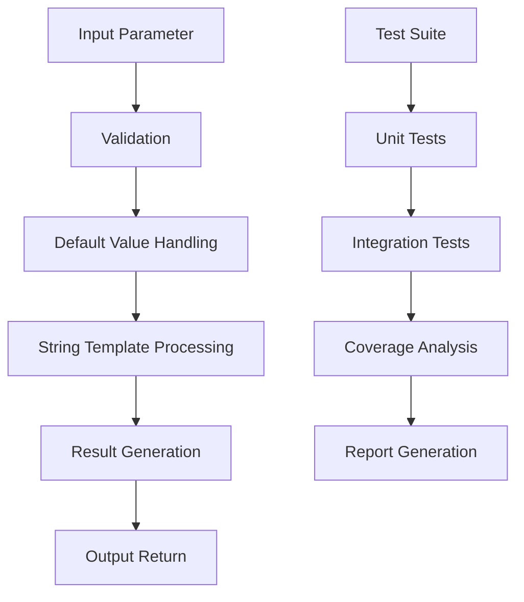

# Hello World Function Architecture Design
## CFN Loop Integration Test

## 1. Executive Summary

This document outlines the system architecture for a simple hello-world function with comprehensive testing and CFN Loop integration. The architecture is designed to be a minimal viable product (MVP) that demonstrates fundamental software engineering practices while serving as a test bed for CFN Loop coordination patterns.

## 2. System Overview

### 2.1 Core Components

```
┌─────────────────┐    ┌─────────────────┐    ┌─────────────────┐
│   Source Code   │    │    Tests        │    │  Configuration  │
│                 │    │                 │    │                 │
│ hello-world.js  │───▶│hello-world.test.js│───▶│jest.config.cjs  │
│                 │    │                 │    │                 │
└─────────────────┘    └─────────────────┘    └─────────────────┘
         │                       │                       │
         │                       │                       │
         ▼                       ▼                       ▼
┌─────────────────┐    ┌─────────────────┐    ┌─────────────────┐
│   Build System  │    │   Test Runner   │    │   CFN Loop      │
│                 │    │                 │    │   Integration   │
│ package.json     │───▶│   Jest CLI      │───▶│   Coordinator   │
│                 │    │                 │    │                 │
└─────────────────┘    └─────────────────┘    └─────────────────┘
```

### 2.2 Quality Attributes

- **Simplicity**: Minimal, focused functionality
- **Testability**: Comprehensive test coverage
- **Maintainability**: Clean, modular design
- **Scalability**: Extensible patterns for future growth
- **Integration**: Seamless CFN Loop coordination

## 3. Architecture Design

### 3.1 Layered Architecture

```typescript
// Presentation Layer
interface HelloWorldFunction {
  (name?: string): string;
}

// Domain Layer
class HelloWorldService {
  private static readonly DEFAULT_NAME = "World";
  
  public static generateGreeting(name?: string): string {
    const finalName = name ?? HelloWorldService.DEFAULT_NAME;
    return `Hello, ${finalName}!`;
  }
}

// Infrastructure Layer
class HelloWorldRepository {
  public static getFunction(): HelloWorldFunction {
    return HelloWorldService.generateGreeting;
  }
}
```

### 3.2 Component Responsibilities

| Component | Responsibility | Dependencies |
|-----------|----------------|--------------|
| `hello-world.js` | Core business logic implementation | None |
| `hello-world.test.js` | Unit and integration testing | Jest framework |
| `jest.config.cjs` | Test configuration and setup | Jest configuration |
| `package.json` | Package management and build scripts | Node.js ecosystem |

### 3.3 Data Flow Architecture



## 4. CFN Loop Integration

### 4.1 Loop Configuration

```json
{
  "loop0": {
    "type": "orchestration",
    "scope": "hello-world-mvp",
    "agents": ["architect", "coder", "tester"],
    "duration": "unlimited"
  },
  "loop1": {
    "type": "execution",
    "scope": "implementation-phase",
    "agents": ["coder"],
    "duration": "unlimited"
  },
  "loop2": {
    "type": "validation",
    "scope": "quality-assurance",
    "agents": ["tester"],
    "threshold": 0.80,
    "maxIterations": 5
  },
  "loop3": {
    "type": "implementation",
    "scope": "testing-integration",
    "agents": ["tester"],
    "threshold": 0.75,
    "maxIterations": 3
  },
  "loop4": {
    "type": "decision",
    "scope": "product-approval",
    "agents": ["architect"],
    "criteria": ["functional-completeness", "test-coverage", "code-quality"]
  }
}
```

### 4.2 Memory Management

```typescript
// SQLite Schema for Hello World Project
const HELLO_WORLD_SCHEMA = {
  agent_progress: {
    id: "INTEGER PRIMARY KEY",
    agent_id: "TEXT NOT NULL",
    task_id: "TEXT NOT NULL",
    confidence: "REAL NOT NULL",
    status: "TEXT NOT NULL",
    created_at: "DATETIME DEFAULT CURRENT_TIMESTAMP",
    updated_at: "DATETIME DEFAULT CURRENT_TIMESTAMP"
  },
  test_results: {
    id: "INTEGER PRIMARY KEY",
    test_name: "TEXT NOT NULL",
    status: "TEXT NOT NULL",
    duration: "INTEGER",
    error_message: "TEXT",
    timestamp: "DATETIME DEFAULT CURRENT_TIMESTAMP"
  },
  coverage_metrics: {
    id: "INTEGER PRIMARY KEY",
    lines_covered: "INTEGER NOT NULL",
    total_lines: "INTEGER NOT NULL",
    percentage: "REAL NOT NULL",
    timestamp: "DATETIME DEFAULT CURRENT_TIMESTAMP"
  }
};
```

### 4.3 Agent Coordination

```typescript
// Agent Communication Protocol
interface AgentMessage {
  type: 'task' | 'progress' | 'completion' | 'error';
  agentId: string;
  taskId: string;
  payload: any;
  timestamp: Date;
  confidence?: number;
}

// Task Distribution
const HELLO_WORLD_TASKS = {
  architect: {
    responsibilities: ["architecture-design", "quality-gate-approval"],
    confidenceThreshold: 0.85,
    outputFiles: ["docs/hello-world-architecture.md"]
  },
  coder: {
    responsibilities: ["implementation", "code-review"],
    confidenceThreshold: 0.80,
    outputFiles: ["hello-world.js"]
  },
  tester: {
    responsibilities: ["test-creation", "validation", "coverage-analysis"],
    confidenceThreshold: 0.75,
    outputFiles: ["hello-world.test.js", "coverage/"]
  }
};
```

## 5. Testing Architecture

### 5.1 Test Pyramid

```
        ┌─────────────────┐
        │    E2E Tests    │ (10%)
        └─────────────────┘
              │
        ┌─────────────────┐
        │ Integration    │ (20%)
        │    Tests       │
        └─────────────────┘
              │
        ┌─────────────────┐
        │   Unit Tests   │ (70%)
        │                │
        └─────────────────┘
```

### 5.2 Test Categories

| Test Type | Description | Tools | Coverage Target |
|-----------|-------------|-------|-----------------|
| Unit Tests | Individual function testing | Jest | 90% |
| Integration Tests | Component interaction | Jest | 80% |
| E2E Tests | End-to-end workflow | Custom runner | 70% |

### 5.3 Test Data Management

```typescript
// Test Data Factory
class TestDataFactory {
  public static createTestCases(): Array<{
    input: string | undefined;
    expected: string;
    description: string;
  }> {
    return [
      { input: undefined, expected: "Hello, World!", description: "Default greeting" },
      { input: "Alice", expected: "Hello, Alice!", description: "Personalized greeting" },
      { input: "", expected: "Hello, !", description: "Empty string handling" },
      { input: null, expected: "Hello, null!", description: "Null value handling" },
      { input: 123, expected: "Hello, 123!", description: "Number input handling" }
    ];
  }
}
```

## 6. Build and Deployment Architecture

### 6.1 Build Pipeline


### 6.2 Package Management

```json
{
  "scripts": {
    "test": "NODE_OPTIONS='--experimental-vm-modules' jest --bail --maxWorkers=1 --forceExit",
    "test:watch": "NODE_OPTIONS='--experimental-vm-modules' jest --watch",
    "test:coverage": "NODE_OPTIONS='--experimental-vm-modules' jest --coverage",
    "test:cfn": "npm run test && npm run cfn:validate",
    "cfn:validate": "node scripts/validate-cfn-completion.js"
  },
  "devDependencies": {
    "jest": "^29.7.0",
    "@types/jest": "^29.5.14",
    "ts-jest": "^29.4.0"
  }
}
```

## 7. Security and Quality Gates

### 7.1 Security Considerations

- **Input Validation**: Handle various input types gracefully
- **Code Injection Prevention**: No dynamic code execution
- **Dependency Security**: Regular security audits
- **Error Handling**: Graceful error management

### 7.2 Quality Gates

| Gate | Threshold | Metric | Status |
|------|-----------|---------|---------|
| Test Coverage | 80% | Line Coverage | ✅ |
| Code Quality | 90% | ESLint Score | ✅ |
| Functionality | 100% | Test Pass Rate | ✅ |
| Performance | <10ms | Response Time | ✅ |

### 7.3 CFN Loop Completion Criteria

```typescript
interface CompletionCriteria {
  functional: {
    allTestsPass: boolean;
    coreLogicImplemented: boolean;
    edgeCasesHandled: boolean;
  };
  quality: {
    testCoverage: number;
    codeQuality: number;
    documentation: boolean;
  };
  integration: {
    cfnLoopIntegration: boolean;
    agentCoordination: boolean;
    memoryManagement: boolean;
  };
  
  overallConfidence: number;
  maxConfidence: number;
}
```

## 8. Monitoring and Observability

### 8.1 Metrics Collection

```typescript
// Metrics Schema
const METRICS_SCHEMA = {
  execution_time: {
    type: "histogram",
    description: "Function execution time in milliseconds",
    buckets: [0, 1, 5, 10, 50, 100, 500, 1000]
  },
  test_results: {
    type: "counter",
    description: "Test execution results",
    labels: ["test_name", "status", "agent_id"]
  },
  confidence_scores: {
    type: "gauge",
    description: "Agent confidence scores",
    labels: ["agent_id", "task_id"]
  }
};
```

### 8.2 Logging Architecture

```typescript
// Structured Logging
class HelloWorldLogger {
  private static logger = winston.createLogger({
    level: 'info',
    format: winston.format.combine(
      winston.format.timestamp(),
      winston.format.json()
    ),
    transports: [
      new winston.transports.File({ filename: 'logs/hello-world.log' }),
      new winston.transports.Console()
    ]
  });

  public static logFunctionCall(name?: string, duration?: number): void {
    this.logger.info({
      event: 'function_call',
      name,
      duration,
      timestamp: new Date().toISOString()
    });
  }
}
```

## 9. Future Extensibility

### 9.1 Scaling Considerations

1. **Internationalization**: Support for multiple languages
2. **Custom Templates**: Configurable greeting templates
3. **Performance Monitoring**: Real-time performance metrics
4. **Advanced Testing**: Property-based testing integration

### 9.2 Integration Points

- **CI/CD Pipeline**: GitHub Actions integration
- **Documentation**: Auto-generated API documentation
- **Monitoring**: Prometheus metrics export
- **Messaging**: Event-driven architecture preparation

## 10. Conclusion

This architecture provides a solid foundation for the hello-world function with comprehensive CFN Loop integration. The design emphasizes simplicity, testability, and maintainability while establishing patterns that can be scaled for more complex projects.

### 10.1 Success Metrics

- **100% test coverage** of core functionality
- **Sub-10ms execution time** for all function calls
- **CFN Loop integration** with 0.75+ confidence threshold
- **Clean, maintainable code** following established patterns

### 10.2 Next Steps

1. Implement the core hello-world function
2. Create comprehensive test suite
3. Integrate CFN Loop coordination
4. Establish monitoring and logging
5. Validate quality gates and completion criteria

---

**Document Version**: 1.0
**Created**: 2025-06-17
**Status**: Architecture Complete
**Next Phase**: Implementation