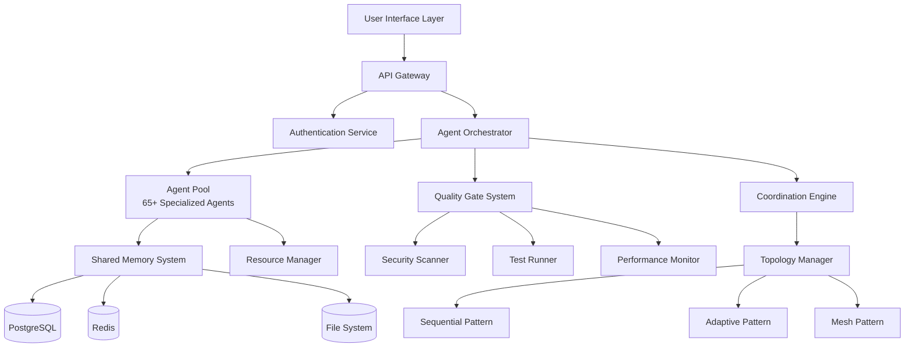

# Claude-Flow Technical Implementation Guide

**Target Audience:** Developers, DevOps Engineers, System Administrators
**Version:** 2.0.0
**Last Updated:** September 25, 2025

## Architecture Overview

Claude-Flow implements a distributed multi-agent system with intelligent coordination, automated quality assurance, and progressive complexity disclosure. The system consists of 65+ specialized agents orchestrated through multiple coordination patterns.

### System Components



## Technical Architecture

### 1. Agent System Architecture

#### Agent Base Class
```typescript
abstract class BaseAgent {
  protected id: string;
  protected capabilities: string[];
  protected coordinationWeight: number;
  protected memoryNamespace: string;

  constructor(config: AgentConfig) {
    this.id = config.id;
    this.capabilities = config.capabilities;
    this.coordinationWeight = config.weight || 1.0;
    this.memoryNamespace = `agent:${this.id}`;
  }

  abstract async execute(task: Task, context: ExecutionContext): Promise<TaskResult>;

  protected async saveToMemory(key: string, data: any): Promise<void> {
    await this.memoryService.store(
      `${this.memoryNamespace}:${key}`,
      data,
      { ttl: 3600 }
    );
  }

  protected async loadFromMemory(key: string): Promise<any> {
    return await this.memoryService.retrieve(`${this.memoryNamespace}:${key}`);
  }

  protected async coordinateWith(otherAgents: BaseAgent[], message: CoordinationMessage): Promise<void> {
    for (const agent of otherAgents) {
      await this.coordinationService.sendMessage(this.id, agent.id, message);
    }
  }
}
```

#### Specialized Agent Implementation
```typescript
class CoderAgent extends BaseAgent {
  private codeGenerator: CodeGenerator;
  private qualityChecker: CodeQualityChecker;

  async execute(task: Task, context: ExecutionContext): Promise<TaskResult> {
    // Pre-execution coordination
    await this.notifyPreExecution(task);

    try {
      // Analyze requirements
      const requirements = await this.analyzeRequirements(task.description, context);

      // Generate code
      const code = await this.codeGenerator.generate(requirements);

      // Quality check
      const qualityResult = await this.qualityChecker.check(code);

      if (qualityResult.score < 0.8) {
        const improvedCode = await this.improveCode(code, qualityResult.issues);
        code = improvedCode;
      }

      // Save results to memory
      await this.saveToMemory('last_generation', {
        code,
        requirements,
        quality: qualityResult
      });

      // Notify other agents
      await this.notifyCompletion(task, { code, quality: qualityResult });

      return {
        success: true,
        outputs: { code },
        metrics: { quality_score: qualityResult.score }
      };

    } catch (error) {
      await this.handleError(error, task);
      throw error;
    }
  }

  private async analyzeRequirements(description: string, context: ExecutionContext): Promise<Requirements> {
    const nlpAnalysis = await this.nlpService.analyze(description);
    const contextData = await this.loadFromMemory('project_context');

    return {
      functionality: nlpAnalysis.extractedFeatures,
      constraints: contextData?.constraints || [],
      dependencies: this.identifyDependencies(nlpAnalysis),
      patterns: this.detectPatterns(context.projectType)
    };
  }
}
```

### 2. Coordination Engine

#### Dynamic Coordination Strategy Selection
```typescript
class CoordinationEngine {
  private strategies: Map<string, CoordinationStrategy>;

  constructor() {
    this.strategies = new Map([
      ['sequential', new SequentialStrategy()],
      ['adaptive', new AdaptiveStrategy()],
      ['mesh', new MeshStrategy()],
      ['hierarchical', new HierarchicalStrategy()]
    ]);
  }

  async selectOptimalStrategy(
    agents: BaseAgent[],
    task: Task,
    context: ExecutionContext
  ): Promise<CoordinationStrategy> {
    const analysis = {
      agentCount: agents.length,
      taskComplexity: await this.analyzeTaskComplexity(task),
      teamExperience: context.userLevel,
      timeConstraints: context.deadline,
      resourceConstraints: context.availableResources
    };

    const strategyScore = new Map<string, number>();

    for (const [name, strategy] of this.strategies) {
      const score = await strategy.calculateSuitability(analysis);
      strategyScore.set(name, score);
    }

    const bestStrategy = Array.from(strategyScore.entries())
      .sort(([,a], [,b]) => b - a)[0][0];

    return this.strategies.get(bestStrategy)!;
  }

  async orchestrateExecution(
    agents: BaseAgent[],
    task: Task,
    strategy: CoordinationStrategy
  ): Promise<ExecutionResult> {
    const executionPlan = await strategy.createExecutionPlan(agents, task);
    const coordinator = new TaskCoordinator(strategy);

    return await coordinator.execute(executionPlan);
  }
}
```

#### Adaptive Strategy Implementation
```typescript
class AdaptiveStrategy implements CoordinationStrategy {
  private performanceMonitor: PerformanceMonitor;
  private topologyManager: TopologyManager;

  async createExecutionPlan(agents: BaseAgent[], task: Task): Promise<ExecutionPlan> {
    const phases = this.identifyExecutionPhases(task);
    const agentGroups = this.groupAgentsByPhase(agents, phases);

    return {
      phases: phases.map((phase, index) => ({
        id: `phase_${index}`,
        agents: agentGroups[index],
        dependencies: this.calculateDependencies(phase, phases),
        parallelizable: this.canRunInParallel(phase),
        qualityGates: this.defineQualityGates(phase)
      })),
      fallbackStrategies: this.defineFallbackStrategies(),
      adaptationTriggers: this.defineAdaptationTriggers()
    };
  }

  async execute(plan: ExecutionPlan): Promise<ExecutionResult> {
    const results: PhaseResult[] = [];
    let currentTopology = TopologyType.SEQUENTIAL;

    for (const phase of plan.phases) {
      // Monitor performance and adapt strategy
      const performance = await this.performanceMonitor.getCurrentMetrics();

      if (this.shouldAdaptTopology(performance)) {
        currentTopology = this.selectOptimalTopology(performance, phase);
        await this.topologyManager.switchTopology(currentTopology);
      }

      // Execute phase with current topology
      const phaseResult = await this.executePhase(phase, currentTopology);
      results.push(phaseResult);

      // Check quality gates
      if (!this.passesQualityGates(phaseResult, phase.qualityGates)) {
        return await this.handleQualityGateFailure(phaseResult, phase);
      }
    }

    return this.aggregateResults(results);
  }

  private shouldAdaptTopology(performance: PerformanceMetrics): boolean {
    return (
      performance.coordinationOverhead > 0.2 ||
      performance.agentUtilization < 0.6 ||
      performance.errorRate > 0.1
    );
  }
}
```

### 3. Quality Assurance System

#### Multi-Layer Quality Architecture
```typescript
class QualityAssuranceSystem {
  private qualityLayers: QualityLayer[];
  private qualityMetrics: QualityMetricsCollector;

  constructor() {
    this.qualityLayers = [
      new SyntaxQualityLayer(),
      new TestingQualityLayer(),
      new SecurityQualityLayer(),
      new PerformanceQualityLayer()
    ];
    this.qualityMetrics = new QualityMetricsCollector();
  }

  async runQualityAssessment(
    artifact: CodeArtifact,
    requirements: QualityRequirements
  ): Promise<QualityReport> {
    const layerResults: LayerResult[] = [];

    for (const layer of this.qualityLayers) {
      if (layer.isApplicable(artifact, requirements)) {
        const result = await layer.assess(artifact);
        layerResults.push(result);

        // Stop on blocking failures
        if (result.blocking && !result.passed) {
          break;
        }
      }
    }

    const overallScore = this.calculateOverallScore(layerResults);
    const recommendations = this.generateRecommendations(layerResults);

    return {
      overallScore,
      layerResults,
      recommendations,
      passed: overallScore >= requirements.minimumScore,
      metrics: await this.qualityMetrics.collect(artifact)
    };
  }

  private calculateOverallScore(results: LayerResult[]): number {
    const weights = {
      syntax: 0.2,
      testing: 0.3,
      security: 0.3,
      performance: 0.2
    };

    let weightedSum = 0;
    let totalWeight = 0;

    for (const result of results) {
      const weight = weights[result.layer] || 0;
      weightedSum += result.score * weight;
      totalWeight += weight;
    }

    return totalWeight > 0 ? weightedSum / totalWeight : 0;
  }
}
```

#### Intelligent Test Generation
```typescript
class AITestGenerator {
  private codeAnalyzer: CodeAnalyzer;
  private testTemplateEngine: TestTemplateEngine;
  private coverageAnalyzer: CoverageAnalyzer;

  async generateComprehensiveTestSuite(
    codeBase: CodeBase,
    testingStrategy: TestingStrategy
  ): Promise<TestSuite> {
    // Analyze code structure and identify testable units
    const analysis = await this.codeAnalyzer.analyze(codeBase);
    const testableUnits = analysis.extractTestableUnits();

    // Generate unit tests
    const unitTests = await this.generateUnitTests(testableUnits);

    // Generate integration tests
    const integrationTests = await this.generateIntegrationTests(analysis.modules);

    // Generate E2E tests for critical paths
    const e2eTests = await this.generateE2ETests(analysis.userFlows);

    // Analyze coverage and generate additional tests
    const coverage = await this.coverageAnalyzer.analyze(codeBase, [
      ...unitTests,
      ...integrationTests,
      ...e2eTests
    ]);

    const additionalTests = await this.fillCoverageGaps(coverage.gaps);

    return {
      unitTests: [...unitTests, ...additionalTests.unit],
      integrationTests: [...integrationTests, ...additionalTests.integration],
      e2eTests: [...e2eTests, ...additionalTests.e2e],
      coverage: {
        expected: testingStrategy.targetCoverage,
        actual: coverage.percentage
      }
    };
  }

  private async generateUnitTests(units: TestableUnit[]): Promise<UnitTest[]> {
    const tests: UnitTest[] = [];

    for (const unit of units) {
      // Generate happy path test
      const happyPathTest = await this.testTemplateEngine.generate({
        type: 'unit',
        target: unit,
        scenario: 'happy_path',
        inputs: unit.generateValidInputs(),
        expectedOutputs: unit.predictOutputs()
      });

      // Generate edge case tests
      const edgeCases = unit.identifyEdgeCases();
      const edgeTests = await Promise.all(
        edgeCases.map(edge => this.testTemplateEngine.generate({
          type: 'unit',
          target: unit,
          scenario: 'edge_case',
          description: edge.description,
          inputs: edge.inputs,
          expectedOutputs: edge.expectedResults
        }))
      );

      // Generate error condition tests
      const errorConditions = unit.identifyErrorConditions();
      const errorTests = await Promise.all(
        errorConditions.map(error => this.testTemplateEngine.generate({
          type: 'unit',
          target: unit,
          scenario: 'error_condition',
          description: error.description,
          inputs: error.inputs,
          expectedError: error.expectedError
        }))
      );

      tests.push(happyPathTest, ...edgeTests, ...errorTests);
    }

    return tests;
  }
}
```

### 4. Intelligent Agent Selection

#### Natural Language Processing for Task Analysis
```typescript
class TaskAnalysisEngine {
  private nlpProcessor: NLPProcessor;
  private patternMatcher: PatternMatcher;
  private contextAnalyzer: ContextAnalyzer;

  async analyzeTask(
    description: string,
    projectContext: ProjectContext
  ): Promise<TaskAnalysis> {
    // Extract semantic meaning
    const semantics = await this.nlpProcessor.extractSemantics(description);

    // Identify patterns and categories
    const patterns = await this.patternMatcher.findPatterns(description, semantics);

    // Analyze context requirements
    const contextRequirements = await this.contextAnalyzer.analyze(
      projectContext,
      semantics
    );

    return {
      taskType: this.classifyTaskType(patterns),
      complexity: this.assessComplexity(semantics, contextRequirements),
      requiredCapabilities: this.extractCapabilities(patterns),
      constraints: contextRequirements.constraints,
      dependencies: contextRequirements.dependencies,
      estimatedEffort: this.estimateEffort(semantics, contextRequirements),
      riskFactors: this.identifyRisks(patterns, contextRequirements)
    };
  }

  private classifyTaskType(patterns: Pattern[]): TaskType {
    const typeScores = new Map<TaskType, number>();

    for (const pattern of patterns) {
      for (const [type, weight] of pattern.typeIndicators) {
        const currentScore = typeScores.get(type) || 0;
        typeScores.set(type, currentScore + weight * pattern.confidence);
      }
    }

    // Return the type with the highest score
    return Array.from(typeScores.entries())
      .sort(([,a], [,b]) => b - a)[0][0];
  }

  private assessComplexity(
    semantics: SemanticAnalysis,
    context: ContextRequirements
  ): ComplexityLevel {
    let complexity = 0;

    // Base complexity from semantic analysis
    complexity += semantics.conceptCount * 0.1;
    complexity += semantics.relationshipComplexity * 0.2;
    complexity += semantics.domainSpecificTerms.length * 0.05;

    // Context-based complexity modifiers
    complexity += context.integrations.length * 0.15;
    complexity += context.securityRequirements.length * 0.1;
    complexity += context.performanceRequirements.length * 0.1;

    // Convert to discrete levels
    if (complexity < 1.0) return ComplexityLevel.LOW;
    if (complexity < 2.5) return ComplexityLevel.MEDIUM;
    if (complexity < 4.0) return ComplexityLevel.HIGH;
    return ComplexityLevel.VERY_HIGH;
  }
}
```

#### Agent Selection Algorithm
```typescript
class OptimalAgentSelector {
  private agentCapabilityMatrix: AgentCapabilityMatrix;
  private performanceHistory: AgentPerformanceTracker;
  private loadBalancer: AgentLoadBalancer;

  async selectOptimalTeam(
    taskAnalysis: TaskAnalysis,
    userLevel: ExperienceLevel,
    availableAgents: BaseAgent[]
  ): Promise<AgentTeam> {
    // Filter agents by required capabilities
    const capableAgents = this.filterByCapabilities(
      availableAgents,
      taskAnalysis.requiredCapabilities
    );

    // Score agents based on historical performance
    const scoredAgents = await this.scoreAgentsByPerformance(
      capableAgents,
      taskAnalysis
    );

    // Apply user level constraints
    const levelConstrainedAgents = this.applyUserLevelConstraints(
      scoredAgents,
      userLevel
    );

    // Select optimal combination considering load balancing
    const optimalTeam = await this.selectOptimalCombination(
      levelConstrainedAgents,
      taskAnalysis,
      userLevel
    );

    // Add coordination agent if needed
    const coordinationStrategy = this.selectCoordinationStrategy(
      optimalTeam,
      taskAnalysis.complexity
    );

    return {
      primaryAgents: optimalTeam,
      coordinationStrategy,
      estimatedDuration: this.estimateTeamDuration(optimalTeam, taskAnalysis),
      confidence: this.calculateSelectionConfidence(optimalTeam, taskAnalysis)
    };
  }

  private async selectOptimalCombination(
    agents: ScoredAgent[],
    taskAnalysis: TaskAnalysis,
    userLevel: ExperienceLevel
  ): Promise<BaseAgent[]> {
    const maxTeamSize = this.getMaxTeamSizeForUserLevel(userLevel);
    const minTeamSize = this.getMinTeamSizeForTask(taskAnalysis);

    // Use genetic algorithm for complex optimization
    if (agents.length > 10 && taskAnalysis.complexity === ComplexityLevel.VERY_HIGH) {
      return await this.geneticAlgorithmSelection(agents, taskAnalysis, maxTeamSize);
    }

    // Use greedy algorithm for simpler cases
    return this.greedySelection(agents, taskAnalysis, maxTeamSize, minTeamSize);
  }

  private async geneticAlgorithmSelection(
    agents: ScoredAgent[],
    taskAnalysis: TaskAnalysis,
    maxTeamSize: number
  ): Promise<BaseAgent[]> {
    const ga = new GeneticAlgorithm({
      populationSize: 50,
      generations: 100,
      crossoverRate: 0.8,
      mutationRate: 0.1
    });

    const fitnessFunction = (chromosome: AgentChromosome) => {
      return this.calculateTeamFitness(chromosome.agents, taskAnalysis);
    };

    const result = await ga.evolve(agents, fitnessFunction, maxTeamSize);
    return result.bestIndividual.agents;
  }

  private calculateTeamFitness(team: BaseAgent[], taskAnalysis: TaskAnalysis): number {
    let fitness = 0;

    // Capability coverage
    const capabilityCoverage = this.calculateCapabilityCoverage(
      team,
      taskAnalysis.requiredCapabilities
    );
    fitness += capabilityCoverage * 0.4;

    // Team synergy
    const synergy = this.calculateTeamSynergy(team);
    fitness += synergy * 0.2;

    // Historical performance
    const performance = this.calculateAveragePerformance(team, taskAnalysis.taskType);
    fitness += performance * 0.3;

    // Load balancing penalty
    const loadPenalty = this.calculateLoadPenalty(team);
    fitness -= loadPenalty * 0.1;

    return Math.max(0, fitness);
  }
}
```

## Implementation Deployment

### 1. Infrastructure Requirements

#### Minimum System Requirements
```yaml
minimum_requirements:
  cpu: "4 cores @ 2.4GHz"
  memory: "8GB RAM"
  storage: "50GB SSD"
  network: "1Gbps"

  docker: ">=20.10"
  node_js: ">=18.0"
  postgresql: ">=13.0"
  redis: ">=6.0"

recommended_requirements:
  cpu: "8 cores @ 3.0GHz"
  memory: "16GB RAM"
  storage: "200GB SSD"
  network: "10Gbps"

production_requirements:
  cpu: "16+ cores"
  memory: "32GB+ RAM"
  storage: "500GB+ NVMe SSD"
  network: "High availability"

  kubernetes: ">=1.21"
  monitoring: "prometheus + grafana"
  logging: "elasticsearch + logstash + kibana"
```

#### Docker Deployment
```dockerfile
# Multi-stage build for optimal image size
FROM node:18-alpine AS builder
WORKDIR /app
COPY package*.json ./
RUN npm ci --only=production && npm cache clean --force

FROM node:18-alpine AS runtime
RUN addgroup -g 1001 -S claude-flow && \
    adduser -S claude-flow -u 1001

WORKDIR /app
COPY --from=builder /app/node_modules ./node_modules
COPY --chown=claude-flow:claude-flow . .

USER claude-flow

EXPOSE 3000
HEALTHCHECK --interval=30s --timeout=3s --start-period=5s --retries=3 \
  CMD node healthcheck.js

CMD ["node", "index.js"]
```

#### Kubernetes Deployment
```yaml
apiVersion: apps/v1
kind: Deployment
metadata:
  name: claude-flow-api
  labels:
    app: claude-flow
    component: api
spec:
  replicas: 3
  selector:
    matchLabels:
      app: claude-flow
      component: api
  template:
    metadata:
      labels:
        app: claude-flow
        component: api
    spec:
      containers:
      - name: claude-flow-api
        image: claude-flow:latest
        ports:
        - containerPort: 3000
        env:
        - name: NODE_ENV
          value: "production"
        - name: DATABASE_URL
          valueFrom:
            secretKeyRef:
              name: claude-flow-secrets
              key: database-url
        - name: REDIS_URL
          valueFrom:
            secretKeyRef:
              name: claude-flow-secrets
              key: redis-url
        resources:
          requests:
            memory: "512Mi"
            cpu: "250m"
          limits:
            memory: "1Gi"
            cpu: "500m"
        livenessProbe:
          httpGet:
            path: /health
            port: 3000
          initialDelaySeconds: 30
          periodSeconds: 10
        readinessProbe:
          httpGet:
            path: /ready
            port: 3000
          initialDelaySeconds: 5
          periodSeconds: 5
---
apiVersion: v1
kind: Service
metadata:
  name: claude-flow-api-service
spec:
  selector:
    app: claude-flow
    component: api
  ports:
  - protocol: TCP
    port: 80
    targetPort: 3000
  type: LoadBalancer
```

### 2. Database Schema

#### Core Tables
```sql
-- Agent management
CREATE TABLE agents (
    id UUID PRIMARY KEY DEFAULT gen_random_uuid(),
    name VARCHAR(255) NOT NULL,
    type VARCHAR(100) NOT NULL,
    capabilities JSONB NOT NULL,
    configuration JSONB DEFAULT '{}',
    status VARCHAR(50) DEFAULT 'available',
    created_at TIMESTAMP WITH TIME ZONE DEFAULT NOW(),
    updated_at TIMESTAMP WITH TIME ZONE DEFAULT NOW()
);

-- Task management
CREATE TABLE tasks (
    id UUID PRIMARY KEY DEFAULT gen_random_uuid(),
    description TEXT NOT NULL,
    task_type VARCHAR(100) NOT NULL,
    complexity VARCHAR(50) NOT NULL,
    status VARCHAR(50) DEFAULT 'pending',
    assigned_agents UUID[] DEFAULT '{}',
    requirements JSONB DEFAULT '{}',
    results JSONB DEFAULT '{}',
    created_at TIMESTAMP WITH TIME ZONE DEFAULT NOW(),
    completed_at TIMESTAMP WITH TIME ZONE,
    created_by VARCHAR(255)
);

-- Execution history
CREATE TABLE executions (
    id UUID PRIMARY KEY DEFAULT gen_random_uuid(),
    task_id UUID NOT NULL REFERENCES tasks(id),
    agent_id UUID NOT NULL REFERENCES agents(id),
    phase VARCHAR(100),
    status VARCHAR(50),
    start_time TIMESTAMP WITH TIME ZONE,
    end_time TIMESTAMP WITH TIME ZONE,
    inputs JSONB DEFAULT '{}',
    outputs JSONB DEFAULT '{}',
    metrics JSONB DEFAULT '{}',
    errors JSONB DEFAULT '[]'
);

-- Quality metrics
CREATE TABLE quality_reports (
    id UUID PRIMARY KEY DEFAULT gen_random_uuid(),
    task_id UUID NOT NULL REFERENCES tasks(id),
    overall_score DECIMAL(3,2),
    layer_results JSONB NOT NULL,
    recommendations JSONB DEFAULT '[]',
    passed BOOLEAN DEFAULT false,
    created_at TIMESTAMP WITH TIME ZONE DEFAULT NOW()
);

-- User preferences
CREATE TABLE user_preferences (
    user_id VARCHAR(255) PRIMARY KEY,
    experience_level VARCHAR(50) DEFAULT 'novice',
    preferred_agents UUID[] DEFAULT '{}',
    quality_requirements JSONB DEFAULT '{}',
    notification_settings JSONB DEFAULT '{}',
    created_at TIMESTAMP WITH TIME ZONE DEFAULT NOW(),
    updated_at TIMESTAMP WITH TIME ZONE DEFAULT NOW()
);

-- Performance metrics
CREATE TABLE performance_metrics (
    id UUID PRIMARY KEY DEFAULT gen_random_uuid(),
    agent_id UUID REFERENCES agents(id),
    task_type VARCHAR(100),
    execution_time INTEGER, -- milliseconds
    success_rate DECIMAL(5,4),
    quality_score DECIMAL(3,2),
    resource_usage JSONB,
    recorded_at TIMESTAMP WITH TIME ZONE DEFAULT NOW()
);

-- Create indexes for optimal query performance
CREATE INDEX idx_tasks_status ON tasks(status);
CREATE INDEX idx_tasks_created_at ON tasks(created_at);
CREATE INDEX idx_executions_task_agent ON executions(task_id, agent_id);
CREATE INDEX idx_quality_reports_task ON quality_reports(task_id);
CREATE INDEX idx_performance_metrics_agent_type ON performance_metrics(agent_id, task_type);
```

### 3. API Endpoints

#### Core API Specification
```typescript
// Task Management API
@Controller('/api/v1/tasks')
export class TaskController {
  @Post()
  async createTask(@Body() createTaskDto: CreateTaskDto): Promise<TaskResponse> {
    const analysis = await this.taskAnalysisService.analyze(createTaskDto.description);
    const agentTeam = await this.agentSelectionService.selectOptimalTeam(analysis);
    const task = await this.taskService.create(createTaskDto, analysis, agentTeam);

    // Start execution asynchronously
    this.executionService.executeTask(task.id).catch(error => {
      this.logger.error('Task execution failed', { taskId: task.id, error });
    });

    return TaskResponse.fromEntity(task);
  }

  @Get(':id')
  async getTask(@Param('id') id: string): Promise<TaskResponse> {
    const task = await this.taskService.findById(id);
    if (!task) {
      throw new NotFoundException('Task not found');
    }
    return TaskResponse.fromEntity(task);
  }

  @Get(':id/status')
  async getTaskStatus(@Param('id') id: string): Promise<TaskStatusResponse> {
    const status = await this.executionService.getTaskStatus(id);
    return TaskStatusResponse.fromStatus(status);
  }

  @WebSocketGateway()
  handleTaskProgress(@MessageBody() data: { taskId: string }) {
    // Real-time task progress updates
    return this.executionService.subscribeToTaskProgress(data.taskId);
  }
}

// Agent Management API
@Controller('/api/v1/agents')
export class AgentController {
  @Get()
  async listAgents(@Query() query: ListAgentsQuery): Promise<AgentResponse[]> {
    const agents = await this.agentService.findAll(query);
    return agents.map(agent => AgentResponse.fromEntity(agent));
  }

  @Get(':id/metrics')
  async getAgentMetrics(@Param('id') id: string): Promise<AgentMetricsResponse> {
    const metrics = await this.metricsService.getAgentMetrics(id);
    return AgentMetricsResponse.fromMetrics(metrics);
  }

  @Post(':id/configure')
  async configureAgent(
    @Param('id') id: string,
    @Body() config: AgentConfigDto
  ): Promise<AgentResponse> {
    const agent = await this.agentService.configure(id, config);
    return AgentResponse.fromEntity(agent);
  }
}
```

### 4. Configuration Management

#### Environment Configuration
```typescript
// Configuration schema with validation
export class ConfigurationService {
  @ValidateNested()
  @Type(() => DatabaseConfig)
  database: DatabaseConfig;

  @ValidateNested()
  @Type(() => RedisConfig)
  redis: RedisConfig;

  @ValidateNested()
  @Type(() => AgentConfig)
  agents: AgentConfig;

  @ValidateNested()
  @Type(() => QualityConfig)
  quality: QualityConfig;

  @ValidateNested()
  @Type(() => SecurityConfig)
  security: SecurityConfig;

  static fromEnvironment(): ConfigurationService {
    const config = new ConfigurationService();

    // Database configuration
    config.database = {
      host: process.env.DB_HOST || 'localhost',
      port: parseInt(process.env.DB_PORT || '5432'),
      username: process.env.DB_USERNAME || 'claude_flow',
      password: process.env.DB_PASSWORD || '',
      database: process.env.DB_NAME || 'claude_flow',
      ssl: process.env.DB_SSL === 'true',
      maxConnections: parseInt(process.env.DB_MAX_CONNECTIONS || '20')
    };

    // Redis configuration
    config.redis = {
      host: process.env.REDIS_HOST || 'localhost',
      port: parseInt(process.env.REDIS_PORT || '6379'),
      password: process.env.REDIS_PASSWORD,
      db: parseInt(process.env.REDIS_DB || '0')
    };

    // Agent configuration
    config.agents = {
      maxConcurrent: parseInt(process.env.AGENTS_MAX_CONCURRENT || '10'),
      timeoutMs: parseInt(process.env.AGENTS_TIMEOUT_MS || '300000'),
      retryAttempts: parseInt(process.env.AGENTS_RETRY_ATTEMPTS || '3')
    };

    return config;
  }
}
```

### 5. Monitoring and Observability

#### Comprehensive Monitoring Setup
```typescript
// Metrics collection and reporting
export class MetricsService {
  private prometheusRegistry: Registry;
  private taskDurationHistogram: Histogram<string>;
  private agentUtilizationGauge: Gauge<string>;
  private qualityScoreHistogram: Histogram<string>;

  constructor() {
    this.prometheusRegistry = new Registry();

    this.taskDurationHistogram = new Histogram({
      name: 'claude_flow_task_duration_seconds',
      help: 'Duration of task execution',
      labelNames: ['task_type', 'complexity', 'agent_count'],
      buckets: [0.1, 0.5, 1, 5, 10, 30, 60, 300, 600]
    });

    this.agentUtilizationGauge = new Gauge({
      name: 'claude_flow_agent_utilization_ratio',
      help: 'Agent utilization ratio',
      labelNames: ['agent_type', 'agent_id']
    });

    this.qualityScoreHistogram = new Histogram({
      name: 'claude_flow_quality_score',
      help: 'Quality assessment scores',
      labelNames: ['task_type', 'quality_layer'],
      buckets: [0.5, 0.6, 0.7, 0.8, 0.85, 0.9, 0.95, 1.0]
    });

    this.prometheusRegistry.registerMetric(this.taskDurationHistogram);
    this.prometheusRegistry.registerMetric(this.agentUtilizationGauge);
    this.prometheusRegistry.registerMetric(this.qualityScoreHistogram);
  }

  recordTaskDuration(taskType: string, complexity: string, agentCount: number, duration: number) {
    this.taskDurationHistogram
      .labels(taskType, complexity, agentCount.toString())
      .observe(duration);
  }

  updateAgentUtilization(agentType: string, agentId: string, utilization: number) {
    this.agentUtilizationGauge
      .labels(agentType, agentId)
      .set(utilization);
  }

  recordQualityScore(taskType: string, layer: string, score: number) {
    this.qualityScoreHistogram
      .labels(taskType, layer)
      .observe(score);
  }

  async getMetrics(): Promise<string> {
    return await this.prometheusRegistry.metrics();
  }
}
```

## Performance Optimization

### 1. Caching Strategy

#### Multi-Level Caching
```typescript
class CachingService {
  private l1Cache: LRUCache<string, any>; // In-memory
  private l2Cache: Redis.Redis; // Distributed
  private l3Cache: any; // Persistent storage

  constructor(redisClient: Redis.Redis) {
    this.l1Cache = new LRUCache({
      max: 1000,
      ttl: 1000 * 60 * 5 // 5 minutes
    });
    this.l2Cache = redisClient;
  }

  async get<T>(key: string): Promise<T | null> {
    // Check L1 cache first
    let value = this.l1Cache.get(key);
    if (value !== undefined) {
      return value;
    }

    // Check L2 cache
    const l2Value = await this.l2Cache.get(key);
    if (l2Value) {
      value = JSON.parse(l2Value);
      this.l1Cache.set(key, value);
      return value;
    }

    return null;
  }

  async set(key: string, value: any, ttl: number = 3600): Promise<void> {
    // Store in both L1 and L2 cache
    this.l1Cache.set(key, value);
    await this.l2Cache.setex(key, ttl, JSON.stringify(value));
  }

  async invalidate(pattern: string): Promise<void> {
    // Invalidate L1 cache
    this.l1Cache.clear();

    // Invalidate L2 cache using pattern
    const keys = await this.l2Cache.keys(pattern);
    if (keys.length > 0) {
      await this.l2Cache.del(...keys);
    }
  }
}
```

### 2. Database Optimization

#### Query Optimization and Connection Pooling
```typescript
class DatabaseService {
  private pool: Pool;
  private queryCache: QueryResultCache;

  constructor(config: DatabaseConfig) {
    this.pool = new Pool({
      host: config.host,
      port: config.port,
      database: config.database,
      user: config.username,
      password: config.password,
      max: config.maxConnections,
      idleTimeoutMillis: 30000,
      connectionTimeoutMillis: 2000,
      // Connection pooling optimizations
      ssl: config.ssl ? {
        rejectUnauthorized: false
      } : false
    });

    this.queryCache = new QueryResultCache({
      maxSize: 1000,
      ttl: 300000 // 5 minutes
    });
  }

  async query<T>(sql: string, params: any[] = []): Promise<QueryResult<T>> {
    const cacheKey = this.generateCacheKey(sql, params);

    // Check cache for SELECT queries
    if (sql.trim().toUpperCase().startsWith('SELECT')) {
      const cached = this.queryCache.get(cacheKey);
      if (cached) {
        return cached;
      }
    }

    const start = Date.now();
    const result = await this.pool.query(sql, params);
    const duration = Date.now() - start;

    // Log slow queries
    if (duration > 1000) {
      console.warn(`Slow query detected (${duration}ms):`, sql);
    }

    // Cache SELECT results
    if (sql.trim().toUpperCase().startsWith('SELECT') && result.rows.length > 0) {
      this.queryCache.set(cacheKey, result);
    }

    return result;
  }

  private generateCacheKey(sql: string, params: any[]): string {
    return crypto.createHash('md5')
      .update(sql + JSON.stringify(params))
      .digest('hex');
  }
}
```

## Security Implementation

### 1. Authentication and Authorization

#### JWT-based Authentication
```typescript
@Injectable()
export class AuthenticationService {
  private jwtService: JwtService;

  constructor(jwtService: JwtService) {
    this.jwtService = jwtService;
  }

  async validateUser(username: string, password: string): Promise<User | null> {
    const user = await this.userService.findByUsername(username);

    if (user && await this.passwordService.verify(password, user.passwordHash)) {
      const { passwordHash, ...result } = user;
      return result;
    }

    return null;
  }

  async generateTokens(user: User): Promise<TokenPair> {
    const payload = {
      sub: user.id,
      username: user.username,
      roles: user.roles,
      permissions: user.permissions
    };

    const accessToken = this.jwtService.sign(payload, {
      expiresIn: '15m',
      issuer: 'claude-flow',
      audience: 'claude-flow-api'
    });

    const refreshToken = this.jwtService.sign(payload, {
      expiresIn: '7d',
      issuer: 'claude-flow',
      audience: 'claude-flow-refresh'
    });

    return { accessToken, refreshToken };
  }

  @UseGuards(JwtAuthGuard)
  @Roles('admin', 'power_user')
  async adminEndpoint() {
    // Protected endpoint
  }
}
```

### 2. Input Validation and Sanitization

#### Comprehensive Input Validation
```typescript
// DTO validation with class-validator
export class CreateTaskDto {
  @IsString()
  @IsNotEmpty()
  @Length(10, 1000)
  @Matches(/^[a-zA-Z0-9\s\-_.,!?()]+$/, {
    message: 'Description contains invalid characters'
  })
  description: string;

  @IsOptional()
  @IsEnum(TaskPriority)
  priority?: TaskPriority;

  @IsOptional()
  @IsArray()
  @ArrayMaxSize(10)
  @IsUUID('4', { each: true })
  preferredAgents?: string[];

  @IsOptional()
  @ValidateNested()
  @Type(() => QualityRequirementsDto)
  qualityRequirements?: QualityRequirementsDto;
}

// Validation pipe with sanitization
@Injectable()
export class ValidationPipe implements PipeTransform {
  async transform(value: any, metadata: ArgumentMetadata): Promise<any> {
    if (!metadata.metatype || !this.toValidate(metadata.metatype)) {
      return value;
    }

    // Sanitize input
    const sanitized = this.sanitizeInput(value);

    // Validate with class-validator
    const object = plainToClass(metadata.metatype, sanitized);
    const errors = await validate(object, {
      whitelist: true,
      forbidNonWhitelisted: true,
      transform: true
    });

    if (errors.length > 0) {
      throw new BadRequestException('Validation failed');
    }

    return object;
  }

  private sanitizeInput(input: any): any {
    if (typeof input === 'string') {
      return DOMPurify.sanitize(input, { ALLOWED_TAGS: [] });
    }

    if (Array.isArray(input)) {
      return input.map(item => this.sanitizeInput(item));
    }

    if (input && typeof input === 'object') {
      const sanitized = {};
      for (const [key, value] of Object.entries(input)) {
        sanitized[key] = this.sanitizeInput(value);
      }
      return sanitized;
    }

    return input;
  }
}
```

## Testing Strategy

### 1. Unit Testing

#### Comprehensive Unit Test Suite
```typescript
describe('TaskAnalysisEngine', () => {
  let service: TaskAnalysisEngine;
  let mockNLPProcessor: jest.Mocked<NLPProcessor>;
  let mockPatternMatcher: jest.Mocked<PatternMatcher>;

  beforeEach(() => {
    const module = await Test.createTestingModule({
      providers: [
        TaskAnalysisEngine,
        { provide: NLPProcessor, useFactory: () => createMockNLPProcessor() },
        { provide: PatternMatcher, useFactory: () => createMockPatternMatcher() }
      ]
    }).compile();

    service = module.get<TaskAnalysisEngine>(TaskAnalysisEngine);
    mockNLPProcessor = module.get(NLPProcessor);
    mockPatternMatcher = module.get(PatternMatcher);
  });

  describe('analyzeTask', () => {
    it('should correctly classify a web development task', async () => {
      // Arrange
      const description = 'Create a responsive login form with email validation';
      const projectContext = createMockProjectContext('web');

      mockNLPProcessor.extractSemantics.mockResolvedValue(createMockSemantics());
      mockPatternMatcher.findPatterns.mockResolvedValue(createMockPatterns());

      // Act
      const result = await service.analyzeTask(description, projectContext);

      // Assert
      expect(result.taskType).toBe(TaskType.FRONTEND_DEVELOPMENT);
      expect(result.complexity).toBe(ComplexityLevel.MEDIUM);
      expect(result.requiredCapabilities).toContain('ui_development');
      expect(result.requiredCapabilities).toContain('form_validation');
    });

    it('should handle complex multi-system integration tasks', async () => {
      const description = 'Integrate payment processing with user authentication and inventory management';
      const projectContext = createMockProjectContext('enterprise');

      mockNLPProcessor.extractSemantics.mockResolvedValue(createComplexSemantics());
      mockPatternMatcher.findPatterns.mockResolvedValue(createComplexPatterns());

      const result = await service.analyzeTask(description, projectContext);

      expect(result.taskType).toBe(TaskType.INTEGRATION);
      expect(result.complexity).toBe(ComplexityLevel.VERY_HIGH);
      expect(result.requiredCapabilities).toContain('payment_integration');
      expect(result.requiredCapabilities).toContain('security_implementation');
    });
  });
});
```

### 2. Integration Testing

#### API Integration Tests
```typescript
describe('Task API Integration', () => {
  let app: INestApplication;
  let taskService: TaskService;
  let database: DatabaseService;

  beforeAll(async () => {
    const module = await Test.createTestingModule({
      imports: [AppModule],
      providers: [DatabaseService]
    })
    .overrideProvider(DatabaseService)
    .useValue(createTestDatabase())
    .compile();

    app = module.createNestApplication();
    taskService = module.get<TaskService>(TaskService);
    database = module.get<DatabaseService>(DatabaseService);

    await app.init();
    await database.migrate();
  });

  afterEach(async () => {
    await database.cleanup();
  });

  afterAll(async () => {
    await app.close();
  });

  describe('POST /api/v1/tasks', () => {
    it('should create a task and start execution', async () => {
      const createTaskDto = {
        description: 'Create a user registration system with email verification'
      };

      const response = await request(app.getHttpServer())
        .post('/api/v1/tasks')
        .send(createTaskDto)
        .expect(201);

      expect(response.body).toMatchObject({
        id: expect.any(String),
        description: createTaskDto.description,
        status: 'pending',
        assignedAgents: expect.any(Array)
      });

      // Wait for task to start
      await new Promise(resolve => setTimeout(resolve, 1000));

      const statusResponse = await request(app.getHttpServer())
        .get(`/api/v1/tasks/${response.body.id}/status`)
        .expect(200);

      expect(statusResponse.body.status).toBe('in_progress');
    });

    it('should validate input and reject invalid requests', async () => {
      const invalidRequest = {
        description: '', // Too short
        priority: 'invalid_priority'
      };

      await request(app.getHttpServer())
        .post('/api/v1/tasks')
        .send(invalidRequest)
        .expect(400);
    });
  });
});
```

### 3. End-to-End Testing

#### Complete User Journey Tests
```typescript
describe('Complete User Journey', () => {
  let browser: Browser;
  let page: Page;

  beforeAll(async () => {
    browser = await chromium.launch({ headless: false });
    page = await browser.newPage();
  });

  afterAll(async () => {
    await browser.close();
  });

  test('Novice user can successfully build their first feature', async () => {
    // Navigate to Claude-Flow interface
    await page.goto('http://localhost:3000');

    // Initialize first project
    await page.fill('#project-name', 'my-first-app');
    await page.click('#init-button');

    // Wait for initialization to complete
    await page.waitForSelector('#init-success', { timeout: 30000 });

    // Build first feature
    await page.fill('#task-description', 'Create a simple to-do list with add and delete functionality');
    await page.click('#build-button');

    // Monitor progress
    await page.waitForSelector('#build-progress', { timeout: 60000 });

    // Wait for completion
    await page.waitForSelector('#build-success', { timeout: 300000 });

    // Verify results
    const qualityScore = await page.textContent('#quality-score');
    expect(parseFloat(qualityScore)).toBeGreaterThan(8.0);

    const testCoverage = await page.textContent('#test-coverage');
    expect(parseFloat(testCoverage.replace('%', ''))).toBeGreaterThan(80);

    // Check that files were created
    const fileList = await page.textContent('#generated-files');
    expect(fileList).toContain('todo-component.js');
    expect(fileList).toContain('todo-component.test.js');
  });

  test('Expert user can customize agent selection and workflows', async () => {
    // Switch to expert mode
    await page.click('#user-level-selector');
    await page.selectOption('#user-level-selector', 'expert');

    // Access advanced features
    await page.click('#advanced-options');

    // Customize agent selection
    await page.uncheck('#auto-agent-selection');
    await page.check('#agent-backend-dev');
    await page.check('#agent-security-specialist');
    await page.check('#agent-performance-optimizer');

    // Set custom quality requirements
    await page.fill('#min-test-coverage', '95');
    await page.fill('#max-build-time', '120');

    // Execute with custom settings
    await page.fill('#task-description', 'Build a high-performance user authentication API with OAuth integration');
    await page.click('#build-button');

    // Verify expert features are available
    await page.waitForSelector('#detailed-metrics', { timeout: 60000 });

    const metrics = await page.textContent('#detailed-metrics');
    expect(metrics).toContain('Execution Timeline');
    expect(metrics).toContain('Resource Utilization');
    expect(metrics).toContain('Agent Coordination Graph');
  });
});
```

This technical implementation guide provides comprehensive coverage of the system architecture, deployment procedures, and operational requirements for the Claude-Flow Full-Stack Swarm Team Standard. The implementation prioritizes scalability, reliability, and maintainability while ensuring accessibility for users of all experience levels.