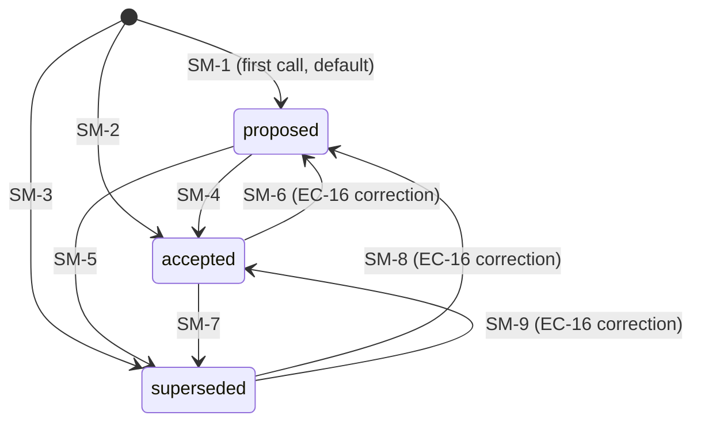

# Architecture: decisions-ledger writer for cfn-workbench

**Date:** 2026-07-28
**Spec:** planning/SPEC_decisions_ledger.md
**Pseudo:** planning/PSEUDO_decisions_ledger.md
**Status:** draft
**Tier:** beta (directive: full)
**Build flags:** frontend=no, db=no, pii=no, unknowns=no

## Step -1: Mode resolution

Under megaplan with `db=no` and `frontend=no`:
- Step 5 (Storage): the writer owns NO new schema. The SQLite schema lives in the LOCKED sink `.claude/skills/decision-log/schema.sql`. This artifact keeps only the JSON file shape (a boundary contract the renderer reads, not a schema the writer owns).
- Step 3 route map: skipped (no frontend).
- Step 6 observability detail, Step 8 rollout mitigation: deferred to `cfn-ops` (beta+). This artifact keeps the failure inventory (Step 7) per the arch/ops split.
- Step 10 error taxonomy: INCLUDED (requested extra).

## 0. DRY Audit

PSEUDO lists 8 operations (OP-W0 entry, OP-W1 parse, OP-W1b refuse-gate, OP-W2 build, OP-W3 upsert-atomic, OP-W4 delegate, OP-H1 helper, OP-H2 4 sites). Build-ladder dispositions:

| Operation | Disposition | Existing Path | Notes |
|---|---|---|---|
| OP-W0 writer_entry | NEW | - | No `cfn-decisions/` skill exists (`ls` confirms dir absent). New entrypoint is justified: writer owns a per-run JSON the renderer reads and no other module writes. |
| OP-W1 parse_and_validate_args | NEW (stdlib) | - | bash `while/case` over argv. stdlib getopts not used (long-flag form required by record.sh mirror). |
| OP-W1b refuse_on_missing_or_invalid | REUSE (pattern) | `.claude/skills/cfn-megaplan/bars/bless-verify.sh:80-94` | First-missing-field gate pattern reused verbatim; re-implemented in writer (cross-skill bash helpers are not imported, per skills CLAUDE.md "Minimal Dependencies"). |
| OP-W2 build_decision_object | REUSE (pattern) | `bless-verify.sh:137-141` | jq `-n --arg/--argjson` escape pattern reused; never string-concatenate JSON (FR-6). |
| OP-W3 upsert_by_key_atomic | EXTEND (pattern) | `bless-verify.sh:62-66,144-148` | DIR/BASE/mktemp+mv atomic-write pattern reused. Extension: UPSERT-BY-KEY (replace by `.id`) instead of append-only (`blessings += [$e]`). Justified by SPEC FR-2: decisions are entities that evolve, not events. |
| OP-W4 delegate_to_record_sh | REUSE (subprocess) | `.claude/skills/decision-log/record.sh` | Composition per D-1. The writer never opens `decisions.db` and never duplicates the sink's SQL. |
| OP-H1 record_decision | NEW (thin wrapper) | - | 6-line bash helper encapsulating writer call + D-8 isolation. Lives inline at each coordinator site (no new file; cfn-loop-task.md and cfn-megaplan/SKILL.md are markdown, the helper is a prose+snippet insertion). |
| OP-H2 coordinator_insertion_points | NEW (4 sites) | - | Four surgical insertions. See §3 for exact anchors and §H1 for the wrapper contract. |

NEW count: 4 of 8 (OP-W0, OP-W1, OP-H1, OP-H2). Below the 50% pause threshold. The 4 NEW are mandatory: no existing module owns the per-run JSON or the coordinator hook sites. The 2 REUSE patterns (refuse-gate, jq-escape) and the 1 REUSE subprocess (record.sh) reflect deliberate composition with locked infrastructure.

## 1. Components

**Composition root(s)** (the files `cfn-test-plan` Phase 3 will grep to prove each component is wired):

- `.claude/skills/cfn-decisions/record.sh`  -  writer construction + entrypoint (the CLI the coordinator calls; constructs the ENTRY via jq, owns the atomic mv, delegates the SQLite sync).
- `.claude/commands/cfn-loop-task.md` (3 insertion sites: Phase 4.2 ~:410-416, Phase 5 batch ~:439, Phase 5E.4 quarantine ~:535-538)  -  coordinator wiring for the loop flow.
- `.claude/skills/cfn-megaplan/SKILL.md` (1 insertion site: L3 decide ~:215)  -  coordinator wiring for the megaplan flow.

A component is "wired" iff one of these files constructs or calls it. A writer that exists but is called from none of these sites is an orphan by definition (precisely the MP-A failure shape; cfn-test-plan Phase 3 greps these files for the writer invocation).

### cfn-decisions-writer
- **Responsibility:** Persist one resolved decision per invocation to `planning/.VERIFY_<slug>.decisions.json` (atomic upsert-by-key) AND delegate the SQLite sync to `decision-log/record.sh` (composition, D-7 dual-write order: JSON-first, SQLite best-effort).
- **Owns operations:** OP-W0, OP-W1, OP-W1b, OP-W2, OP-W3, OP-W4.
- **Owns data:** the per-run JSON file `planning/.VERIFY_<slug>.decisions.json` (shape: `{slug, decisions:[ENTRY]}`). Owns NO database table.
- **Does NOT own:** the SQLite schema (decision-log owns `schema.sql`); the renderer projection (`section-decisions.sh`); coordinator control flow (the writer is a pure side-effect CLI invoked after a decision is resolved).

### cfn-decisions-hook (logical component, not a file)
- **Responsibility:** Wrap the writer call at each of the 4 coordinator sites with D-8 failure isolation (`record.sh ... || warn_log`). Translate a resolved decision into the writer's CLI argv. Emit the `decisions.ledger id=<id> status=<status>` runtime signal on success.
- **Owns operations:** OP-H1 (the wrapper), OP-H2 (the 4 insertion sites).
- **Owns data:** none (transient argv + log line).
- **Does NOT own:** the writer's exit-code semantics (writer owns those); the decision itself (the coordinator owns the resolution).

### decision-log-sink (LOCKED consumer, not modified by this plan)
- **Responsibility:** SQLite row upsert with `UNIQUE(project,slug,decision_id)`; html-escape-free SQL parameterization.
- **Owns operations:** none new (writer calls its existing `record.sh`).
- **Owns data:** `~/.claude/decision-log/decisions.db` (table `decisions`).
- **Does NOT own:** the per-run JSON; the `actor` or `iteration` fields (these are JSON-only per FR-5; the SQLite schema does not admit them).

### section-decisions-renderer (LOCKED consumer, not modified by this plan)
- **Responsibility:** Read `planning/.VERIFY_<slug>.decisions.json` and project it to TSV/HTML.
- **Owns operations:** none new.
- **Owns data:** none.
- **Does NOT own:** writes. The renderer is read-only.

## 2. Interface Contracts

The primary seam is the writer CLI. There is exactly one cross-component boundary a caller can reach: `cfn-decisions/record.sh` argv. Every other contract is internal to the writer or owned by a locked sink.

### 2.1 Writer CLI (THE seam)

```bash
.claude/skills/cfn-decisions/record.sh \
  --slug       <string>     \   # required, ^[a-z0-9][a-z0-9_-]{0,59}$
  --id         <string>     \   # required, stable within slug (D1, D2, ...)
  --title      <string>     \   # required, non-empty
  --chosen     <string>     \   # required, non-empty
  --actor      human|ai     \   # required, enum
  [--rationale      <string>]   # optional, default "" ; untrusted free text (FR-9)
  [--alternatives  <string>]   # optional, default ""
  [--status proposed|accepted|superseded]  # optional, default proposed (FR-10)
  [--iteration <int>]           # optional, default 1 (FR-10); JSON-only (not forwarded)
  [--blocking true|false]       # optional, default false (FR-10); forwarded as bare --blocking if true
  [--timestamp <iso8601-utc>]   # optional, default date -u +%Y-%m-%dT%H:%M:%SZ
  [--root <dir>]                # optional, default "$(pwd)/planning"
```

**Required vs optional table** (FR-10):

| Flag | Required | Default | Validation |
|---|---|---|---|
| `--slug` | yes | - | regex `^[a-z0-9][a-z0-9_-]{0,59}$` (SPEC §5 precondition) |
| `--id` | yes | - | non-empty, whitespace-trimmed |
| `--title` | yes | - | non-empty after trim |
| `--chosen` | yes | - | non-empty after trim |
| `--actor` | yes | - | enum `{human, ai}` |
| `--rationale` | no | `""` | any UTF-8 (FR-6 jq-escaped) |
| `--alternatives` | no | `""` | any UTF-8 |
| `--status` | no | `proposed` | enum `{proposed, accepted, superseded}` |
| `--iteration` | no | `1` | `^[0-9]+$` (0 and 2147483647 both accepted, EC-5) |
| `--blocking` | no | `false` | literal `true` or `false` |
| `--timestamp` | no | UTC now | `^[0-9]{4}-[0-9]{2}-[0-9]{2}T[0-9]{2}:[0-9]{2}:[0-9]{2}Z$` (EC-19) |
| `--root` | no | `$(pwd)/planning` | must be an existing writable dir |

**Reject flags:** `--delete`, `--remove`, `--purge`, `--supersede` (the SQLite sink's supersede path is NOT exposed through this writer; status transitions are encoded in `--status` per SPEC §6). Any unknown flag exits 2.

### 2.2 Exit-code semantics (D-7/D-8 contract; the hook reads these)

```
0   success: JSON entry written AND SQLite row synced (both locks held)
1   validation failure (FR-3): a required field is missing/empty/whitespace.
    Named field in stderr; NO field value echoed. NO file modified. record.sh NOT invoked.
2   CLI parse failure: unknown flag, missing flag value, invalid enum, malformed
    timestamp/iteration/blocking. NO file modified.
3   internal: jq failed to build ENTRY (OP-W2). Defensive / near-unreachable since
    --arg escapes every untrusted string. NO file modified.
4   filesystem failure (FR-4): planning dir missing/RO, mktemp fail, mv fail, disk
    full at the writer's filesystem layer. NO file at target path; original file
    unchanged; temp file cleaned up.
5   target JSON corrupt: existing .VERIFY_<slug>.decisions.json does not parse with
    jq empty. PRESERVE the bad file for inspection; refuse overwrite. NO modification.
6   RESERVED. (Was 2a-FATAL in PSEUDO OP-W4 step2a; REJECTED by D-7. Code is reserved
    so a future policy reversal can emit it without renumbering. The writer NEVER
    emits 6 in the current contract.)
7   SQLite sink missing: record.sh not on PATH (EC-10, D-7 winner 2a-PERSIST).
    JSON ALREADY COMMITTED. stderr names record.sh as missing. Non-zero so the
    coordinator can retry the sync; idempotent upsert makes retry safe.
8   SQLite sink non-zero: record.sh exited non-zero (EC-8: SQLite busy, disk full at
    the SQLite layer, sink-internal validation). JSON ALREADY COMMITTED. stderr logs
    the record.sh exit code; rationale NOT echoed (FR-9). Idempotent retry safe.
```

The hook (D-8) treats every non-zero code the same way at every site: log the code + site_id to stderr, emit `decisions.ledger id=<id> record FAILED rc=<n> site=<site_id>`, return 0 from the wrapper. The granular codes exist for the log shape and for `cfn-test-plan` assertions, not for hook branching. Recording the distinction matters for post-hoc audit (a code-7 spike across runs means a deployment problem; a code-1 spike means a caller bug).

### 2.3 JSON file shape (renderer contract; locked by `section-decisions.sh:14,38-51`)

```typescript
// File: planning/.VERIFY_<slug>.decisions.json
// Owner: cfn-decisions-writer (only writer of this file)
// Reader (locked): section-decisions.sh renders this verbatim.
interface DecisionLedgerFile {
  slug: string;            // matches the filename's <slug> and the invocation's --slug
  decisions: DecisionEntry[];
}
interface DecisionEntry {
  id:           string;    // stable within slug
  actor:        "human" | "ai";
  title:        string;
  chosen:       string;
  rationale:    string;    // untrusted free text; persisted verbatim (FR-9)
  alternatives: string;    // untrusted free text; persisted verbatim
  iteration:    number;    // JSON number (renderer's `.iteration|type == "number"` guard at line 48)
  blocking:     boolean;   // JSON boolean
  timestamp:    string;    // ISO 8601 UTC, e.g. "2026-07-28T14:00:00Z"
  status:       "proposed" | "accepted" | "superseded";
}
```

The renderer at `section-decisions.sh:23` gates on `.decisions | type == "array"`. The writer MUST bootstrap the wrapper object (never a bare array) and MUST keep `decisions` as an array. OP-W3 step 5a bootstraps `{slug, decisions:[$new]}` on first write; step 5c upserts by `.id` thereafter.

### 2.4 SQLite sink call (the composition seam with decision-log)

```bash
# Writer invokes the sink with the SHARED fields only (FR-5).
# actor + iteration are JSON-only and NEVER forwarded.
decision-log/record.sh \
  --slug "$SLUG" --id "$DEC_ID" \
  --title "$TITLE" --chosen "$CHOSEN" \
  --rationale "$RATIONALE" --alternatives "$ALTS" \
  --status "$STATUS" \
  --timestamp "$TS" \
  [--blocking]                    # bare flag, ONLY when writer's --blocking=true
# NEVER pass: --project (sink derives from git toplevel; Q-6 PARKED)
# NEVER pass: --actor, --iteration (not in sink schema; FR-5)
# NEVER pass: --supersede (status encoded via --status on the new ENTRY)
```

Always forward `--status` explicitly: the sink defaults `STATUS="accepted"` (`record.sh:19`) but the writer's default is `proposed`. Forgetting to forward would silently upgrade a proposed decision to accepted in the SQLite register. This is a defensive MUST, documented in OP-W4 step 3a.

### 2.5 Core-FR Dependency Interfaces

The skill's DI table fits a long-running service, not a bash CLI. The bash equivalent: the writer's external dependency is `decision-log/record.sh` (a subprocess, not an injected symbol). Mapping the 4 core FRs:

| Component | core_fr | Dependency (file:argv) | Optionality | DECISIONS ref |
|---|---|---|---|---|
| cfn-decisions-writer | FR-1 (insert new) | `decision-log/record.sh` (subprocess) | optional at runtime, REQUIRED for full dual-write | D-7 (JSON kept on sink-missing; non-zero exit) |
| cfn-decisions-writer | FR-2 (upsert by key) | filesystem `planning/` dir (atomic mv) | required | - |
| cfn-decisions-writer | FR-5 (delegate SQLite) | `decision-log/record.sh` (subprocess) | optional at runtime (D-7); required for the SQLite half of dual-write | D-7 |
| cfn-decisions-writer | FR-7 (loop auto-capture) | hook sites in `cfn-loop-task.md` + `cfn-megaplan/SKILL.md` | required (orphan otherwise) | - |

`optional at runtime` is filled with a D-7 reference (the ceiling is "JSON stays; SQLite sync can fail or be absent; coordinator sees non-zero exit"). Per the skill's rule, an optional DI row with a filled DECISIONS ref is acceptable. The FR-7 row is `required`: a writer with no coordinator site calling it is the MP-A orphan shape.

**Do not conflate seam-widening with omittability.** The writer's `--rationale`, `--alternatives`, `--iteration`, `--blocking`, `--timestamp`, `--root` flags are all optional AT THE CALL SITE (existing callers keep working if they omit them; FR-10 defaults apply). That is a widened seam. It is a separate decision from making the writer's construction optional at the composition root, which is NOT optional: the writer dir MUST exist and MUST be invoked from the 4 coordinator sites (FR-7 is `[core]`).

## 3. Data Flow

Primary happy path (one resolved decision):

```
Coordinator (loop-task.md Phase 4.2 | Phase 5 batch | Phase 5E.4 quarantine
             | megaplan/SKILL.md L3 decide)
   |
   | (1) decision resolved (product-owner verdict | AskUserQuestion answer
   |                         | quarantine classification)
   v
cfn-decisions-hook  (OP-H1 wrapper)
   |
   | (2) build argv; map actor/status/blocking per site (see §H1)
   v
cfn-decisions-writer  (record.sh)
   |-- OP-W1  parse + validate         -- exit 1/2 -> return to hook (D-8 logs, loop continues)
   |-- OP-W1b refuse on missing        -- exit 1
   |-- OP-W2  jq-build ENTRY           -- exit 3 (defensive)
   |-- OP-W3  upsert-by-key atomic     -- exit 4/5 (FS / corrupt-target)
   |          mktemp .dec.XXXXXX
   |          jq --argjson new ... > TMP
   |          mv TMP -> TARGET          (atomic; EC-7 reader sees old OR new)
   |          ** JSON PERSISTED HERE ** (renderer's primary artifact)
   |-- OP-W4  delegate to record.sh    -- exit 7 (missing) | exit 8 (non-zero)
   |          decision-log/record.sh
   |             |-- sqlite3 INSERT ... ON CONFLICT DO UPDATE
   |             v
   |          SQLite decisions table   (UNIQUE(project,slug,decision_id))
   v
exit 0 + stdout: "<DEC_ID> <STATUS>\n"  (FR-9: id+status only)
   |
   v
cfn-decisions-hook (RC=0 branch)
   |-- emits: "decisions.ledger id=<DEC_ID> status=<STATUS>\n"  (FR-7 signal)
   v
Coordinator continues to next phase / next queued decision
```

Failure path (D-8 isolation, identical at every site):

```
writer exits non-zero (any of 1..5, 7, 8)
   |
   v
hook wrapper: record.sh ... || RC=$?
   |-- printf 'decisions.ledger id=%s record FAILED rc=%d site=%s\n' \
   |       "$DEC_ID" "$RC" "$SITE_ID" >&2
   |-- return 0   (D-8: decision-record is an audit side-effect; loop continues)
   v
Coordinator proceeds (decision already honored in control flow)
```

**Anchor precision for each insertion site** (the load-bearing part; cfn-test-plan will grep these line ranges):

### SITE 1: cfn-loop-task.md Phase 4.2 product-owner 2/3 (anchor ~:414-416)
- **Anchor text:** the paragraph at line 414 ("3/3 items are implemented in-line during the vote pass. 2/3 items consult product-owner one at a time. 1/3 items are collected and surfaced after every other item is resolved.") followed by the line 416 marker ("**Mark todo #4 as completed. Proceed to Phase 5.**").
- **Insertion point:** BETWEEN the product-owner agent returning a verdict (IMPLEMENT / DEFER / REJECT) on a 2/3-routed suggestion AND the loop continuing to the next suggestion or marking todo #4 complete. The hook call is one line per resolved 2/3 item, fired inside the "consult product-owner one at a time" loop.
- **Control-flow risk:** ADDITIVE. There is no existing record call at this site. The hook is a new side effect appended after the verdict is known; it cannot change the verdict or the IMPLEMENT/DEFER/REJECT dispatch.
- **Actor mapping:** `actor=ai` (the product-owner agent is the decider).
- **Status mapping:** IMPLEMENT -> `accepted`; DEFER -> `proposed` (backlog); REJECT -> `superseded`.
- **Blocking mapping:** `blocking=true` if the suggestion was a `block`-severity vote (cfn-vote-implement block rule, cfn-loop-task.md:394); else `false`.

### SITE 2: cfn-loop-task.md Phase 5 user-batch (anchor ~:439)
- **Anchor text:** line 439 ("After each batch returns, implement the `Apply` items with TDD (sequential, same protocol as 3/3 items). Continue until queue is empty.").
- **Insertion point:** IMMEDIATELY AFTER each `AskUserQuestion` batch returns and BEFORE the "implement the Apply items" dispatch. One hook call per item in the returned batch (4 items max per batch per the batched-4 rule at line 429).
- **Control-flow risk:** ADDITIVE. No existing record call. The user's choice is honored regardless; the hook records the fact of the choice.
- **Actor mapping:** `actor=human` (AskUserQuestion resolution).
- **Status mapping:** Apply -> `accepted`; Skip -> `superseded`; Defer to backlog -> `proposed`.
- **Blocking mapping:** `blocking=false` (1/3 items are by definition non-blocking per the routing table at line 411).

### SITE 3: cfn-loop-task.md Phase 5E.4 quarantine (anchor ~:535-538)
- **Anchor text:** the `AskUserQuestion` line 535 and the three dispatch bullets at 536-538 (Quarantine: test.skip + backlog; Keep iterating: back to Phase 2; Abort: stop and report).
- **Insertion point:** BETWEEN the user's choice and the bullet-list dispatch. One hook call total (this AskUserQuestion is one decision by design: "one decision" per the spec at line 535).
- **Control-flow risk:** ADDITIVE but load-bearing-adjacent. The hook fires BEFORE the test.skip wrap (Quarantine branch) or the Phase 2 return (Keep iterating) or the report (Abort). If the hook fails, D-8 isolation means the test.skip wrap still happens, the backlog entry still lands, and the audit row is the only missing artifact. Per D-8, this is acceptable: the audit row is an audit side-effect, not a gate on the quarantine itself. (Prior reasoning that 5E.4 was the one fatal site is SUPERSEDED by D-8; the user-approved directive isolates at all 4 sites uniformly.)
- **Actor mapping:** `actor=human`.
- **Status mapping:** Quarantine -> `accepted`; Keep iterating -> `proposed`; Abort -> `superseded`.
- **Blocking mapping:** `blocking=true` (quarantine is load-bearing for Step 3.05 hygiene; the audit row is what makes a subsequent audit pass clean, even though D-8 says a missing row does not block the run).

### SITE 4: cfn-megaplan/SKILL.md L3 decide (anchor ~:215)  -  see [OPEN-A]
- **Anchor text:** line 215 ("If any phase returns **BLOCKING** `[OPEN]` items, batch them and surface via `AskUserQuestion` before advancing past the level. Record every resolved decision to the decision log (closes gap G35/decision-log loop). `cfn-decide` owns the register; the orchestrator forwards mid-level decisions to it.").
- **Insertion point:** IMMEDIATELY AFTER the `AskUserQuestion` resolution of a BLOCKING `[OPEN]` item AND BEFORE "advance past the level".
- **Control-flow risk:** This is the ONE site where the insertion is a SUBSTITUTION, not a pure addition. The existing sentence routes to `cfn-decide` / `decision-log/record.sh` directly. Routing through `cfn-decisions/record.sh` instead is BEHAVIOR-PRESERVING for the SQLite half (the writer calls `record.sh` per D-1 composition; the same row lands with the same fields) and ADDITIVE for the JSON half (a new entry appears in `.VERIFY_<slug>.decisions.json`). It does NOT remove the existing decision-log write.
- **Conservative default carried forward:** the writer REPLACES the direct `decision-log/record.sh` call as the canonical entry, because (a) FR-7 names this site explicitly, (b) the writer's delegation is faithful (FR-5 AC asserts the SQLite row lands), and (c) routing both writes through one entrypoint removes a fork where the JSON and SQLite could drift. Flagged as [OPEN-A] BLOCKING because changing existing prose intent is the highest-risk class of edit per the task directive.
- **Actor mapping:** `actor=human` (BLOCKING [OPEN] items resolve via user `AskUserQuestion`).
- **Status mapping:** always `accepted` (a BLOCKING [OPEN] resolution is the canonical accepted-decision shape).
- **Blocking mapping:** `blocking=true` (BLOCKING items are blocking by definition).

## 4. External Integrations

### 4.1 Filesystem (`planning/` directory)
- **Version:** POSIX filesystem semantics (Linux/WSL2; macOS would need `mktemp -d` differ for dir cases, but writer uses file mktemp inside an existing dir, so portable).
- **Contract:** atomic `mv` (POSIX `rename(2)`) on the SAME filesystem. Target path: `planning/.VERIFY_<slug>.decisions.json`. Temp path: `planning/.dec.XXXXXX` (mktemp inside the target dir, so the final `mv` is same-filesystem and atomic).
- **Auth:** process uid must have write+create permission on `planning/`.
- **Retry policy:** NONE. mktemp and mv are not retried; failure exits 4 immediately. The coordinator can re-invoke the writer (idempotent upsert) but the writer itself does not retry.
- **Timeout:** NONE (mv is atomic and fast; if it blocks, something is fundamentally wrong and retrying masks it).
- **Circuit breaker:** NONE.
- **Failure modes:** EC-9 (mktemp/mv fail), EC-11 (read-only dir), EC-24 (disk full at mv). All exit 4, original file unchanged, temp file cleaned up via trap on EXIT/INT/TERM.

### 4.2 SQLite sink (`decision-log/record.sh` subprocess)
- **Version:** whatever `decision-log/record.sh` and `sqlite3` provide. The writer treats it as a black box; it does not read schema.sql or open `decisions.db` directly (FR-5 composition).
- **Contract:** the sink's argv surface (§2.4). Read the sink's `record.sh:1-12` usage block; do not invent flags.
- **Auth:** `DB_PATH` defaults to `${HOME}/.claude/decision-log/decisions.db`; the sink owns that path and its sqlite3 auth. The writer passes nothing DB-related through.
- **Retry policy:** NONE in the writer. The sink may have its own retry policy (out of scope). If the sink exits non-zero (EC-8) or is missing (EC-10), the writer exits 7 or 8 and the JSON stays committed; the coordinator can re-invoke (idempotent upsert in both files).
- **Timeout:** NONE in the writer. (A hung sink would hang the coordinator hook; D-8 isolation does not cover indefinite hangs. `cfn-ops` should consider a `timeout` wrapper at the hook site if sink-latency spikes are observed. Flagged in §7 as a writer-adjacent risk, not a writer contract.)
- **Circuit breaker:** NONE.
- **Failure modes:** EC-8 (sink non-zero; writer exit 8), EC-10 (sink missing; writer exit 7). Both preserve the JSON. FR-9 invariant: stderr carries the sink exit code, never the rationale.

### 4.3 jq subprocess
- **Version:** any jq 1.6+ (renderer assumes the same; `section-decisions.sh:23` uses the same jq).
- **Contract:** stdin (none for `-n` builds), stdout (JSON), stderr (parse errors), exit code.
- **Auth:** none.
- **Retry/timeout/circuit breaker:** NONE.
- **Failure mode:** writer startup checks `command -v jq >/dev/null 2>&1` and refuses with exit 2 if absent (mirrors `bless-verify.sh:60`). A jq failure during ENTRY build exits 3 (defensive). A jq failure during upsert exits 5 (target corrupt) or 5 (jq upsert output invalid).

## 5. Storage

**SKIPPED per Step -1.** `db=no`; the writer owns NO new schema. The SQLite schema lives in the LOCKED sink `.claude/skills/decision-log/schema.sql:48-64` (table `decisions`, `UNIQUE(project,slug,decision_id)`, status CHECK constraint `proposed|accepted|superseded`).

The writer's data ownership is the JSON shape documented in §2.3. That shape is a boundary contract the renderer reads; it is not a schema the writer migrates. The `decisions` array bootstraps on first write and grows by upsert; there is no migration path because there is no schema version.

## 6. Cross-Cutting

- **AuthN:** no authN surface. The writer is a CLI invoked by the trusted coordinator. Manual invocation (EC-12) is identical in behavior.
- **AuthZ matrix:** SPEC §1a explicitly omits actors (`frontend: no` AND `db: no`; "Single implicit caller: the loop coordinator and megaplan orchestrator. No user surface, no new trust boundaries."). Per the skill rule, columns come from §1a verbatim. With one implicit caller:

  | Operation | coordinator (loop + megaplan) | manual-invoker (EC-12) |
  |---|---|---|
  | record new decision (FR-1) | allow | allow |
  | upsert existing (slug,id) (FR-2) | allow | allow |
  | delegate to record.sh (FR-5) | allow | allow (if record.sh on PATH) |
  | emit decisions.ledger log line (FR-7) | allow | n/a (no coordinator log surface) |

  No new trust boundary; the matrix collapses to "any caller with filesystem + record.sh access". This is consistent with §1a's omission.

- **Observability:** the FR-7 runtime signal `decisions.ledger id=<id> status=<status>` on success; `decisions.ledger id=<id> record FAILED rc=<n> site=<site>` on failure. Both carry id+status+rc only; rationale NEVER appears (FR-9).
- **Rate limiting:** N/A. Synchronous CLI, one invocation per resolved decision. The coordinator naturally bounds the rate (decisions resolve at human/agent decision speed).
- **Caching:** none.
- **Secrets:** rationale and alternatives are untrusted free text (floors: `secrets_handling`, `pii_if_present`). They flow only to the JSON file and (via record.sh) to the SQLite register. They never appear in stdout, stderr, /tmp, the `decisions.ledger` log line, or the writer's own process environment beyond the argv that carries them to record.sh. See §10 for the leakage audit pattern.

## 7. Failure Modes (inventory; mitigation design deferred to cfn-ops)

| Component | Failures | Blast radius | Mitigation |
|---|---|---|---|
| cfn-decisions-writer (validation) | missing required field (FR-3); invalid actor/status/timestamp/iteration/blocking; unknown flag | none (NO file modified; record.sh NOT invoked) | exit 1 or 2; stderr names the field, never the value; D-8 hook logs and continues |
| cfn-decisions-writer (FS) | planning dir missing/RO; mktemp fail; mv fail; disk full at FS layer | target file unchanged; temp file cleaned via trap | exit 4; coordinator can re-invoke (idempotent) |
| cfn-decisions-writer (target corrupt) | existing .VERIFY_<slug>.decisions.json not valid JSON | bad file PRESERVED for inspection; no overwrite | exit 5; operator investigates the corrupt file manually |
| cfn-decisions-writer (sink missing) | decision-log/record.sh not on PATH (EC-10) | JSON committed; SQLite out of sync until sink restored | exit 7; D-8 hook logs; coordinator re-run is safe |
| cfn-decisions-writer (sink non-zero) | record.sh exits non-zero: SQLite busy, disk full at SQLite layer, sink-internal validation | JSON committed; SQLite may be missing or stale | exit 8; D-8 hook logs; idempotent re-run safe |
| cfn-decisions-hook | writer subprocess hangs (e.g. sink hung on sqlite lock) | coordinator hook site blocks indefinitely | writer does NOT time out the sink (out of scope); cfn-ops should consider a `timeout 30s` wrapper around the writer call at each site. Flagged as [PARKED: hook timeout mitigation | deferred: cfn-ops owns rollout mitigation design]. |
| cfn-decisions-hook (concurrent writers, EC-6) | two writers race for same (slug,id) | last writer wins; final file has exactly one entry for the id; no temp files linger | atomic `mv` (POSIX rename); per-writer mktemp; per-writer EXIT/INT/TERM trap. Writer does NOT detect the race; EC-6 accepts last-writer-wins. |
| decision-log-sink | SQLite busy / locked / disk full | JSON half of dual-write still succeeds; SQLite half fails | writer exits 8 (not 0); coordinator sees non-zero and can retry |
| decision-log-sink (FTS trigger) | decisions_fts insertion fails after decisions INSERT succeeds | SQLite table row exists; FTS index out of sync (search-quality degradation, not data loss) | sink-owned; out of writer scope. cfn-ops audit item if search quality regresses. |

## 8. Deployment

- **Env vars:** none new. `DB_PATH` belongs to `decision-log/record.sh` and is untouched. The writer reads no env vars (timestamp uses `date -u`, paths use `$(pwd)/planning` default or `--root`).
- **Feature flag:** none. The hook insertions are unconditional at the 4 sites per FR-7 ("There is no 'skip if quiet' path").
- **Backward compatibility:** purely additive. The renderer (`section-decisions.sh`) already reads `.VERIFY_<slug>.decisions.json` and treats its absence as the normal empty state (lines 22-27). Before any writer invocation, the renderer emits "No decisions logged for this run." Adding the writer only flips that to a populated list when decisions actually resolve. No existing contract changes shape.
- **Rollback procedure:**
  1. Remove the 4 hook insertions from `cfn-loop-task.md` (3 sites) and `cfn-megaplan/SKILL.md` (1 site). The writer script can remain on disk; it simply is not invoked.
  2. Stale `.VERIFY_<slug>.decisions.json` files remain valid (the renderer tolerates them; they are historical record). Optionally delete them per slug, but the writer's own no-delete invariant (FR-8) does not apply to manual cleanup outside the writer.
  3. SQLite rows persisted by the sink are untouched (separate concern, separate lifecycle per SPEC §6).
  - Rollout mitigation detail (canary strategy, incremental site enablement) deferred to `cfn-ops`.

## 9. State Machines

Entity: `decision` (one element of `.VERIFY_<slug>.decisions.json#decisions[]`, mirrored as one row in SQLite `decisions`).

**SM-id space:** SM-1 through SM-3 (valid) + SM-4 through SM-9 (legal-but-not-gated, treated as valid because EC-16 forbids a forward-only gate). One continuous space. cfn-test-plan consumes SM-id as the greppable token; Bar A counters `sm_total=9, sm_mapped` per the test plan's mapping.

**Key design decision (EC-16):** ALL status pairs are legal in BOTH directions. The writer does NOT enforce `proposed -> accepted -> superseded` as a forward-only flow. Rationale (SPEC §7 Q-4 / EC-16): callers can correct mistakes (`accepted -> proposed` is a legitimate "we re-opened this decision") and the upsert model has no history to consult. Therefore there are NO illegal transitions; the "illegal transitions" table is empty by design and every non-adjacent pair is documented as legal.

### Valid transitions

| SM-id | Entity | From | To | Trigger | Guard |
|---|---|---|---|---|---|
| SM-1 | decision | (absent) | proposed | first writer invocation, `--status proposed` (FR-10 default) | slug regex; required fields non-empty (FR-3) |
| SM-2 | decision | (absent) | accepted | first writer invocation, `--status accepted` | same as SM-1 |
| SM-3 | decision | (absent) | superseded | first writer invocation, `--status superseded` | same as SM-1 (rare: records a decision already obsolete at first capture) |
| SM-4 | decision | proposed | accepted | re-invoke same (slug,id), `--status accepted` | id matches existing entry |
| SM-5 | decision | proposed | superseded | re-invoke, `--status superseded` | id matches |
| SM-6 | decision | accepted | proposed | re-invoke, `--status proposed` (EC-16: mistake correction) | id matches; no forward-only gate |
| SM-7 | decision | accepted | superseded | re-invoke, `--status superseded` | id matches |
| SM-8 | decision | superseded | proposed | re-invoke, `--status proposed` (EC-16) | id matches |
| SM-9 | decision | superseded | accepted | re-invoke, `--status accepted` (EC-16) | id matches |

### Illegal transitions

| SM-id | Entity | From | To (illegal) | Rejection behavior |
|---|---|---|---|---|
| (none) | - | - | - | The writer emits NO transition-rejection error code. Every (From, To) pair is either a valid row above or `unreachable by construction` per the note below. |

`unreachable by construction: any status -> any status not in {proposed, accepted, superseded}` (the writer validates `--status` against the enum in OP-W1 step 8 and exits 2 on anything else; the SQLite sink's CHECK constraint at `schema.sql:57-58` is the second line of defense).

### State transition mechanics

- Each transition is a writer invocation; the ENTRY for the matching `id` is REPLACED in the JSON array (upsert-by-key, OP-W3 step 5c).
- Relative order of every other element is preserved (FR-2 / OP-W3 step 5c `map(if .id == $new.id then $new else . end)`).
- The SQLite row is updated via `ON CONFLICT(project, slug, decision_id) DO UPDATE` (`record.sh:67-71`).
- `iteration` is caller-supplied (default 1). It is NOT a state axis and the writer does NOT auto-increment it; callers pass a new value if they want to signal iteration count.
- NO `DELETE` is issued at any transition (FR-8). The SQLite sink's `--supersede` flag is NOT used by this writer; supersession is encoded purely via `--status superseded` on the replacement entry. (The sink's separate `--supersede <Dn>` mechanism for cross-row `superseded_by` population is out of scope and remains a `cfn-decide` direct-call concern, not a writer concern.)

### Diagram (mermaid)



This diagram (or an ASCII equivalent) is what NFR-6 requires mirrored into `readme/state-machines.md` at commit time. The commit-time update is a copy of this section, not a fresh design.

## 10. Error Taxonomy (beta+; `error_taxonomy` extra)

Single source of truth: the writer's exit code is the canonical error surface. The sink (decision-log/record.sh) has its own error shape; the writer surfaces sink failures as exit 7 or 8 with the sink's exit code in stderr (the sink's own stderr is suppressed or surfaced verbatim per implementation choice at OP-W4; this contract pins only that the WRITER's stderr never contains rationale).

### 10.1 Canonical error-code enum

```
# Source of truth: cfn-decisions/record.sh (exit codes); tests assert these.
E_OK                 = 0   # success
E_VALIDATION         = 1   # FR-3 missing/empty/whitespace required field
E_CLI_PARSE          = 2   # unknown flag, missing value, invalid enum, malformed timestamp/iteration/blocking
E_JQ_BUILD           = 3   # OP-W2 jq failed to build ENTRY (defensive)
E_FILESYSTEM         = 4   # OP-W3 dir missing/RO, mktemp fail, mv fail, disk full at FS layer
E_TARGET_CORRUPT     = 5   # existing .VERIFY_*.decisions.json not valid JSON; refuse overwrite
E_RESERVED_6         = 6   # RESERVED (was 2a-FATAL in PSEUDO; rejected by D-7; never emitted)
E_SINK_MISSING       = 7   # decision-log/record.sh not on PATH (D-7 PERSIST)
E_SINK_NONZERO       = 8   # decision-log/record.sh exited non-zero (EC-8)
```

### 10.2 Typed error shape (stderr contract)

```
# Every writer stderr line matches one of these shapes. FR-9 invariant:
# NO line ever contains the value of --rationale or --alternatives.
#
# Validation / parse:
"missing required field: <fieldname>"           # E_VALIDATION (1)
"unknown arg: <arg>"                            # E_CLI_PARSE (2)
"<fieldname> must be <constraint>"              # E_CLI_PARSE (2) -- e.g. "actor must be human|ai"
"iteration must be a non-negative integer"      # E_CLI_PARSE (2)
"timestamp must be ISO 8601 UTC like 2026-07-28T14:00:00Z"  # E_CLI_PARSE (2)
# Internal:
"internal: jq failed to build decision object"  # E_JQ_BUILD (3)
# Filesystem:
"planning dir missing or read-only: <dir>"      # E_FILESYSTEM (4)
"mktemp failed in <dir>"                        # E_FILESYSTEM (4)
"mv failed to commit <target>"                  # E_FILESYSTEM (4)
# Target corrupt:
"existing <target> is not valid JSON; refusing overwrite"  # E_TARGET_CORRUPT (5)
# Sink:
"record.sh missing; JSON persisted at <target>; SQLite sync skipped"  # E_SINK_MISSING (7)
"record.sh failed exit=<n>; JSON persisted at <target>; SQLite out of sync"  # E_SINK_NONZERO (8)
```

### 10.3 Mapping: failure mode -> code -> coordinator-visible behavior (D-8)

| Failure mode (EC) | Code | Stderr shape | Coordinator hook behavior (D-8) |
|---|---|---|---|
| EC-1 missing slug | 1 | `missing required field: slug` | hook logs `id=<id> record FAILED rc=1 site=<site>` and returns 0; loop continues |
| EC-2 empty title | 1 | `missing required field: title` | same |
| EC-3 actor omitted/invalid | 1 / 2 | `missing required field: actor` / `actor must be human\|ai` | same |
| EC-4 rationale 10k chars | 0 | (success; no stderr) | hook emits `decisions.ledger id=<id> status=<status>` |
| EC-5 iteration 0 / MAX_INT | 0 | (success) | same |
| EC-6 concurrent same-id writers | 0 | (success; last-writer-wins) | both hooks emit success; final file has one entry |
| EC-7 concurrent reader | 0 | (success) | reader sees pre- or post-invocation file, never partial |
| EC-8 record.sh non-zero | 8 | `record.sh failed exit=<n>; JSON persisted at <target>; SQLite out of sync` | hook logs failure and returns 0; JSON is authoritative; SQLite will sync on next run |
| EC-9 mktemp/mv fail | 4 | `mktemp failed in <dir>` / `mv failed to commit <target>` | hook logs failure, returns 0; NO JSON at target; coordinator re-run safe |
| EC-10 record.sh missing | 7 | `record.sh missing; JSON persisted at <target>; SQLite sync skipped` | hook logs failure, returns 0; JSON authoritative |
| EC-11 read-only planning dir | 4 | `planning dir missing or read-only: <dir>` | same as EC-9 |
| EC-12 manual invocation | n/a | writer behaves identically (CLI has no caller-detection) | n/a (no hook involved) |
| EC-13 JSON breakout in rationale | 0 | (success; jq --arg escaped the breakout) | FR-6 / AC-FR-6 assert `.evil` is absent |
| EC-14 XSS + SQL in rationale | 0 | (success) | rationale persisted verbatim; renderer escapes; sink parameterizes |
| EC-15 100-row volume | 0 per row | (success) | hook fires 100 times; renderer paginates |
| EC-16 status transition accepted->superseded etc. | 0 | (success; upsert replaces) | SM-4 through SM-9 |
| EC-17 caller attempts --delete | 2 | `unknown arg: --delete` | hook logs failure, returns 0; no entry removed (no `--delete` surface exists) |
| EC-18 TZ=America/New_York, no --timestamp | 0 | (success; default is UTC) | persisted timestamp ends in `Z` |
| EC-19 malformed caller timestamp | 2 | `timestamp must be ISO 8601 UTC like 2026-07-28T14:00:00Z` | hook logs failure, returns 0 |
| EC-20 DST boundary parallel runs | 0 | (success) | both timestamps well-formed UTC |
| EC-21 unicode/emoji in rationale | 0 | (success) | UTF-8 preserved verbatim |
| EC-22 em dash in caller rationale | 0 | (success; NFR-5 bans em dashes in writer's OWN code, not in caller data) | persisted verbatim |
| EC-23 1000-entry file | 0 | (success; OP-W3 is O(2n); p95 target 500ms flagged for test_plan to verify) | perf target, not a correctness gate |
| EC-24 disk full at mv | 4 | `mv failed to commit <target>` | same as EC-9 |

### 10.4 Leakage audit (FR-9 enforcement pattern, cfn-test-plan Phase 4 consumes)

The rationale-leakage invariant is cross-cutting, not a single error code. Test pattern (encode as one AC per FR-9 floor):

1. Invoke writer with `--rationale "secret-marker-ZZY-12345"`.
2. Assert exit 0.
3. `grep -r secret-marker-ZZY-12345 /tmp` returns zero matches.
4. Writer stdout does not contain the marker (stdout is `<id> <status>\n` only).
5. Writer stderr does not contain the marker (stderr carries field names, exit codes, target paths; never rationale).
6. The only repositories containing the marker are `planning/.VERIFY_<slug>.decisions.json` and the SQLite `decisions` table (via `decision-log/decisions.sh show`).
7. The hook's `decisions.ledger` log line carries `id` and `status` only (regex `^decisions\.ledger id=[^ ]+ status=[^ ]+\$` on the log line; marker absent).

This pattern is the FR-9 / floor-items `secrets_handling` + `pii_if_present` enforcement. It is independent of the exit-code taxonomy because leakage is a content invariant, not a control-flow outcome.

### 10.5 Concurrency guarantee (EC-6, §PSEUDO 4)

**Guarantee:** two concurrent writer invocations for the same `(slug, id)` produce a final `.VERIFY_<slug>.decisions.json` that is valid JSON, contains exactly one entry for that id, and leaves no temp files in `planning/`. The entry's content is the last writer's ENTRY (last-writer-wins).

**Mechanism:** each writer allocates its own `mktemp .dec.XXXXXX`; both compute their ENTRY independently; both run `jq ... > $TMP`; both `mv $TMP $TARGET`. POSIX `rename(2)` is atomic on the same filesystem, so one mv lands last and wins; the other's TMP is removed by its own EXIT trap. Both tmp paths are unique (mktemp XXXXXX), so they do not collide.

**Limit:** last-writer-wins means the LOSING writer's field values are silently overwritten. The writer does NOT detect the race, does NOT queue, does NOT merge. Callers needing atomic read-modify-write across multiple ids in one transaction must serialize at the coordinator level (one writer invocation at a time per slug). EC-6 accepts last-writer-wins because (a) the same id being resolved twice in parallel is itself a coordinator bug, and (b) the SQLite sink's `UNIQUE(project,slug,decision_id) DO UPDATE` mirrors the same semantics, so JSON and SQLite stay consistent under the race.

---

## Open-item triage

Per the orchestrator's triage rule (BLOCKING iff in a downstream-consumed section OR touching a floor item; conservative default otherwise; never park a floor/contract/FR-set/coverage-reducing item).

**Downstream-consumed sections of this artifact:** §1 Components, §2 Interface Contracts, §3 Data Flow (the 4 hook sites), §9 State Machines. Consumed by `cfn-ops` (L6 failure mitigation + rollout) and `cfn-test-plan` (L7 test-plan turns components/contracts/SM-id/error-taxonomy into concrete test rows). An [OPEN] in any of these is BLOCKING.

### [OPEN] items (BLOCKING, need a user decision now)

**[OPEN-A] [RESOLVED via D-9, user-approved 2026-07-28]** SITE 4 insertion at `cfn-megaplan/SKILL.md:215` is the ONE site where the new writer call SUBSTITUTES for existing routing rather than purely adding a side effect. The existing sentence routes BLOCKING `[OPEN]` resolutions to "the decision log" via `cfn-decide` / `decision-log/record.sh` directly. Routing through `cfn-decisions/record.sh` instead is behavior-preserving for the SQLite half (writer delegates to record.sh per D-1; same row lands) and additive for the JSON half. But it changes existing prose intent at a load-bearing orchestrator site.
- **Conservative default carried forward (will be implemented unless the user picks otherwise):** the writer REPLACES the direct `decision-log/record.sh` call as the canonical entry at this site. The sentence at line 215 is rewritten to: "Record every resolved decision via `cfn-decisions/record.sh` (closes gap G35/decision-log loop AND populates the per-run JSON ledger). The writer delegates the SQLite register sync to `decision-log/record.sh`." This is the conservative choice because it (a) satisfies FR-7's explicit naming of this site, (b) eliminates the JSON/SQLite drift fork by routing both writes through one entrypoint, and (c) preserves the existing SQLite row via composition.
- **Why BLOCKING:** the task directive says "flag any insertion that could change existing coordinator control flow (not just add a side-effect call) as BLOCKING". This is the only such site. The other three sites (Phase 4.2, Phase 5 batch, Phase 5E.4 quarantine) have NO existing record call to replace; they are pure additions and are NOT BLOCKING.
- **Recommendation:** approve the substitution. The writer's faithful delegation (FR-5 / AC-FR-5) is the test plan's proof that no SQLite coverage is lost.

### [PARKED] items (deferred, listed with the chosen default)

- **[PARKED: hook timeout mitigation | deferred: §7 Failure Modes  -  cfn-ops owns rollout mitigation design]** The writer does NOT time out the `decision-log/record.sh` subprocess. A hung sink (e.g. sqlite lock contention) would hang the coordinator hook indefinitely, and D-8 isolation does not cover indefinite hangs. Default carried: document the risk in §7; do NOT add a `timeout` wrapper in the writer itself (would be a writer-side mitigation of a sink-side problem; cfn-ops owns the rollout policy and may wrap the writer call with `timeout 30s` at the hook site if sink-latency spikes are observed in canary).

- **[PARKED: bash test framework + tests/ location | deferred: §1  -  test framework and location is internal to the writer skill, not downstream-consumed by arch; SPEC Q-5 PARKED]** Tests will be bash (NFR-1) and live under `.claude/skills/cfn-decisions/tests/` (Option (a) per SPEC Q-1 resolution). Matches `bless-verify.sh`'s adjacent-tests layout pattern. Final framework details re-resolve at `write-plan`.

- **[PARKED: single decision per invocation | deferred: §2.1  -  invocation shape is internal to the writer; SPEC Q-3 PARKED]** The writer CLI accepts exactly one `(slug, id)` per invocation, matching `decision-log/record.sh` semantics. Batch is out of scope.

- **[PARKED: project auto-derived by record.sh | deferred: §2.4  -  project derivation is the sink's contract, not the writer's; SPEC Q-6 PARKED]** The writer NEVER passes `--project`; `record.sh` derives it from `git rev-parse --show-toplevel` basename (`record.sh:51-53`).

- **[PARKED: em dashes in caller text | deferred: §2.3 / §10.3 EC-22  -  caller data is not writer code; SPEC NFR-5 / EC-22 PARKED]** The writer does not reject, rewrite, or normalize em dashes in `--rationale` or `--alternatives`. NFR-5 bans em dashes in the writer's OWN code, comments, SKILL.md copy, and hook prose; caller text is persisted verbatim and the renderer escapes downstream.

---

## Return block

```
artifact: planning/ARCH_decisions_ledger.md
components: 4 (cfn-decisions-writer, cfn-decisions-hook [logical], decision-log-sink [LOCKED consumer], section-decisions-renderer [LOCKED consumer])
interfaces: writer CLI (THE seam), JSON file shape (renderer-locked), record.sh call (sink composition seam), exit-code enum (D-7/D-8 contract)
state_machines: 1 entity (decision), 9 valid transitions (SM-1..SM-9), 0 illegal (EC-16: all status pairs legal both directions; enum validation is the only gate)
error_taxonomy: 9 exit codes (0..8 with 6 RESERVED), stderr shape contract, EC-1..EC-24 mapping table
gate: PASS
open_questions_blocking: 0  ([OPEN-A] RESOLVED via D-9, user-approved 2026-07-28: writer replaces the direct record.sh call as canonical at megaplan:215, behavior-preserving for SQLite via composition, additive for JSON)
parked: 5  (hook timeout mitigation, test framework/location, single-per-call, project derivation, em dashes in caller text)
```
