# CFN Loop System Flowcharts

Complete visual documentation of the CFN (Claude Flow Novice) Loop system with detailed Mermaid diagrams.

**Documentation Version**: 1.1.0
**Last Updated**: 2025-10-03
**Compatible With**: Claude Flow Novice v1.5.22+

---

## Table of Contents

1. [Overall CFN Loop Flow](#1-overall-cfn-loop-flow)
2. [Autonomous Self-Looping Flow](#2-autonomous-self-looping-flow)
3. [Loop 2: Phase-Level Flow](#3-loop-2-phase-level-flow)
4. [Loop 3: Consensus Flow](#4-loop-3-consensus-flow)
5. [Product Owner Decision Gate (Loop 2)](#5-product-owner-decision-gate-loop-2)
6. [Confidence Score Calculation](#6-confidence-score-calculation)
7. [Circuit Breaker State Machine](#7-circuit-breaker-state-machine)
8. [Memory Coordination](#8-memory-coordination)
9. [Agent Spawning Process](#9-agent-spawning-process)
10. [Feedback Injection Pipeline](#10-feedback-injection-pipeline)

---

## 1. Overall CFN Loop Flow

Complete 3-loop system with decision gates, feedback paths, and escalation routes.

```mermaid
flowchart TD
    Start([Start CFN Loop]) --> Loop1Init{Loop 1: Swarm<br/>Initialization}

    Loop1Init --> CheckMultiAgent{Multiple<br/>Agents?}
    CheckMultiAgent -->|Yes| SwarmInit[Initialize Swarm<br/>swarm_init topology maxAgents]
    CheckMultiAgent -->|No Single Agent| DirectExecution[Direct Execution<br/>No Coordination]

    SwarmInit --> SelectTopology{Agent Count?}
    SelectTopology -->|2-7 Agents| MeshTopology[Topology: mesh<br/>Peer-to-peer]
    SelectTopology -->|8+ Agents| HierarchicalTopology[Topology: hierarchical<br/>Coordinator-led]

    MeshTopology --> SpawnAgents[Spawn ALL Agents<br/>in SINGLE Message]
    HierarchicalTopology --> SpawnAgents

    SpawnAgents --> Loop2[Loop 2: Execution Loop<br/>Primary Swarm]

    %% Loop 2: Execution Loop
    Loop2 --> ExecuteAgents[Execute Primary Agents<br/>Concurrent via Task tool]
    ExecuteAgents --> FileEdits[File Edits<br/>Write/Edit/MultiEdit]
    FileEdits --> PostEditHooks[MANDATORY: Post-Edit Hooks<br/>npx enhanced-hooks post-edit]

    PostEditHooks --> ValidationResults[Validation Results<br/>Format Lint Type Security Tests]
    ValidationResults --> SelfValidation[Self-Validation<br/>Calculate Confidence Scores]

    SelfValidation --> Gate1{GATE 1:<br/>Self-Assessment<br/>Confidence ≥ 0.75?}

    Gate1 -->|PASS| Loop3[Loop 3: Consensus<br/>Verification Loop]
    Gate1 -->|FAIL| CheckLoop2Retries{Loop 2 Round<br/>≤ 3?}

    CheckLoop2Retries -->|Yes| CollectFeedback2[Collect Feedback<br/>from Failed Validations]
    CheckLoop2Retries -->|No Max Retries| EscalateLoop2[Escalate with<br/>Next Steps Guidance]

    CollectFeedback2 --> InjectFeedback2[Inject Feedback<br/>into Agent Instructions]
    InjectFeedback2 --> Loop2RetryCounter[Round++]
    Loop2RetryCounter --> Loop2

    %% Loop 3: Consensus Verification Loop
    Loop3 --> SpawnValidators[Spawn Validator Swarm<br/>2-4 validators]
    SpawnValidators --> MultiDimValidation[Multi-Dimensional Validation<br/>Quality Security Performance Tests Docs]

    MultiDimValidation --> ByzantineVoting[Byzantine Consensus Voting<br/>Calculate Agreement & Confidence]
    ByzantineVoting --> CheckCritical{All Critical<br/>Criteria Passing?}

    CheckCritical -->|No| FailConsensus[Consensus: FAIL]
    CheckCritical -->|Yes| Gate2{GATE 2:<br/>Consensus Decision<br/>Agreement ≥ 0.90<br/>& Avg Conf ≥ 0.90?}

    Gate2 -->|PASS| Success[Success!<br/>Store Results in SwarmMemory]
    Gate2 -->|FAIL| FailConsensus

    FailConsensus --> CheckLoop3Retries{Loop 3 Round<br/>≤ 10?}

    CheckLoop3Retries -->|Yes| AggregateFeedback3[Aggregate Validator Feedback]
    CheckLoop3Retries -->|No Max Rounds| EscalateLoop3[Escalate to Human<br/>Next Steps Guidance]

    AggregateFeedback3 --> InjectFeedback3[Inject Feedback<br/>into Loop 2 Context]
    InjectFeedback3 --> Loop3RetryCounter[Round++]
    Loop3RetryCounter --> Loop2

    Success --> UpdateDocs{Documentation<br/>Required?}
    UpdateDocs -->|Yes| GenerateDocs[Update Documentation]
    UpdateDocs -->|No| GenerateNextSteps
    GenerateDocs --> GenerateNextSteps[Generate Next Steps Guidance]

    GenerateNextSteps --> Exit([Exit: Success])

    EscalateLoop2 --> EscalateGuidance[Generate Escalation Guidance<br/>Completed Issues Next Steps]
    EscalateLoop3 --> EscalateGuidance
    EscalateGuidance --> Exit2([Exit: Escalated])

    DirectExecution --> Exit3([Exit: Single Agent])

    style Start fill:#90EE90
    style Exit fill:#90EE90
    style Exit2 fill:#FFB6C1
    style Exit3 fill:#87CEEB
    style Success fill:#FFD700
    style Gate1 fill:#FFA500
    style Gate2 fill:#FFA500
    style Loop2 fill:#E6E6FA
    style Loop3 fill:#E6E6FA
    style EscalateLoop2 fill:#FF6B6B
    style EscalateLoop3 fill:#FF6B6B
```

---

## 2. Autonomous Self-Looping Flow

Demonstrates autonomous retry behavior with NO human approval gates, immediate auto-retries, and auto-transitions between phases.

```mermaid
graph TD
    Start[Start CFN Loop] --> Phase0[Loop 0: Initialize Phase]

    Phase0 --> Loop2[Loop 2: Execute Primary Swarm]

    Loop2 --> ConfGate{Confidence ≥ 75%?}

    ConfGate -->|NO| CheckIter2{Iteration < 5?}
    CheckIter2 -->|YES| AutoRetry2[🔄 IMMEDIATE AUTO-RETRY<br/>Generate feedback<br/>Relaunch NOW<br/>NO APPROVAL]
    AutoRetry2 --> Loop2

    CheckIter2 -->|NO| AltApproach[Generate Alternative<br/>Attempt 1 more iteration]
    AltApproach --> Loop2

    ConfGate -->|YES| Loop3[Loop 3: Consensus Validation]

    Loop3 --> ConsGate{Consensus ≥ 90%?}

    ConsGate -->|NO| CheckIter3{Iteration < 10?}
    CheckIter3 -->|YES| AutoRetry3[🔄 IMMEDIATE AUTO-RETRY<br/>Inject validator feedback<br/>Relaunch Loop 2 NOW<br/>NO APPROVAL]
    AutoRetry3 --> Loop2

    CheckIter3 -->|NO| AltStrategy[Generate Alternative Strategy<br/>Attempt 1 more round]
    AltStrategy --> Loop2

    ConsGate -->|YES| PhaseComplete[Phase Complete]

    PhaseComplete --> NextPhase{Next Phase<br/>Dependencies<br/>Satisfied?}

    NextPhase -->|YES| AutoTrans[🔄 IMMEDIATE AUTO-TRANSITION<br/>Initialize next phase NOW<br/>NO APPROVAL]
    AutoTrans --> Phase0

    NextPhase -->|NO| Wait[Wait for Dependencies]
    Wait --> NextPhase

    NextPhase -->|All Complete| Success[✅ All Phases Complete<br/>Project Success]

    style AutoRetry2 fill:#f9f,stroke:#333,stroke-width:4px
    style AutoRetry3 fill:#f9f,stroke:#333,stroke-width:4px
    style AutoTrans fill:#9f9,stroke:#333,stroke-width:4px
    style Success fill:#9f9,stroke:#333,stroke-width:2px
```

**Key Features of Autonomous Self-Looping:**

1. **NO Human Approval Gates**: All retry and transition decisions are autonomous
2. **Immediate Auto-Retry**: Failed validations trigger instant retry with feedback injection
3. **Alternative Approaches**: System tries alternative strategies when iteration limits approached
4. **Auto-Transitions**: Successful phase completion automatically initializes next phase
5. **Dependency-Aware**: Waits only for external dependencies, not human approval
6. **Continuous Improvement**: Feedback loops continuously refine deliverables

**Autonomous Decision Points:**

| Decision | Trigger | Action | Human Involvement |
|----------|---------|--------|------------------|
| **Loop 2 Retry** | Confidence < 75% | Generate feedback → Relaunch immediately | None |
| **Alternative Approach** | Iteration ≥ 5 | Try different strategy → Relaunch | None |
| **Loop 3 Retry** | Consensus < 90% | Inject validator feedback → Return to Loop 2 | None |
| **Alternative Strategy** | Iteration ≥ 10 | Generate new approach → Relaunch | None |
| **Phase Transition** | Phase complete + Dependencies met | Initialize next phase automatically | None |

**Escalation Only Occurs When:**
- Maximum iterations exhausted (5 for Loop 2, 10 for Loop 3)
- Alternative approaches all fail
- Critical blockers detected (security vulnerabilities, system failures)
- External dependencies cannot be satisfied

---

## 3. Loop 2: Phase-Level Flow

Self-validation iterations with confidence collection and retry logic.

---

## 4. Loop 3: Consensus Flow

Consensus validation with Byzantine voting and feedback capture.

```mermaid
flowchart TD
    Start([Enter Loop 3:<br/>Consensus Verification]) --> InitRound[Initialize Round Counter<br/>v = 1]

    InitRound --> SpawnValidators[Spawn Validator Swarm<br/>2-4 validators concurrently]

    SpawnValidators --> ValidatorTypes{Validator Types}

    ValidatorTypes --> Reviewer[Validator 1:<br/>reviewer<br/>Quality & Architecture]
    ValidatorTypes --> Security[Validator 2:<br/>security-specialist<br/>Security & Performance]
    ValidatorTypes --> Architect[Validator 3:<br/>system-architect<br/>Architecture Validation]
    ValidatorTypes --> Tester[Validator 4:<br/>tester<br/>Integration Testing]

    Reviewer --> ReviewerAssess[Multi-Dimensional<br/>Assessment]
    Security --> SecurityAssess[Multi-Dimensional<br/>Assessment]
    Architect --> ArchitectAssess[Multi-Dimensional<br/>Assessment]
    Tester --> TesterAssess[Multi-Dimensional<br/>Assessment]

    ReviewerAssess --> ReviewerDims[Dimensions:<br/>Quality Performance<br/>Tests Docs]
    SecurityAssess --> SecurityDims[Dimensions:<br/>Security Vulnerabilities<br/>Best Practices]
    ArchitectAssess --> ArchitectDims[Dimensions:<br/>Architecture Scalability<br/>Consistency]
    TesterAssess --> TesterDims[Dimensions:<br/>Test Coverage Edge Cases<br/>Integration]

    ReviewerDims --> ReviewerVote[Vote:<br/>approve: bool<br/>confidence: float]
    SecurityDims --> SecurityVote[Vote:<br/>approve: bool<br/>confidence: float]
    ArchitectDims --> ArchitectVote[Vote:<br/>approve: bool<br/>confidence: float]
    TesterDims --> TesterVote[Vote:<br/>approve: bool<br/>confidence: float]

    ReviewerVote --> CollectVotes[Collect All Votes<br/>PARALLEL]
    SecurityVote --> CollectVotes
    ArchitectVote --> CollectVotes
    TesterVote --> CollectVotes

    CollectVotes --> ByzantineVoting[Byzantine Consensus Voting]

    ByzantineVoting --> CalcAgreement[Calculate Agreement Rate<br/>approvals / total validators]
    CalcAgreement --> CalcConfidence[Calculate Avg Confidence<br/>mean validator confidence]

    CalcConfidence --> CheckCritical{All Critical<br/>Criteria Passing?}

    CheckCritical -->|No Security Vulns| CriticalFail[Critical Criteria: FAIL]
    CheckCritical -->|Tests Failing| CriticalFail
    CheckCritical -->|Blocking Errors| CriticalFail
    CheckCritical -->|All Pass| Gate2{GATE 2:<br/>Agreement ≥ 0.90<br/>& Avg Conf ≥ 0.90?}

    CriticalFail --> ConsensusFail[Consensus: FAIL]

    Gate2 -->|PASS| ConsensusPass[Consensus: PASS]
    Gate2 -->|FAIL| ConsensusFail

    ConsensusPass --> StoreResults[Store Results<br/>in SwarmMemory]
    StoreResults --> UpdateDocs{Documentation<br/>Required?}
    UpdateDocs -->|Yes| GenerateDocs[Update Documentation]
    UpdateDocs -->|No| NextSteps
    GenerateDocs --> NextSteps[Generate Next Steps<br/>Guidance]
    NextSteps --> ExitSuccess([Exit: Success])

    ConsensusFail --> ProductOwnerGate[Product Owner<br/>Decision Gate]
    ProductOwnerGate --> PODecision{PO Decision?}

    PODecision -->|relaunch_loop3| CaptureFeedback[Capture Validator<br/>Feedback]
    PODecision -->|defer_to_backlog| DeferBacklog[Save to Backlog<br/>Approve Phase]
    PODecision -->|escalate| Escalate[Escalate to Human<br/>Next Steps Guidance]

    DeferBacklog --> ExitDeferred([Exit: Deferred<br/>Phase Approved])

    CaptureFeedback --> AggregateFeedback[Aggregate Feedback:<br/>Critical Issues<br/>Recommendations<br/>Failed Criteria]

    AggregateFeedback --> CheckRetries{Round Counter<br/>v ≤ 10?}

    CheckRetries -->|Yes| IncrementRound[v++]
    CheckRetries -->|No Max Rounds| Escalate

    IncrementRound --> PrioritizeFeedback[Prioritize Feedback:<br/>Critical > High > Medium > Low]

    PrioritizeFeedback --> DeduplicateIssues[Deduplicate Issues<br/>vs Previous Iterations]

    DeduplicateIssues --> InjectIntoLoop2[Inject Feedback<br/>into Loop 2 Context]

    InjectIntoLoop2 --> ReturnToLoop2([Return to Loop 2:<br/>Relaunch Primary Swarm])

    Escalate --> GenerateEscalation[Generate Escalation Guidance:<br/>Completed Work<br/>Validation Results<br/>Identified Issues<br/>Recommended Next Steps]

    GenerateEscalation --> ExitEscalate([Exit: Escalated])

    style Start fill:#90EE90
    style ExitSuccess fill:#90EE90
    style ExitDeferred fill:#87CEEB
    style ExitEscalate fill:#FFB6C1
    style ReturnToLoop2 fill:#87CEEB
    style Gate2 fill:#FFA500
    style ConsensusPass fill:#FFD700
    style ConsensusFail fill:#FF6B6B
    style ProductOwnerGate fill:#FFD700
    style Escalate fill:#FF6B6B
    style CollectVotes fill:#FFD700
```

---

## 5. Product Owner Decision Gate (Loop 2)

GOAP-based autonomous decision-making for scope control and resource optimization when consensus fails.

**Product Owner Decision Logic:**

**When Triggered:**
- Consensus <90% in Loop 2 validation
- Validator concerns require triage

**Decision Process:**
1. Retrieve original scope from `scope-control` namespace
2. Parse and classify each validator concern
3. Assess whether concern is in-scope or scope expansion
4. Assign GOAP costs based on classification
5. Run A* search to find optimal action
6. Execute decision autonomously

**GOAP Cost Model:**
- In-scope blocker: 50-100 cost (low)
- Scope expansion: 1000 cost (high)
- Deferral to backlog: 25 cost (very low)
- Human escalation: 500 cost (medium-high)

**Actions:**
- `relaunch_loop3`: Fix in-scope blockers, continue CFN loop
- `defer_to_backlog`: Save out-of-scope items, approve phase
- `escalate`: Present options to human for critical decisions

**Benefits:**
- Prevents scope creep
- Optimizes resource allocation
- Maintains autonomous operation
- Escalates only when necessary

---

## 6. Confidence Score Calculation

Input collection, weighting application, threshold evaluation, and gate decision.

---

## 7. Circuit Breaker State Machine

CLOSED → OPEN → HALF_OPEN transitions with failure/success thresholds and cooldown.

**Circuit Breaker Transitions Detail:**

---

## 8. Memory Coordination

Storage flow, retrieval flow, cleanup triggers, and namespace routing.

**Memory Namespace Hierarchy:**

---

## 9. Agent Spawning Process

Swarm initialization, agent type selection, task distribution, and coordination setup.

**Agent Type Selection Matrix:**

---

## 10. Feedback Injection Pipeline

Feedback capture from consensus, sanitization, priority assignment, and injection into agent instructions.

**Feedback Deduplication Process:**

---

## Appendix: Flow Interaction Summary

**How Flows Connect:**

1. **Overall CFN Loop** → Calls **Loop 2** and **Loop 3**
2. **Loop 2** → Uses **Confidence Score Calculation** for gate decision
3. **Loop 3** → Uses **Confidence Score Calculation** for validator assessments
4. **Loop 3 Failure** → Triggers **Feedback Injection Pipeline**
5. **Feedback Injection** → Stores in **Memory Coordination**
6. **Loop 2/Loop 3** → Protected by **Circuit Breaker State Machine**
7. **All Loops** → Begin with **Agent Spawning Process**

**Key Integration Points:**

---

## Quick Reference: Decision Gates

| Gate | Location | Threshold | Pass Criteria | Fail Action |
|------|----------|-----------|---------------|-------------|
| **GATE 1** | Loop 2 | ≥ 0.75 | `min(confidence) ≥ 0.75` | Collect feedback → Retry (max 10) or Escalate |
| **GATE 2** | Loop 3 | ≥ 0.90 | `agreement ≥ 0.90 AND avg_conf ≥ 0.90 AND no_critical_issues` | Inject feedback → Return to Loop 2 (max 10) or Escalate |

---

## Quick Reference: Iteration Limits

| Loop | Max Iterations | Default Threshold | Escalation Trigger |
|------|----------------|-------------------|-------------------|
| **Loop 2** (Self-Validation) | 3 | Confidence ≥ 0.75 | 3 failures → Proceed to Loop 3 with warnings |
| **Loop 3** (Consensus) | 10 | Agreement ≥ 0.90 | 10 failures → Escalate to human with Next Steps Guidance |

---

## Quick Reference: Memory Namespaces

| Namespace | Purpose | Example Key |
|-----------|---------|-------------|
| `swarm/{agent}/{task}` | Agent task deliverables | `swarm/backend-dev/jwt-auth` |
| `swarm/consensus/{round}` | Consensus validation results | `swarm/consensus/round-5` |
| `swarm/iterations/round-{n}` | Iteration feedback | `swarm/iterations/round-3/feedback` |
| `swarm/{agent}/learning/patterns` | Learning patterns | `swarm/backend-dev/learning/patterns` |

---

**End of CFN Loop Flowcharts Documentation**

For additional information, see:
- [CFN Loop Documentation](/mnt/c/Users/masha/Documents/claude-flow-novice/docs/CFN_LOOP.md)
- [CFN Loop Implementation](/mnt/c/Users/masha/Documents/claude-flow-novice/src/cfn-loop/README.md)
- [Main CLAUDE.md](/mnt/c/Users/masha/Documents/claude-flow-novice/CLAUDE.md)
