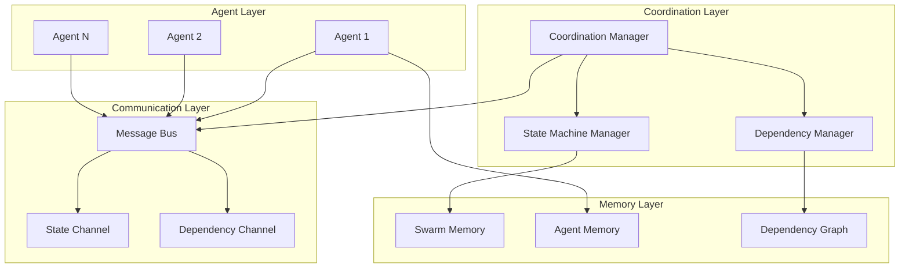
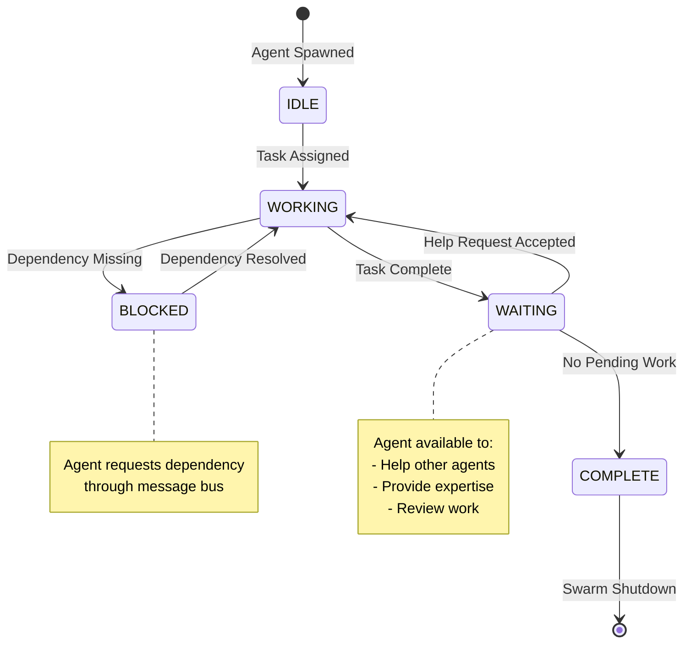
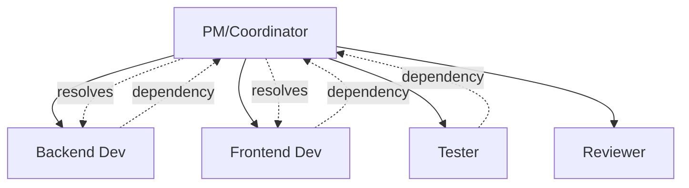
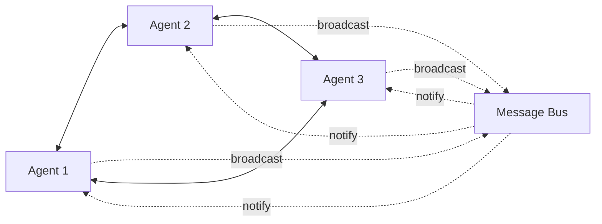
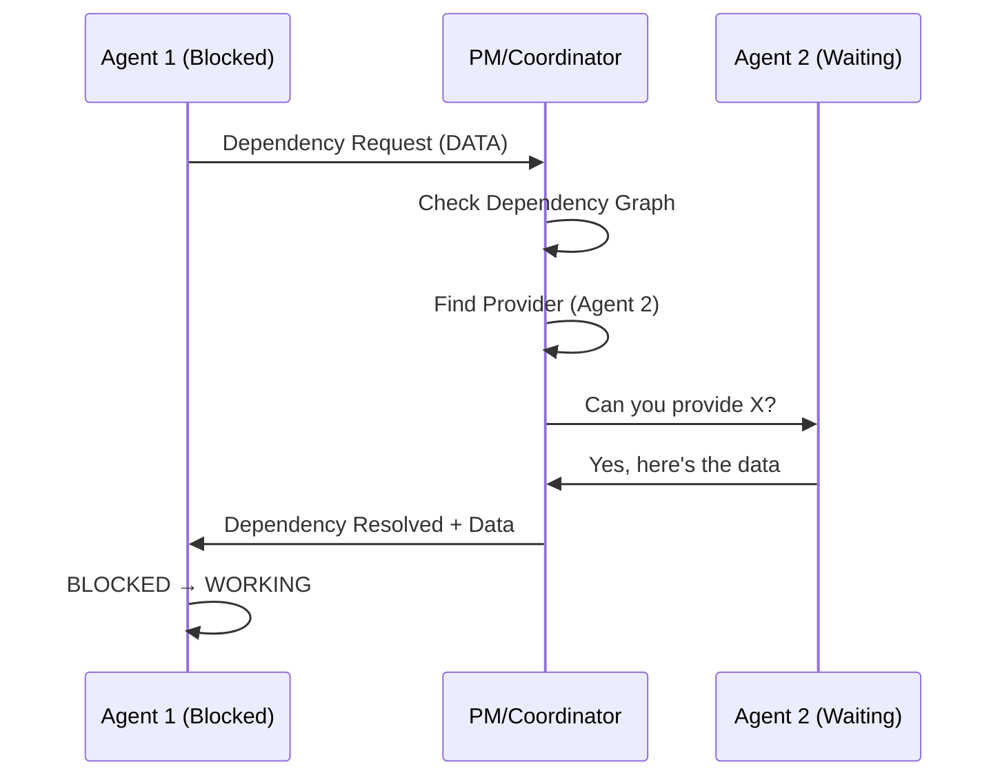
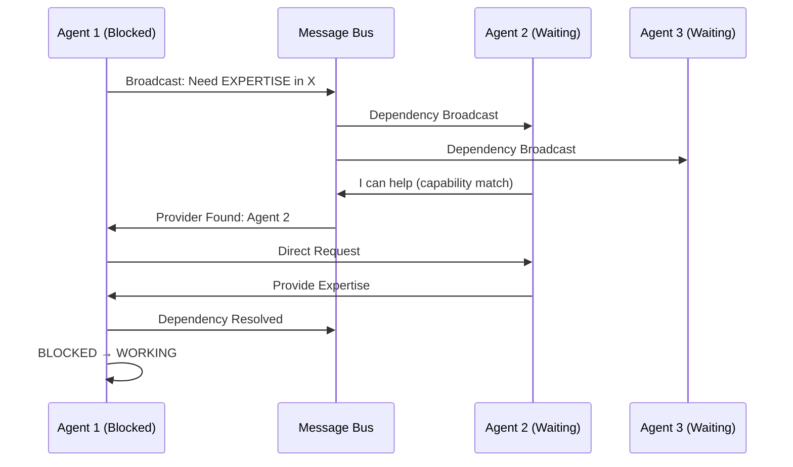
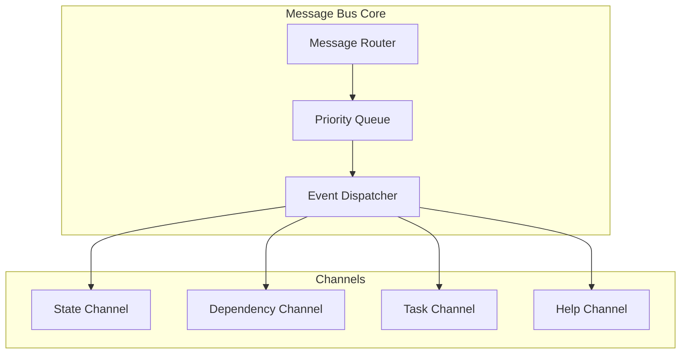
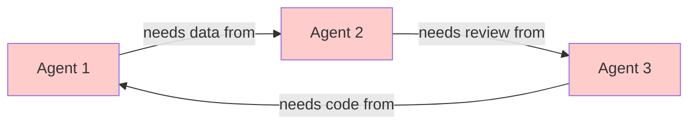

# Agent Coordination System V2 - Architecture

## Executive Summary

This architecture defines a human-team-inspired agent coordination system that enables true dependency resolution, waiting states, and natural completion detection. The system supports both hierarchical (PM-led) and mesh (peer-to-peer) coordination patterns.

## Core Principles

1. **Natural Team Dynamics**: Agents behave like human team members - they work, wait for dependencies, help others, and signal completion
2. **State-Based Lifecycle**: Clear agent states (idle → working → waiting → blocked → complete) drive coordination logic
3. **Dependency-Aware**: Explicit dependency tracking and resolution across hierarchical and mesh topologies
4. **Completion Detection**: Swarm completes when all agents enter waiting mode with no pending dependencies

## System Architecture

### High-Level Overview



## Agent Lifecycle State Machine

### State Definitions

```typescript
enum AgentState {
  IDLE = 'idle',           // Agent spawned, ready for work
  WORKING = 'working',     // Actively executing assigned task
  WAITING = 'waiting',     // Task complete, available to help others
  BLOCKED = 'blocked',     // Waiting for dependencies to resolve
  COMPLETE = 'complete'    // All work done, swarm can check completion
}
```

### State Transition Diagram



### State Transition Rules

| From State | To State | Trigger | Conditions |
|------------|----------|---------|------------|
| IDLE | WORKING | Task assigned | Agent has capacity, task dependencies met |
| WORKING | WAITING | Task completed | Work finished successfully |
| WORKING | BLOCKED | Dependency check | Required dependency not available |
| BLOCKED | WORKING | Dependency resolved | Blocking dependency now available |
| WAITING | WORKING | Help request | Agent accepts assist request from peer |
| WAITING | COMPLETE | Completion check | No pending tasks, no help requests |

## Coordination Patterns

### Hierarchical Coordination (PM/Coordinator Pattern)

**Use Case**: 8+ agents, complex workflows, centralized decision-making



**Responsibilities**:
- **PM/Coordinator**:
  - Receives dependency requests from all agents
  - Matches providers with requesters
  - Orchestrates task sequencing
  - Detects and resolves deadlocks
  - Triggers swarm completion

- **Worker Agents**:
  - Report state changes to PM
  - Request dependencies through PM
  - Accept task reassignments
  - Signal when entering waiting state

### Mesh Coordination (Peer-to-Peer Pattern)

**Use Case**: 2-7 agents, collaborative workflows, distributed decision-making



**Responsibilities**:
- **All Agents** (equal status):
  - Broadcast state changes to message bus
  - Listen for dependency broadcasts
  - Respond to help requests directly
  - Participate in distributed completion detection
  - Self-organize around dependencies

## Dependency Resolution Protocol

### Dependency Types

```typescript
enum DependencyType {
  DATA = 'data',              // Needs data/results from another agent
  EXPERTISE = 'expertise',    // Needs domain knowledge consultation
  RESOURCE = 'resource',      // Needs shared resource access
  APPROVAL = 'approval',      // Needs review/approval to proceed
  SEQUENCE = 'sequence'       // Must wait for task completion
}
```

### Resolution Flow (Hierarchical)



### Resolution Flow (Mesh)



## Swarm Completion Detection

### Completion Algorithm (Hierarchical)

```python
def check_swarm_completion(coordinator):
    """PM/Coordinator runs this check periodically"""

    agents = coordinator.get_all_agents()
    dependency_graph = coordinator.dependency_manager.get_graph()

    # Check 1: All agents in WAITING or COMPLETE state
    all_waiting = all(
        agent.state in [AgentState.WAITING, AgentState.COMPLETE]
        for agent in agents
    )

    if not all_waiting:
        return False

    # Check 2: No pending dependencies in graph
    pending_deps = dependency_graph.get_pending_dependencies()
    if pending_deps:
        return False

    # Check 3: No tasks in queue
    task_queue = coordinator.get_task_queue()
    if task_queue.size() > 0:
        return False

    # All checks passed - swarm complete
    coordinator.initiate_swarm_shutdown()
    return True
```

### Completion Algorithm (Mesh)

```python
def check_swarm_completion_distributed(agent):
    """Each agent runs distributed completion check"""

    # Phase 1: Local state check
    if agent.state != AgentState.WAITING:
        return False

    # Phase 2: Broadcast completion probe
    responses = agent.broadcast_message({
        'type': 'completion_probe',
        'agent_id': agent.id,
        'state': agent.state,
        'pending_dependencies': agent.get_pending_dependencies()
    })

    # Phase 3: Collect responses from all peers
    all_agents_waiting = all(
        response['state'] in ['waiting', 'complete']
        for response in responses
    )

    all_dependencies_resolved = all(
        len(response['pending_dependencies']) == 0
        for response in responses
    )

    # Phase 4: Consensus check (Byzantine agreement)
    if all_agents_waiting and all_dependencies_resolved:
        # Initiate 2-phase commit for swarm shutdown
        agent.initiate_completion_consensus()
        return True

    return False
```

## Communication Patterns

### Message Bus Architecture



### Message Types

```typescript
interface StateChangeMessage {
  type: 'state_change';
  agentId: string;
  fromState: AgentState;
  toState: AgentState;
  timestamp: Date;
  reason?: string;
}

interface DependencyRequestMessage {
  type: 'dependency_request';
  requesterId: string;
  dependencyType: DependencyType;
  requirements: {
    dataType?: string;
    expertise?: string[];
    resourceId?: string;
  };
  urgency: 'low' | 'normal' | 'high' | 'critical';
}

interface DependencyResolutionMessage {
  type: 'dependency_resolution';
  providerId: string;
  requesterId: string;
  dependencyId: string;
  resolution: {
    status: 'resolved' | 'partial' | 'failed';
    data?: any;
    nextSteps?: string[];
  };
}

interface HelpRequestMessage {
  type: 'help_request';
  requesterId: string;
  taskContext: string;
  requiredCapabilities: string[];
  estimatedDuration: number;
}

interface CompletionProbeMessage {
  type: 'completion_probe';
  agentId: string;
  state: AgentState;
  pendingDependencies: string[];
  taskQueueSize: number;
}
```

## Waiting Mode Mechanics

### Waiting Agent Capabilities

When an agent enters WAITING state, it can:

1. **Accept Help Requests**: Assist other agents with tasks matching its capabilities
2. **Provide Dependencies**: Serve as provider for blocked agents
3. **Peer Review**: Review completed work from other agents
4. **Knowledge Sharing**: Answer questions, provide expertise
5. **Resource Monitoring**: Monitor system health, suggest optimizations

### Help Request Matching

```typescript
class WaitingAgentMatcher {
  matchHelpRequest(request: HelpRequestMessage): Agent[] {
    const waitingAgents = this.getAgentsByState(AgentState.WAITING);

    return waitingAgents.filter(agent => {
      // Capability match
      const hasCapabilities = request.requiredCapabilities.every(
        cap => agent.capabilities.includes(cap)
      );

      // Availability check
      const hasCapacity = agent.getCurrentLoad() < agent.maxConcurrentTasks;

      // Context relevance
      const isRelevant = this.calculateRelevanceScore(
        agent.expertise,
        request.taskContext
      ) > 0.6;

      return hasCapabilities && hasCapacity && isRelevant;
    }).sort((a, b) => b.priority - a.priority);
  }
}
```

## Deadlock Detection & Resolution

### Deadlock Scenarios



### Detection Algorithm

```python
class DeadlockDetector:
    def detect_deadlock(self, dependency_graph):
        """Detect circular dependencies using DFS cycle detection"""

        visited = set()
        rec_stack = set()

        def dfs(agent_id):
            visited.add(agent_id)
            rec_stack.add(agent_id)

            # Check all agents this agent depends on
            for dependency in dependency_graph.get_dependencies(agent_id):
                if dependency not in visited:
                    if dfs(dependency):
                        return True
                elif dependency in rec_stack:
                    # Cycle detected - deadlock!
                    self.record_deadlock_cycle(rec_stack)
                    return True

            rec_stack.remove(agent_id)
            return False

        for agent_id in dependency_graph.get_all_agents():
            if agent_id not in visited:
                if dfs(agent_id):
                    return True

        return False
```

### Resolution Strategies

**Hierarchical Pattern**:
1. PM detects deadlock via cycle detection
2. Identifies lowest-priority agent in cycle
3. Cancels blocking dependency for that agent
4. Reassigns task or provides alternative path

**Mesh Pattern**:
1. Agents participate in distributed deadlock detection
2. Use timestamp-based priority resolution
3. Agent with earliest timestamp breaks cycle
4. Broadcasts resolution to all affected agents

## Performance Characteristics

### Scalability Targets

| Metric | Hierarchical | Mesh | Notes |
|--------|-------------|------|-------|
| Max Agents | 50 | 10 | Based on coordination overhead |
| Latency (state change) | <100ms | <50ms | Message propagation time |
| Throughput (messages/sec) | 1000 | 500 | Per message bus instance |
| Completion Detection | O(n) | O(n²) | n = number of agents |
| Memory per Agent | 5MB | 8MB | Includes state + dependencies |

### Optimization Strategies

1. **Lazy Dependency Resolution**: Only resolve when agent actually blocked
2. **Batched State Updates**: Combine multiple state changes in single broadcast
3. **Hierarchical Caching**: PM caches agent capabilities for fast matching
4. **Mesh Gossip Protocol**: Use gossip for non-critical state propagation
5. **Adaptive Polling**: Adjust completion check frequency based on activity

## Integration Points

### Extends Existing Infrastructure

```typescript
// Coordination Manager Enhancement
interface CoordinationManagerV2 extends ICoordinationManager {
  // New methods for V2
  registerStateMachine(agent: Agent): StateMachine;
  handleStateTransition(agent: Agent, newState: AgentState): void;
  resolveDependency(request: DependencyRequest): Promise<Resolution>;
  checkSwarmCompletion(): Promise<boolean>;
}

// SwarmMemory Enhancement
interface SwarmMemoryV2 extends SwarmMemoryManager {
  storeDependencyGraph(graph: DependencyGraph): Promise<void>;
  loadDependencyGraph(): Promise<DependencyGraph>;
  recordStateTransition(agent: Agent, transition: StateTransition): Promise<void>;
}

// Message Bus Enhancement
interface MessageBusV2 {
  createChannel(name: string, type: ChannelType): Channel;
  broadcastToChannel(channel: string, message: Message): void;
  subscribeToChannel(channel: string, handler: MessageHandler): void;
  enablePriorityRouting(enabled: boolean): void;
}
```

## Migration Path

### Phase 1: Core State Machine (Week 1)
- Implement AgentState enum and transitions
- Build StateMachineManager
- Add state tracking to SwarmMemory

### Phase 2: Dependency System (Week 2)
- Implement DependencyManager
- Build dependency graph data structure
- Add dependency resolution protocols

### Phase 3: Message Bus Channels (Week 3)
- Create specialized channels (state, dependency, help)
- Implement priority routing
- Add message persistence

### Phase 4: Completion Detection (Week 4)
- Implement hierarchical completion algorithm
- Build mesh distributed completion
- Add deadlock detection

### Phase 5: Waiting Mode (Week 5)
- Implement help request matching
- Build peer review system
- Add knowledge sharing features

### Phase 6: Testing & Optimization (Week 6)
- Integration tests for all patterns
- Performance benchmarking
- Production hardening

## Next Steps

See `TECHNICAL_SPECS.md` for:
- Detailed data structures
- API contracts
- Memory schemas
- Performance benchmarks
- Implementation examples
