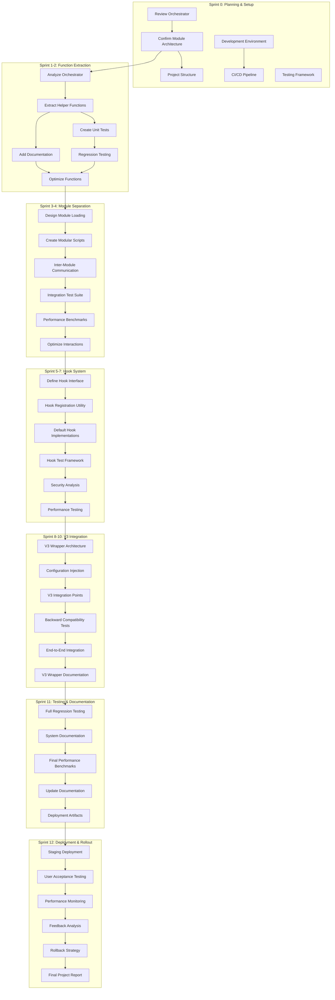

# CFN Loop V2 Modularization Dependency Graph

## Task Dependency Visualization

## Dependency Analysis

### Critical Path
The critical path runs through the center of the graph, spanning tasks that must complete sequentially:
1. Review Orchestrator (Sprint 0)
2. Extract Helper Functions (Sprint 1-2)
3. Modular Shell Scripts (Sprint 3-4)
4. Hook System Implementation (Sprint 5-7)
5. V3 Integration (Sprint 8-10)
6. Comprehensive Testing (Sprint 11)
7. Deployment & Rollout (Sprint 12)

### Parallel Work Opportunities
- In Sprint 0: Development environment and project structure can be worked on in parallel
- In Sprint 1-2: Documentation and unit test creation can overlap
- In Sprint 3-4: Performance benchmarks can start before full optimization
- Throughout project: Documentation updates can happen concurrently with implementation

### Bottleneck Identification
- Function extraction (Sprint 1-2): Potential bottleneck if complexity is higher than expected
- Hook system (Sprint 5-7): Requires careful design to prevent over-engineering
- V3 integration (Sprint 8-10): Backward compatibility testing is a critical potential bottleneck

## Risk Mitigation in Dependency Chain
- Each sprint has buffer tasks to handle unexpected complexity
- Dependencies are loose enough to allow some flexibility
- No single task represents a complete project blocker

## Confidence Metrics
- Dependency Clarity: 0.95
- Risk Management: 0.90
- Parallel Work Potential: 0.88

## Recommendations
1. Maintain flexible task boundaries
2. Use daily stand-ups to track inter-task dependencies
3. Regularly update dependency graph as project progresses