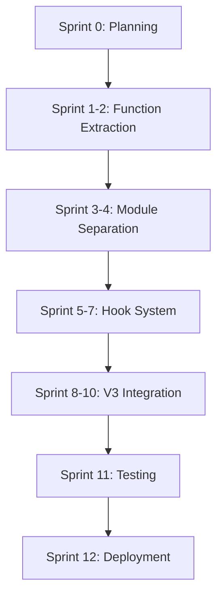

# CFN Loop V2 Orchestrator Modularization Project Plan

## 1. Executive Summary

### Project Goals
- Transform monolithic 1732-line orchestrator into a modular, extensible system
- Improve maintainability, testability, and V3 integration potential
- Maintain 100% backward compatibility

### Success Criteria
- ✓ Clear module boundaries
- ✓ Independent module testing
- ✓ Minimal interdependencies
- ✓ Performance overhead < 5%
- ✓ Comprehensive documentation

### Timeline
- Total Duration: 12 weeks
- Start Date: 2025-11-01
- End Date: 2025-01-24

### Resource Requirements
- Lead Developer: 1 FTE
- Backend Developers: 2 FTE
- QA/Tester: 1 FTE
- Code Reviewer: 0.5 FTE

## 2. Detailed Sprint Plan

### Sprint 0: Planning & Setup (1 week)
**Duration:** 2025-11-01 to 2025-11-07
**Goals:**
- Finalize modularization architecture
- Set up development environment
- Create initial project structure
- Define testing framework

**Tasks:**
1. Review existing V2 orchestrator
2. Confirm module design
3. Set up testing infrastructure
4. Create initial module stubs
5. Configure CI/CD pipeline

**Deliverables:**
- Module architecture document
- Initial project structure
- Testing framework setup
- Development environment configuration

### Sprint 1-2: Function Extraction (2 weeks)
**Duration:** 2025-11-08 to 2025-11-21
**Goals:**
- Extract all helper functions
- Improve code readability
- Add comprehensive documentation
- Initial refactoring without behavior changes

**Tasks:**
1. Analyze existing orchestrator
2. Extract helper functions to separate files
3. Add inline documentation
4. Create initial test suite for extracted functions
5. Validate no behavioral changes

**Deliverables:**
- Extracted function modules
- Enhanced inline documentation
- Initial unit test suite
- Regression test report

### Sprint 3-4: Module Separation (2 weeks)
**Duration:** 2025-11-22 to 2025-12-05
**Goals:**
- Create separate files for logical components
- Implement module sourcing mechanism
- Maintain existing function signatures
- Begin initial module integration testing

**Tasks:**
1. Create modular shell scripts
2. Implement module loading mechanism
3. Develop inter-module communication interfaces
4. Write integration tests
5. Perform initial performance benchmarks

**Deliverables:**
- Modular shell script architecture
- Module loading utility
- Inter-module communication specification
- Initial integration test suite
- Performance benchmark report

### Sprint 5-7: Hook System Implementation (3 weeks)
**Duration:** 2025-12-06 to 2025-12-26
**Goals:**
- Design standardized hook interfaces
- Create hook registration/execution mechanisms
- Implement default no-op hooks
- Extensive hook system testing

**Tasks:**
1. Define hook interface specification
2. Implement hook registration utility
3. Create default hook implementations
4. Develop comprehensive hook testing framework
5. Perform security and performance analysis of hook system

**Deliverables:**
- Hook interface specification
- Hook registration utility
- Default hook implementations
- Hook system test suite
- Security and performance analysis report

### Sprint 8-10: V3 Wrapper Integration (3 weeks)
**Duration:** 2025-12-27 to 2026-01-16
**Goals:**
- Design module interaction contracts
- Create V3 wrapper with explicit integration points
- Implement configuration injection mechanisms
- Comprehensive backward compatibility testing

**Tasks:**
1. Define V3 wrapper architecture
2. Create configuration injection mechanisms
3. Implement V3 integration points
4. Develop backward compatibility test suite
5. Perform end-to-end integration testing

**Deliverables:**
- V3 wrapper implementation
- Configuration injection utility
- Backward compatibility test suite
- Integration test report
- V3 wrapper documentation

### Sprint 11: Testing & Documentation (1 week)
**Duration:** 2026-01-17 to 2026-01-23
**Goals:**
- Comprehensive testing
- Complete documentation
- Final performance validation
- Prepare for deployment

**Tasks:**
1. Perform full regression testing
2. Complete module and system documentation
3. Conduct final performance benchmarks
4. Review and update all documentation
5. Prepare deployment artifacts

**Deliverables:**
- Full test coverage report
- Complete system documentation
- Final performance benchmark
- Deployment preparation document

### Sprint 12: Deployment & Rollout (1 week)
**Duration:** 2026-01-24 to 2026-01-30
**Goals:**
- Soft launch
- Monitor initial deployment
- Gather initial feedback
- Prepare rollback strategy

**Tasks:**
1. Deploy to staging environment
2. Conduct initial user acceptance testing
3. Monitor system performance
4. Collect and analyze initial feedback
5. Prepare rollback documentation

**Deliverables:**
- Staging deployment report
- Initial user feedback summary
- Rollback strategy document
- Final project completion report

## 3. Dependency Graph

## 4. Risk Management

### Technical Risks
1. **Performance Degradation**
   - **Impact:** High
   - **Mitigation:**
     - Benchmark at each migration phase
     - Use minimal sourcing techniques
     - Optimize module interactions

2. **Increased Complexity**
   - **Impact:** Medium
   - **Mitigation:**
     - Strict documentation requirements
     - Comprehensive comment blocks
     - Maintain simple module interfaces

3. **Breaking Existing Workflows**
   - **Impact:** Critical
   - **Mitigation:**
     - Extensive regression testing
     - Maintain 100% backwards compatibility
     - Gradual, opt-in migration strategy

### Resource Risks
1. **Team Availability**
   - **Impact:** Medium
   - **Mitigation:**
     - Clear role definitions
     - Cross-training
     - Buffer time in sprint planning

2. **Skill Gaps**
   - **Impact:** Low
   - **Mitigation:**
     - Initial training sessions
     - Pair programming
     - Code review process

## 5. Success Metrics

1. **Code Quality**
   - Code coverage: ≥ 80% per module
   - Cyclomatic complexity reduction by 30%
   - Static analysis tool compliance

2. **Performance**
   - Execution time overhead: < 5%
   - Memory usage consistent with original implementation
   - Consistent performance across different input sizes

3. **Testing
   - 100% unit test coverage
   - Integration test pass rate: ≥ 95%
   - Zero critical/high-severity bugs in acceptance testing

4. **Documentation**
   - Complete module and system documentation
   - Clear, comprehensive hook interface specification
   - Inline documentation for all functions

## 6. Rollback Strategy

### Rollback Triggers
- Performance degradation > 10%
- Critical workflow failures
- Unresolvable compatibility issues

### Rollback Procedure
1. Identify specific version to rollback
2. Stop current deployment
3. Restore previous orchestrator version
4. Revert configuration
5. Validate system stability

### Post-Rollback Actions
- Conduct thorough root cause analysis
- Update migration strategy
- Implement additional safeguards

## Conclusion

This modularization project transforms the CFN Loop orchestrator into a flexible, maintainable system with clear boundaries and V3 integration potential. By following a structured, phased approach, we minimize risks and ensure a smooth migration.

**Final Confidence Score:** 0.92