# Sprint Orchestrator - Quick Reference

## Component Summary

### Core Architecture Layers

```
EpicOrchestrator (Loop 0)
  ↓
PhaseOrchestrator (manages Phase 0 → Phase N)
  ↓
SprintOrchestrator (manages Sprint 1 → Sprint M) ← NEW LAYER
  ↓
CFNLoopIntegrator (Loop 2/3)
  ↓
Agent Swarms (primary + validators)
```

---

## Key Components

### 1. Dependency Graph Builder
- **Purpose:** Build and validate sprint dependency graph
- **Features:**
  - Cycle detection (DFS algorithm)
  - Topological ordering
  - Missing dependency detection
- **Output:** Execution order for sprints

### 2. Auto-Agent Assignment Engine
- **Purpose:** Automatically assign agents based on task patterns
- **Rules:**
  - Pattern matching on sprint description
  - Priority-based selection
  - Default fallback (coder, tester, reviewer)
- **Agent Types:**
  - backend-dev, frontend-dev, security-specialist
  - tester, reviewer, system-architect
  - devops-engineer, perf-analyzer, api-docs

### 3. Checkpoint Validator
- **Purpose:** Validate sprint completion before dependent sprints execute
- **Criteria:**
  - ✅ Tests pass
  - ✅ Coverage ≥80%
  - ✅ No critical issues
  - ✅ Confidence ≥75%
  - ✅ Dependencies satisfied
  - ✅ Custom validation (optional)

### 4. Sprint Execution Engine
- **Purpose:** Execute sprints with retry and feedback
- **Features:**
  - 10 retry iterations per sprint
  - Feedback injection on failure
  - Parallel execution (where dependencies allow)
  - Circuit breaker integration

### 5. Progress Tracker
- **Purpose:** Real-time markdown status updates
- **Status Emoji:**
  - ❌ = Failed
  - 🔄 = In Progress
  - ✅ = Completed
- **Updates:** Direct file modification

### 6. Memory Namespace Manager
- **Purpose:** Hierarchical result storage
- **Structure:**
  ```
  epic/{epic-id}/
    phase-{N}/
      sprint-{M}/
        agent-{type}/
        consensus/
        metadata/
  ```

---

## Workflow

```mermaid
graph TB
    A[PhaseOrchestrator] --> B{Has Sprints?}
    B -->|Yes| C[SprintOrchestrator]
    B -->|No| D[CFNLoopIntegrator]

    C --> E[Build Dependency Graph]
    E --> F[Detect Cycles]
    F --> G[Compute Topological Order]
    G --> H[For Each Sprint]

    H --> I[Check Dependencies]
    I -->|Satisfied| J[Auto-Assign Agents]
    I -->|Not Satisfied| K[Skip Sprint]

    J --> L[Update Status: 🔄]
    L --> M[Execute via CFNLoopIntegrator]

    M --> N[Validate Checkpoint]
    N -->|Pass| O[Update Status: ✅]
    N -->|Fail| P{Retry < 10?}

    P -->|Yes| Q[Inject Feedback]
    Q --> M
    P -->|No| R[Update Status: ❌]

    O --> S[Store Results in Memory]
    R --> T[Mark Sprint Failed]

    S --> U{More Sprints?}
    T --> U
    U -->|Yes| H
    U -->|No| V[Return Result]
```



---

## Interface Quick Reference

### Sprint Definition
```typescript
interface Sprint {
  id: string;
  order: number;
  name: string;
  description: string;
  dependsOn: string[];
  sourceFile?: string;
  checkpointCriteria: CheckpointCriteria;
  agentAssignment: 'auto' | AgentConfig[];
}
```

### Checkpoint Criteria
```typescript
interface CheckpointCriteria {
  testsPass: boolean;
  minCoverage: number;           // 80
  noCriticalIssues: boolean;
  minConfidence: number;          // 0.75
  dependenciesSatisfied: boolean;
  customValidation?: (result: PhaseResult) => Promise<boolean>;
}
```

### Agent Assignment
```typescript
interface AgentConfig {
  agentId: string;
  agentType: string;
  role: 'primary' | 'validator';
  instructions: string;
}
```

### Orchestrator Result
```typescript
interface SprintOrchestratorResult {
  success: boolean;
  totalSprints: number;
  completedSprints: string[];
  failedSprints: string[];
  sprintResults: Map<string, PhaseResult>;
  totalDuration: number;
  timestamp: number;
}
```

---

## Usage Example

### Phase with Sprints (JSON)
```json
{
  "id": "phase-1",
  "name": "Authentication Implementation",
  "description": "Implement JWT authentication system",
  "dependsOn": [],
  "file": "./planning/phase-1-sprints.json",
  "completionCriteria": {
    "minConsensusScore": 0.9,
    "requiredDeliverables": ["auth-service", "jwt-middleware", "tests"]
  }
}
```

### Sprints File (phase-1-sprints.json)
```json
{
  "sprints": [
    {
      "id": "sprint-1-1",
      "name": "JWT Token Service",
      "description": "Implement JWT token generation and validation",
      "dependencies": [],
      "suggestedAgentTypes": ["backend-dev", "security-specialist"],
      "checkpoints": {
        "testsPass": true,
        "minCoverage": 85,
        "minConfidence": 0.75
      }
    },
    {
      "id": "sprint-1-2",
      "name": "Auth Middleware",
      "description": "Implement authentication middleware",
      "dependencies": ["sprint-1-1"],
      "suggestedAgentTypes": ["backend-dev", "tester"]
    }
  ]
}
```

### Markdown Format (Alternative)
```markdown
# Phase 1: Authentication Implementation

## Sprints

### Sprint 1.1: JWT Token Service
**Status:** ✅
**Dependencies:** None
**Description:** Implement JWT token generation and validation

### Sprint 1.2: Auth Middleware
**Status:** 🔄
**Dependencies:** Sprint 1.1
**Description:** Implement authentication middleware

### Sprint 1.3: Integration Tests
**Status:** ❌
**Dependencies:** Sprint 1.1, Sprint 1.2
**Description:** End-to-end authentication tests
```

---

## Auto-Agent Assignment Rules

| Task Pattern | Assigned Agents | Priority |
|--------------|-----------------|----------|
| `/auth\|jwt\|oauth\|security/i` | backend-dev, security-specialist, tester | 10 |
| `/ui\|frontend\|react\|vue/i` | frontend-dev, ui-designer, tester | 9 |
| `/api\|endpoint\|rest\|graphql/i` | backend-dev, api-docs, tester | 8 |
| `/database\|schema\|migration/i` | backend-dev, system-architect, tester | 8 |
| `/refactor\|optimize\|performance/i` | coder, perf-analyzer, reviewer, tester | 7 |
| `/test\|coverage\|validation/i` | tester, reviewer | 6 |
| `/deploy\|ci-cd\|pipeline/i` | devops-engineer, cicd-engineer, tester | 9 |
| Default | coder, tester, reviewer | 1 |

---

## Integration Points

### PhaseOrchestrator Integration
```typescript
// In PhaseOrchestrator.executePhase()
if (phase.sprints || phase.file) {
  // Use SprintOrchestrator
  const sprintOrchestrator = new SprintOrchestrator({
    phaseId: phase.id,
    sprints: phase.sprints || await loadSprintsFromFile(phase.file),
    phaseContext: context,
  });

  return await sprintOrchestrator.executeAllSprints(context);
} else {
  // Use existing CFNLoopOrchestrator
  return await cfnLoopOrchestrator.executePhase(phaseTask);
}
```

### CFNLoopIntegrator Integration
```typescript
// SprintOrchestrator uses CFNLoopIntegrator for each sprint
private async executeSprint(sprint: Sprint): Promise<PhaseResult> {
  const loopIntegrator = new CFNLoopIntegrator({
    maxIterations: 5,
    consensusThreshold: 0.9,
    enableFeedbackInjection: true,
  });

  // Execute Loop 2/3 for this sprint
  return await loopIntegrator.executePhase(sprintTask);
}
```

---

## Performance Optimizations

### Parallel Execution
```typescript
// Group sprints by dependency level
const levels = computeDependencyLevels();

for (const level of levels) {
  // Execute all sprints in parallel
  const promises = level.map(sprint => executeSprintWithRetry(sprint));
  const results = await Promise.allSettled(promises);
}
```

### Memory Caching
- Dependency results cached to avoid repeated lookups
- Agent assignment rules compiled once at startup
- Markdown status updates batched (if multiple sprints in same file)

### Resource Management
- Circuit breaker prevents infinite loops
- Memory cleanup after sprint completion
- File handle pooling for markdown updates

---

## Error Handling

| Error Type | Detection | Recovery |
|------------|-----------|----------|
| Circular Dependency | DFS cycle detection | Initialization fails, fix required |
| Missing Dependency | Dependency check | Skip sprint, continue with independent sprints |
| Checkpoint Failure | Multi-criteria validation | Retry up to 10 times with feedback |
| Markdown Not Found | File I/O error | Log warning, continue (non-critical) |
| Agent Assignment Fail | No matching rules | Use default agents (coder, tester, reviewer) |

---

## Monitoring Metrics

### Sprint-Level
- Sprint execution time (p50, p95, p99)
- Sprint retry rate
- Checkpoint validation pass rate
- Agent assignment distribution

### Phase-Level
- Total sprints per phase
- Parallel execution efficiency
- Dependency graph depth

### System-Level
- Memory namespace growth
- Markdown update latency
- Feedback injection effectiveness

---

## Key Design Decisions

### 1. Why 10 Retry Iterations?
- **Consistency** with Loop 2 max iterations
- **Predictable** behavior across all orchestration layers
- **Reuses** existing feedback injection machinery

### 2. Why Auto-Agent Assignment?
- **Reduces** configuration overhead (no manual agent setup)
- **Ensures** consistent agent selection
- **Allows** domain-specific optimization rules

### 3. Why Checkpoint Validation?
- **Prevents** cascading failures
- **Ensures** stable incremental progress
- **Maintains** high quality throughout execution

### 4. Why Markdown Status Updates?
- **Zero-overhead** progress tracking
- **Works** with existing markdown workflows
- **Version-controllable** progress history

### 5. Why Hierarchical Memory?
- **Enables** cross-sprint queries
- **Facilitates** epic-level analytics
- **Simplifies** garbage collection

---

## Testing Strategy

### Unit Tests
- Dependency graph building (cycle detection, topological order)
- Auto-agent assignment (pattern matching, fallback)
- Checkpoint validation (multi-criteria, custom functions)

### Integration Tests
- Sprint execution with dependencies
- Parallel sprint execution
- Checkpoint failure and retry
- Feedback injection

### End-to-End Tests
- Full phase with sprints
- Markdown status updates
- Memory namespacing
- Phase result aggregation

---

## Migration Path

1. **Deploy** SprintOrchestrator alongside PhaseOrchestrator
2. **Opt-in** Convert select phases to use sprints
3. **Validate** Monitor performance and reliability
4. **Expand** Convert more phases to use sprints
5. **Default** Make sprints the default for new phases

**Backward Compatibility:** Phases without sprints continue using CFNLoopOrchestrator directly.

---

## Future Enhancements

### 1. Dynamic Sprint Generation
AI-powered sprint breakdown from phase description

### 2. Sprint Cost Estimation
ML-based prediction of execution time and resources

### 3. Adaptive Checkpoints
Dynamically adjust thresholds based on sprint criticality

### 4. Cross-Phase Sprint Dependencies
Allow sprints to depend on sprints from other phases

### 5. Sprint Templates
Predefined sprint configurations for common tasks

---

## Quick Commands

```bash
# Initialize SprintOrchestrator
const orchestrator = new SprintOrchestrator({
  phaseId: 'phase-1',
  sprintsFile: './planning/phase-1-sprints.json',
  phaseContext: context,
});

# Load and execute
await orchestrator.initialize();
const result = await orchestrator.executeAllSprints(context);

# Check results
console.log(`Completed: ${result.completedSprints.length}`);
console.log(`Failed: ${result.failedSprints.length}`);
```

---

## Summary

**SprintOrchestrator** adds fine-grained task orchestration within phases:

✅ **Dependency-aware execution** (topological ordering, cycle detection)
✅ **Auto-agent assignment** (rule-based intelligent selection)
✅ **Checkpoint validation** (multi-criteria quality gates)
✅ **Feedback-driven retry** (10 iterations with feedback injection)
✅ **Real-time progress** (markdown status updates ❌→🔄→✅)
✅ **Hierarchical memory** (`epic/{id}/phase-{N}/sprint-{M}`)
✅ **Parallel execution** (dependency-level parallelism)
✅ **Backward compatible** (opt-in via `sprints` or `file` field)

**Complete integration** with existing CFN Loop architecture while adding sprint-level granularity.
