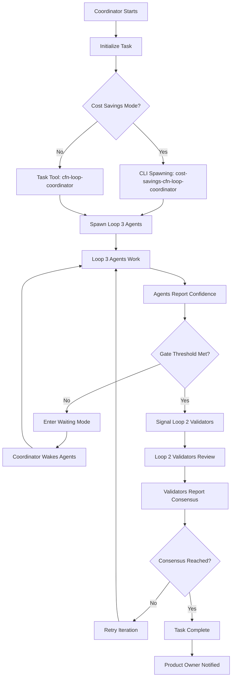
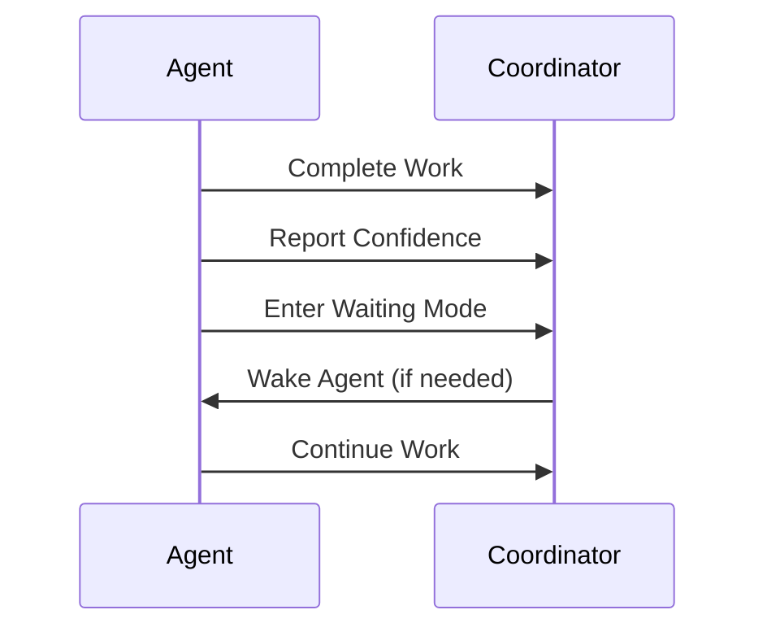
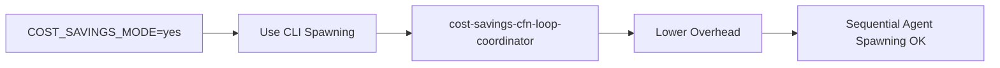

# CFN Loop Flow Diagram (v2)

## Orchestration Flow Overview

## V2 Key Differences from V1

### Coordination Primitives
- **V1:** Polling-based coordination
- **V2:** Zero-token BLPOP waiting mode

### Agent Synchronization
- **V1:** Manual task signaling
- **V2:** Explicit Redis-based dependency management

### Iteration Management
- **V1:** Linear progression
- **V2:** Dynamic, context-aware iteration with adaptive thresholds

## Waiting Mode Protocol

## Cost-Savings Mode Workflow

## Best Practices

1. Use `orchestrate-cfn-loop.sh` for all multi-agent workflows
2. Implement comprehensive error handling
3. Validate consensus thresholds
4. Use parallel spawning for coordinator-based workflows

## References
- Redis Coordination Skill: `.claude/skills/redis-coordination/SKILL.md`
- CFN Loop Validation Skill: `.claude/skills/cfn-loop-validation/SKILL.md`
