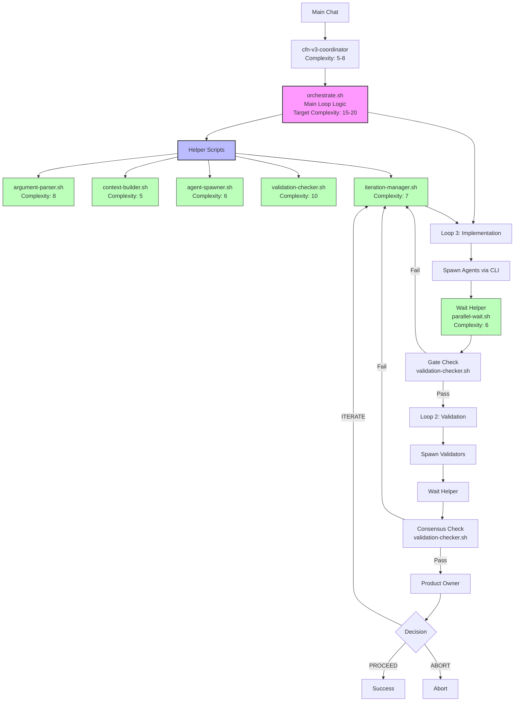
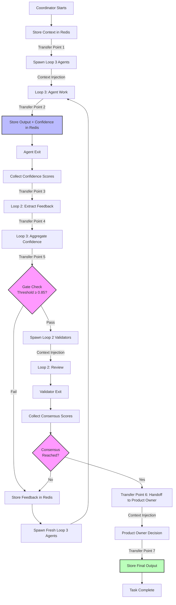
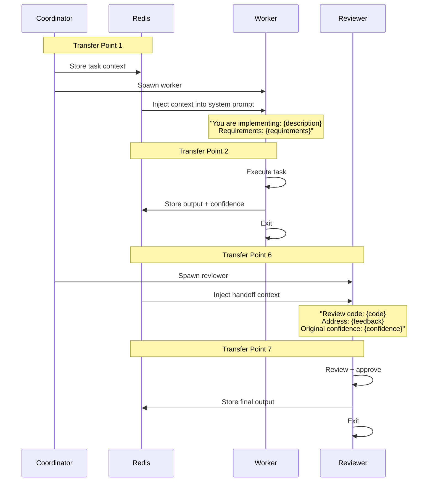
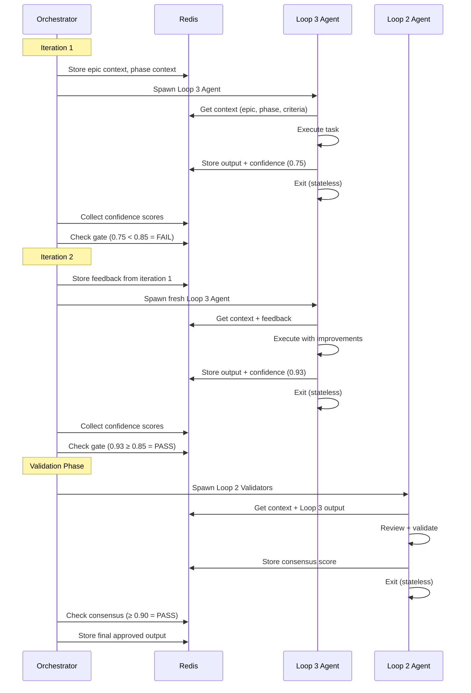
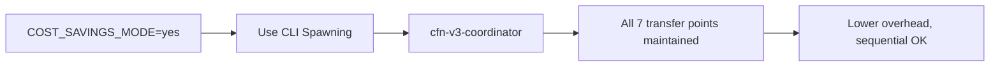

# CFN Loop Flow Diagram (v3)

## Ideal Low-Complexity Structure



## Complexity Reduction Breakdown

**Current State (orchestrate.sh):**
- Total complexity: ~45
- Monolithic script with all logic inline

**Target State (modular):**
- orchestrate.sh: 15-20 (main loop + coordination)
- Helper scripts: 5-10 each (focused, single responsibility)
- Total system complexity: ~60 (distributed, maintainable)

**Key Improvements:**
1. **Argument parsing**: Extracted → argument-parser.sh (complexity 8)
2. **Agent spawning**: Extracted → agent-spawner.sh (complexity 6)
3. **Waiting logic**: Extracted → parallel-wait.sh (complexity 6)
4. **Validation**: Unified → validation-checker.sh (complexity 10)
5. **Context building**: Extracted → context-builder.sh (complexity 5)
6. **Iteration management**: Extracted → iteration-manager.sh (complexity 7)

**Benefits:**
- Each script testable in isolation
- Reusable across different coordinators
- Easier to understand and maintain
- Lower cognitive load per file

## Complete Data Flow Pipeline



## 7 Critical Data Transfer Points

### Transfer Point 1: Coordinator → Worker
**Data**: Task context (description, requirements, priority)
**Storage**: `Redis → task:{taskId}:assignment`
**Validation**: Context fields preserved (taskId, description, requirements[], priority)

```javascript
{
  taskId: "task-001",
  description: "Implement authentication",
  requirements: ["JWT", "Password hashing"],
  priority: "high"
}
```

### Transfer Point 2: Worker → Redis
**Data**: Worker output (code, files, confidence)
**Storage**: `Redis → task:{taskId}:output`
**Validation**: Code, files, confidence all stored correctly

```javascript
{
  workerId: "worker-001",
  code: "function authenticate() {...}",
  files: ["auth.js", "session.js"],
  confidence: 0.92,
  completedAt: timestamp
}
```

### Transfer Point 3: Redis → Loop2
**Data**: Feedback extraction
**Storage**: `Redis → task:{taskId}:loop2`
**Validation**: Confidence preserved through extraction

```javascript
{
  critical: ["Add input validation"],
  warnings: ["Consider rate limiting"],
  suggestions: ["Add 2FA support"],
  extractedConfidence: 0.92
}
```

### Transfer Point 4: Loop2 → Loop3
**Data**: Confidence aggregation
**Storage**: `Redis → task:{taskId}:loop3`
**Validation**: Aggregated confidence matches input

```javascript
{
  aggregatedConfidence: 0.92,
  consensusReached: true,
  reviewerCount: 3
}
```

### Transfer Point 5: Loop3 → Gate Check
**Data**: Validation against threshold
**Storage**: `Redis → gate:{taskId}`
**Validation**: Pass/fail correctly determined

```javascript
{
  passed: true,
  threshold: 0.85,
  actualConfidence: 0.92
}
```

### Transfer Point 6: Worker → Reviewer
**Data**: Handoff with full context
**Storage**: `Redis → handoff:{taskId}:reviewer`
**Validation**: Task ID, code, feedback, confidence all transferred

```javascript
{
  taskId: "task-001",
  code: "function authenticate() {...}",
  feedback: ["Add input validation"],
  originalConfidence: 0.92
}
```

### Transfer Point 7: Reviewer → Final Storage
**Data**: Final output with approval
**Storage**: `Redis/SQLite → task:{taskId}:final`
**Validation**: Approval status, updated confidence stored

```javascript
{
  approved: true,
  reviewerConfidence: 0.95,
  mergedToMain: true
}
```

## Prompt Injection Points



## V3 Stateless Agent Protocol



## Redis Key Schema

### Context Storage
```
swarm:{taskId}:epic-context          # Epic-level context
swarm:{taskId}:phase-context         # Phase-level context
swarm:{taskId}:success-criteria      # Success criteria
```

### Task Execution
```
task:{taskId}:assignment             # Worker assignment + context
task:{taskId}:output                 # Worker output + confidence
task:{taskId}:loop2                  # Loop2 feedback extraction
task:{taskId}:loop3                  # Loop3 confidence aggregation
```

### Validation
```
gate:{taskId}                        # Gate check result
handoff:{taskId}:reviewer            # Reviewer handoff context
task:{taskId}:final                  # Final approved output
```

## Confidence Flow Through Pipeline

```
Worker Output (0.92)
    ↓
Loop 2 Extraction (0.92 preserved)
    ↓
Loop 3 Aggregation (0.92 consensus)
    ↓
Gate Check (0.92 ≥ 0.85 = PASS)
    ↓
Reviewer Validation (→ 0.95 improved)
    ↓
Final Storage (0.95 approved)
```

## Context Preservation Chain

```
Coordinator Context
  ├─ taskId: "auth-implementation"
  ├─ description: "Implement user authentication"
  ├─ requirements: ["JWT", "Password hashing", "Sessions"]
  └─ priority: "high"
        ↓ Transfer Point 1
Worker Receives Context (injected into prompt)
        ↓ Transfer Point 2
Worker Output + Original Context
        ↓ Transfer Points 3-5
Loop2/Loop3/Gate (context maintained)
        ↓ Transfer Point 6
Reviewer Receives Full Context (injected into prompt)
  ├─ Original task context
  ├─ Worker code
  ├─ Loop2 feedback
  └─ Confidence scores
        ↓ Transfer Point 7
Final Storage (complete history)
```

## Mode Comparison

| Mode | Gate Threshold | Consensus | Transfer Points | Iterations |
|------|---------------|-----------|-----------------|------------|
| MVP | 0.70 | 0.80 | All 7 | Max 10 |
| Standard | 0.75 | 0.90 | All 7 | Max 10 |
| Enterprise | 0.75 | 0.95 | All 7 | Max 10 |

## V3 Key Differences from V2

### Agent Lifecycle
- **V2**: Stateful (agents enter waiting mode, woken for iterations)
- **V3**: Stateless (agents exit after work, fresh spawn per iteration)

### Context Management
- **V2**: Context passed during wake signal
- **V3**: Context stored in Redis, retrieved on spawn with prompt injection

### Data Flow
- **V2**: Context held in agent memory across iterations
- **V3**: Context persisted in Redis, retrieved at each spawn, injected into prompts

### Coordination
- **V2**: BLPOP-based waiting mode (zero-token blocking)
- **V3**: Exit-based coordination (no blocking, fresh spawn)

### Iteration Management
- **V2**: Wake existing agents with feedback
- **V3**: Spawn fresh agents, inject feedback from Redis into prompts

## Testing Data Flow

```bash
# Test confidence score flow
npm run test:cfn-v3:confidence

# Test complete data transfer pipeline (7 points)
npm run test:cfn-v3:dataflow

# Test all orchestration + data flow
npm run test:cfn-v3
```

**Metrics Validated**:
- `cfnDataTransferPoints`: 7/7 successful transfers
- `cfnDataLossPoints`: 0 (no corruption)
- `cfnContextPreserved`: 2/2 (task + handoff)
- `cfnPromptInjections`: 1+ (context in prompts)
- `cfnConfidenceScoresPassed`: All scores stored
- `cfnConfidenceScoresRetrieved`: All scores retrieved
- `cfnGateCheckPassed`: Correct pass/fail logic
- `cfnAverageConfidence`: Accurate calculation

## Cost-Savings Mode



All data transfer points function identically in cost-savings mode.

## Best Practices

1. **Context Storage**: Store complete context in Redis before spawning agents
2. **Stateless Agents**: Agents exit after work, retrieve context on spawn
3. **Prompt Injection**: Context automatically injected into agent system prompts
4. **Confidence Tracking**: Preserve confidence through all 7 transfer points
5. **Gate Validation**: Verify threshold before advancing to Loop 2
6. **Clean Handoffs**: Transfer full context (task + code + feedback + confidence)
7. **Final Storage**: Include complete history (original context + all iterations)

## References

- Data Flow Map: `tests/cfn-v3-orchestration/DATA-FLOW-MAP.md`
- CFN Loop Orchestration: `.claude/skills/cfn-loop-orchestration/SKILL.md`
- Coordination: `.claude/skills/cfn-loop-orchestration-v2/SKILL.md` (replaces deprecated cfn-redis-coordination)
- Test Suite: `tests/cfn-v3-orchestration/README.md`
