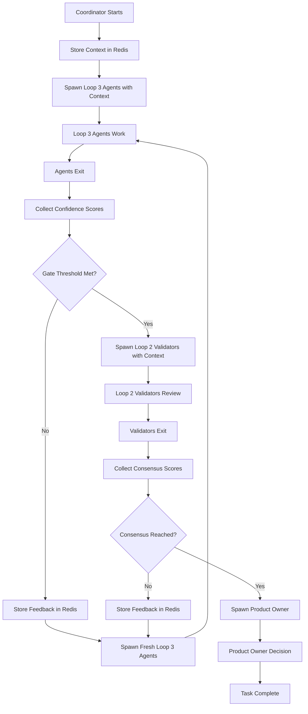
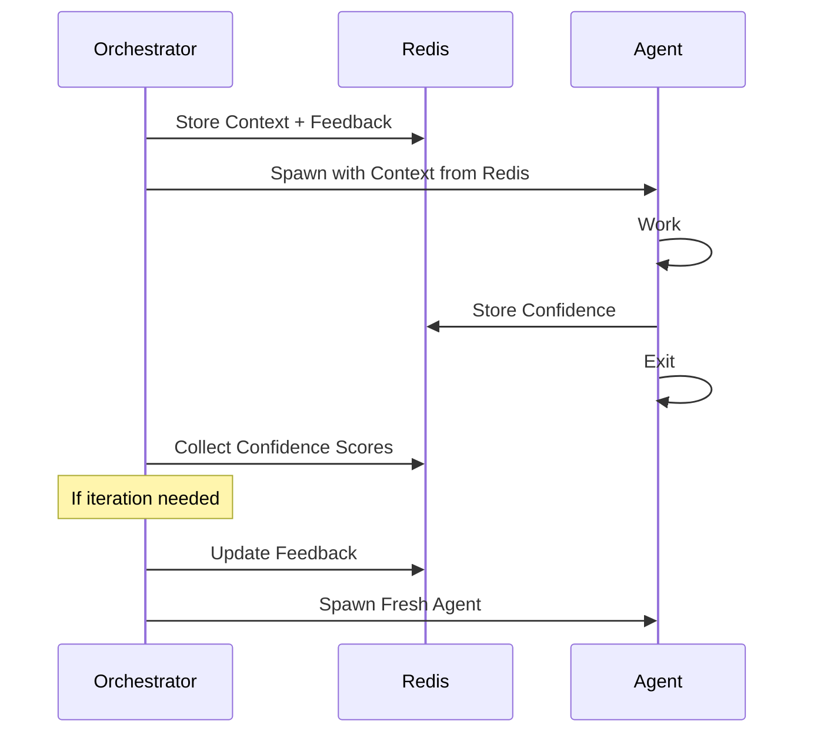
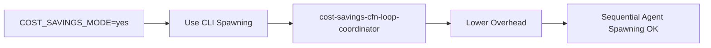
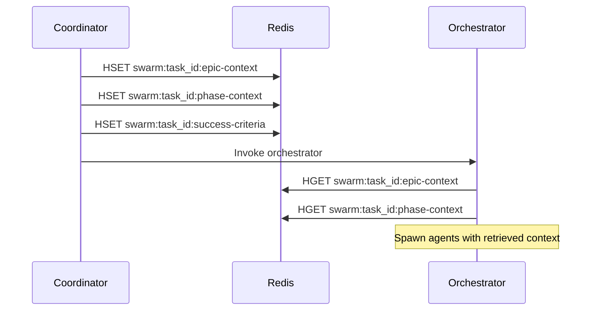

# CFN Loop Flow Diagram (v3)

## Orchestration Flow Overview

## V3 Key Differences from V2

### Agent Lifecycle
- **V2:** Stateful (agents enter waiting mode, woken for iterations)
- **V3:** Stateless (agents exit after work, fresh spawn per iteration)

### Context Management
- **V2:** Context passed during wake signal
- **V3:** Context stored in Redis, retrieved on spawn

### Coordination Primitives
- **V2:** BLPOP-based waiting mode (zero-token blocking)
- **V3:** Exit-based coordination (no blocking, fresh spawn)

### Iteration Management
- **V2:** Wake existing agents with feedback
- **V3:** Spawn fresh agents with feedback from Redis

## Stateless Agent Protocol (v3)

## Cost-Savings Mode Workflow

## Redis Context Storage Steps (v3)

## Best Practices

1. Use `.claude/skills/cfn-loop-orchestration/orchestrate.sh` for all multi-agent workflows
2. Store complete context in Redis before spawning agents
3. Use stateless agent spawning (exit after work)
4. Collect confidence using `collect-confidence-scores.sh`
5. Validate consensus thresholds

## References
- CFN Loop Orchestration: `.claude/skills/cfn-loop-orchestration/SKILL.md`
- Redis Coordination: `.claude/skills/redis-coordination/SKILL.md`
- CFN Loop Validation: `.claude/skills/cfn-loop-validation/SKILL.md`
