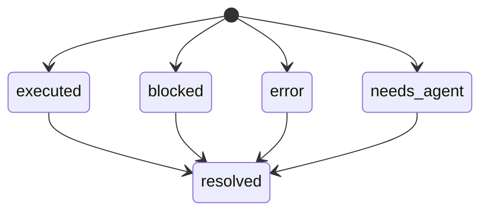

<!-- GENERATED by cfn-wiki sync. Edit knowledge.json or wiki:enrich blocks. -->
<!-- wiki-fp: a62a0cec5b7470e25afa6d6dcf9d91c97d3f5af8c2d4a673d60701f007f61f4a -->

# State Machines

**Last Updated:** 2026-09-14 wiki sync

## Table of Contents

- [1. Acceptance-check result](#1-acceptance-check-result)

## 1. Acceptance-check result

**Source:** .claude/skills/cfn-loop-orchestration-v2/cli/verify-run.sh:461

run creates one result row per selected acceptance criterion. This diagram shows result modes, not feature maturity. resolve can update an existing row after receiving evidence; pass remains a separate true/false/null field.

### States

| State | Meaning |
|---|---|
| executed | Command ran; pass may be true, false or unresolved. |
| blocked | Prerequisites unavailable; pass is null. |
| error | Tool failure; pass is false. |
| needs_agent | Runner cannot execute the check; pass is null. |
| resolved | Evidence and an explicit verdict were stamped into an existing row. |

### Transitions

| From | To | Trigger | Guard |
|---|---|---|---|
| [*] | executed | run executes a supported check | Working directory, prerequisites and tools available |
| [*] | blocked | run evaluates prerequisites | Required environment, service or directory unavailable |
| [*] | error | Tool preflight or runtime diagnostic | Required executable is missing |
| [*] | needs_agent | run classifies the check | Command not mechanically executable by this runner |
| executed | resolved | resolve stamps a verdict | Existing AC id, true/false verdict, evidence file with at least three non-empty lines |
| blocked | resolved | resolve stamps a verdict | Existing AC id, true/false verdict, evidence file with at least three non-empty lines |
| error | resolved | resolve stamps a verdict | Existing AC id, true/false verdict, evidence file with at least three non-empty lines |
| needs_agent | resolved | resolve stamps a verdict | Existing AC id, true/false verdict, evidence file with at least three non-empty lines |

### Diagram




## Appendix. Preserved notes awaiting review

These legacy notes are preserved for reconciliation; they are not current runtime models.

<!-- wiki:enrich id=orphan-entity-1 fp=orphan -->
<!-- imported from readme/state-machines.md -->

**Imported entity:** CFN Loop Task: Phase 5 Exit Gate (cfn-loop-task 3.2.0, W1/W4/W5)
<!-- /wiki:enrich -->

<!-- wiki:enrich id=orphan-entity-10 fp=orphan -->
<!-- imported from readme/state-machines.md -->

**Imported entity:** Dependency Scheduling
<!-- /wiki:enrich -->

<!-- wiki:enrich id=orphan-entity-11 fp=orphan -->
<!-- imported from readme/state-machines.md -->

**Imported entity:** Video Ingest Run (glm-video-ingest)

### States

**States:** `PROCESSING | ACTIVE | FAILED`

| From | To | Trigger |
|------|----|---------|
| PROCESSING | ACTIVE | file processed; generateContent proceeds |
| PROCESSING | FAILED | Gemini rejects/fails processing → run `failed` |

---
<!-- /wiki:enrich -->

<!-- wiki:enrich id=orphan-entity-12 fp=orphan -->
<!-- imported from readme/state-machines.md -->

**Imported entity:** Decision Record (decision-log structured store)
<!-- /wiki:enrich -->

<!-- wiki:enrich id=orphan-entity-13 fp=orphan -->
<!-- imported from readme/state-machines.md -->

**Imported entity:** Manifest Suggestion (cfn-vote-implement processing)
<!-- /wiki:enrich -->

<!-- wiki:enrich id=orphan-entity-14 fp=orphan -->
<!-- imported from readme/state-machines.md -->

**Imported entity:** Intent Item (cfn-spec §1b Interaction Intent Walk)
<!-- /wiki:enrich -->

<!-- wiki:enrich id=orphan-entity-15 fp=orphan -->
<!-- imported from readme/state-machines.md -->

**Imported entity:** Monitor Probe (cfn-monitor health gate)
<!-- /wiki:enrich -->

<!-- wiki:enrich id=orphan-entity-16 fp=orphan -->
<!-- imported from readme/state-machines.md -->

**Imported entity:** Lane Deferrals (cfn-loop-orchestration-v2/cli/deferrals.sh, S006)
<!-- /wiki:enrich -->

<!-- wiki:enrich id=orphan-entity-17 fp=orphan -->
<!-- imported from readme/state-machines.md -->

**Imported entity:** AC Verdict Lifecycle (verify-run.sh, S003, 2026-07-11)
<!-- /wiki:enrich -->

<!-- wiki:enrich id=orphan-entity-18 fp=orphan -->
<!-- imported from readme/state-machines.md -->

**Imported entity:** VERIFY Manifest Bless Lifecycle (bless-verify.sh, S007, 2026-07-22)
<!-- /wiki:enrich -->

<!-- wiki:enrich id=orphan-entity-19 fp=orphan -->
<!-- imported from readme/state-machines.md -->

**Imported entity:** Test Hygiene Gate (check-test-hygiene.sh, S001, 2026-07-11)
<!-- /wiki:enrich -->

<!-- wiki:enrich id=orphan-entity-2 fp=orphan -->
<!-- imported from readme/state-machines.md -->

**Imported entity:** GOAP Planner
<!-- /wiki:enrich -->

<!-- wiki:enrich id=orphan-entity-20 fp=orphan -->
<!-- imported from readme/state-machines.md -->

**Imported entity:** Role Capability Outcome (cfn-persona-verify)
<!-- /wiki:enrich -->

<!-- wiki:enrich id=orphan-entity-21 fp=orphan -->
<!-- imported from readme/state-machines.md -->

**Imported entity:** Role Verification Finding (cfn-persona-verify schema audit)
<!-- /wiki:enrich -->

<!-- wiki:enrich id=orphan-entity-22 fp=orphan -->
<!-- imported from readme/state-machines.md -->

**Imported entity:** Wireframe Gate (cfn-megaplan L5→L6 barrier)
<!-- /wiki:enrich -->

<!-- wiki:enrich id=orphan-entity-23 fp=orphan -->
<!-- imported from readme/state-machines.md -->

**Imported entity:** Implementation Wave (cfn-loop-task LANE DERIVATION)

**Source:** `.claude/skills/cfn-megaplan/bars/derive_lanes.py` (stages 5-9: ownership, edges, SCC merge, topological waves); consumed by `.claude/commands/cfn-loop-task.md` Phase 2; verified by `.claude/skills/cfn-megaplan/bars/tests/test-derive-lanes.sh`

### States

`blocked | ready | running | complete`

### Transitions

| From | To | Trigger | Guard |
|------|----|---------|-------|
| (none) | ready | lane has no inbound produce/consume edge | ready lanes form wave 1 (`waves[0]`) |
| (none) | blocked | lane Consumes an identifier Produced by a lane not yet complete | edge recorded in `edges[]` |
| ready | running | wave slot spawned (at most `LANE_CAP=8` lanes per slot; excess deferred to the next slot) | file ownership exclusive across lanes in the slot; `shared_files[]` are read-only for that lane |
| running | complete | every wave agent returned, barrier reached, producer-existence guard passed | claimed `produces[]` symbols resolve (scoped typecheck/grep), else the producing lane respawns |
| blocked | ready | every inbound-edge source lane reached complete | dependency satisfied |
| complete | running | gate fails and this lane is the failing lane or transitively downstream of it | respawn set recomputed from `edges[]` each iteration |

```
(none) ──no inbound edge──> ready ──spawn slot──> running ──barrier+producer guard──> complete
(none) ──consumes pending──> blocked ──sources complete──> ready        complete ──gate fail──> running
```

**Cycle note:** a produce/consume cycle is not a state. Stage 8 collapses each
strongly-connected component into one lane run sequentially (same resolution as
the same-file rule), so no wave ever waits on itself. The SCC pass is iterative;
recursive Tarjan overflows on a real 109-step co-write chain.

**Not-separable exit:** when the longest lane exceeds twice `--max-steps`, the
script emits a `separability` advisory instead of pretending to parallelize. That
is a plan-quality signal (a hub file co-written by most steps), and the
documented resolution is to re-run `/write-plan` with phase-local file sets or to
accept the serial run explicitly. Exclusive ownership stays the default;
`--hub-split` and `--soft-ownership` loosen it only on request.

---
<!-- /wiki:enrich -->

<!-- wiki:enrich id=orphan-entity-24 fp=orphan -->
<!-- imported from readme/state-machines.md -->

**Imported entity:** Loop Pre-Flight Readiness (preflight.sh)

**Source:** `.claude/skills/cfn-megaplan/bars/preflight.py` (`scan_open_sections`, `find_artifacts`, `open_blocking_deferrals`); called from `.claude/commands/cfn-loop-task.md` Step 0c; verified by `.claude/skills/cfn-megaplan/bars/tests/test-preflight.sh`

### States

`clear | open-items | open-deferrals | missing-artifact | unresolvable`

### Transitions

| From | To | Trigger | Guard |
|------|----|---------|-------|
| (none) | unresolvable | `--plan-dir` absent or not a directory | exit 2; re-resolve through `plan-paths.sh` before retrying |
| (none) | missing-artifact | a required artifact (PLAN, VERIFY, SPEC, DECISIONS) has no `<KIND>_<slug>.md` | exit 1; reported in `missing_artifacts[]` |
| (none) | open-items | an unqualified open heading in DECISIONS/SPEC/PLAN/ARCH/OPS/DATA/UX/TEST carries at least one item | exit 1; at most 8 items listed per section, `item_count` and `truncated` stay exact |
| (none) | open-deferrals | `.DEFERRALS_<slug>.json` beside the plan dir has an entry with `status: OPEN` and `blocking: true` | exit 1; these become Phase 5 gate failures if the loop starts anyway |
| (none) | clear | no missing artifact, no open section, no open blocking deferral | exit 0; the only state Phase 1 may follow |
| open-items | clear | each item resolved or explicitly accepted, answer recorded in `DECISIONS_<slug>.md`, script re-run | one `AskUserQuestion` per item; a heading rewritten as answered/resolved drops out of the scan |
| open-deferrals | clear | resolved through `deferrals.sh`, script re-run | resolution recorded in the side manifest, not in prose |
| missing-artifact | clear | the artifact written (`/write-plan`, `/cfn-megaplan`), script re-run | resolves through `plan-paths.sh`, nested layout first |

```
unresolvable <──bad --plan-dir── (none) ──nothing open──> clear ──> Phase 1
                                   │
       ┌───────────────────────────┼───────────────────────────┐
missing-artifact            open-items                  open-deferrals
       │ write artifact            │ decide + record            │ deferrals.sh
       └───────────────────────────┴───────────────────────────┘
                              re-run ──> clear
```

`clear` is not sticky: it describes the plan dir at scan time, so the script is
re-run after every resolution rather than remembered.

---
<!-- /wiki:enrich -->

<!-- wiki:enrich id=orphan-entity-25 fp=orphan -->
<!-- imported from readme/state-machines.md -->

**Imported entity:** Post-Edit Validation Pipeline (cfn-invoke-post-edit.sh / post-edit-pipeline.js, S016/S018/S020)
<!-- /wiki:enrich -->

<!-- wiki:enrich id=orphan-entity-26 fp=orphan -->
<!-- imported from readme/state-machines.md -->

**Imported entity:** Subagent Lifecycle Hooks (cfn-subagent-start.sh / cfn-subagent-stop.sh, S015)
<!-- /wiki:enrich -->

<!-- wiki:enrich id=orphan-entity-27 fp=orphan -->
<!-- imported from readme/state-machines.md -->

**Imported entity:** Pre-Edit Backup Lifecycle (cfn-invoke-pre-edit.sh / restore.sh / cleanup.sh, S014 + S017)
<!-- /wiki:enrich -->

<!-- wiki:enrich id=orphan-entity-28 fp=orphan -->
<!-- imported from readme/state-machines.md -->

**Imported entity:** Hook Timeout Budget (cfn-hook-budget.sh, S017)
<!-- /wiki:enrich -->

<!-- wiki:enrich id=orphan-entity-29 fp=orphan -->
<!-- imported from readme/state-machines.md -->

**Imported entity:** Pre-commit Credential Scan (scan_staged_file, S010-S014)
<!-- /wiki:enrich -->

<!-- wiki:enrich id=orphan-entity-3 fp=orphan -->
<!-- imported from readme/state-machines.md -->

**Imported entity:** Agent Selection (GOAP substitution)
<!-- /wiki:enrich -->

<!-- wiki:enrich id=orphan-entity-30 fp=orphan -->
<!-- imported from readme/state-machines.md -->

**Imported entity:** Pre-commit Hook Self-Test Gate (cfn-hook-selftest.sh, S019)
<!-- /wiki:enrich -->

<!-- wiki:enrich id=orphan-entity-31 fp=orphan -->
<!-- imported from readme/state-machines.md -->

**Imported entity:** Prompt Optimizer Run (prompt-optimizer engine)
<!-- /wiki:enrich -->

<!-- wiki:enrich id=orphan-entity-32 fp=orphan -->
<!-- imported from readme/state-machines.md -->

**Imported entity:** Workbench Watcher (cfn-workbench watch.sh)

**Source:** `.claude/skills/cfn-workbench/watch.sh` (pidfile `/tmp/cfn-workbench-watch-<slug>.pid`)

### States

`not-running | running | stale-pid`

### Transitions

| From | To | Trigger | Guard |
|------|----|---------|-------|
| not-running | running | start invocation (default mode) | pidfile written with live pid; loop daemonized (disown). Idempotent: start while running exits 0 without a second loop |
| running | running | tick every `--interval` secs | re-renders only when the source-glob fingerprint hash changed; render failure logged WARN, loop survives |
| running | not-running | `--stop` | SIGTERM, SIGKILL after ~2s if still alive; pidfile removed. `--stop` with nothing running still exits 0 |
| running | stale-pid | watcher process dies without `--stop` | pidfile remains but `kill -0` fails |
| stale-pid | running | next start invocation | stale pidfile detected and replaced with the fresh pid |

```
not-running --start--> running --tick--> running
     ^                    |  \
     |                 --stop  process death
     +---(stop)---------/       \
     ^                           v
     +----(next start)------ stale-pid
```
<!-- /wiki:enrich -->

<!-- wiki:enrich id=orphan-entity-33 fp=orphan -->
<!-- imported from readme/state-machines.md -->

**Imported entity:** Roster Lane (cfn-workbench section-roster)

**Source:** `planning/run-plan-<slug>.json` `lanes[]`, joined at render time against `/tmp/lane-report-<slug>-*-<id>.json` (and `<root>/tmp/`) plus `cfn-events-<slug>.jsonl`

### States

`pending | in-flight | landed`

### Transitions

| From | To | Trigger | Guard |
|------|----|---------|-------|
| pending | in-flight | `lane_spawned` event for the lane id | no lane-report file and no `lane_landed` event yet; Since column = event ts (HH:MM) |
| in-flight | landed | lane-report file appears OR `lane_landed` event | file glob matches lane id suffix in either tmp scan path |
| pending | landed | lane-report file appears with no spawn event | derivation is stateless per render; a lane can skip in-flight if events were never emitted |

```
pending --lane_spawned--> in-flight --report/landed event--> landed
    \_______________________report file________________________/
```
<!-- /wiki:enrich -->

<!-- wiki:enrich id=orphan-entity-34 fp=orphan -->
<!-- imported from readme/state-machines.md -->

**Imported entity:** Runtime Link Target (link-runtime-dirs.sh)

**Source:** `.claude/cfn-scripts/link-runtime-dirs.sh` (`RUNTIME_DIRS` list, one pass per entry); verified by `tests/test-link-runtime-dirs.sh`

### States

`absent | linked | mislinked | occupied-file | occupied-empty-dir | occupied-populated-dir | refused`

### Transitions

| From | To | Trigger | Guard |
|------|----|---------|-------|
| absent | linked | run without `--check` | parent `~/.claude` exists or is created first |
| absent | absent | run with `--check` | check mode never writes; reports the entry as missing and exits non-zero |
| linked | linked | any run | readlink already resolves to the repo path; reported `ok`, no write |
| mislinked | linked | run without `--check` | existing symlink points elsewhere; old target recorded in the backup dir, then relinked |
| occupied-file | linked | run without `--check` | real file moved to `~/.claude-runtime-links-backup-<ts>/`, never deleted |
| occupied-empty-dir | linked | run without `--check` | `rmdir` succeeds, so nothing is discarded |
| occupied-populated-dir | refused | run without `--force` | refuses and exits non-zero rather than risk data loss; the dir is left untouched |
| occupied-populated-dir | linked | run with `--force` | whole dir moved to the timestamped backup dir first |
| refused | linked | re-run with `--force` | operator has seen the refusal and opted in |

```
absent ─────────────────────────────> linked <──── mislinked
occupied-file ──backup+replace───────>   ^
occupied-empty-dir ──rmdir───────────>   |
occupied-populated-dir ──no --force──> refused ──--force+backup──┘
```

`~/.claude/agents` is deliberately not in this set: it stays a real directory so
project-local agents survive, and only `agents/cfn-dev-team` is linked.
<!-- /wiki:enrich -->

<!-- wiki:enrich id=orphan-entity-35 fp=orphan -->
<!-- imported from readme/state-machines.md -->

**Imported entity:** Terse-Output Mode (caveman plugin flag)

**Source:** `~/.claude/.caveman-active` written by `caveman-activate.js` (SessionStart) and `caveman-mode-tracker.js` (UserPromptSubmit); rules in `.claude/global/CLAUDE.md` "Terse-Output Mode Carve-Out"; verified by `tests/test-caveman-carveout.sh`

### States

`off | active-lite | active-full | active-ultra | independent`

`independent` covers the commit, review and compress skills, which define their
own behaviour and suppress the per-prompt reminder.

### Transitions

| From | To | Trigger | Guard |
|------|----|---------|-------|
| any | active-<level> | SessionStart, including after a compact | resolved mode is not `off`; flag written, 1,847-byte ruleset injected |
| any | off | SessionStart | resolved mode is `off` from env or config; flag unlinked, nothing injected |
| off | active-<level> | prompt matches activate/enable/turn on/start/talk like + caveman | no stop word in the same prompt |
| active-<level> | active-<other> | `/caveman lite\|full\|ultra` | argument is a valid mode |
| active-<level> | independent | `/caveman-commit`, `/caveman-review`, `/caveman-compress` | skill defines behaviour; per-prompt reminder suppressed |
| active-<level> | off | prompt matches stop/disable/deactivate/turn off + caveman, or "normal mode" | flag unlinked; takes effect from the next prompt |
| active-<level> | active-<level> | any other prompt | 121-byte reminder injected because the flag reads back as a valid mode |
| off | off | any prompt | flag absent, so `readFlag` returns null and nothing is injected |

```
                  SessionStart / compact (mode != off)
      ┌──────────────────────────────────────────────┐
      │                                              v
    off <──stop caveman / normal mode──── active-{lite,full,ultra}
      │                                     │      ^
      └──"activate caveman"─────────────────┘      │
                                                   v
                              independent {commit, review, compress}
```

Resolution order for the mode is `CAVEMAN_DEFAULT_MODE`, then
`~/.config/caveman/config.json`, then `full`. A malformed, oversized, or
symlinked flag file reads back as null and is treated as `off`, so a tampered
flag can never inject arbitrary bytes into model context.
<!-- /wiki:enrich -->

<!-- wiki:enrich id=orphan-entity-36 fp=orphan -->
<!-- imported from readme/state-machines.md -->

**Imported entity:** Content Path Containment (security-utils.sh validate_file_path)

**Source:** `.claude/skills/cfn-knowledge-base/lib/workflow/lib/security-utils.sh:183`

### States

| State | Meaning |
|-------|---------|
| `submitted` | A path and a base directory have been supplied, neither resolved yet. |
| `unresolvable` | `readlink -f` failed on the path or on the base. Terminal, rejected. |
| `resolved` | Both sides are absolute and canonical, ready to compare. Symlinks are already followed, so a link is judged by its target. |
| `contained` | The resolved path equals the base or sits beneath it on a path-separator boundary. Terminal, accepted. |
| `escaped` | The resolved path lies outside the base. Terminal, rejected. |

### Transitions

| From | To | Trigger | Guard |
|------|----|---------|-------|
| `submitted` | `unresolvable` | `readlink -f "$file_path"` fails | path does not exist or cannot be canonicalised |
| `submitted` | `unresolvable` | `readlink -f "$base_dir"` fails | base does not exist |
| `submitted` | `resolved` | both `readlink -f` calls succeed | - |
| `resolved` | `contained` | boundary comparison passes | `abs_path` equals `abs_base`, or `abs_path` matches `abs_base/*` |
| `resolved` | `escaped` | boundary comparison fails | anything else, including a sibling whose name merely begins with the base |
| `contained` | - | returns 0 | caller proceeds with deployment |
| `escaped` | - | returns 1 | caller exits 1 |
| `unresolvable` | - | returns 1 | caller exits 1 |

```
submitted ──readlink fails──> unresolvable ──> reject
    |
    └──both resolve──> resolved ──on boundary──> contained ──> accept
                          |
                          └──off boundary────> escaped ────> reject
```

The boundary condition is the whole point. The check previously compared with a
bare prefix (`=~ ^"$abs_base"`), which admitted a sibling directory whose name
started with the base: base `/srv/app` accepted `/srv/app-evil/payload`. The
comparison now requires either equality or a following `/`, so `resolved` moves
to `escaped` in that case. Covered by `tests/security/test-path-containment.sh`.
<!-- /wiki:enrich -->

<!-- wiki:enrich id=orphan-entity-37 fp=orphan -->
<!-- imported from readme/state-machines.md -->

**Imported entity:** Night Mode Flag (cfn-night-mode)

**Source:** `~/.claude/.night-mode-active` (+ `.night-mode-pending-review` window-start

### States

| State | Meaning |
|-------|---------|
| `off` | No flag file. Hooks fail open; the normal Decision Protocol applies. |
| `on` | Flag file holds the ISO start timestamp. The guard blocks AskUserQuestion and EnterPlanMode; the injector shows the contract at session start plus a per-turn reminder. |
| `off-pending-review` | Flag removed but decisions or denied prompts exist in the window; the pending marker stays until the user reviews the report. |

### Transitions

| From | To | Trigger | Guard |
|------|----|---------|-------|
| `off` | `on` | `night-mode.sh on` | doctor registrations verified |
| `on` | `off` | `night-mode.sh off` | morning report rendered; pending marker written if decisions or deferred items exist in the window |
| `off-pending-review` | `off` | `night-mode.sh report --ack` | user reviewed the batch; marker removed, events log truncated |

```
                  night-mode.sh on (doctor verified)
    off  <──────────────────────────────────────────  on
     ^                                               │
     │ report --ack (guard: user reviewed            │ night-mode.sh off
     │ the batch; marker removed)                    │ (guard: morning report rendered;
     │                                               ▼  marker written if needed)
     └──────────────────────────────────  off-pending-review
```

---
<!-- /wiki:enrich -->

<!-- wiki:enrich id=orphan-entity-38 fp=orphan -->
<!-- imported from readme/state-machines.md -->

**Imported entity:** Fleet Workstream (cfn-fleet roster.tsv)

**Source:** `<run-dir>/roster.tsv` `status` column, written by `fleet add/spawn/commit/land` (`.claude/skills/cfn-fleet/lib/common.sh` `roster_set`); `working/blocked/done/dead` are set by direct roster edit or `roster_set` (no dedicated subcommand).

### States

| State | Meaning |
|-------|---------|
| `pending` | Registered by `fleet add`; no session spawned yet. |
| `started` | `fleet spawn` launched the worker session (heartbeat seeded). |
| `working` | Worker active: heartbeats fresh, claims registered. |
| `blocked` | Worker reported a blocker; master must resolve or reassign. |
| `landed` | `fleet commit`/`fleet land` succeeded; `landed_sha` recorded. |
| `done` | Master confirmed the run; terminal success. |
| `dead` | Session hung, killed, or compacted without handoff; terminal failure. |

### Transitions

| From | To | Trigger | Guard |
|------|----|---------|-------|
| `pending` | `started` | `fleet spawn WSxx` | `briefs/WSxx.md` exists (else 65) |
| `started` | `working` | direct roster edit (worker picks up task) | claims registered |
| `working` | `blocked` | direct roster edit (blocker note in `notes`) | note carries block reason |
| `blocked` | `working` | direct roster edit (blocker resolved) | |
| `working` | `landed` | `fleet commit WSxx` | no unclaimed dirty files (else 66; `--force-with-note` overrides, stages claimed only) |
| `working` | `landed` | `fleet land WSxx` | worktree mode: branch merged + worktree clean; main mode: unclaimed-dirty guard |
| `landed` | `done` | direct roster edit (master closes run) | |
| `started`/`working` | `dead` | `fleet watch` STALE event or manual edit | heartbeat older than `--stale-min` |

```
 pending ──spawn──> started ──edit──> working <──edit──> blocked
                                       │
                          commit/land  │  (guards: unclaimed-dirty 66,
                                       ▼   worktree clean)
                                    landed ──edit──> done
 started/working ──watch STALE──> dead
```

---
<!-- /wiki:enrich -->

<!-- wiki:enrich id=orphan-entity-39 fp=orphan -->
<!-- imported from readme/state-machines.md -->

**Imported entity:** Review Decision (nitpicky portal)

**Source:** `<run-dir>/decisions.json` `decisions` map, written by

### States

| State | Meaning |
|-------|---------|
| `undecided` | No record (or record without `decision`). Excluded from the exported checklist sections, counted in its header. |
| `fix` | Accepted: goes to the implementation team as a checklist item with the explanation as context. |
| `defer` | Explicitly postponed; listed under Deferred, never silently backlogged. |
| `deny` | Rejected; appendix only. A deny explanation may authorize an alternative change, so it is preserved verbatim. |

### Transitions

| From | To | Trigger | Guard |
|------|----|---------|-------|
| `undecided` | `fix`/`defer`/`deny` | decision button click, bulk action on the filtered set, or cluster apply in review.html | patch validated server-side (id in findings.json, enum, size caps, localhost Origin) |
| `fix`/`defer`/`deny` | `undecided` | same decision button re-clicked | explanation preserved |
| `fix`/`defer`/`deny` | `fix`/`defer`/`deny` | different decision button clicked, or bulk/cluster overwrite | record replaced, `updatedAt` bumped; bulk note only fills empty explanations, cluster apply never overwrites existing explanations |
| any | any | browser reload | server state authoritative; newer unsent browser drafts overwrite (draft `ts` > record `updatedAt`) |

```
             click Fix            click Defer          click Deny
 undecided ───────────> fix ─┐ undecided ──────> defer   undecided ──────> deny
     ^                  │     │                  │                          │
     │  re-click same   │     │  re-click same   │        re-click same    │
     └──────────────────┘     └──────────────────┘          └───────────────┘
     any state ──click another button──> that decision (record replaced)
```

Persistence rules: the server applies patches serially and writes atomically;
unsent browser edits sit in a per-run localStorage draft queue and are retried via
the Retry button after a server restart; a stale draft never overwrites a newer
server record.
<!-- /wiki:enrich -->

<!-- wiki:enrich id=orphan-entity-4 fp=orphan -->
<!-- imported from readme/state-machines.md -->

**Imported entity:** Error Recovery (GOAP)
<!-- /wiki:enrich -->

<!-- wiki:enrich id=orphan-entity-5 fp=orphan -->
<!-- imported from readme/state-machines.md -->

**Imported entity:** Orchestrator Loop (GOAP-advised)
<!-- /wiki:enrich -->

<!-- wiki:enrich id=orphan-entity-6 fp=orphan -->
<!-- imported from readme/state-machines.md -->

**Imported entity:** Spec Artifact Status (cfn-spec / cfn-megaplan)
<!-- /wiki:enrich -->

<!-- wiki:enrich id=orphan-entity-7 fp=orphan -->
<!-- imported from readme/state-machines.md -->

**Imported entity:** Megaplan Bar B Result (Multi-Plan Program)
<!-- /wiki:enrich -->

<!-- wiki:enrich id=orphan-entity-8 fp=orphan -->
<!-- imported from readme/state-machines.md -->

**Imported entity:** Knowledge Claim (cfn-knowledge-plan Bar K)

**Source:** `.claude/skills/cfn-knowledge-plan/bars/check-grounding.sh` (rules G1-G9); ledger rows in `planning/KDOC_<slug>.md` `## Claims Ledger`.

### States

| State | Meaning |
|-------|---------|
| `extracted` | verbatim quote + locator sits in `KEVIDENCE_<slug>__SRC-n.md`; no ledger row yet |
| `ledgered` | has a `C-n` row with Type, Source, Locator, Confidence |
| `cited` | prose references `[C-n]` at least once |
| `grounded` | ledgered + cited + Bar K clean; blessable |
| `finding` | Bar K raised G1-G9 against it |
| `relabelled` | retyped to ASSUMPTION after no source was found; legitimate exit |
| `dropped` | removed from ledger and prose together |

### Transitions

| From | To | Trigger | Guard |
|------|----|---------|-------|
| (none) | extracted | L4 extract node emits a quote | verbatim text + locator present; paraphrase re-runs the node at opus |
| extracted | ledgered | L5 synthesis writes the `C-n` row | Type in EVIDENCE\|INFERENCE\|ASSUMPTION (else G6); Confidence in high\|medium\|low (else G8) |
| ledgered | cited | L6 draft writes `[C-n]` in prose | row exists (else G1 against the prose) |
| cited | grounded | Bar K exit 0 | EVIDENCE has Source+Locator (else G2); SRC-n exists in KSOURCES (else G4); INFERENCE names upstream C-ids (else G9); id unique (else G5) |
| ledgered | finding | Bar K G3: row never cited in prose | draft dropped the claim, or the ledger is padded |
| cited | finding | Bar K G1: no matching row | claim asserted in prose without a trace |
| finding | grounded | owning level patches within 2 rounds | G1/G3 → draft; G2/G4/G9 → synthesis; G5/G6/G8 → the writing level |
| finding | relabelled | user accepts via AskUserQuestion after 2 rounds | Type set to ASSUMPTION and phrased as a testable statement |
| finding | dropped | user chooses to cut the claim | removed from BOTH ledger and prose, else G1 or G3 re-fires |
| relabelled | grounded | Bar K re-run exit 0 | ASSUMPTION rows need no Source or Locator |

```
extracted ──> ledgered ──> cited ──> grounded
                 │           │          ▲
                 │ G3        │ G1       │ patch (<=2 rounds)
                 └────> finding <───────┘
                          ├──> relabelled ──> grounded
                          └──> dropped
```

---
<!-- /wiki:enrich -->

<!-- wiki:enrich id=orphan-entity-9 fp=orphan -->
<!-- imported from readme/state-machines.md -->

**Imported entity:** Shared Doc Publication (cfn-share)

**Source:** `.claude/skills/cfn-share/resolve.sh` (state read), `.claude/skills/cfn-share/record-url.sh` (state write); sidecar `<dir>/.share-<basename>.url` holding `url`, `sha256`, `published`.

### States

| State | Sidecar | Meaning |
|-------|---------|---------|
| `unresolved` | n/a | target missing, empty, or not `.md`; resolve.sh exits 1 |
| `resolved` | absent | publishable, never published |
| `published` | `sha256` matches file | live URL serves current bytes |
| `stale` | `sha256` differs | file edited since publish; the reader's link is behind |
| `orphaned` | points at a superseded artifact | a republish omitted `url:` and created a second artifact |

### Transitions

| From | To | Trigger | Guard |
|------|----|---------|-------|
| unresolved | resolved | file exists, non-empty, `.md` | no-arg form resolves newest `planning/PLAN_*.md` |
| resolved | published | Artifact publish (no `url` param) + record-url.sh | full file read before publishing; no credentials or customer data in the doc |
| published | stale | any edit to the file | detected on next resolve.sh by sha256 mismatch |
| stale | published | Artifact publish **with** `url:` + record-url.sh | same URL updated in place; sidecar sha refreshed |
| stale | orphaned | republish omits `url:` | failure mode; the reader's link keeps serving old bytes |
| published | published | republish of unchanged bytes | resolve.sh reports `stale:false`; confirm with the user first |

```
unresolved ──> resolved ──> published <──────┐
                               │             │ publish WITH url:
                               │ file edit   │
                               └──> stale ───┘
                                      │ publish WITHOUT url:
                                      └──> orphaned
```

---
<!-- /wiki:enrich -->

<!-- wiki:enrich id=orphan-entity-api-gateway fp=orphan -->
_No curated description yet. Edit this wiki:enrich block to describe entity-api-gateway._
<!-- /wiki:enrich -->

<!-- wiki:enrich id=orphan-entity-archive fp=orphan -->
_No curated description yet. Edit this wiki:enrich block to describe entity-archive._
<!-- /wiki:enrich -->

<!-- wiki:enrich id=orphan-entity-artifacts fp=orphan -->
_No curated description yet. Edit this wiki:enrich block to describe entity-artifacts._
<!-- /wiki:enrich -->

<!-- wiki:enrich id=orphan-entity-backups fp=orphan -->
_No curated description yet. Edit this wiki:enrich block to describe entity-backups._
<!-- /wiki:enrich -->

<!-- wiki:enrich id=orphan-entity-benchmark fp=orphan -->
_No curated description yet. Edit this wiki:enrich block to describe entity-benchmark._
<!-- /wiki:enrich -->

<!-- wiki:enrich id=orphan-entity-codex fp=orphan -->
_No curated description yet. Edit this wiki:enrich block to describe entity-codex._
<!-- /wiki:enrich -->

<!-- wiki:enrich id=orphan-entity-config fp=orphan -->
_No curated description yet. Edit this wiki:enrich block to describe entity-config._
<!-- /wiki:enrich -->

<!-- wiki:enrich id=orphan-entity-database fp=orphan -->
_No curated description yet. Edit this wiki:enrich block to describe entity-database._
<!-- /wiki:enrich -->

<!-- wiki:enrich id=orphan-entity-deployment fp=orphan -->
_No curated description yet. Edit this wiki:enrich block to describe entity-deployment._
<!-- /wiki:enrich -->

<!-- wiki:enrich id=orphan-entity-docker fp=orphan -->
_No curated description yet. Edit this wiki:enrich block to describe entity-docker._
<!-- /wiki:enrich -->

<!-- wiki:enrich id=orphan-entity-lib fp=orphan -->
_No curated description yet. Edit this wiki:enrich block to describe entity-lib._
<!-- /wiki:enrich -->

<!-- wiki:enrich id=orphan-entity-logs fp=orphan -->
_No curated description yet. Edit this wiki:enrich block to describe entity-logs._
<!-- /wiki:enrich -->

<!-- wiki:enrich id=orphan-entity-migrations fp=orphan -->
_No curated description yet. Edit this wiki:enrich block to describe entity-migrations._
<!-- /wiki:enrich -->

<!-- wiki:enrich id=orphan-entity-monitoring fp=orphan -->
_No curated description yet. Edit this wiki:enrich block to describe entity-monitoring._
<!-- /wiki:enrich -->

<!-- wiki:enrich id=orphan-entity-packages fp=orphan -->
_No curated description yet. Edit this wiki:enrich block to describe entity-packages._
<!-- /wiki:enrich -->

<!-- wiki:enrich id=orphan-entity-planning fp=orphan -->
<!-- imported from readme/state-machines.md -->

**Imported entity:** CFN MegaPlan-Lite: Planning DAG
<!-- /wiki:enrich -->

<!-- wiki:enrich id=orphan-entity-src fp=orphan -->
_No curated description yet. Edit this wiki:enrich block to describe entity-src._
<!-- /wiki:enrich -->

<!-- wiki:enrich id=orphan-entity-templates fp=orphan -->
_No curated description yet. Edit this wiki:enrich block to describe entity-templates._
<!-- /wiki:enrich -->

<!-- wiki:enrich id=orphan-entity-tools fp=orphan -->
_No curated description yet. Edit this wiki:enrich block to describe entity-tools._
<!-- /wiki:enrich -->

<!-- wiki:enrich id=entity-api-gateway fp=d7c568d77a3888a80e901a0b840b41cd88d2bae9b2b1ac6a4c8bb43b92d6e35d -->
_No curated description yet. Edit this wiki:enrich block to describe entity-api-gateway._
<!-- /wiki:enrich -->

<!-- wiki:enrich id=entity-artifacts fp=d3dcbe4134b7a52e936dfcbf2aac020384f4228406e0c89a1440698827af7673 -->
_No curated description yet. Edit this wiki:enrich block to describe entity-artifacts._
<!-- /wiki:enrich -->

<!-- wiki:enrich id=entity-benchmark fp=fc1bea1f1d98c9e0e346c9af537561da5e90613812ac4dd3051619525adb157f -->
_No curated description yet. Edit this wiki:enrich block to describe entity-benchmark._
<!-- /wiki:enrich -->

<!-- wiki:enrich id=entity-config fp=d97ebba8982315083386c4c0220acc5a33b7a0505472828c7499a76c6ff790f6 -->
_No curated description yet. Edit this wiki:enrich block to describe entity-config._
<!-- /wiki:enrich -->

<!-- wiki:enrich id=entity-database fp=d64c3e7409d072f25c6bc60bc6c53553b38ae1456c32b4ccd1fe76ccabe84805 -->
_No curated description yet. Edit this wiki:enrich block to describe entity-database._
<!-- /wiki:enrich -->

<!-- wiki:enrich id=entity-deployment fp=bf4dc11a474fe765e4e7560203e19815b9dfbc7a1eddf5e7c847b110a6d85ae8 -->
_No curated description yet. Edit this wiki:enrich block to describe entity-deployment._
<!-- /wiki:enrich -->

<!-- wiki:enrich id=entity-docker fp=2fd432e94aa6758bd5192fbc022741f7ef81dd46b0c883b56128e5c2257593fa -->
_No curated description yet. Edit this wiki:enrich block to describe entity-docker._
<!-- /wiki:enrich -->

<!-- wiki:enrich id=entity-lib fp=1bbfb6fc01b5096f503b15a14f259f3ffb980b877e9fea1257ce30282278f43d -->
_No curated description yet. Edit this wiki:enrich block to describe entity-lib._
<!-- /wiki:enrich -->

<!-- wiki:enrich id=entity-migrations fp=1ab2ea2d8f69f661d1d7095599c967c5e7f7b8ddaf76b182cc755650c5ff5a83 -->
_No curated description yet. Edit this wiki:enrich block to describe entity-migrations._
<!-- /wiki:enrich -->

<!-- wiki:enrich id=entity-monitoring fp=b844ee9a5275118ec6ff53b2ee306c6b454d48cac4fac961a04e48b91735869d -->
_No curated description yet. Edit this wiki:enrich block to describe entity-monitoring._
<!-- /wiki:enrich -->

<!-- wiki:enrich id=entity-packages fp=0585d277fdbe6703e03d3b2e186f1745fac254343b7486a1a97e33ee184e5245 -->
_No curated description yet. Edit this wiki:enrich block to describe entity-packages._
<!-- /wiki:enrich -->

<!-- wiki:enrich id=entity-planning fp=6efcb16208864720c81be53fea6b99b01c1c923c43e7b80c1f50882222073f0f -->
<!-- imported from readme/state-machines.md -->

**Imported entity:** CFN MegaPlan-Lite: Planning DAG
<!-- /wiki:enrich -->

<!-- wiki:enrich id=entity-src fp=6540664b23f61e936f424c967d6433345d0ca2416fa6d018c33bd7860a5a47cd -->
_No curated description yet. Edit this wiki:enrich block to describe entity-src._
<!-- /wiki:enrich -->

<!-- wiki:enrich id=entity-templates fp=e0ffe622344898c9e33ef25463d0b0fcb61dbda518e6a3549598a532c5a3a32f -->
_No curated description yet. Edit this wiki:enrich block to describe entity-templates._
<!-- /wiki:enrich -->

<!-- wiki:enrich id=entity-tools fp=54c415e9e7e8ce000c0e65df9897f2ac593b6d873b18c0da5389b2fb1c5df3ce -->
_No curated description yet. Edit this wiki:enrich block to describe entity-tools._
<!-- /wiki:enrich -->

<!-- wiki:enrich id=entity-training fp=edd7caa9200b4220a1495622c3ceee6e46c9f9cac02d703b3206dff8bfd6e722 -->
_No curated description yet. Edit this wiki:enrich block to describe entity-training._
<!-- /wiki:enrich -->

