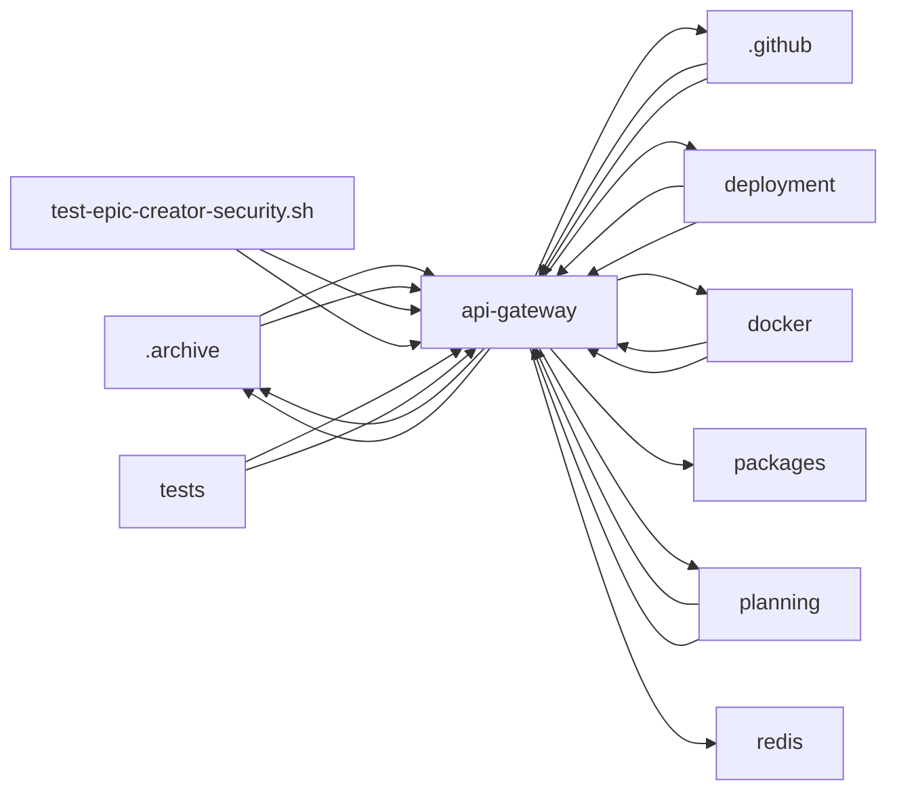

<!-- GENERATED by cfn-wiki sync. DO NOT EDIT. -->
<!-- wiki-fp: 9ecd0922332f7ff3d52327a3bbe494615f4e5844a8bfae605f624dfad90a5eec -->

# api-gateway

**Source:**

- `api-gateway/jwt/src/config.js`
- `api-gateway/jwt/src/index.js`
- `api-gateway/jwt/src/logger.js`
- `api-gateway/jwt/src/middleware/auth.js`
- `api-gateway/jwt/src/middleware/token-management.js`
- `api-gateway/jwt/src/redis-client.js`
- `api-gateway/jwt/src/routes/auth.js`
- `api-gateway/jwt/src/routes/tokens.js`
- `api-gateway/jwt/src/routes/users.js`
- `api-gateway/tests/run-all-tests.sh`
- `api-gateway/tests/test-setup.sh`
- `api-gateway/tests/unit/test-jwt-auth.sh`
- `api-gateway/tests/unit/test-kong-config.sh`
- `api-gateway/tests/unit/test-nginx-config.sh`

**Status:** dev

## Feature Edges

## Change Coupling

No co-change pairs recorded for these files.

<!-- wiki:enrich id=api-gateway fp=3df7530fcf3916a9891f2622dd730989abfdf4157f4448b1a7b2bc12c00e92f9 -->
_No curated description yet. Edit this wiki:enrich block to describe api-gateway._
<!-- /wiki:enrich -->
