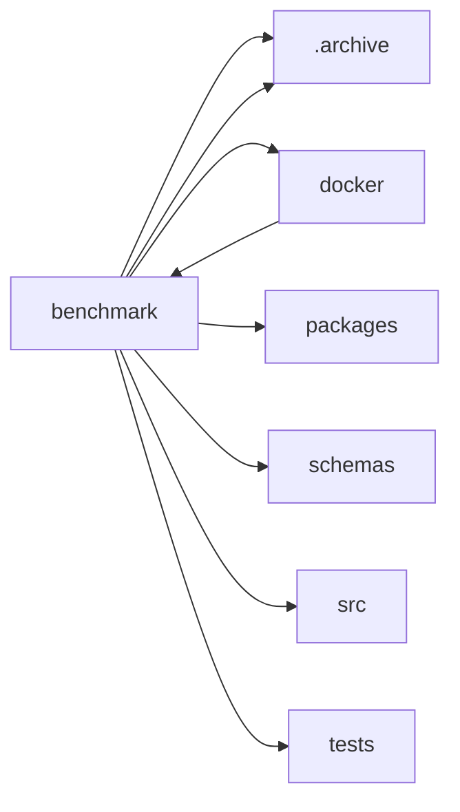

<!-- GENERATED by cfn-wiki sync. DO NOT EDIT. -->
<!-- wiki-fp: 9ecd0922332f7ff3d52327a3bbe494615f4e5844a8bfae605f624dfad90a5eec -->

# benchmark

**Source:**

- `benchmark/agent-messaging.js`
- `benchmark/ai-streaming.js`
- `benchmark/load-test.js`
- `benchmark/node-message-bus.js`
- `benchmark/persistent-agent.js`
- `benchmark/persistent-spawner.js`
- `benchmark/run-all.sh`
- `benchmark/rust-message-bus/src/main.rs`
- `benchmark/spawn-cost.sh`

**Status:** dev

## Feature Edges

## Change Coupling

No co-change pairs recorded for these files.

<!-- wiki:enrich id=benchmark fp=f23dde989389051fdcf34bfbfbc1d144edd02db08c1efe7b9a4f6f2e245c064f -->
_No curated description yet. Edit this wiki:enrich block to describe benchmark._
<!-- /wiki:enrich -->
