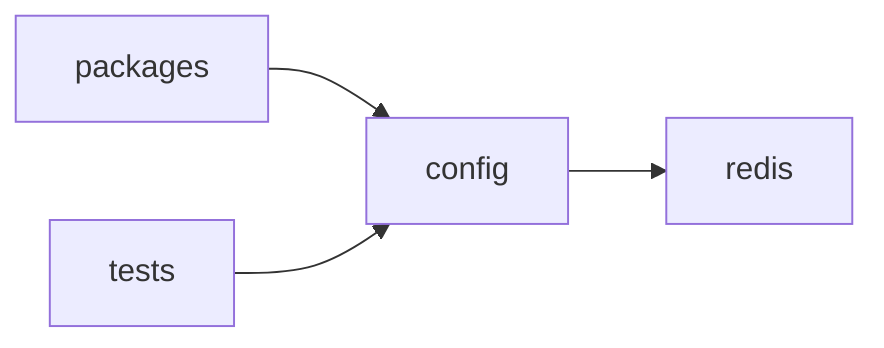

<!-- GENERATED by cfn-wiki sync. DO NOT EDIT. -->
<!-- wiki-fp: 9ecd0922332f7ff3d52327a3bbe494615f4e5844a8bfae605f624dfad90a5eec -->

# config

**Source:**

- `config/redis.config.js`
- `config/redis.config.test.js`

**Status:** dev

## Feature Edges

## Change Coupling

No co-change pairs recorded for these files.

<!-- wiki:enrich id=config fp=8c175cdf126475ebac562a637b472a11b656f9e8b61e368479c36611fc79e7df -->
_No curated description yet. Edit this wiki:enrich block to describe config._
<!-- /wiki:enrich -->
