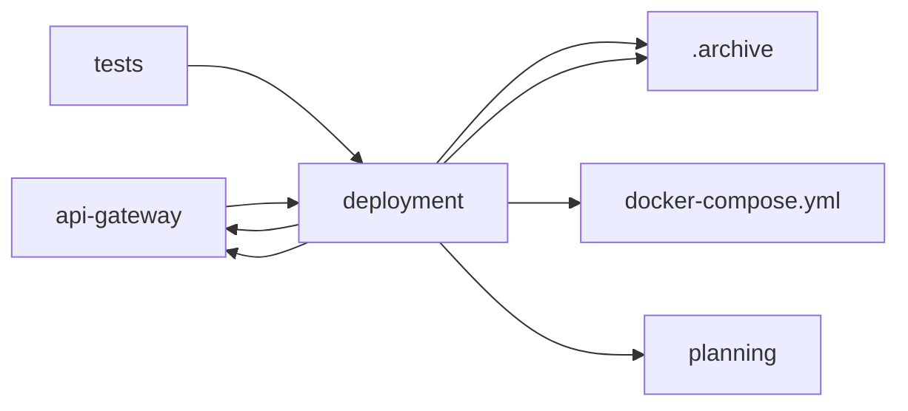

<!-- GENERATED by cfn-wiki sync. DO NOT EDIT. -->
<!-- wiki-fp: 9ecd0922332f7ff3d52327a3bbe494615f4e5844a8bfae605f624dfad90a5eec -->

# deployment

**Source:**

- `deployment/batch-spawning-optimization.sh`
- `deployment/canary-rollout.sh`
- `deployment/cross-team-escalation-test.sh`
- `deployment/csuite-deployment.sh`
- `deployment/csuite-escalation-test.sh`
- `deployment/csuite-strategic-decision-test.sh`
- `deployment/deploy.sh`
- `deployment/engineering-code-review-workflow.sh`
- `deployment/engineering-test-workflow.sh`
- `deployment/finance-deployment.sh`
- `deployment/full-org-coordination-test.sh`
- `deployment/marketing-coordinator-deploy.sh`
- `deployment/playbook-driven-execution.sh`
- `deployment/rollback.sh`
- `deployment/run-migrations.sh`
- `deployment/sales-support-deployment.sh`
- `deployment/strategic-decision-workflow.sh`
- `deployment/validate-deployment.sh`
- `deployment/worker-model-tiering.sh`

**Status:** dev

## Feature Edges

## Change Coupling

No co-change pairs recorded for these files.

<!-- wiki:enrich id=deployment fp=c3d771f72ad99bdee8079d7c70585241f6ecab9e79d585c929489e25107c7918 -->
_No curated description yet. Edit this wiki:enrich block to describe deployment._
<!-- /wiki:enrich -->
