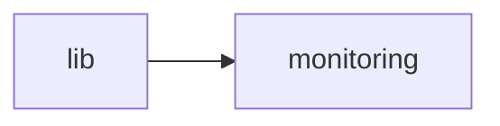

<!-- GENERATED by cfn-wiki sync. DO NOT EDIT. -->
<!-- wiki-fp: 9ecd0922332f7ff3d52327a3bbe494615f4e5844a8bfae605f624dfad90a5eec -->

# lib

**Source:**

- `lib/mdap/decomposers/architecture.ts`
- `lib/mdap/decomposers/index.ts`
- `lib/mdap/decomposers/performance.ts`
- `lib/mdap/decomposers/security.ts`
- `lib/mdap/decomposers/testing.ts`
- `lib/mdap/diff-applicator.ts`
- `lib/mdap/error-fixer.ts`
- `lib/mdap/glm-client.ts`
- `lib/mdap/implementer.ts`
- `lib/mdap/index.ts`
- `lib/mdap/orchestrator.ts`
- `lib/mdap/secure-execution.test.ts`
- `lib/mdap/secure-execution.ts`
- `lib/mdap/security.ts`
- `lib/mdap/types.ts`
- `lib/mdap/validation.ts`

**Status:** dev

## Feature Edges

## Change Coupling

No co-change pairs recorded for these files.

<!-- wiki:enrich id=lib fp=4b143c89666be025b549e134bbea59038d57ded10b9bc10a9dd78b4e44aff380 -->
_No curated description yet. Edit this wiki:enrich block to describe lib._
<!-- /wiki:enrich -->
