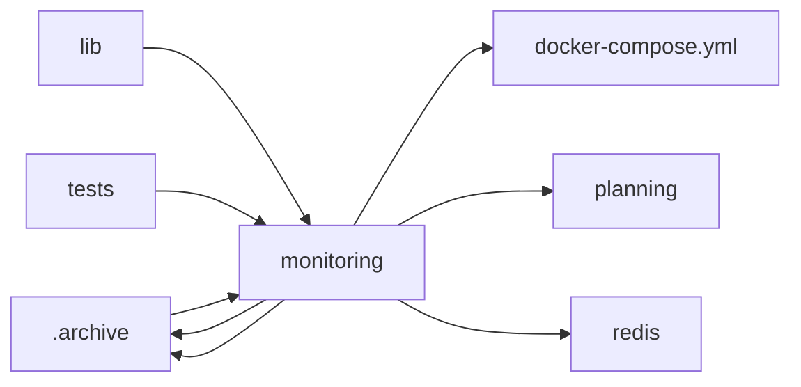

<!-- GENERATED by cfn-wiki sync. DO NOT EDIT. -->
<!-- wiki-fp: 9ecd0922332f7ff3d52327a3bbe494615f4e5844a8bfae605f624dfad90a5eec -->

# monitoring

**Source:**

- `monitoring/container-team-monitor.sh`
- `monitoring/cost-anomaly-detection.sh`
- `monitoring/server.js`
- `monitoring/sprint-2.2/launch-coordinator.sh`
- `monitoring/sprint-2.2/track-costs.sh`
- `monitoring/sprint-2.2/validate-workflow.sh`
- `monitoring/start-dashboard.sh`
- `monitoring/test-api.js`

**Status:** dev

## Feature Edges

## Change Coupling

No co-change pairs recorded for these files.

<!-- wiki:enrich id=monitoring fp=03cf633a92d4174ba5674b844081e1d1e91d833395311c578924a2483b544a30 -->
_No curated description yet. Edit this wiki:enrich block to describe monitoring._
<!-- /wiki:enrich -->
