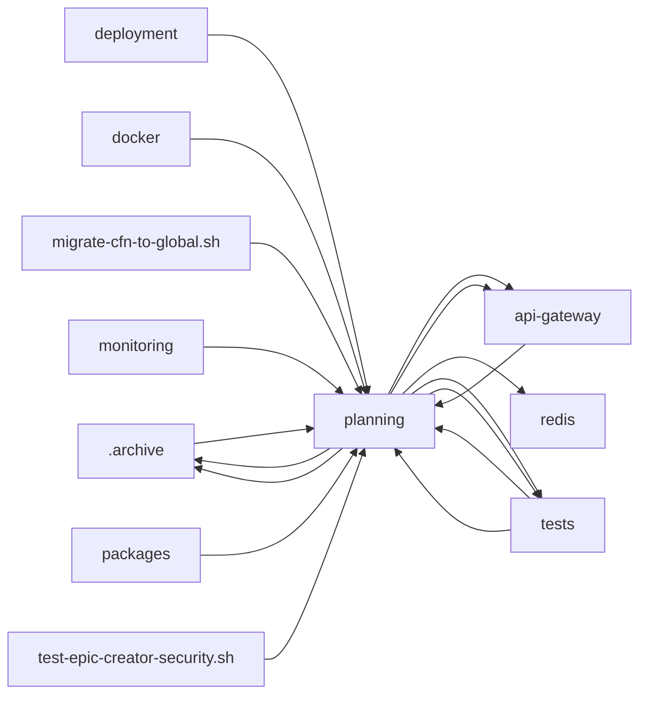

<!-- GENERATED by cfn-wiki sync. DO NOT EDIT. -->
<!-- wiki-fp: 9ecd0922332f7ff3d52327a3bbe494615f4e5844a8bfae605f624dfad90a5eec -->

# planning

**Source:**

- `planning/cfn_megaplan_fast/dryrun.sh`
- `planning/completed/cfn-testing/execute-testing-epic.sh`
- `planning/completed/cfn-testing/generate-summary.sh`
- `planning/completed/cfn-testing/test-harness/scenarios/01-perfect-storm-poc.sh`
- `planning/completed/cfn-testing/test-harness/scenarios/02-gate-guardian-unix.sh`
- `planning/completed/cfn-testing/test-harness/scenarios/02-gate-guardian.sh`
- `planning/completed/cfn-testing/test-harness/scenarios/03-consensus-gridlock.sh`
- `planning/completed/cfn-testing/test-harness/scenarios/04-marathon.sh`
- `planning/completed/cfn-testing/test-harness/scenarios/05-sprint.sh`
- `planning/completed/cfn-testing/test-harness/scenarios/06-rebel.sh`
- `planning/completed/cfn-testing/test-harness/scenarios/07-apocalypse.sh`
- `planning/completed/cfn-testing/test-harness/scenarios/08-scalability.sh`
- `planning/completed/cfn-testing/test-harness/scenarios/09-context-memory.sh`
- `planning/completed/cfn-testing/test-harness/scenarios/10-simulator.sh`
- `planning/completed/trigger/tests/phase2/run-all-tests.sh`
- `planning/completed/trigger/tests/phase2/test-concurrent-spawning.sh`
- `planning/completed/trigger/tests/phase2/test-filesystem-isolation.sh`
- `planning/completed/trigger/tests/phase2/test-network-isolation.sh`
- `planning/completed/trigger/tests/phase2/test-parallel-execution.sh`
- `planning/completed/trigger/tests/phase2/test-resource-isolation.sh`
- `planning/completed/trigger/tests/phase2/test-result-independence.sh`
- `planning/completed/trigger/tests/phase2/validate-test-suite.sh`
- `planning/docker/archive/intelligent-coordinator/cleanup-images.sh`
- `planning/docker/archive/intelligent-coordinator/code/coordinator.js`
- `planning/docker/archive/intelligent-coordinator/tests/intelligent-coordinator-test.sh`
- `planning/incompleted/windows/examples/platform-adapter-example.ts`
- `planning/incompleted/windows/examples/process-manager-example.ts`

**Status:** dev

## Feature Edges

## Change Coupling

No co-change pairs recorded for these files.

<!-- wiki:enrich id=planning fp=4a412a882b5ec2c5d8c14af9faaaa4d3e3e991f2f9b89843c759f9b1e8f523b7 -->
_No curated description yet. Edit this wiki:enrich block to describe planning._
<!-- /wiki:enrich -->
