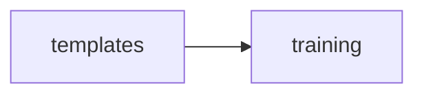

<!-- GENERATED by cfn-wiki sync. DO NOT EDIT. -->
<!-- wiki-fp: 9ecd0922332f7ff3d52327a3bbe494615f4e5844a8bfae605f624dfad90a5eec -->

# templates

**Source:**

- `templates/integration-starter/src/index.ts`

**Status:** dev

## Feature Edges

## Change Coupling

No co-change pairs recorded for these files.

<!-- wiki:enrich id=templates fp=968cb3ebe5d255c67a599ba78d9483469a84669d6d8cb87319d5fda983d9695e -->
_No curated description yet. Edit this wiki:enrich block to describe templates._
<!-- /wiki:enrich -->
