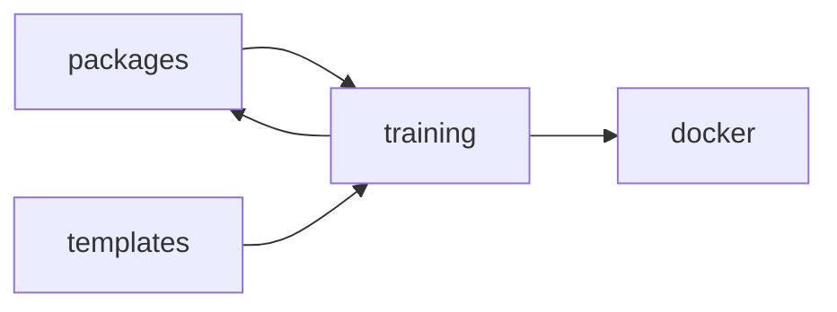

<!-- GENERATED by cfn-wiki sync. DO NOT EDIT. -->
<!-- wiki-fp: 9ecd0922332f7ff3d52327a3bbe494615f4e5844a8bfae605f624dfad90a5eec -->

# training

**Source:**

- `training/CODE_EXAMPLES/database-integration-example/database-service.ts`

**Status:** dev

## Feature Edges

## Change Coupling

No co-change pairs recorded for these files.

<!-- wiki:enrich id=training fp=fc5106c7cfba6730ba465efadb84d38ce9ca7c93671e3a4bd05fb3a35fe01e3e -->
_No curated description yet. Edit this wiki:enrich block to describe training._
<!-- /wiki:enrich -->
