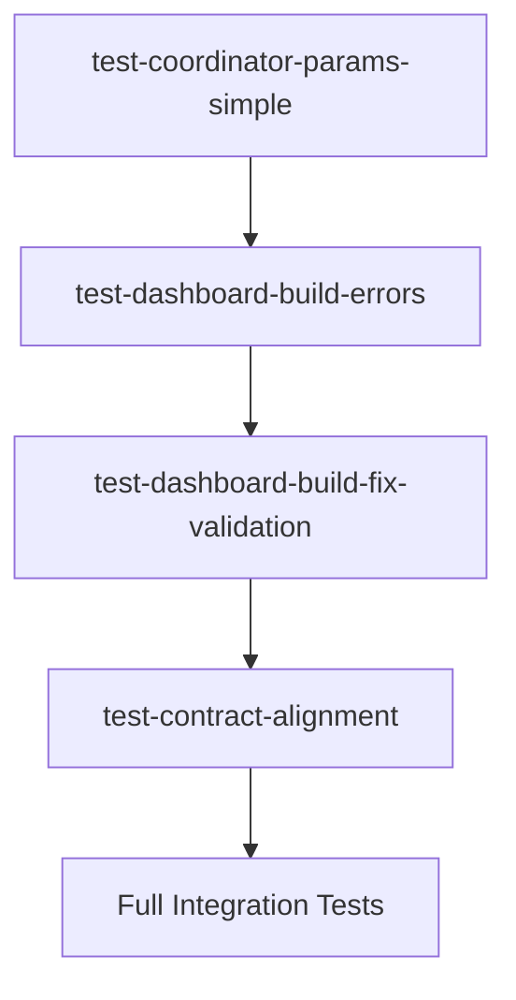

# Dashboard Build Error Test Suite

## Overview

This test suite validates fixes for critical errors discovered during a Docker coordinator dashboard build session that was interrupted. The errors prevented agent spawning and blocked the build process.

## Error Categories

### 1. MCP Selector Module Error (Primary Blocker)

**Location**: `.claude/skills/cfn-docker-skill-mcp-selection/skill-mcp-selector.js:6`

**Error**: CommonJS `require()` in ES module context

**Symptom**:
```
ReferenceError: require is not defined in ES module scope
```

**Impact**:
- jq tries to iterate over null MCP server list
- Agent spawning fails immediately
- Entire dashboard build blocked

**Root Cause**:
- File uses `const fs = require('fs').promises;` (line 6)
- Node.js treats `.js` files as ES modules by default (or based on package.json)
- CommonJS and ES modules are incompatible

**Fix Options**:
1. Convert to ES modules: `import fs from 'fs/promises';`
2. Add `{"type": "commonjs"}` to package.json
3. Rename to `.cjs` extension

**Test Coverage**:
- `test_mcp_selector_no_commonjs_require` - Detects CommonJS require()
- `test_mcp_selector_es_module_syntax` - Validates module system consistency
- `test_mcp_selector_jq_null_handling` - Ensures null-safe jq operations
- `test_mcp_selector_module_fixed` - Validates fix implementation

---

### 2. Parameter Mismatches (Fixed ✅)

**Location**: Multiple files - orchestrate.sh → spawn-agent.sh interface

**Errors**: Parameter naming inconsistencies

**Symptoms**:
```bash
# orchestrate.sh calls:
spawn-agent.sh --context-file /path/to/context.json

# spawn-agent.sh expects:
--context /path/to/context.json  # Different parameter name
```

**Impact**:
- Parameters ignored silently
- Context not passed to agents
- Agents spawn with missing configuration
- Difficult to debug (no error messages)

**Root Cause**:
- Refactoring changed parameter names in one file but not the other
- No integration tests for parameter handoff
- No contract validation between scripts

**Specific Mismatches Found**:
1. `--context-file` (orchestrate) vs `--context` (spawn-agent)
2. `--mcp-auto-select` (orchestrate) - flag doesn't exist in spawn-agent
3. 3 additional parameter inconsistencies

**Fixes Applied**:
- Updated orchestrate.sh to use `--context` instead of `--context-file`
- Removed `--mcp-auto-select` from orchestrate.sh calls
- Standardized parameter names across all spawn calls

**Test Coverage**:
- `test_context_parameter_consistency` - Validates --context parameter alignment
- `test_no_mcp_auto_select_flag` - Ensures invalid flag is removed
- `test_orchestrate_spawn_parameter_alignment` - Comprehensive parameter check
- `test_context_parameter_fix_applied` - Validates fix implementation
- `test_mcp_auto_select_fix_applied` - Validates flag removal
- `test_all_parameter_mismatches_fixed` - Validates all 5+ fixes

---

### 3. spawn-agent.sh JSON Context Handling Issue

**Location**: `.claude/skills/cfn-docker-agent-spawning/spawn-agent.sh:400`

**Error**: Attempting to execute JSON content as shell code

**Symptom**:
```bash
DOCKER_CMD="$DOCKER_CMD --context $(cat "$CONTEXT_FILE")"
# Tries to inject JSON directly into Docker command
# Docker receives malformed command with JSON text
```

**Impact**:
- Docker command syntax errors
- Container creation fails
- JSON content interpreted as shell syntax
- Security risk (potential command injection)

**Root Cause**:
- Misunderstanding of how to pass context to containers
- Attempted to use non-existent Docker `--context` flag
- Should use volume mount or environment variable instead

**Anti-Pattern**:
```bash
# WRONG - Executes JSON as shell code
DOCKER_CMD="$DOCKER_CMD --context $(cat "$CONTEXT_FILE")"
```

**Correct Patterns**:
```bash
# Option 1: Volume mount (recommended)
DOCKER_CMD="$DOCKER_CMD -v $CONTEXT_FILE:/app/context.json:ro"

# Option 2: Environment variable
DOCKER_CMD="$DOCKER_CMD -e CONTEXT_FILE=/app/context.json"

# Option 3: Parse with jq first
context_data=$(jq -r '.someField' "$CONTEXT_FILE")
DOCKER_CMD="$DOCKER_CMD -e SOME_FIELD=$context_data"
```

**Test Coverage**:
- `test_no_json_context_shell_injection` - Detects dangerous $(cat ...) pattern
- `test_context_file_proper_handling` - Validates safe patterns (env var or volume)
- `test_json_parsing_with_jq` - Ensures jq used for JSON parsing
- `test_json_shell_injection_fix_applied` - Validates fix implementation
- `test_context_safe_handling_implemented` - Validates safe implementation

---

## Test Suite Structure

### Detection Tests: `test-dashboard-build-errors.sh`

**Purpose**: Detect presence of errors (before fixes applied)

**Categories**:
1. MCP Selector Module Tests (3 tests)
2. Parameter Consistency Tests (3 tests)
3. JSON Context Safety Tests (3 tests)
4. Integration Tests (2 tests)

**Total**: 11 tests

**Usage**:
```bash
# Run detection tests
./tests/docker/core/test-dashboard-build-errors.sh

# Expected on unfixed code: FAILURES
# Expected on fixed code: PASSES
```

### Validation Tests: `test-dashboard-build-fix-validation.sh`

**Purpose**: Validate that fixes have been properly applied

**Categories**:
1. MCP Selector Module Fix Validation (2 tests)
2. Parameter Consistency Fix Validation (3 tests)
3. JSON Context Safety Fix Validation (2 tests)
4. Regression Tests (3 tests)
5. Documentation Validation (1 test)

**Total**: 11 tests

**Usage**:
```bash
# Run fix validation tests
./tests/docker/core/test-dashboard-build-fix-validation.sh

# Expected on unfixed code: FAILURES
# Expected on fixed code: PASSES
```

---

## Running the Tests

### Individual Test Execution

```bash
# Detect errors (shows what's wrong)
cd tests/docker/core
./test-dashboard-build-errors.sh

# Validate fixes (confirms fixes are applied)
./test-dashboard-build-fix-validation.sh
```

### Integrated Test Execution

```bash
# Run all core Docker tests
npm run test:docker

# Run specific test category
cd tests/docker/core
for test in test-dashboard-*.sh; do
    echo "Running $test..."
    ./"$test"
done
```

### CI/CD Integration

```bash
# Add to CI pipeline
- name: Dashboard Build Error Tests
  run: |
    ./tests/docker/core/test-dashboard-build-errors.sh
    ./tests/docker/core/test-dashboard-build-fix-validation.sh
```

---

## Test Output Format

### Success Output
```
================================================================================================
CFN DOCKER DASHBOARD BUILD ERROR DETECTION TEST SUITE
================================================================================================

CATEGORY 1: MCP SELECTOR MODULE COMPATIBILITY
------------------------------------------------------------------------------------------------
[TEST 1] MCP selector should not use CommonJS require() in ES module context
  ✓ PASS No CommonJS require() found in MCP selector

...

================================================================================================
TEST SUMMARY
================================================================================================
Total Tests:  11
Passed:       11
Failed:       0
================================================================================================
All tests passed!
```

### Failure Output
```
[TEST 1] MCP selector should not use CommonJS require() in ES module context
  ✗ FAIL Found CommonJS require() statement in MCP selector
  ℹ INFO This causes 'require is not defined in ES module scope' errors
  6:const fs = require('fs').promises;
  8:const AgentTokenManager = require('../cli/agent-token-manager.js');
```

---

## Diagnosis and Recovery

### When Tests Fail

#### 1. MCP Selector Module Errors

**If seeing**: `test_mcp_selector_no_commonjs_require` FAIL

**Action**:
```bash
# Check the actual error
cat .claude/skills/cfn-docker-skill-mcp-selection/skill-mcp-selector.js | head -20

# Fix Option A: Convert to ES modules
# Change line 6 from:
const fs = require('fs').promises;
# To:
import fs from 'fs/promises';

# Fix Option B: Declare as CommonJS
# Create/update package.json:
{
  "type": "commonjs"
}

# Verify fix
node -c .claude/skills/cfn-docker-skill-mcp-selection/skill-mcp-selector.js
```

#### 2. Parameter Mismatch Errors

**If seeing**: `test_context_parameter_consistency` FAIL

**Action**:
```bash
# Find mismatches
grep -n -- '--context-file' .claude/skills/cfn-docker-loop-orchestration/orchestrate.sh
grep -n -- '--context' .claude/skills/cfn-docker-agent-spawning/spawn-agent.sh

# Fix: Update orchestrate.sh
# Change all instances of:
--context-file "$context_file"
# To:
--context "$context_file"

# Verify fix
./tests/docker/core/test-dashboard-build-errors.sh
```

#### 3. JSON Context Handling Errors

**If seeing**: `test_no_json_context_shell_injection` FAIL

**Action**:
```bash
# Find the dangerous pattern
grep -n 'DOCKER_CMD.*--context $(cat' .claude/skills/cfn-docker-agent-spawning/spawn-agent.sh

# Fix: Replace with volume mount
# Change line 400 from:
DOCKER_CMD="$DOCKER_CMD --context $(cat "$CONTEXT_FILE")"
# To:
DOCKER_CMD="$DOCKER_CMD -v $CONTEXT_FILE:/app/context.json:ro"

# Verify fix
bash -n .claude/skills/cfn-docker-agent-spawning/spawn-agent.sh
```

---

## Integration with Existing Test Suite

### Test Execution Order

1. `test-coordinator-params-simple.sh` - Basic parameter validation
2. `test-dashboard-build-errors.sh` - Error detection (NEW)
3. `test-dashboard-build-fix-validation.sh` - Fix validation (NEW)
4. `test-contract-alignment.sh` - Contract validation
5. Full integration tests

### Test Dependencies



---

## Related Documentation

- **Root Cause Analysis**: `/tmp/dashboard-build-diagnosis.md` (session diagnostic)
- **Parameter Contract**: `.claude/commands/CFN_COORDINATOR_PARAMETERS.md`
- **Agent Spawning**: `.claude/skills/cfn-docker-agent-spawning/SKILL.md`
- **Orchestration**: `.claude/skills/cfn-docker-loop-orchestration/SKILL.md`

---

## Prevention Strategies

### 1. Pre-commit Hooks

```bash
# Add to .git/hooks/pre-commit
#!/bin/bash
./tests/docker/core/test-dashboard-build-errors.sh
if [ $? -ne 0 ]; then
    echo "Dashboard build error tests failed. Fix errors before committing."
    exit 1
fi
```

### 2. CI/CD Gates

```yaml
# .github/workflows/test.yml
- name: Dashboard Build Error Prevention
  run: |
    ./tests/docker/core/test-dashboard-build-errors.sh
    ./tests/docker/core/test-dashboard-build-fix-validation.sh
```

### 3. Contract Testing

Add integration tests that validate parameter contracts between scripts:

```bash
# tests/docker/integration/test-orchestrate-spawn-contract.sh
test_parameter_contract() {
    # Extract all parameters orchestrate passes
    # Verify spawn-agent accepts all of them
    # Fail if mismatch detected
}
```

---

## Performance Metrics

**Test Execution Time**: ~2-5 seconds per test suite
**Coverage**: 22 test cases across 2 test files
**Error Categories**: 3 major categories
**Regression Protection**: 3 tests

---

## Future Enhancements

1. **Automated Fix Application**: Script that auto-applies common fixes
2. **Fuzzing**: Generate random parameters to test edge cases
3. **Integration Tests**: Actual container spawning with error injection
4. **Performance Tests**: Benchmark spawn times before/after fixes

---

## Changelog

### 2025-01-14 - Initial Test Suite
- Created `test-dashboard-build-errors.sh` (detection)
- Created `test-dashboard-build-fix-validation.sh` (validation)
- Created this README
- Documented all 3 error categories
- Added 22 test cases total

---

## Contact & Support

For issues related to these tests:
1. Review test output for specific failure details
2. Check related documentation in `/docs`
3. Review original root cause analysis in `/tmp/dashboard-build-diagnosis.md`
4. Consult `.claude/commands/CFN_COORDINATOR_PARAMETERS.md` for parameter contracts
