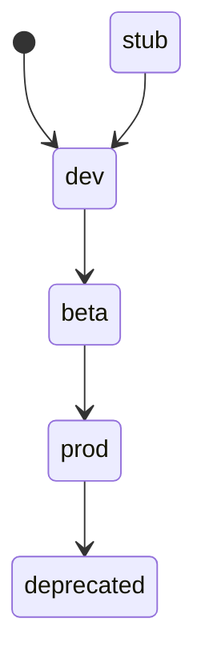

<!-- GENERATED by cfn-wiki sync. DO NOT EDIT. -->
<!-- wiki-fp: 043027a37bceef6547e143f2a95df5695f879abfe0f3e81eb8ae019214ab9b7a -->

# State Machines

**Last Updated:** 2026-09-12 wiki sync

## 1. parsing

**Source:** parsing/__init__.py:1 (auto-grounded from .wiki/store.json)

Status lifecycle of this feature in the closed doc-contract vocabulary.

### States

| State | Meaning |
|-------|---------|
| prod | Live, verified, monitored. Real users. |
| beta | Feature-complete, under verification. |
| dev | In development. Not verifiable end-to-end. (current) |
| stub | Scaffold only. Returns placeholder. |
| deprecated | Scheduled for removal. Do not build on. |

### Transitions

| From | To | Trigger | Guard |
|------|----|---------|-------|
| (new) | stub | Feature scaffold appears in the tree | none |
| stub | dev | First working implementation lands | none |
| dev | beta | Feature-complete, verification pending | verification suite exists |
| beta | prod | Verified and monitored in real use | zero known blockers |
| prod | deprecated | Replacement shipped or feature retired | removal scheduled |

### Diagram

<!-- wiki:enrich id=entity-parsing fp=e01c19aa91d05e39b06a3903f623360ceaea7be298ec57fec2dba968174fd49c -->
_No curated description yet. Edit this wiki:enrich block to describe entity-parsing._
<!-- /wiki:enrich -->

## 2. reporting

**Source:** reporting/__init__.py:1 (auto-grounded from .wiki/store.json)

Status lifecycle of this feature in the closed doc-contract vocabulary.

### States

| State | Meaning |
|-------|---------|
| prod | Live, verified, monitored. Real users. |
| beta | Feature-complete, under verification. |
| dev | In development. Not verifiable end-to-end. (current) |
| stub | Scaffold only. Returns placeholder. |
| deprecated | Scheduled for removal. Do not build on. |

### Transitions

| From | To | Trigger | Guard |
|------|----|---------|-------|
| (new) | stub | Feature scaffold appears in the tree | none |
| stub | dev | First working implementation lands | none |
| dev | beta | Feature-complete, verification pending | verification suite exists |
| beta | prod | Verified and monitored in real use | zero known blockers |
| prod | deprecated | Replacement shipped or feature retired | removal scheduled |

### Diagram

<!-- wiki:enrich id=entity-reporting fp=0f3fdf2c3d53712f945ddea1a50ceb88ae08b240db64c4a9cd5c92eb1cabc44c -->
_No curated description yet. Edit this wiki:enrich block to describe entity-reporting._
<!-- /wiki:enrich -->

## 3. src

**Source:** src/report.ts:1 (auto-grounded from .wiki/store.json)

Status lifecycle of this feature in the closed doc-contract vocabulary.

### States

| State | Meaning |
|-------|---------|
| prod | Live, verified, monitored. Real users. |
| beta | Feature-complete, under verification. |
| dev | In development. Not verifiable end-to-end. (current) |
| stub | Scaffold only. Returns placeholder. |
| deprecated | Scheduled for removal. Do not build on. |

### Transitions

| From | To | Trigger | Guard |
|------|----|---------|-------|
| (new) | stub | Feature scaffold appears in the tree | none |
| stub | dev | First working implementation lands | none |
| dev | beta | Feature-complete, verification pending | verification suite exists |
| beta | prod | Verified and monitored in real use | zero known blockers |
| prod | deprecated | Replacement shipped or feature retired | removal scheduled |

### Diagram

<!-- wiki:enrich id=entity-src fp=6c961956ccae48e71015cfa1003b607f652b1a9a316434c164b9a4dd959d0ba8 -->
_No curated description yet. Edit this wiki:enrich block to describe entity-src._
<!-- /wiki:enrich -->

