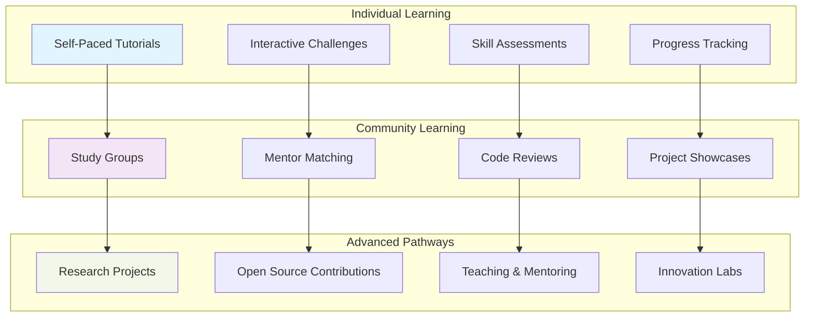
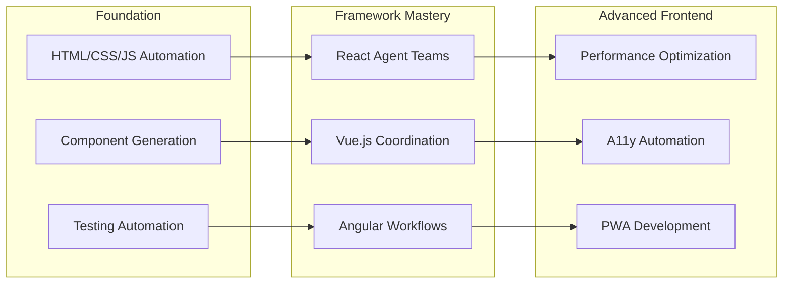
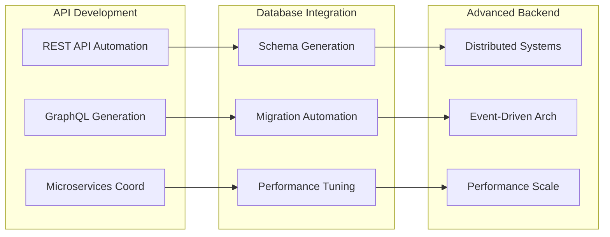
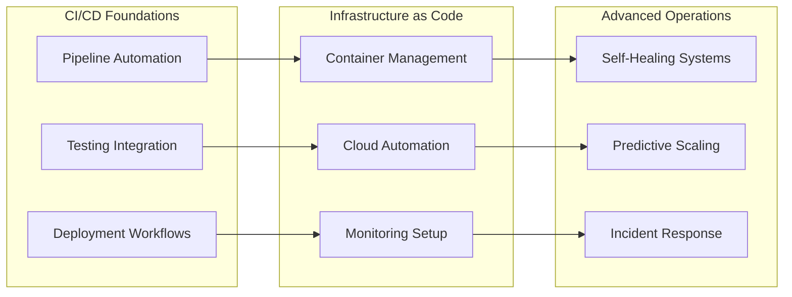

# Community Learning Resources & Educational Pathways

## 🌟 Welcome to the Learning Community

Join thousands of developers mastering AI-assisted development through our comprehensive community-driven learning ecosystem.

## 🎯 Visual Learning Journey Map



## 🚀 Learning Path Navigator

### 🎓 Academic Learning Tracks

#### Computer Science Students
```
Foundation Track (Semester 1-2)
├── Agent Programming Fundamentals
├── Collaborative AI Development
├── Software Engineering with AI
└── Performance & Optimization

Specialization Track (Semester 3-4)
├── Advanced Coordination Patterns
├── Enterprise Integration
├── Research & Innovation
└── Capstone Project
```

#### Bootcamp Integration (12-16 weeks)
```
Week 1-4: Traditional + AI Fundamentals
├── Core programming concepts
├── Agent-assisted coding introduction
├── SPARC methodology basics
└── Quality automation setup

Week 5-8: Project-Based Learning
├── Full-stack project with agents
├── Team coordination patterns
├── CI/CD automation
└── Code quality enforcement

Week 9-12: Advanced Applications
├── Multi-agent orchestration
├── Performance optimization
├── Production deployment
└── Industry best practices

Week 13-16: Capstone & Career Prep
├── Independent project
├── Portfolio development
├── Interview preparation
└── Job placement support
```

### 🏢 Professional Development Tracks

#### Individual Contributors (4-8 weeks)
```
Phase 1: Personal Productivity (2 weeks)
├── Automated code generation
├── Quality assurance workflows
├── Documentation automation
└── Testing efficiency

Phase 2: Team Collaboration (2 weeks)
├── Code review automation
├── Pair programming with AI
├── Knowledge sharing systems
└── Cross-functional coordination

Phase 3: Advanced Skills (2-4 weeks)
├── Custom agent development
├── Performance optimization
├── Complex problem solving
└── Innovation projects
```

#### Team Leads & Managers (6-10 weeks)
```
Phase 1: Team Orchestration (3 weeks)
├── Multi-agent team management
├── Workflow optimization
├── Quality gate implementation
└── Performance monitoring

Phase 2: Strategic Implementation (3 weeks)
├── Technology adoption planning
├── Training program development
├── ROI measurement
└── Change management

Phase 3: Leadership Excellence (4 weeks)
├── Innovation initiatives
├── Cross-team collaboration
├── Mentoring programs
└── Industry leadership
```

#### Architects & Seniors (8-12 weeks)
```
Phase 1: System Design (4 weeks)
├── Architecture patterns
├── Scalability planning
├── Integration strategies
└── Performance design

Phase 2: Enterprise Implementation (4 weeks)
├── Large-scale coordination
├── Legacy system integration
├── Security & compliance
└── Migration strategies

Phase 3: Innovation Leadership (4 weeks)
├── Research & development
├── Technology evaluation
├── Industry contributions
└── Thought leadership
```

## 🎯 Skill-Based Learning Pathways

### Frontend Development Path


### Backend Development Path


### DevOps & Infrastructure Path


## 🤝 Community Learning Programs

### 📚 Study Groups & Learning Circles

#### Beginner Learning Circles (4-6 people, 6 weeks)
```
Structure: Weekly 2-hour sessions
├── Week 1: Environment Setup & First Agent
├── Week 2: SPARC Methodology Deep Dive
├── Week 3: Quality Automation Workflows
├── Week 4: Multi-Agent Coordination Basics
├── Week 5: Project-Based Application
└── Week 6: Showcase & Next Steps Planning
```

#### Intermediate Practice Groups (3-5 people, 8 weeks)
```
Structure: Bi-weekly 3-hour sessions
├── Session 1-2: Complex Project Planning
├── Session 3-4: Multi-Agent Implementation
├── Session 5-6: Performance Optimization
├── Session 7-8: Production Deployment
```

#### Advanced Research Cohorts (2-4 people, 12 weeks)
```
Structure: Weekly 4-hour deep dives
├── Research project definition
├── Novel pattern development
├── Open source contributions
├── Community knowledge sharing
```

### 👥 Mentorship Program

#### Mentor Matching System
```
Experience Levels:
├── 🌱 Novice (0-3 months) → Beginner Mentor
├── ⚙️ Beginner (3-6 months) → Intermediate Mentor
├── 🔄 Intermediate (6-12 months) → Advanced Mentor
├── 🚀 Advanced (12+ months) → Expert Mentor
└── 🎖️ Expert (18+ months) → Community Leader
```

#### Mentorship Tracks
- **Technical Mentorship**: Code review, architecture guidance, best practices
- **Career Mentorship**: Professional development, goal setting, industry insights
- **Project Mentorship**: End-to-end project guidance, real-world applications
- **Leadership Mentorship**: Team management, strategic thinking, innovation

### 🏆 Community Challenges & Competitions

#### Monthly Coding Challenges
```
Challenge Types:
├── 🏃‍♂️ Speed Challenges (1-2 hours)
│   ├── Fastest agent setup
│   ├── Quick automation wins
│   └── Rapid prototyping
├── 🧩 Complexity Challenges (1 week)
│   ├── Multi-agent coordination
│   ├── Performance optimization
│   └── Creative problem solving
└── 🏗️ Innovation Challenges (1 month)
    ├── Novel use cases
    ├── Open source contributions
    └── Community tool development
```

#### Annual Learning Festival
- **Hackathon Weekend**: 48-hour intensive collaboration
- **Knowledge Sharing Sessions**: Community-led workshops
- **Innovation Showcase**: Demonstrate breakthrough projects
- **Awards & Recognition**: Celebrate outstanding contributions

## 🎓 Certification & Credentialing

### Professional Certification Levels

#### Claude Flow Novice Certified (Entry Level)
```
Requirements:
✅ Complete all beginner tutorials (4 tutorials)
✅ Pass skills assessment (80% minimum)
✅ Complete 2 practice projects
✅ Demonstrate both CLI and MCP proficiency
✅ Community participation (discussions, help others)

Time Investment: 15-25 hours
Valid For: 2 years
Renewal: 5 hours continuing education
```

#### Claude Flow Practitioner Certified (Professional Level)
```
Requirements:
✅ Hold Novice certification
✅ Complete all intermediate tutorials (4 tutorials)
✅ Lead or contribute to 3 team projects
✅ Demonstrate multi-agent coordination mastery
✅ Performance optimization case study
✅ Mentor 2+ community members

Time Investment: 40-60 hours
Valid For: 3 years
Renewal: 10 hours continuing education + project
```

#### Claude Flow Expert Certified (Advanced Level)
```
Requirements:
✅ Hold Practitioner certification
✅ Complete all advanced tutorials (8 tutorials)
✅ Design and implement custom agent system
✅ Contribute to open source projects
✅ Publish case study or research
✅ Train and certify others

Time Investment: 80-120 hours
Valid For: 3 years
Renewal: 15 hours continuing education + innovation project
```

#### Claude Flow Master Instructor (Teaching Level)
```
Requirements:
✅ Hold Expert certification
✅ Develop original curriculum content
✅ Train 10+ certified practitioners
✅ Significant community contributions
✅ Industry recognition and speaking
✅ Peer review and recommendation

Time Investment: 150+ hours
Valid For: 5 years
Renewal: Ongoing teaching and innovation
```

## 📊 Learning Analytics & Progress Tracking

### Personal Learning Dashboard
```
Metrics Tracked:
├── 📈 Skill Progression
│   ├── Tutorial completion rates
│   ├── Assessment scores
│   ├── Project complexity evolution
│   └── Time-to-competency tracking
├── 🤝 Community Engagement
│   ├── Discussion participation
│   ├── Help provided to others
│   ├── Mentorship activities
│   └── Event attendance
├── 🏆 Achievements & Milestones
│   ├── Certification progress
│   ├── Challenge completions
│   ├── Recognition received
│   └── Contribution impact
└── 🎯 Goal Achievement
    ├── Personal learning objectives
    ├── Career development goals
    ├── Skill gap closure
    └── Professional growth metrics
```

### Community Learning Insights
- **Trending Skills**: Most in-demand capabilities
- **Success Patterns**: What works for different learner types
- **Knowledge Gaps**: Areas needing more resources
- **Career Pathways**: Successful transition stories

## 🌐 External Learning Partnerships

### University Collaborations
- **Course Integration**: Embedding claude-flow-novice in CS curricula
- **Research Projects**: Student thesis and capstone projects
- **Faculty Training**: Professional development for educators
- **Industry Connections**: Bridging academia and practice

### Industry Training Programs
- **Corporate Workshops**: Customized team training
- **Conference Presentations**: Knowledge sharing at events
- **Professional Development**: Continuing education credits
- **Consulting Services**: Expert implementation guidance

### Open Source Ecosystem
- **Documentation Contributions**: Improve learning materials
- **Tool Development**: Create community resources
- **Integration Projects**: Connect with other platforms
- **Research Publications**: Share insights and findings

## 🎯 Learning Support Resources

### Getting Help
- **Community Forum**: Ask questions, share solutions
- **Office Hours**: Weekly live help sessions
- **Peer Support**: Connect with learning partners
- **Expert Consultations**: One-on-one guidance sessions

### Resource Library
- **Video Tutorials**: Visual learning content
- **Interactive Examples**: Hands-on practice
- **Cheat Sheets**: Quick reference materials
- **Best Practices Guides**: Proven approaches

### Tools & Platforms
- **Learning Management System**: Track progress and assignments
- **Code Sandbox**: Practice environment
- **Project Templates**: Starting points for learning
- **Assessment Tools**: Validate skills and knowledge

## 🚀 Getting Started with Community Learning

### Join the Community
1. **Create Learning Profile**: Set goals and preferences
2. **Complete Assessment**: Understand current skill level
3. **Choose Learning Path**: Select appropriate track
4. **Find Learning Group**: Connect with peers
5. **Start Learning Journey**: Begin with first milestone

### Contribute to the Community
1. **Share Experience**: Document learning journey
2. **Help Others**: Answer questions, provide guidance
3. **Create Content**: Tutorials, examples, improvements
4. **Lead Initiatives**: Organize groups, events, projects
5. **Become a Mentor**: Guide new community members

---

**Ready to accelerate your learning through community?** [Join our learning community](../community/README.md) and connect with fellow developers on the same journey! 🌟