# Claude Flow Integration Architecture

This document provides comprehensive integration patterns and architectural diagrams for claude-flow-novice across different environments and tools.

## Table of Contents

1. [Integration Overview](#integration-overview)
2. [Claude Code + claude-flow-novice Integration](#claude-code--claude-flow-integration)
3. [MCP Server Connection Patterns](#mcp-server-connection-patterns)
4. [Architecture Patterns](#architecture-patterns)
5. [Performance Considerations](#performance-considerations)
6. [Security Patterns](#security-patterns)

## Integration Overview

Claude-flow provides a unified orchestration layer that coordinates between Claude Code's execution capabilities and MCP server coordination features.

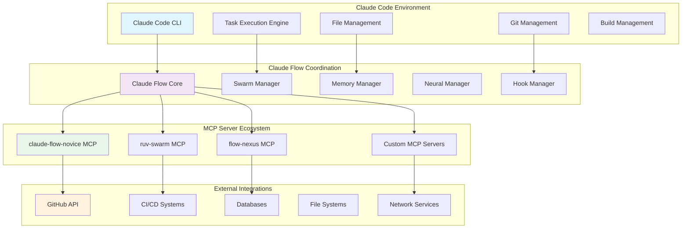

## Claude Code + claude-flow-novice Integration

### Primary Integration Flow

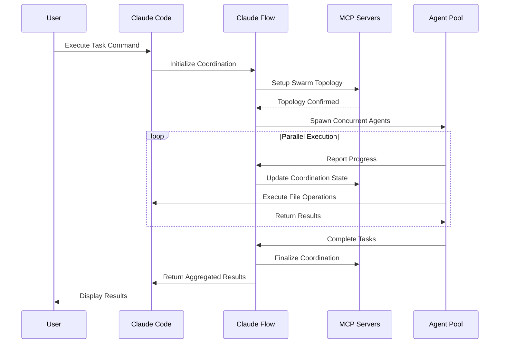

### Task Execution Pattern

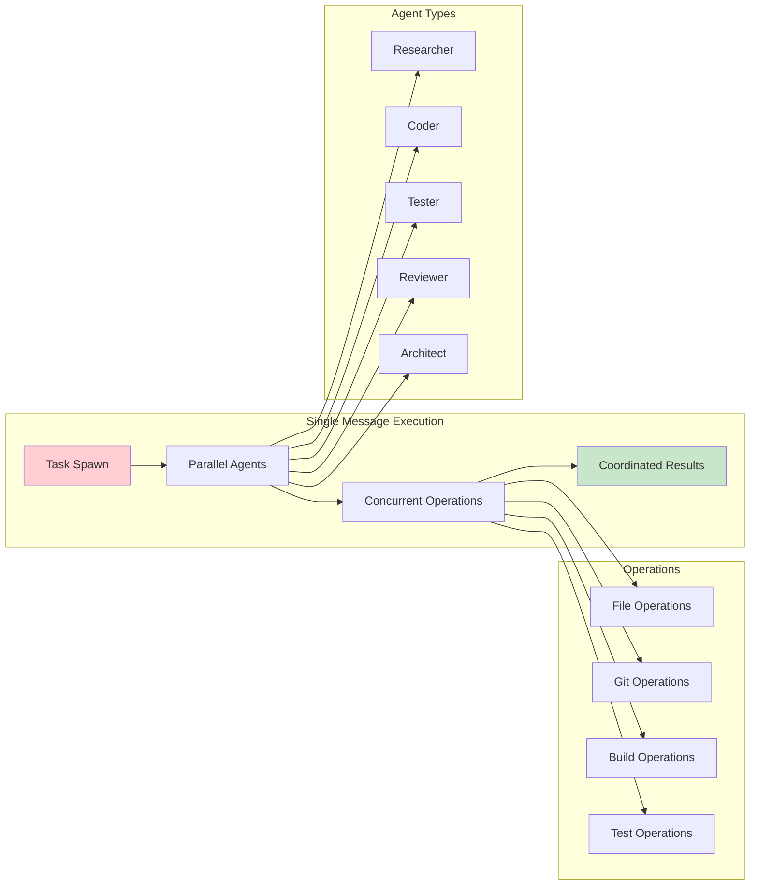

## MCP Server Connection Patterns

### Multi-Server Architecture

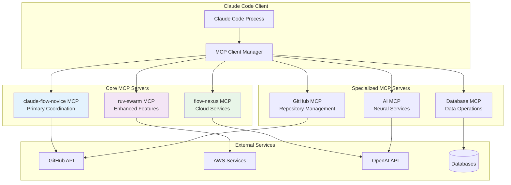

### Connection State Management

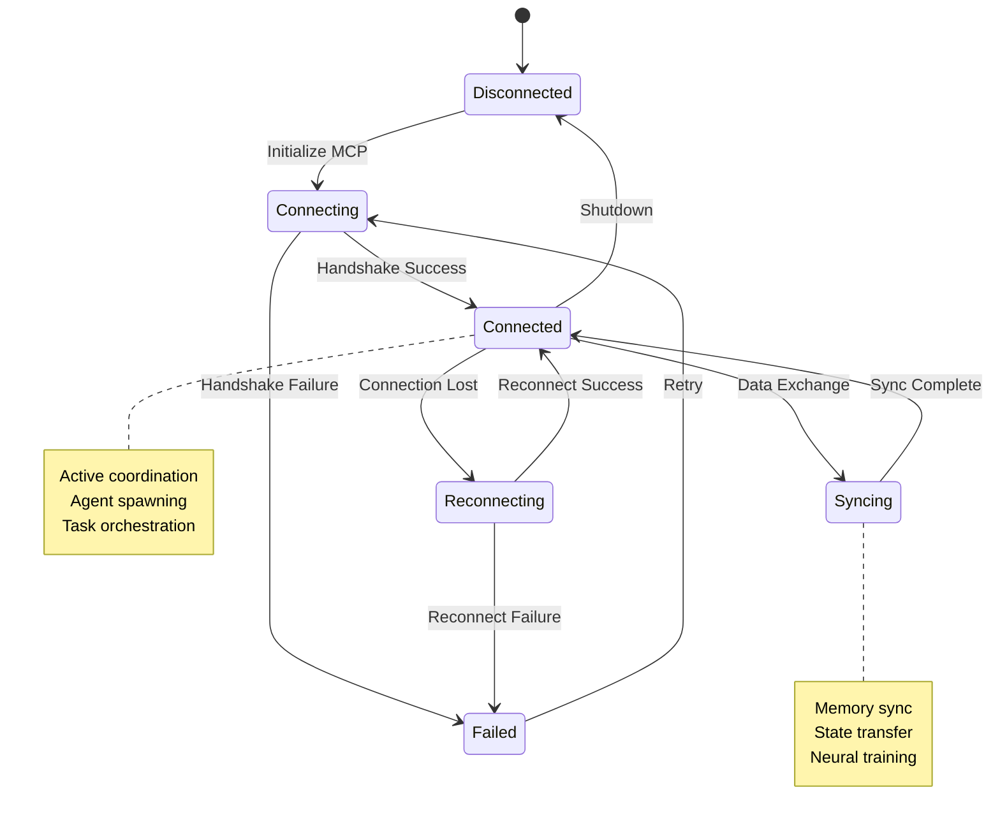

## Architecture Patterns

### Hierarchical Coordination Pattern

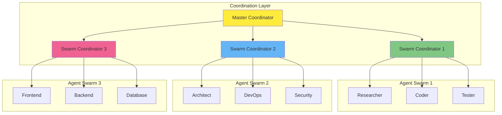

### Mesh Coordination Pattern

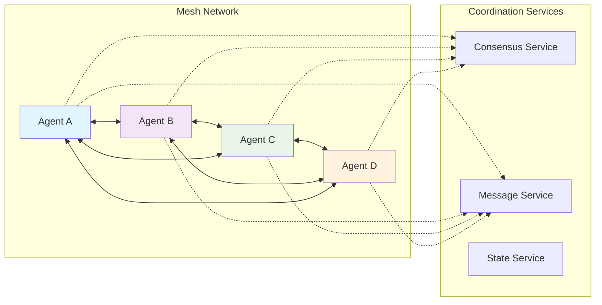

### Ring Coordination Pattern

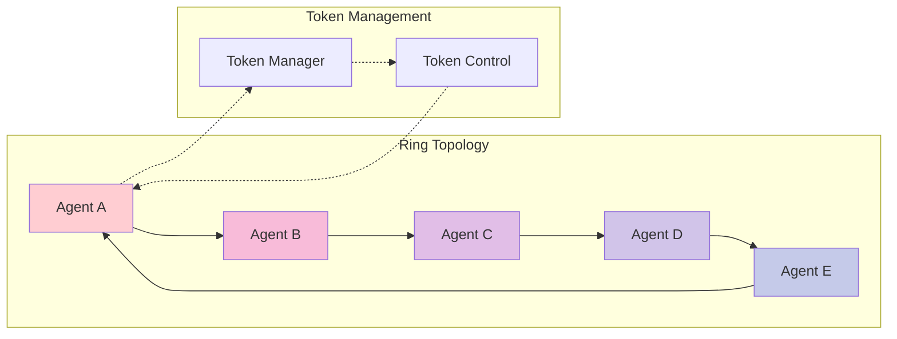

## Performance Considerations

### Parallel Execution Optimization

```mermaid
gantt
    title Agent Execution Timeline
    dateFormat X
    axisFormat %L ms

    section Traditional Sequential
    Agent 1    :done, a1, 0, 100
    Agent 2    :done, a2, after a1, 100
    Agent 3    :done, a3, after a2, 100
    Agent 4    :done, a4, after a3, 100

    section Claude Flow Parallel
    Agent 1    :active, p1, 0, 100
    Agent 2    :active, p2, 0, 100
    Agent 3    :active, p3, 0, 100
    Agent 4    :active, p4, 0, 100
```

### Memory and State Management

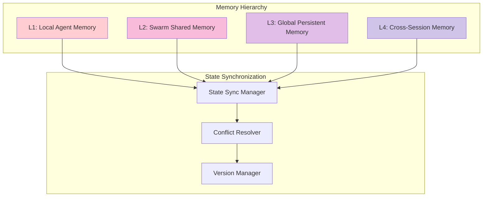

## Security Patterns

### Authentication and Authorization Flow

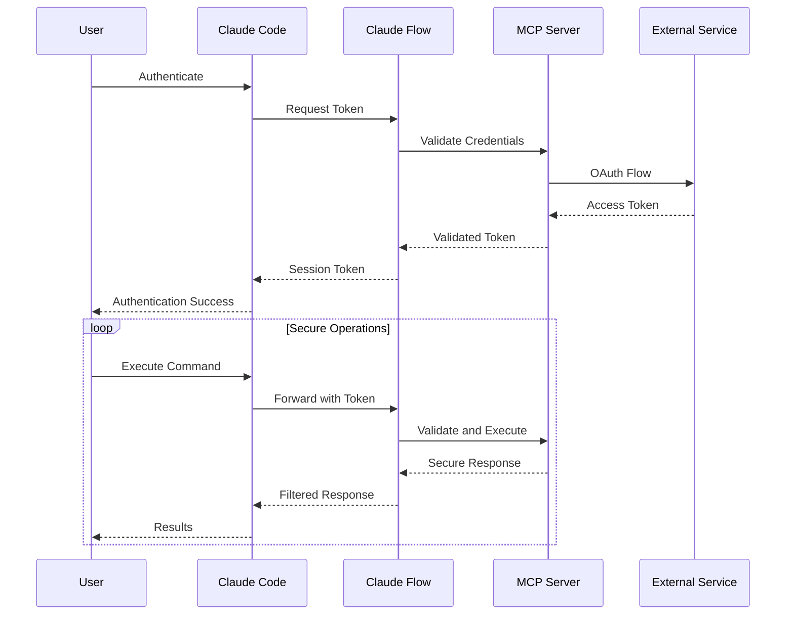

### Security Boundary Model

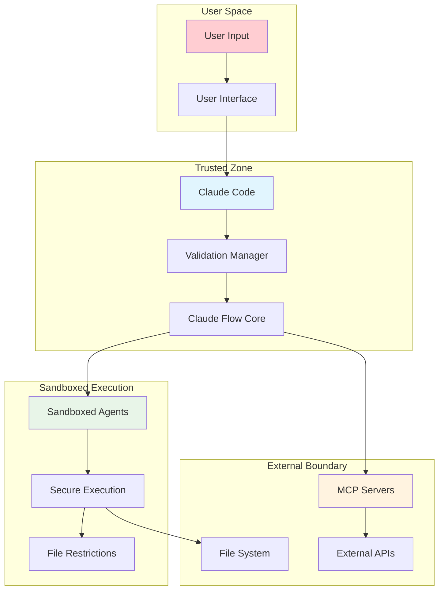

## Integration Best Practices

### 1. Concurrent Execution Pattern

Always execute related operations in a single message:

```javascript
// ✅ CORRECT: All operations in one message
[Single Message]:
  Task("Backend Dev", "Build API", "backend-dev")
  Task("Frontend Dev", "Build UI", "coder")
  Task("Test Engineer", "Write tests", "tester")
  TodoWrite({ todos: [...all todos...] })
  Write("multiple files...")
```

### 2. Memory Coordination Pattern

Use shared memory for agent coordination:

```javascript
// Agents coordinate through shared memory
npx claude-flow-novice hooks store --key "api/schema" --value "{...}"
npx claude-flow-novice hooks retrieve --key "api/schema"
```

### 3. Error Handling Pattern

Implement graceful degradation:

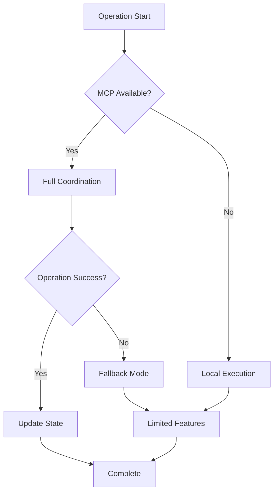

## Next Steps

- Review [Integration Examples](../examples/integration-patterns.md)
- Explore [Language-Specific Integration](../languages/)
- Study [Performance Optimization](../wiki/performance-optimization-strategies.md)
- Implement [Security Best Practices](../SECURITY_AUDIT_REPORT.md)