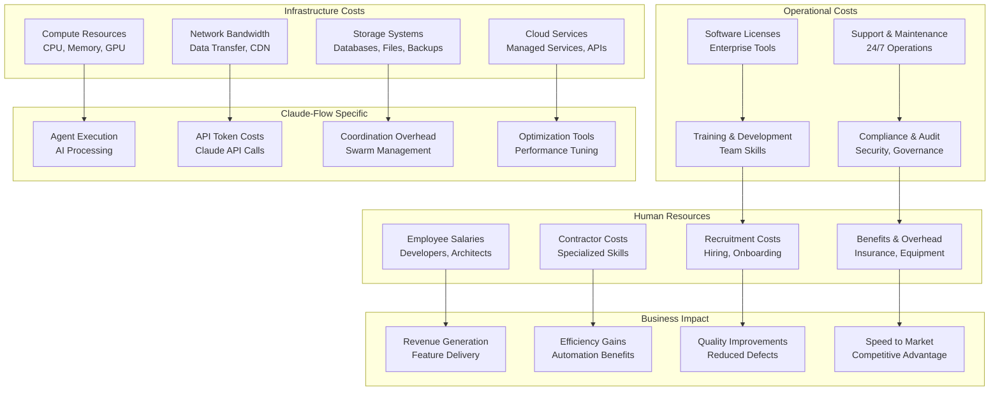

# Enterprise Cost Optimization and Resource Management

## Executive Summary

Enterprise cost optimization for Claude-Flow enables organizations to maximize ROI while scaling AI-powered development workflows efficiently. This comprehensive framework provides strategies for cost management, resource optimization, and financial governance across teams of 100+ developers and multiple projects.

## Cost Management Architecture

### 1. Multi-Dimensional Cost Model



### 2. Cost Attribution Model

```typescript
// Comprehensive cost attribution framework
export interface CostAttributionModel {
  // Direct costs attributable to specific teams/projects
  direct_costs: {
    team_costs: {
      salaries_and_benefits: number;
      contractor_costs: number;
      training_and_development: number;
      equipment_and_tools: number;
    };

    project_costs: {
      infrastructure_allocation: number;
      license_allocation: number;
      third_party_services: number;
      compliance_costs: number;
    };

    claude_flow_costs: {
      agent_execution_costs: number;
      api_token_consumption: number;
      infrastructure_overhead: number;
      storage_and_networking: number;
    };
  };

  // Shared costs allocated across teams/projects
  shared_costs: {
    platform_operations: {
      shared_infrastructure: number;
      platform_team_costs: number;
      monitoring_and_observability: number;
      security_and_compliance: number;
    };

    organizational_overhead: {
      management_overhead: number;
      hr_and_recruiting: number;
      facilities_and_utilities: number;
      corporate_services: number;
    };
  };

  // Allocation methodologies
  allocation_methods: {
    direct_allocation: "direct_assignment_to_cost_center";
    usage_based_allocation: "proportional_to_resource_usage";
    headcount_allocation: "proportional_to_team_size";
    revenue_allocation: "proportional_to_revenue_contribution";
  };
}

// Cost tracking and analytics
export class CostTracker {

  async calculateTotalCostOfOwnership(
    organization: Organization,
    time_period: TimePeriod
  ): Promise<TCOAnalysis> {

    const [
      infrastructure_costs,
      operational_costs,
      human_resource_costs,
      claude_flow_specific_costs
    ] = await Promise.all([
      this.calculateInfrastructureCosts(organization, time_period),
      this.calculateOperationalCosts(organization, time_period),
      this.calculateHumanResourceCosts(organization, time_period),
      this.calculateClaudeFlowCosts(organization, time_period)
    ]);

    const total_costs = {
      infrastructure: infrastructure_costs.total,
      operational: operational_costs.total,
      human_resources: human_resource_costs.total,
      claude_flow: claude_flow_specific_costs.total
    };

    const tco = Object.values(total_costs).reduce((sum, cost) => sum + cost, 0);

    return {
      total_cost_of_ownership: tco,
      cost_breakdown: total_costs,
      cost_per_developer: tco / organization.developer_count,
      cost_per_project: tco / organization.project_count,
      cost_trends: await this.analyzeCostTrends(total_costs, time_period),
      optimization_opportunities: await this.identifyCostOptimizations(total_costs)
    };
  }

  async calculateROI(
    costs: CostBreakdown,
    benefits: BenefitQuantification,
    time_period: TimePeriod
  ): Promise<ROIAnalysis> {

    const total_investment = costs.total_costs;
    const total_benefits = benefits.quantified_benefits;

    const roi_percentage = ((total_benefits - total_investment) / total_investment) * 100;
    const payback_period = this.calculatePaybackPeriod(costs, benefits);
    const npv = this.calculateNetPresentValue(costs, benefits, time_period);

    return {
      roi_percentage,
      payback_period_months: payback_period,
      net_present_value: npv,
      benefit_cost_ratio: total_benefits / total_investment,
      break_even_analysis: this.performBreakEvenAnalysis(costs, benefits),
      sensitivity_analysis: this.performSensitivityAnalysis(costs, benefits)
    };
  }
}
```

## Resource Optimization Strategies

### 1. Infrastructure Cost Optimization

```yaml
# Infrastructure cost optimization configuration
infrastructure_optimization:
  compute_optimization:
    rightsizing:
      enabled: true
      analysis_period: "7d"
      utilization_threshold: 20
      sizing_recommendations:
        underutilized: "downsize_instance"
        overutilized: "upsize_or_scale_out"
        optimal: "maintain_current_size"

    auto_scaling:
      predictive_scaling:
        enabled: true
        prediction_window: "2h"
        scale_up_threshold: 70
        scale_down_threshold: 30

      scheduled_scaling:
        business_hours_scaling:
          weekdays: "08:00-18:00"
          scale_factor: 1.5
        off_hours_scaling:
          nights_weekends: "18:00-08:00"
          scale_factor: 0.3

    spot_instances:
      enabled: true
      max_spot_percentage: 70
      fallback_strategy: "on_demand"
      termination_handling: "graceful_shutdown"

  storage_optimization:
    tiered_storage:
      hot_tier:
        storage_class: "ssd"
        retention_period: "30d"
        access_pattern: "frequent"

      warm_tier:
        storage_class: "standard"
        retention_period: "90d"
        access_pattern: "infrequent"

      cold_tier:
        storage_class: "glacier"
        retention_period: "7y"
        access_pattern: "archival"

    data_lifecycle:
      automated_tiering: true
      compression: "enabled"
      deduplication: "enabled"
      cleanup_policies:
        temporary_files: "24h"
        log_files: "30d"
        backup_files: "90d"

  network_optimization:
    content_delivery:
      cdn_enabled: true
      cache_optimization: "aggressive"
      compression: "gzip_brotli"

    bandwidth_optimization:
      traffic_shaping: "enabled"
      qos_policies: "business_critical_first"
      regional_optimization: "enabled"

# Claude-Flow specific optimizations
claude_flow_optimization:
  agent_execution:
    agent_pooling:
      enabled: true
      pool_size_strategy: "dynamic"
      warm_pool_minimum: 5
      max_pool_size: 100

    resource_sharing:
      shared_memory: "enabled"
      shared_compute: "enabled"
      resource_multiplexing: "enabled"

    execution_optimization:
      batch_processing: "enabled"
      parallel_execution: "optimized"
      resource_affinity: "cpu_memory_optimized"

  token_usage_optimization:
    prompt_optimization:
      template_reuse: "enabled"
      prompt_compression: "enabled"
      context_optimization: "enabled"

    caching_strategy:
      response_caching: "aggressive"
      context_caching: "enabled"
      result_memoization: "enabled"

    usage_monitoring:
      real_time_tracking: "enabled"
      cost_alerts: "enabled"
      budget_controls: "enforced"
```

### 2. Operational Cost Optimization

```typescript
// Operational cost optimization engine
export class OperationalCostOptimizer {

  async optimizeLicensingCosts(
    current_licenses: SoftwareLicense[],
    usage_analytics: UsageAnalytics
  ): Promise<LicenseOptimization> {

    const usage_analysis = await this.analyzeLicenseUsage(
      current_licenses,
      usage_analytics
    );

    const optimization_opportunities = await this.identifyLicenseOptimizations(
      usage_analysis
    );

    return {
      current_spend: this.calculateCurrentLicenseSpend(current_licenses),
      utilization_analysis: usage_analysis,
      optimization_recommendations: optimization_opportunities.map(opp => ({
        license_type: opp.license,
        current_cost: opp.current_cost,
        optimized_cost: opp.optimized_cost,
        savings_potential: opp.current_cost - opp.optimized_cost,
        recommendation: opp.action,
        risk_assessment: this.assessOptimizationRisk(opp)
      })),
      total_savings_potential: optimization_opportunities.reduce(
        (total, opp) => total + (opp.current_cost - opp.optimized_cost), 0
      ),
      implementation_plan: this.createLicenseOptimizationPlan(optimization_opportunities)
    };
  }

  async optimizeMaintenanceCosts(
    maintenance_contracts: MaintenanceContract[],
    system_health_data: SystemHealthData
  ): Promise<MaintenanceOptimization> {

    const maintenance_analysis = await this.analyzeMaintenanceValue(
      maintenance_contracts,
      system_health_data
    );

    const contract_optimization = await this.optimizeMaintenanceContracts(
      maintenance_analysis
    );

    return {
      current_maintenance_spend: this.calculateMaintenanceSpend(maintenance_contracts),
      value_analysis: maintenance_analysis,
      contract_optimizations: contract_optimization.recommendations,
      in_house_opportunities: contract_optimization.insourcing_candidates,
      vendor_consolidation: contract_optimization.consolidation_opportunities,
      estimated_savings: contract_optimization.total_savings
    };
  }

  // Vendor management and cost optimization
  async optimizeVendorCosts(
    vendor_relationships: VendorRelationship[],
    usage_patterns: VendorUsagePattern[]
  ): Promise<VendorCostOptimization> {

    const vendor_performance_analysis = await Promise.all(
      vendor_relationships.map(vendor => this.analyzeVendorPerformance(vendor))
    );

    const consolidation_opportunities = await this.identifyConsolidationOpportunities(
      vendor_relationships,
      usage_patterns
    );

    const negotiation_opportunities = await this.identifyNegotiationOpportunities(
      vendor_relationships,
      vendor_performance_analysis
    );

    return {
      current_vendor_spend: this.calculateVendorSpend(vendor_relationships),
      performance_analysis: vendor_performance_analysis,
      consolidation_savings: consolidation_opportunities.estimated_savings,
      negotiation_leverage: negotiation_opportunities.leverage_points,
      alternative_solutions: await this.identifyAlternatives(vendor_relationships),
      optimization_roadmap: this.createVendorOptimizationRoadmap({
        consolidation_opportunities,
        negotiation_opportunities
      })
    };
  }
}

// Training and development cost optimization
export class TrainingCostOptimizer {

  async optimizeTrainingInvestments(
    team: Team,
    current_training_spend: TrainingSpend,
    skill_requirements: SkillRequirement[]
  ): Promise<TrainingOptimization> {

    const skill_gap_analysis = await this.analyzeSkillGaps(team, skill_requirements);
    const training_effectiveness = await this.analyzeTrainingEffectiveness(
      current_training_spend
    );

    const optimization_strategy = await this.developOptimizationStrategy(
      skill_gap_analysis,
      training_effectiveness
    );

    return {
      current_training_roi: training_effectiveness.roi,
      skill_prioritization: skill_gap_analysis.prioritized_gaps,
      training_mix_optimization: optimization_strategy.optimal_mix,
      cost_effective_alternatives: optimization_strategy.alternatives,
      internal_capability_development: optimization_strategy.internal_programs,
      projected_savings: optimization_strategy.cost_savings
    };
  }

  async implementMicrolearning(
    team: Team,
    learning_objectives: LearningObjective[]
  ): Promise<MicrolearningProgram> {

    const personalized_paths = await Promise.all(
      team.members.map(member => this.createPersonalizedPath(member, learning_objectives))
    );

    const content_curation = await this.curateOptimalContent(learning_objectives);

    return {
      personalized_learning_paths: personalized_paths,
      curated_content_library: content_curation.library,
      delivery_mechanisms: content_curation.delivery_methods,
      progress_tracking: this.setupProgressTracking(personalized_paths),
      cost_comparison: this.compareCostsWithTraditionalTraining(
        personalized_paths,
        content_curation
      )
    };
  }
}
```

### 3. Human Resource Cost Optimization

```yaml
# Human resource cost optimization
hr_cost_optimization:
  recruitment_optimization:
    sourcing_strategy:
      internal_referrals: "30% of hires"
      professional_networks: "25% of hires"
      university_partnerships: "20% of hires"
      external_recruiters: "15% of hires"
      direct_sourcing: "10% of hires"

    cost_per_hire_reduction:
      target: "< $5000 per hire"
      strategies:
        - "employee_referral_programs"
        - "university_recruiting_partnerships"
        - "social_media_sourcing"
        - "automated_screening"

    time_to_hire_optimization:
      target: "< 30 days"
      strategies:
        - "streamlined_interview_process"
        - "automated_initial_screening"
        - "concurrent_interview_rounds"
        - "faster_decision_making"

  retention_optimization:
    retention_rate_target: "> 90%"

    retention_strategies:
      career_development:
        budget_allocation: "5% of salary budget"
        programs: ["mentoring", "skill_development", "leadership_training"]

      compensation_optimization:
        market_analysis: "quarterly"
        adjustment_frequency: "annual"
        equity_participation: "all_employees"

      work_life_balance:
        flexible_working: "hybrid_model"
        time_off_policy: "unlimited_pto"
        wellness_programs: "comprehensive"

  productivity_optimization:
    developer_productivity_metrics:
      - "code_commits_per_day"
      - "feature_delivery_velocity"
      - "code_review_efficiency"
      - "knowledge_sharing_participation"

    automation_investment:
      target_automation_level: "70% of repetitive tasks"
      automation_areas:
        - "code_testing"
        - "deployment_processes"
        - "documentation_generation"
        - "performance_monitoring"

    skill_utilization:
      optimal_skill_match: "> 80%"
      cross_training_investment: "10% of training budget"
      specialization_balance: "70% generalists, 30% specialists"

# Contractor and vendor optimization
contractor_optimization:
  contractor_vs_employee_analysis:
    decision_criteria:
      duration: "< 6 months → contractor"
      skill_rarity: "very_rare → contractor"
      knowledge_transfer: "critical → employee"
      cost_comparison: "20% premium acceptable for contractors"

  vendor_management:
    preferred_vendor_program:
      tier_1_vendors: "3-5 strategic partners"
      volume_discounts: "negotiated annually"
      performance_based_contracts: "SLA with penalties"

    contract_optimization:
      flexible_capacity: "scale up/down 25% without penalties"
      outcome_based_pricing: "value-based contracts"
      risk_sharing: "shared risk/reward models"
```

## Financial Governance and Budgeting

### 1. Budget Management Framework

```typescript
// Comprehensive budget management system
export class BudgetManager {

  async createAnnualBudget(
    organization: Organization,
    business_objectives: BusinessObjective[],
    constraints: BudgetConstraint[]
  ): Promise<AnnualBudget> {

    const historical_analysis = await this.analyzeHistoricalSpending(organization);
    const growth_projections = await this.projectGrowthRequirements(business_objectives);
    const optimization_opportunities = await this.identifyOptimizationOpportunities(
      historical_analysis
    );

    const budget_allocation = await this.optimizeBudgetAllocation({
      historical_baseline: historical_analysis.baseline,
      growth_requirements: growth_projections.requirements,
      optimization_savings: optimization_opportunities.savings,
      constraints: constraints
    });

    return {
      total_budget: budget_allocation.total,
      category_allocation: budget_allocation.categories,
      quarterly_distribution: budget_allocation.quarterly_breakdown,
      contingency_reserves: budget_allocation.contingency,
      optimization_targets: budget_allocation.optimization_goals,
      monitoring_framework: this.createBudgetMonitoringFramework(budget_allocation)
    };
  }

  async manageBudgetVariance(
    actual_spending: SpendingData,
    budgeted_amounts: BudgetAllocation,
    time_period: TimePeriod
  ): Promise<VarianceAnalysis> {

    const variance_analysis = this.calculateVariances(actual_spending, budgeted_amounts);
    const root_cause_analysis = await this.analyzeVarianceRootCauses(variance_analysis);
    const corrective_actions = await this.generateCorrectiveActions(root_cause_analysis);

    return {
      total_variance: variance_analysis.total_variance,
      category_variances: variance_analysis.category_variances,
      variance_explanations: root_cause_analysis.explanations,
      corrective_action_plan: corrective_actions.action_plan,
      budget_reforecast: corrective_actions.reforecast,
      early_warning_indicators: this.identifyEarlyWarningIndicators(variance_analysis)
    };
  }

  // Zero-based budgeting implementation
  async implementZeroBasedBudgeting(
    organization: Organization,
    budget_period: BudgetPeriod
  ): Promise<ZeroBasedBudget> {

    const activity_analysis = await this.analyzeAllActivities(organization);
    const value_assessment = await this.assessActivityValue(activity_analysis.activities);
    const priority_ranking = await this.rankActivitiesByValue(value_assessment);

    const budget_build_up = await this.buildBudgetFromZero(
      priority_ranking,
      organization.budget_constraints
    );

    return {
      justified_activities: budget_build_up.approved_activities,
      eliminated_activities: budget_build_up.eliminated_activities,
      optimized_activities: budget_build_up.optimized_activities,
      total_budget: budget_build_up.total_budget,
      savings_identified: this.calculateSavingsFromElimination(
        activity_analysis.baseline_cost,
        budget_build_up.total_budget
      ),
      implementation_roadmap: this.createZBBImplementationRoadmap(budget_build_up)
    };
  }

  // Dynamic budget reallocation
  async performDynamicReallocation(
    current_budget: BudgetAllocation,
    performance_data: PerformanceData,
    changing_priorities: Priority[]
  ): Promise<BudgetReallocation> {

    const performance_analysis = await this.analyzePerformanceVsBudget(
      current_budget,
      performance_data
    );

    const reallocation_opportunities = await this.identifyReallocationOpportunities(
      performance_analysis,
      changing_priorities
    );

    const optimized_allocation = await this.optimizeAllocation(
      current_budget,
      reallocation_opportunities
    );

    return {
      current_allocation: current_budget,
      proposed_allocation: optimized_allocation.new_allocation,
      reallocation_rationale: optimized_allocation.rationale,
      expected_impact: optimized_allocation.projected_impact,
      implementation_timeline: optimized_allocation.timeline,
      risk_assessment: this.assessReallocationRisks(optimized_allocation)
    };
  }
}

// Financial forecasting and planning
export class FinancialForecaster {

  async generateFinancialForecast(
    historical_data: FinancialHistory,
    business_drivers: BusinessDriver[],
    forecast_horizon: ForecastHorizon
  ): Promise<FinancialForecast> {

    const base_forecast = await this.buildBaseForecast(historical_data, forecast_horizon);
    const driver_impact = await this.modelBusinessDriverImpact(business_drivers);
    const scenario_analysis = await this.performScenarioAnalysis(base_forecast, driver_impact);

    return {
      base_case_forecast: base_forecast,
      optimistic_scenario: scenario_analysis.optimistic,
      pessimistic_scenario: scenario_analysis.pessimistic,
      most_likely_scenario: scenario_analysis.most_likely,
      key_assumptions: scenario_analysis.assumptions,
      sensitivity_analysis: await this.performSensitivityAnalysis(scenario_analysis),
      confidence_intervals: this.calculateConfidenceIntervals(scenario_analysis)
    };
  }

  async modelClaudeFlowCostGrowth(
    current_usage: ClaudeFlowUsage,
    growth_projections: GrowthProjection[]
  ): Promise<CostGrowthModel> {

    const usage_patterns = this.analyzeUsagePatterns(current_usage);
    const scaling_factors = await this.calculateScalingFactors(usage_patterns);
    const cost_elasticity = await this.modelCostElasticity(usage_patterns, scaling_factors);

    return {
      usage_growth_model: usage_patterns.growth_model,
      cost_scaling_model: scaling_factors.scaling_model,
      elasticity_factors: cost_elasticity.elasticity_coefficients,
      break_even_analysis: this.performBreakEvenAnalysis(cost_elasticity),
      optimization_thresholds: this.identifyOptimizationThresholds(cost_elasticity)
    };
  }
}
```

### 2. Cost Allocation and Chargeback

```yaml
# Cost allocation and chargeback system
cost_allocation:
  methodology: "activity_based_costing"

  allocation_hierarchy:
    level_1_corporate:
      allocation_basis: "headcount"
      percentage: 15
      includes: ["executive_management", "hr", "finance", "legal"]

    level_2_engineering:
      allocation_basis: "usage_based"
      percentage: 70
      includes: ["development", "testing", "deployment", "infrastructure"]

    level_3_support:
      allocation_basis: "service_level"
      percentage: 15
      includes: ["customer_support", "maintenance", "documentation"]

  chargeback_model:
    frequency: "monthly"

    pricing_structure:
      infrastructure:
        compute_hour: "$0.08"
        storage_gb_month: "$0.12"
        network_gb: "$0.05"

      claude_flow_services:
        agent_execution_hour: "$2.50"
        api_token_1k: "$0.15"
        coordination_overhead: "$0.30/hour"

      platform_services:
        ci_cd_pipeline_hour: "$0.40"
        monitoring_dashboard: "$15/month"
        security_scanning: "$0.20/scan"

    discount_structure:
      volume_discounts:
        tier_1: "< 1000 hours → 0% discount"
        tier_2: "1000-5000 hours → 5% discount"
        tier_3: "5000+ hours → 10% discount"

      commitment_discounts:
        annual_commitment: "15% discount"
        multi_year_commitment: "25% discount"

  showback_analytics:
    cost_transparency:
      real_time_dashboards: "enabled"
      detailed_cost_breakdown: "monthly_reports"
      trend_analysis: "quarterly_reviews"

    usage_optimization_insights:
      efficiency_recommendations: "automated"
      cost_saving_opportunities: "highlighted"
      best_practice_sharing: "cross_team"

# Financial governance
financial_governance:
  approval_workflows:
    budget_approvals:
      tactical_expenses: "< $1000 → team_lead"
      operational_expenses: "$1000-$10000 → department_head"
      strategic_investments: "> $10000 → executive_approval"

    procurement_process:
      vendor_evaluation: "standardized_scoring"
      contract_negotiation: "legal_review_required"
      purchase_authorization: "multi_level_approval"

  cost_controls:
    spending_limits:
      team_monthly_limit: "$50000"
      project_budget_variance: "± 10%"
      emergency_spending_approval: "cfo_required"

    automated_controls:
      budget_alerts: "80% of budget consumed"
      spending_freezes: "automatic at 95% budget"
      approval_escalation: "automatic for overages"

  compliance_monitoring:
    financial_auditing:
      frequency: "quarterly"
      scope: "all_cost_centers"
      external_audit: "annual"

    policy_compliance:
      procurement_policy: "100% compliance required"
      expense_policy: "automated_validation"
      budget_policy: "variance_reporting_required"
```

## Value Engineering and ROI Optimization

### 1. Value Stream Analysis

```typescript
// Value stream analysis for cost optimization
export class ValueStreamAnalyzer {

  async analyzeValueStream(
    development_process: DevelopmentProcess,
    cost_data: CostData,
    value_delivery_metrics: ValueMetrics
  ): Promise<ValueStreamAnalysis> {

    const process_mapping = await this.mapValueStream(development_process);
    const cost_attribution = await this.attributeCostsToActivities(
      process_mapping.activities,
      cost_data
    );
    const value_analysis = await this.analyzeValueCreation(
      process_mapping.activities,
      value_delivery_metrics
    );

    const waste_identification = await this.identifyWaste(
      process_mapping,
      cost_attribution,
      value_analysis
    );

    return {
      value_stream_map: process_mapping,
      cost_per_activity: cost_attribution,
      value_per_activity: value_analysis,
      waste_categories: waste_identification.categories,
      optimization_opportunities: waste_identification.opportunities,
      roi_improvement_potential: this.calculateROIImprovement(
        cost_attribution,
        value_analysis,
        waste_identification
      )
    };
  }

  async optimizeValueDelivery(
    current_value_stream: ValueStream,
    optimization_constraints: OptimizationConstraint[]
  ): Promise<ValueStreamOptimization> {

    const bottleneck_analysis = await this.identifyBottlenecks(current_value_stream);
    const elimination_opportunities = await this.identifyEliminationOpportunities(
      current_value_stream
    );
    const automation_opportunities = await this.identifyAutomationOpportunities(
      current_value_stream
    );

    const optimized_stream = await this.designOptimizedValueStream({
      current_stream: current_value_stream,
      bottleneck_resolutions: bottleneck_analysis.resolutions,
      eliminations: elimination_opportunities.approved_eliminations,
      automations: automation_opportunities.approved_automations,
      constraints: optimization_constraints
    });

    return {
      current_metrics: this.calculateCurrentMetrics(current_value_stream),
      optimized_metrics: this.calculateOptimizedMetrics(optimized_stream),
      improvement_summary: this.summarizeImprovements(
        current_value_stream,
        optimized_stream
      ),
      implementation_plan: this.createImplementationPlan(optimized_stream),
      roi_projection: this.projectROI(current_value_stream, optimized_stream)
    };
  }

  // Feature value assessment
  async assessFeatureValue(
    delivered_features: DeliveredFeature[],
    development_costs: DevelopmentCost[],
    business_metrics: BusinessMetric[]
  ): Promise<FeatureValueAssessment> {

    const feature_cost_mapping = await this.mapFeaturesToCosts(
      delivered_features,
      development_costs
    );

    const value_realization = await this.measureValueRealization(
      delivered_features,
      business_metrics
    );

    const value_efficiency = await this.calculateValueEfficiency(
      feature_cost_mapping,
      value_realization
    );

    return {
      feature_portfolio_analysis: this.analyzeFeaturePortfolio(
        feature_cost_mapping,
        value_realization
      ),
      high_value_features: value_efficiency.high_performers,
      low_value_features: value_efficiency.low_performers,
      optimization_recommendations: this.generateFeatureOptimizationRecommendations(
        value_efficiency
      ),
      portfolio_rebalancing: this.recommendPortfolioRebalancing(value_efficiency)
    };
  }
}

// Investment prioritization
export class InvestmentPrioritizer {

  async prioritizeInvestments(
    investment_opportunities: InvestmentOpportunity[],
    budget_constraints: BudgetConstraint[],
    strategic_objectives: StrategicObjective[]
  ): Promise<InvestmentPrioritization> {

    const financial_analysis = await Promise.all(
      investment_opportunities.map(opp => this.analyzeFinancialViability(opp))
    );

    const strategic_alignment = await Promise.all(
      investment_opportunities.map(opp =>
        this.assessStrategicAlignment(opp, strategic_objectives)
      )
    );

    const risk_assessment = await Promise.all(
      investment_opportunities.map(opp => this.assessInvestmentRisk(opp))
    );

    const portfolio_optimization = await this.optimizeInvestmentPortfolio({
      opportunities: investment_opportunities,
      financial_analysis,
      strategic_alignment,
      risk_assessment,
      constraints: budget_constraints
    });

    return {
      prioritized_investments: portfolio_optimization.ranked_investments,
      portfolio_composition: portfolio_optimization.optimal_portfolio,
      expected_returns: portfolio_optimization.projected_returns,
      risk_profile: portfolio_optimization.portfolio_risk,
      implementation_sequence: portfolio_optimization.implementation_plan,
      monitoring_framework: this.createInvestmentMonitoringFramework(
        portfolio_optimization
      )
    };
  }

  async performPortfolioRebalancing(
    current_portfolio: InvestmentPortfolio,
    performance_data: PortfolioPerformance,
    market_conditions: MarketCondition[]
  ): Promise<PortfolioRebalancing> {

    const performance_analysis = await this.analyzePortfolioPerformance(
      current_portfolio,
      performance_data
    );

    const market_impact_analysis = await this.analyzeMarketImpact(
      current_portfolio,
      market_conditions
    );

    const rebalancing_opportunities = await this.identifyRebalancingOpportunities(
      performance_analysis,
      market_impact_analysis
    );

    return {
      current_allocation: current_portfolio.allocation,
      recommended_allocation: rebalancing_opportunities.optimal_allocation,
      rebalancing_rationale: rebalancing_opportunities.rationale,
      expected_improvement: rebalancing_opportunities.projected_improvement,
      transition_plan: this.createTransitionPlan(rebalancing_opportunities),
      risk_mitigation: this.createRiskMitigation(rebalancing_opportunities)
    };
  }
}
```

### 2. Continuous Cost Optimization

```yaml
# Continuous cost optimization framework
continuous_optimization:
  optimization_cycles:
    daily_optimization:
      resource_rightsizing: "automated"
      usage_monitoring: "real_time"
      cost_alerts: "immediate"

    weekly_optimization:
      usage_pattern_analysis: "automated"
      recommendation_generation: "ai_powered"
      quick_wins_identification: "prioritized"

    monthly_optimization:
      comprehensive_cost_review: "detailed"
      vendor_performance_analysis: "systematic"
      budget_variance_analysis: "thorough"

    quarterly_optimization:
      strategic_cost_review: "executive_level"
      major_initiative_evaluation: "comprehensive"
      annual_planning_preparation: "forward_looking"

  automation_framework:
    cost_monitoring:
      real_time_dashboards: "executive_and_operational"
      automated_alerting: "threshold_based"
      anomaly_detection: "ml_powered"

    optimization_actions:
      auto_scaling: "demand_responsive"
      resource_decommissioning: "usage_based"
      contract_optimization: "renewal_triggered"

    reporting_automation:
      cost_attribution: "automated_allocation"
      variance_analysis: "ai_generated_insights"
      recommendation_prioritization: "impact_based"

  success_metrics:
    cost_efficiency:
      cost_per_developer: "monthly_tracking"
      cost_per_feature: "quarterly_assessment"
      infrastructure_efficiency: "continuous_monitoring"

    optimization_effectiveness:
      savings_realization: "monthly_measurement"
      optimization_implementation_rate: "quarterly_review"
      cost_avoidance: "annual_calculation"

# Advanced cost optimization techniques
advanced_techniques:
  machine_learning_optimization:
    predictive_scaling:
      algorithm: "time_series_forecasting"
      prediction_horizon: "4_hours"
      accuracy_target: "> 90%"

    cost_anomaly_detection:
      algorithm: "isolation_forest"
      sensitivity: "medium"
      false_positive_tolerance: "< 5%"

    optimization_recommendation:
      algorithm: "reinforcement_learning"
      training_data: "historical_cost_and_performance"
      recommendation_confidence: "> 80%"

  dynamic_pricing_optimization:
    spot_instance_optimization:
      bid_strategy: "adaptive"
      termination_handling: "graceful"
      cost_savings_target: "> 60%"

    reserved_instance_optimization:
      capacity_planning: "demand_forecasting"
      term_optimization: "cost_benefit_analysis"
      portfolio_management: "automated_rebalancing"

  supply_chain_optimization:
    vendor_consolidation:
      evaluation_criteria: ["cost", "quality", "reliability", "innovation"]
      consolidation_target: "30% vendor_reduction"
      risk_mitigation: "dual_sourcing_for_critical_services"

    contract_optimization:
      negotiation_triggers: ["renewal_date", "performance_issues", "market_changes"]
      optimization_targets: ["cost_reduction", "service_improvement", "flexibility"]
      success_metrics: ["total_cost_of_ownership", "service_level_achievement"]
```

## Performance Metrics and KPIs

### 1. Financial Performance Indicators

```typescript
// Comprehensive financial KPIs
export interface FinancialKPIs {
  cost_efficiency_metrics: {
    cost_per_developer_per_month: {
      target: number;
      current: number;
      trend: "improving" | "stable" | "declining";
    };

    cost_per_feature_delivered: {
      target: number;
      current: number;
      benchmark: number;
    };

    infrastructure_utilization_rate: {
      target: number; // > 75%
      current: number;
      optimization_opportunity: number;
    };

    claude_flow_efficiency_ratio: {
      description: "Value delivered per dollar spent on Claude-Flow";
      target: number; // > 5:1
      current: number;
      improvement_trend: number;
    };
  };

  budget_performance_metrics: {
    budget_variance: {
      target: number; // < ±5%
      current: number;
      forecast_accuracy: number;
    };

    cost_predictability: {
      description: "Consistency of actual vs. budgeted costs";
      target: number; // > 90%
      current: number;
      volatility_index: number;
    };

    optimization_savings_realization: {
      target: number; // > 80% of identified savings
      current: number;
      cumulative_savings: number;
    };
  };

  roi_metrics: {
    claude_flow_roi: {
      target: number; // > 300%
      current: number;
      payback_period: number; // months
    };

    productivity_improvement_roi: {
      target: number; // > 200%
      current: number;
      productivity_multiplier: number;
    };

    quality_improvement_roi: {
      description: "ROI from reduced defects and improved quality";
      target: number; // > 150%
      current: number;
      defect_cost_savings: number;
    };
  };

  value_metrics: {
    feature_delivery_velocity: {
      target: number; // features per month
      current: number;
      cost_per_velocity_unit: number;
    };

    time_to_market_improvement: {
      target: number; // % improvement
      current: number;
      revenue_impact: number;
    };

    customer_value_realization: {
      description: "Customer value delivered per dollar invested";
      target: number;
      current: number;
      customer_satisfaction_correlation: number;
    };
  };
}

// KPI tracking and analysis
export class KPITracker {

  async trackFinancialKPIs(
    organization: Organization,
    tracking_period: TimePeriod
  ): Promise<KPIReport> {

    const current_metrics = await this.calculateCurrentKPIs(organization, tracking_period);
    const historical_trends = await this.analyzeHistoricalTrends(organization, tracking_period);
    const benchmark_comparison = await this.compareToBenchmarks(current_metrics);

    return {
      current_performance: current_metrics,
      trend_analysis: historical_trends,
      benchmark_position: benchmark_comparison,
      performance_insights: this.generatePerformanceInsights(
        current_metrics,
        historical_trends,
        benchmark_comparison
      ),
      improvement_recommendations: this.generateImprovementRecommendations(
        current_metrics,
        benchmark_comparison
      )
    };
  }

  async generateExecutiveDashboard(
    kpi_data: KPIReport,
    executive_preferences: ExecutivePreferences
  ): Promise<ExecutiveDashboard> {

    const key_highlights = this.extractKeyHighlights(kpi_data);
    const risk_indicators = this.identifyRiskIndicators(kpi_data);
    const action_items = this.prioritizeActionItems(kpi_data);

    return {
      executive_summary: this.createExecutiveSummary(key_highlights),
      performance_scorecard: this.createPerformanceScorecard(kpi_data),
      risk_dashboard: this.createRiskDashboard(risk_indicators),
      action_prioritization: this.createActionPrioritization(action_items),
      forward_looking_indicators: this.createForwardLookingIndicators(kpi_data)
    };
  }
}
```

### 2. Operational Efficiency Metrics

```yaml
# Operational efficiency measurement
operational_metrics:
  resource_utilization:
    compute_utilization:
      target: "> 75%"
      measurement: "average_cpu_memory_usage"
      optimization_threshold: "< 60%"

    storage_efficiency:
      target: "> 80%"
      measurement: "used_storage / allocated_storage"
      waste_indicator: "< 50%"

    network_efficiency:
      target: "< 10% idle bandwidth"
      measurement: "bandwidth_utilization"
      optimization_opportunity: "> 20% idle"

  process_efficiency:
    automation_rate:
      target: "> 70%"
      measurement: "automated_tasks / total_tasks"
      improvement_opportunity: "< 50%"

    manual_effort_reduction:
      target: "> 30% annual reduction"
      measurement: "manual_hours / total_hours"
      roi_calculation: "labor_cost_savings"

    error_rate_reduction:
      target: "< 1% error rate"
      measurement: "errors / total_operations"
      cost_impact: "error_resolution_cost"

  vendor_efficiency:
    vendor_performance_score:
      target: "> 90%"
      measurement: "sla_compliance_rate"
      cost_effectiveness: "value / cost_ratio"

    contract_utilization:
      target: "> 85%"
      measurement: "actual_usage / contracted_capacity"
      waste_identification: "< 70%"

    vendor_consolidation_efficiency:
      target: "< 20 vendors"
      measurement: "number_of_vendors"
      management_overhead: "vendor_management_cost"

# Cost optimization impact measurement
optimization_impact:
  savings_realization:
    immediate_savings:
      timeframe: "0-3 months"
      measurement: "actual_cost_reduction"
      validation: "before_after_comparison"

    medium_term_savings:
      timeframe: "3-12 months"
      measurement: "cumulative_cost_avoidance"
      validation: "baseline_projection_comparison"

    long_term_value:
      timeframe: "12+ months"
      measurement: "strategic_value_creation"
      validation: "business_impact_assessment"

  efficiency_improvements:
    productivity_gains:
      measurement: "output_per_dollar_invested"
      target: "> 25% improvement"
      attribution: "cost_optimization_contribution"

    quality_improvements:
      measurement: "defect_reduction_rate"
      target: "> 40% reduction"
      cost_impact: "quality_cost_savings"

    speed_improvements:
      measurement: "time_to_market_reduction"
      target: "> 30% improvement"
      revenue_impact: "accelerated_revenue_realization"
```

## Implementation Roadmap

### Phase 1: Foundation and Assessment (Months 1-3)
- Implement cost tracking and attribution
- Establish baseline metrics and KPIs
- Deploy basic optimization automation
- Create financial governance framework

### Phase 2: Optimization and Automation (Months 4-6)
- Deploy advanced cost optimization algorithms
- Implement automated resource management
- Establish value stream analysis
- Create continuous optimization processes

### Phase 3: Advanced Analytics and Intelligence (Months 7-9)
- Deploy predictive cost modeling
- Implement ML-powered optimization
- Establish portfolio optimization
- Create advanced financial analytics

### Phase 4: Strategic Value Realization (Months 10-12)
- Achieve operational excellence
- Demonstrate strategic value creation
- Establish industry-leading practices
- Create sustainable optimization culture

## Success Metrics

### Financial Targets
- **Cost Reduction**: 20-30% infrastructure cost reduction
- **ROI Achievement**: > 300% ROI on Claude-Flow investment
- **Budget Accuracy**: < ±5% variance in budget predictions
- **Optimization Efficiency**: > 80% of identified savings realized

### Operational Targets
- **Resource Utilization**: > 75% average utilization
- **Automation Rate**: > 70% of cost optimization automated
- **Process Efficiency**: 30% reduction in manual effort
- **Vendor Optimization**: 25% vendor consolidation

## Related Documentation

- [Enterprise Architecture Overview](../enterprise-architecture/enterprise-architecture-overview.md)
- [Performance Monitoring](../monitoring/enterprise-observability.md)
- [Team Coordination](../team-coordination/team-scaling-strategies.md)
- [Security Framework](../security/enterprise-security-framework.md)