# Enterprise Deployment Patterns and DevOps Integration

## Executive Summary

Enterprise deployment patterns for Claude-Flow enable organizations to deliver AI-powered development workflows with high reliability, security, and scalability. This document outlines proven deployment strategies, DevOps integration patterns, and operational practices for enterprise-scale implementations.

## Deployment Architecture Patterns

```
                    🏗️ ENTERPRISE DEPLOYMENT ARCHITECTURE OVERVIEW

    ┌─────────────────────────────────────────────────────────────────┐
    │              DEPLOYMENT ENVIRONMENT HIERARCHY                    │
    └─────────────────────────┬───────────────────────────────────────┘
                              │
                              ▼
    ┌─────────────────────────────────────────────────────────────────┐
    │                   DEPLOYMENT PROGRESSION                        │
    │                                                                 │
    │  DEV → STAGING → PROD-CANARY → PROD-FULL → DR-STANDBY         │
    │   ↓      ↓            ↓           ↓           ↓                │
    │ Feature  Integration  Limited     Full      Disaster           │
    │ Testing  Testing      Rollout     Deploy    Recovery           │
    │ 100%     90%          5%→100%     100%      100%              │
    │ Auto     Auto         Manual      Manual    Auto               │
    └─────────────────────────────────────────────────────────────────┘
                              │
         ┌────────────────────┼────────────────────┐
         │                   │                    │
    ┌────▼────┐        ┌─────▼─────┐        ┌────▼────┐
    │ MULTI-  │        │BLUE-GREEN│        │ CANARY  │
    │ CLOUD   │        │DEPLOYMENT │        │DEPLOYMENT│
    │STRATEGY │        │ PATTERN   │        │ PATTERN │
    └────┬────┘        └─────┬─────┘        └────┬────┘
         │                   │                    │
         ▼                   ▼                    ▼
    ┌─────────┐        ┌─────────────┐      ┌─────────────┐
    │AWS 60%  │        │INSTANT SWAP │      │GRADUAL ROLL │
    │Azure 30%│        │ZERO DOWNTIME│      │RISK CONTROL │
    │GCP 10%  │        │AUTO ROLLBACK│      │PERF MONITOR │
    └─────────┘        └─────────────┘      └─────────────┘

    🚀 DEPLOYMENT PIPELINE FLOW:
    ┌─────────────────────────────────────────────────────────────────┐
    │ Code → CI Build → Test → Security → Package → Deploy → Monitor │
    │  ↓        ↓        ↓       ↓         ↓        ↓        ↓       │
    │ Git    Compile   Unit    SAST      Docker   Blue/    Metrics   │
    │ Push   Validate  Integr  DAST      Registry Green    Alerts    │
    │        Quality   E2E     Vulns     Helm     Canary   Logs      │
    │        Gates     Perf    License   Charts   Traffic  Health    │
    └─────────────────────────────────────────────────────────────────┘
```

### 1. Multi-Environment Strategy

```mermaid
graph TB
    subgraph "Development Environment"
        DEV_LB[Load Balancer]
        DEV_APP[Claude-Flow Dev]
        DEV_DB[Dev Database]
        DEV_CACHE[Dev Cache]
    end

    subgraph "Staging Environment"
        STAGE_LB[Load Balancer]
        STAGE_APP[Claude-Flow Staging]
        STAGE_DB[Staging Database]
        STAGE_CACHE[Staging Cache]
    end

    subgraph "Production Environment"
        PROD_LB[Load Balancer]
        PROD_APP[Claude-Flow Production]
        PROD_DB[Production Database]
        PROD_CACHE[Production Cache]
        PROD_DR[Disaster Recovery]
    end

    subgraph "Shared Services"
        REGISTRY[Container Registry]
        SECRETS[Secret Management]
        MONITORING[Monitoring Stack]
        LOGGING[Centralized Logging]
    end

    DEV_LB --> DEV_APP
    DEV_APP --> DEV_DB
    DEV_APP --> DEV_CACHE

    STAGE_LB --> STAGE_APP
    STAGE_APP --> STAGE_DB
    STAGE_APP --> STAGE_CACHE

    PROD_LB --> PROD_APP
    PROD_APP --> PROD_DB
    PROD_APP --> PROD_CACHE
    PROD_APP --> PROD_DR

    DEV_APP --> REGISTRY
    STAGE_APP --> REGISTRY
    PROD_APP --> REGISTRY

    DEV_APP --> SECRETS
    STAGE_APP --> SECRETS
    PROD_APP --> SECRETS

    DEV_APP --> MONITORING
    STAGE_APP --> MONITORING
    PROD_APP --> MONITORING

    DEV_APP --> LOGGING
    STAGE_APP --> LOGGING
    PROD_APP --> LOGGING
```



### 2. Blue-Green Deployment

```yaml
# Blue-Green deployment configuration
blue_green_deployment:
  strategy: "blue_green"

  environments:
    blue:
      name: "claude-flow-blue"
      replicas: 5
      health_check:
        path: "/health"
        timeout: "30s"
        interval: "10s"

    green:
      name: "claude-flow-green"
      replicas: 5
      health_check:
        path: "/health"
        timeout: "30s"
        interval: "10s"

  traffic_management:
    load_balancer: "aws-alb"
    switch_strategy: "instant"
    rollback_strategy: "automatic"

    validation_tests:
      - "health_check"
      - "smoke_tests"
      - "integration_tests"
      - "performance_baseline"

  automation:
    automated_switching: true
    rollback_triggers:
      - "health_check_failure"
      - "error_rate > 1%"
      - "latency > 500ms"
      - "validation_test_failure"

# Canary deployment configuration
canary_deployment:
  strategy: "canary"

  phases:
    - name: "initial_canary"
      traffic_percentage: 5
      duration: "10m"
      success_criteria:
        error_rate: "< 0.1%"
        latency_p95: "< 200ms"

    - name: "expanded_canary"
      traffic_percentage: 25
      duration: "20m"
      success_criteria:
        error_rate: "< 0.1%"
        latency_p95: "< 200ms"

    - name: "majority_canary"
      traffic_percentage: 75
      duration: "30m"
      success_criteria:
        error_rate: "< 0.1%"
        latency_p95: "< 200ms"

    - name: "full_deployment"
      traffic_percentage: 100
      duration: "ongoing"

  monitoring:
    metrics:
      - "request_rate"
      - "error_rate"
      - "latency_percentiles"
      - "agent_spawn_success_rate"
      - "task_completion_rate"

    alerts:
      - "high_error_rate"
      - "increased_latency"
      - "agent_failures"
```

### 3. Multi-Cloud Deployment

```typescript
// Multi-cloud deployment orchestration
export interface MultiCloudDeployment {

  // Cloud provider configurations
  providers: {
    aws: {
      region: "us-east-1";
      backup_region: "us-west-2";
      services: {
        compute: "EKS";
        database: "RDS";
        cache: "ElastiCache";
        storage: "S3";
        networking: "VPC";
      };
    };

    azure: {
      region: "East US";
      backup_region: "West US 2";
      services: {
        compute: "AKS";
        database: "Azure SQL";
        cache: "Azure Cache for Redis";
        storage: "Blob Storage";
        networking: "Virtual Network";
      };
    };

    gcp: {
      region: "us-central1";
      backup_region: "us-east1";
      services: {
        compute: "GKE";
        database: "Cloud SQL";
        cache: "Memorystore";
        storage: "Cloud Storage";
        networking: "VPC";
      };
    };
  };

  // Traffic distribution strategy
  traffic_distribution: {
    primary_cloud: "aws";
    secondary_cloud: "azure";
    tertiary_cloud: "gcp";

    distribution_weights: {
      aws: 60;
      azure: 30;
      gcp: 10;
    };

    failover_strategy: "automatic";
    health_check_interval: "30s";
  };

  // Data synchronization
  data_sync: {
    strategy: "active_active";
    consistency_model: "eventual_consistency";
    sync_interval: "real_time";
    conflict_resolution: "last_write_wins";
  };
}

// Multi-cloud orchestrator
export class MultiCloudOrchestrator {

  async deployToMultipleCloudProviders(
    deployment_config: MultiCloudDeployment,
    application_manifest: ApplicationManifest
  ): Promise<MultiCloudDeploymentResult> {

    const deployment_tasks = Object.entries(deployment_config.providers).map(
      ([provider, config]) => this.deployToCloudProvider(
        provider,
        config,
        application_manifest
      )
    );

    const results = await Promise.allSettled(deployment_tasks);

    return {
      deployment_summary: this.summarizeDeploymentResults(results),
      traffic_routing: await this.configureTrafficRouting(deployment_config),
      monitoring_setup: await this.setupCrossCloudMonitoring(deployment_config),
      disaster_recovery: await this.configureDRProcedures(deployment_config)
    };
  }

  async manageCloudFailover(
    failed_provider: string,
    deployment_config: MultiCloudDeployment
  ): Promise<FailoverResult> {

    // Detect failure
    const failure_assessment = await this.assessProviderFailure(failed_provider);

    // Redistribute traffic
    const traffic_rebalancing = await this.rebalanceTraffic(
      failed_provider,
      deployment_config.traffic_distribution
    );

    // Scale remaining providers
    const scaling_adjustment = await this.scaleRemainingProviders(
      failed_provider,
      deployment_config.providers
    );

    return {
      failure_assessment,
      traffic_rebalancing,
      scaling_adjustment,
      recovery_timeline: this.estimateRecoveryTimeline(failure_assessment),
      communication_plan: this.generateCommunicationPlan(failure_assessment)
    };
  }
}
```

## CI/CD Pipeline Integration

### 1. Advanced CI/CD Architecture

```yaml
# GitOps-based CI/CD pipeline
ci_cd_pipeline:
  version_control:
    provider: "GitHub Enterprise"
    branching_strategy: "GitFlow"

    branch_policies:
      main:
        protection_rules:
          - "require_pull_request_reviews"
          - "require_status_checks"
          - "require_signed_commits"
          - "restrict_pushes"

      develop:
        auto_deploy_to: "development"

      release/*:
        auto_deploy_to: "staging"

      hotfix/*:
        auto_deploy_to: "staging"
        fast_track: true

  continuous_integration:
    triggers:
      - "push_to_any_branch"
      - "pull_request_creation"
      - "pull_request_update"
      - "scheduled_nightly"

    stages:
      build:
        - "code_compilation"
        - "dependency_resolution"
        - "container_build"
        - "artifact_creation"

      test:
        - "unit_tests"
        - "integration_tests"
        - "security_scan"
        - "performance_tests"
        - "ai_agent_validation"

      quality:
        - "code_coverage_check"
        - "code_quality_analysis"
        - "dependency_vulnerability_scan"
        - "license_compliance_check"

      package:
        - "container_registry_push"
        - "helm_chart_package"
        - "artifact_signing"
        - "sbom_generation"

  continuous_deployment:
    deployment_strategies:
      development:
        strategy: "rolling_update"
        automation_level: "fully_automated"

      staging:
        strategy: "blue_green"
        automation_level: "automated_with_approval"
        approvers: ["tech_lead", "qa_lead"]

      production:
        strategy: "canary"
        automation_level: "manual_approval"
        approvers: ["engineering_manager", "sre_lead"]

    quality_gates:
      pre_deployment:
        - "all_tests_pass"
        - "security_scan_pass"
        - "performance_baseline_met"
        - "approval_obtained"

      post_deployment:
        - "health_check_pass"
        - "smoke_tests_pass"
        - "monitoring_baseline_met"
        - "rollback_capability_verified"

# Advanced pipeline features
advanced_features:
  progressive_delivery:
    feature_flags:
      provider: "LaunchDarkly"
      integration: "continuous"
      rollback_capability: true

    a_b_testing:
      framework: "Optimizely"
      automated_winner_selection: true
      significance_threshold: 0.95

  infrastructure_as_code:
    provider: "Terraform"
    state_management: "remote_backend"
    plan_review: "required"

    environments:
      - name: "development"
        auto_apply: true
      - name: "staging"
        auto_apply: false
      - name: "production"
        auto_apply: false

  security_integration:
    sast_tools: ["SonarQube", "Veracode"]
    dast_tools: ["OWASP ZAP", "Burp Suite"]
    dependency_scan: ["Snyk", "WhiteSource"]
    container_scan: ["Twistlock", "Aqua Security"]

    policy_enforcement:
      - "no_critical_vulnerabilities"
      - "license_compliance"
      - "container_base_image_approved"
      - "secrets_not_in_code"
```

### 2. GitOps Implementation

```typescript
// GitOps controller for Claude-Flow
export class GitOpsController {

  async synchronizeDeployment(
    git_repository: GitRepository,
    target_environment: Environment
  ): Promise<SynchronizationResult> {

    // Fetch latest configuration from Git
    const latest_config = await this.fetchLatestConfiguration(git_repository);

    // Compare with current deployment state
    const drift_analysis = await this.analyzeDrift(latest_config, target_environment);

    // Apply changes if drift detected
    if (drift_analysis.has_drift) {
      const sync_result = await this.applyChanges(
        drift_analysis.changes,
        target_environment
      );

      return {
        synchronization_status: "completed",
        changes_applied: sync_result.changes,
        rollback_info: sync_result.rollback_info,
        next_sync_time: this.calculateNextSyncTime()
      };
    }

    return {
      synchronization_status: "up_to_date",
      changes_applied: [],
      next_sync_time: this.calculateNextSyncTime()
    };
  }

  // Automated rollback capabilities
  async performAutomatedRollback(
    deployment_id: string,
    rollback_trigger: RollbackTrigger
  ): Promise<RollbackResult> {

    const rollback_plan = await this.generateRollbackPlan(deployment_id);

    // Validate rollback plan
    const validation_result = await this.validateRollbackPlan(rollback_plan);

    if (!validation_result.is_safe) {
      return {
        status: "failed",
        reason: "rollback_validation_failed",
        details: validation_result.errors
      };
    }

    // Execute rollback
    const execution_result = await this.executeRollback(rollback_plan);

    // Verify rollback success
    const verification_result = await this.verifyRollback(execution_result);

    return {
      status: verification_result.success ? "completed" : "failed",
      rollback_plan,
      execution_result,
      verification_result,
      recovery_time: this.calculateRecoveryTime(execution_result)
    };
  }
}

// Configuration drift detection
export class DriftDetector {

  async detectConfigurationDrift(
    desired_state: ClusterState,
    actual_state: ClusterState
  ): Promise<DriftAnalysis> {

    const differences = {
      resource_differences: await this.compareResources(
        desired_state.resources,
        actual_state.resources
      ),
      configuration_differences: await this.compareConfigurations(
        desired_state.configurations,
        actual_state.configurations
      ),
      scaling_differences: await this.compareScaling(
        desired_state.scaling,
        actual_state.scaling
      )
    };

    return {
      has_drift: this.hasDrift(differences),
      drift_severity: this.calculateDriftSeverity(differences),
      drift_categories: this.categorizeDrift(differences),
      remediation_plan: this.generateRemediationPlan(differences),
      estimated_sync_time: this.estimateSyncTime(differences)
    };
  }
}
```

## Container Orchestration

### 1. Kubernetes Production Configuration

```yaml
# Production Kubernetes manifests
apiVersion: apps/v1
kind: Deployment
metadata:
  name: claude-flow-api
  namespace: claude-flow-production
  labels:
    app: claude-flow-api
    version: v2.0.0
    environment: production
spec:
  replicas: 10
  strategy:
    type: RollingUpdate
    rollingUpdate:
      maxSurge: 2
      maxUnavailable: 1
  selector:
    matchLabels:
      app: claude-flow-api
  template:
    metadata:
      labels:
        app: claude-flow-api
        version: v2.0.0
      annotations:
        prometheus.io/scrape: "true"
        prometheus.io/port: "8080"
        prometheus.io/path: "/metrics"
    spec:
      serviceAccountName: claude-flow-service-account
      securityContext:
        runAsNonRoot: true
        runAsUser: 1000
        fsGroup: 2000
      containers:
      - name: claude-flow-api
        image: enterprise.registry.com/claude-flow/api:v2.0.0
        imagePullPolicy: Always
        ports:
        - containerPort: 8080
          name: http
        - containerPort: 8081
          name: admin
        env:
        - name: ENVIRONMENT
          value: "production"
        - name: DATABASE_URL
          valueFrom:
            secretKeyRef:
              name: claude-flow-secrets
              key: database-url
        - name: REDIS_URL
          valueFrom:
            secretKeyRef:
              name: claude-flow-secrets
              key: redis-url
        resources:
          requests:
            memory: "2Gi"
            cpu: "1000m"
          limits:
            memory: "4Gi"
            cpu: "2000m"
        livenessProbe:
          httpGet:
            path: /health
            port: 8080
          initialDelaySeconds: 30
          periodSeconds: 10
          timeoutSeconds: 5
          failureThreshold: 3
        readinessProbe:
          httpGet:
            path: /ready
            port: 8080
          initialDelaySeconds: 5
          periodSeconds: 5
          timeoutSeconds: 3
          failureThreshold: 3
        startupProbe:
          httpGet:
            path: /startup
            port: 8080
          initialDelaySeconds: 10
          periodSeconds: 10
          timeoutSeconds: 3
          failureThreshold: 30
        volumeMounts:
        - name: config-volume
          mountPath: /app/config
          readOnly: true
        - name: secret-volume
          mountPath: /app/secrets
          readOnly: true
      volumes:
      - name: config-volume
        configMap:
          name: claude-flow-config
      - name: secret-volume
        secret:
          secretName: claude-flow-secrets
      nodeSelector:
        workload-type: "api"
      affinity:
        podAntiAffinity:
          preferredDuringSchedulingIgnoredDuringExecution:
          - weight: 100
            podAffinityTerm:
              labelSelector:
                matchExpressions:
                - key: app
                  operator: In
                  values:
                  - claude-flow-api
              topologyKey: kubernetes.io/hostname
      tolerations:
      - key: "workload-type"
        operator: "Equal"
        value: "api"
        effect: "NoSchedule"

---
# Horizontal Pod Autoscaler
apiVersion: autoscaling/v2
kind: HorizontalPodAutoscaler
metadata:
  name: claude-flow-api-hpa
  namespace: claude-flow-production
spec:
  scaleTargetRef:
    apiVersion: apps/v1
    kind: Deployment
    name: claude-flow-api
  minReplicas: 5
  maxReplicas: 50
  metrics:
  - type: Resource
    resource:
      name: cpu
      target:
        type: Utilization
        averageUtilization: 70
  - type: Resource
    resource:
      name: memory
      target:
        type: Utilization
        averageUtilization: 80
  - type: Pods
    pods:
      metric:
        name: agent_queue_depth
      target:
        type: AverageValue
        averageValue: "30"
  behavior:
    scaleUp:
      stabilizationWindowSeconds: 60
      policies:
      - type: Percent
        value: 100
        periodSeconds: 15
      - type: Pods
        value: 4
        periodSeconds: 15
      selectPolicy: Max
    scaleDown:
      stabilizationWindowSeconds: 300
      policies:
      - type: Percent
        value: 10
        periodSeconds: 60
      selectPolicy: Min

---
# Pod Disruption Budget
apiVersion: policy/v1
kind: PodDisruptionBudget
metadata:
  name: claude-flow-api-pdb
  namespace: claude-flow-production
spec:
  minAvailable: 70%
  selector:
    matchLabels:
      app: claude-flow-api
```

### 2. Service Mesh Integration

```yaml
# Istio service mesh configuration
apiVersion: networking.istio.io/v1beta1
kind: VirtualService
metadata:
  name: claude-flow-api
  namespace: claude-flow-production
spec:
  hosts:
  - claude-flow-api
  http:
  - match:
    - headers:
        canary:
          exact: "true"
    route:
    - destination:
        host: claude-flow-api
        subset: canary
      weight: 100
  - route:
    - destination:
        host: claude-flow-api
        subset: stable
      weight: 100
    fault:
      delay:
        percentage:
          value: 0.1
        fixedDelay: 5s
    retries:
      attempts: 3
      perTryTimeout: 10s
      retryOn: gateway-error,connect-failure,refused-stream
    timeout: 30s

---
apiVersion: networking.istio.io/v1beta1
kind: DestinationRule
metadata:
  name: claude-flow-api
  namespace: claude-flow-production
spec:
  host: claude-flow-api
  trafficPolicy:
    connectionPool:
      tcp:
        maxConnections: 100
      http:
        http1MaxPendingRequests: 10
        maxRequestsPerConnection: 2
    loadBalancer:
      simple: LEAST_CONN
    outlierDetection:
      consecutiveErrors: 3
      interval: 30s
      baseEjectionTime: 30s
      maxEjectionPercent: 50
  subsets:
  - name: stable
    labels:
      version: v2.0.0
  - name: canary
    labels:
      version: v2.1.0

---
# Security policies
apiVersion: security.istio.io/v1beta1
kind: AuthorizationPolicy
metadata:
  name: claude-flow-api-policy
  namespace: claude-flow-production
spec:
  selector:
    matchLabels:
      app: claude-flow-api
  rules:
  - from:
    - source:
        principals: ["cluster.local/ns/claude-flow-production/sa/claude-flow-frontend"]
    to:
    - operation:
        methods: ["GET", "POST"]
        paths: ["/api/*"]
  - from:
    - source:
        principals: ["cluster.local/ns/monitoring/sa/prometheus"]
    to:
    - operation:
        methods: ["GET"]
        paths: ["/metrics"]
```

## Infrastructure as Code

```
                    ⚡ INFRASTRUCTURE DEPLOYMENT ARCHITECTURE

    ┌─────────────────────────────────────────────────────────────────┐
    │                  CLOUD-NATIVE INFRASTRUCTURE                    │
    └─────────────────────────┬───────────────────────────────────────┘
                              │
                              ▼
    ┌─────────────────────────────────────────────────────────────────┐
    │                    KUBERNETES CLUSTER                           │
    │                                                                 │
    │  ┌─────────────┐ ┌─────────────┐ ┌─────────────┐ ┌───────────┐ │
    │  │ API NODES   │ │AGENT NODES  │ │  STORAGE    │ │ NETWORK   │ │
    │  │ (5-50 pods) │ │(10-200 pods)│ │   LAYER     │ │   LAYER   │ │
    │  │             │ │             │ │             │ │           │ │
    │  │• Load Bal   │ │• Coder      │ │• PostgreSQL │ │• ALB/NLB  │ │
    │  │• Auth       │ │• Reviewer   │ │• Redis      │ │• VPC      │ │
    │  │• API Gateway│ │• Tester     │ │• S3 Buckets │ │• Subnets  │ │
    │  │• Web UI     │ │• Security   │ │• EFS/EBS    │ │• Route53  │ │
    │  └─────────────┘ └─────────────┘ └─────────────┘ └───────────┘ │
    └─────────────────────────────────────────────────────────────────┘
                              │
                              ▼
    ┌─────────────────────────────────────────────────────────────────┐
    │                   OBSERVABILITY STACK                          │
    │                                                                 │
    │  ┌─────────────┐ ┌─────────────┐ ┌─────────────┐ ┌───────────┐ │
    │  │ MONITORING  │ │   LOGGING   │ │   TRACING   │ │  ALERTS   │ │
    │  │             │ │             │ │             │ │           │ │
    │  │• Prometheus │ │• FluentBit  │ │• Jaeger     │ │• AlertMgr │ │
    │  │• Grafana    │ │• ElasticSrch│ │• OpenTelem  │ │• PagerDuty│ │
    │  │• Metrics    │ │• Kibana     │ │• APM        │ │• Slack    │ │
    │  │• Dashboards │ │• Log Aggr   │ │• Dist Trace │ │• Email    │ │
    │  └─────────────┘ └─────────────┘ └─────────────┘ └───────────┘ │
    └─────────────────────────────────────────────────────────────────┘

    🔄 TERRAFORM DEPLOYMENT WORKFLOW:
    ┌─────────────────────────────────────────────────────────────────┐
    │ Plan → Validate → Apply → Test → Promote → Monitor → Rollback   │
    │  ↓       ↓         ↓      ↓      ↓         ↓         ↓         │
    │ IaC    Resource   Deploy  Health  Env      Metrics   Disaster   │
    │ Code   Validate   Infra   Check   Promo    Track     Recovery   │
    │ Review Security   Create  E2E     Next     Alert     Previous   │
    │ Approve Scan     Verify  Tests   Stage    Respond   Version    │
    └─────────────────────────────────────────────────────────────────┘

    🏗️ INFRASTRUCTURE COMPONENTS:
    ┌─────────────────────────────────────────────────────────────────┐
    │ Component        → Provider → Config → Scaling → Backup         │
    ├─────────────────────────────────────────────────────────────────┤
    │ Compute (EKS)    → AWS     → Multi-AZ → HPA    → AMI           │
    │ Database (RDS)   → AWS     → Multi-AZ → Read   → Snapshots     │
    │ Cache (Redis)    → AWS     → Cluster → Shards  → Persistence   │
    │ Storage (S3)     → AWS     → Global  → Auto    → Versioning    │
    │ Network (VPC)    → AWS     → Regions → Transit → Flow Logs     │
    │ Security (IAM)   → AWS     → RBAC    → Policies→ CloudTrail    │
    │ DNS (Route53)    → AWS     → Global  → Health  → Monitoring    │
    │ CDN (CloudFront) → AWS     → Edge    → Cache   → Access Logs   │
    └─────────────────────────────────────────────────────────────────┘
```

### 1. Terraform Enterprise Configuration

```hcl
# Terraform configuration for enterprise deployment
terraform {
  required_version = ">= 1.0"
  required_providers {
    aws = {
      source  = "hashicorp/aws"
      version = "~> 5.0"
    }
    kubernetes = {
      source  = "hashicorp/kubernetes"
      version = "~> 2.0"
    }
    helm = {
      source  = "hashicorp/helm"
      version = "~> 2.0"
    }
  }

  backend "s3" {
    bucket         = "claude-flow-terraform-state"
    key            = "production/terraform.tfstate"
    region         = "us-east-1"
    encrypt        = true
    dynamodb_table = "terraform-state-lock"
  }
}

# VPC and networking
module "vpc" {
  source = "./modules/vpc"

  environment = var.environment
  cidr_block  = "10.0.0.0/16"

  availability_zones = [
    "${var.aws_region}a",
    "${var.aws_region}b",
    "${var.aws_region}c"
  ]

  private_subnets = [
    "10.0.1.0/24",
    "10.0.2.0/24",
    "10.0.3.0/24"
  ]

  public_subnets = [
    "10.0.101.0/24",
    "10.0.102.0/24",
    "10.0.103.0/24"
  ]

  enable_nat_gateway = true
  enable_vpn_gateway = true
  enable_dns_hostnames = true
  enable_dns_support = true

  tags = {
    Environment = var.environment
    Project     = "claude-flow"
    Owner       = "platform-team"
  }
}

# EKS cluster
module "eks" {
  source = "./modules/eks"

  cluster_name    = "claude-flow-${var.environment}"
  cluster_version = "1.27"

  vpc_id     = module.vpc.vpc_id
  subnet_ids = module.vpc.private_subnets

  node_groups = {
    api_nodes = {
      instance_types = ["m5.2xlarge"]
      min_size       = 3
      max_size       = 20
      desired_size   = 5

      labels = {
        workload-type = "api"
      }

      taints = [
        {
          key    = "workload-type"
          value  = "api"
          effect = "NO_SCHEDULE"
        }
      ]
    }

    agent_nodes = {
      instance_types = ["c5.4xlarge"]
      min_size       = 5
      max_size       = 100
      desired_size   = 10

      labels = {
        workload-type = "agent"
      }

      taints = [
        {
          key    = "workload-type"
          value  = "agent"
          effect = "NO_SCHEDULE"
        }
      ]
    }
  }

  enable_irsa = true

  tags = {
    Environment = var.environment
    Project     = "claude-flow"
  }
}

# RDS database
module "database" {
  source = "./modules/rds"

  identifier = "claude-flow-${var.environment}"

  engine         = "postgres"
  engine_version = "14.9"
  instance_class = "db.r5.2xlarge"
  allocated_storage = 1000
  max_allocated_storage = 10000

  db_name  = "claudeflow"
  username = "claudeflow"

  vpc_security_group_ids = [module.security_groups.database_sg_id]
  db_subnet_group_name   = module.vpc.database_subnet_group

  backup_retention_period = 30
  backup_window          = "03:00-04:00"
  maintenance_window     = "sun:04:00-sun:05:00"

  monitoring_interval = 60
  performance_insights_enabled = true

  deletion_protection = true
  skip_final_snapshot = false

  tags = {
    Environment = var.environment
    Project     = "claude-flow"
  }
}

# ElastiCache Redis
module "redis" {
  source = "./modules/elasticache"

  cluster_id = "claude-flow-${var.environment}"

  engine               = "redis"
  node_type           = "cache.r6g.2xlarge"
  num_cache_nodes     = 1
  parameter_group_name = "default.redis7"
  port                = 6379

  subnet_group_name = module.vpc.elasticache_subnet_group
  security_group_ids = [module.security_groups.redis_sg_id]

  at_rest_encryption_enabled = true
  transit_encryption_enabled = true

  tags = {
    Environment = var.environment
    Project     = "claude-flow"
  }
}

# Security groups
module "security_groups" {
  source = "./modules/security-groups"

  vpc_id = module.vpc.vpc_id

  environment = var.environment
}

# Application Load Balancer
module "alb" {
  source = "./modules/alb"

  name = "claude-flow-${var.environment}"

  vpc_id  = module.vpc.vpc_id
  subnets = module.vpc.public_subnets

  security_groups = [module.security_groups.alb_sg_id]

  enable_deletion_protection = true

  target_groups = {
    api = {
      name     = "claude-flow-api"
      port     = 8080
      protocol = "HTTP"

      health_check = {
        enabled             = true
        healthy_threshold   = 2
        interval            = 30
        matcher             = "200"
        path                = "/health"
        port                = "traffic-port"
        protocol            = "HTTP"
        timeout             = 5
        unhealthy_threshold = 2
      }
    }
  }

  tags = {
    Environment = var.environment
    Project     = "claude-flow"
  }
}

# Outputs
output "cluster_endpoint" {
  description = "EKS cluster endpoint"
  value       = module.eks.cluster_endpoint
}

output "cluster_name" {
  description = "EKS cluster name"
  value       = module.eks.cluster_name
}

output "database_endpoint" {
  description = "RDS instance endpoint"
  value       = module.database.endpoint
  sensitive   = true
}

output "redis_endpoint" {
  description = "ElastiCache Redis endpoint"
  value       = module.redis.endpoint
  sensitive   = true
}

output "load_balancer_dns" {
  description = "Load balancer DNS name"
  value       = module.alb.dns_name
}
```

### 2. Helm Charts for Application Deployment

```yaml
# Chart.yaml
apiVersion: v2
name: claude-flow
description: A Helm chart for Claude-Flow Enterprise
type: application
version: 2.0.0
appVersion: "2.0.0"

dependencies:
- name: postgresql
  version: 12.x.x
  repository: https://charts.bitnami.com/bitnami
  condition: postgresql.enabled

- name: redis
  version: 17.x.x
  repository: https://charts.bitnami.com/bitnami
  condition: redis.enabled

- name: prometheus
  version: 23.x.x
  repository: https://prometheus-community.github.io/helm-charts
  condition: monitoring.prometheus.enabled

# values.yaml
global:
  imageRegistry: enterprise.registry.com
  imagePullSecrets:
    - name: registry-secret
  storageClass: gp3

# Application configuration
api:
  image:
    repository: claude-flow/api
    tag: v2.0.0
    pullPolicy: Always

  replicas: 10

  resources:
    requests:
      cpu: 1000m
      memory: 2Gi
    limits:
      cpu: 2000m
      memory: 4Gi

  autoscaling:
    enabled: true
    minReplicas: 5
    maxReplicas: 50
    targetCPUUtilizationPercentage: 70
    targetMemoryUtilizationPercentage: 80

  service:
    type: ClusterIP
    port: 8080
    targetPort: 8080

  ingress:
    enabled: true
    className: alb
    annotations:
      kubernetes.io/ingress.class: alb
      alb.ingress.kubernetes.io/scheme: internet-facing
      alb.ingress.kubernetes.io/target-type: ip
      alb.ingress.kubernetes.io/ssl-policy: ELBSecurityPolicy-TLS-1-2-2017-01
      alb.ingress.kubernetes.io/certificate-arn: arn:aws:acm:us-east-1:123456789012:certificate/12345678-1234-1234-1234-123456789012
    hosts:
      - host: api.claude-flow.company.com
        paths:
          - path: /
            pathType: Prefix
    tls:
      - secretName: claude-flow-tls
        hosts:
          - api.claude-flow.company.com

# Agent worker configuration
agents:
  image:
    repository: claude-flow/agent-worker
    tag: v2.0.0
    pullPolicy: Always

  replicas: 20

  resources:
    requests:
      cpu: 2000m
      memory: 4Gi
    limits:
      cpu: 4000m
      memory: 8Gi

  autoscaling:
    enabled: true
    minReplicas: 10
    maxReplicas: 200
    targetCPUUtilizationPercentage: 60

  nodeSelector:
    workload-type: agent

  tolerations:
    - key: workload-type
      operator: Equal
      value: agent
      effect: NoSchedule

# Database configuration
postgresql:
  enabled: false  # Using external RDS

externalDatabase:
  host: claude-flow-production.cluster-xyz.us-east-1.rds.amazonaws.com
  port: 5432
  database: claudeflow
  username: claudeflow
  existingSecret: claude-flow-db-secret
  existingSecretPasswordKey: password

# Redis configuration
redis:
  enabled: false  # Using external ElastiCache

externalRedis:
  host: claude-flow-production.abc123.cache.amazonaws.com
  port: 6379
  existingSecret: claude-flow-redis-secret
  existingSecretPasswordKey: password

# Monitoring configuration
monitoring:
  prometheus:
    enabled: true
    serviceMonitor:
      enabled: true
      interval: 30s

  grafana:
    enabled: true
    adminPassword: admin123

    dashboards:
      default: true

    datasources:
      datasources.yaml:
        apiVersion: 1
        datasources:
        - name: Prometheus
          type: prometheus
          url: http://prometheus:9090
          access: proxy
          isDefault: true

# Security configuration
security:
  podSecurityPolicy:
    enabled: true

  networkPolicy:
    enabled: true

  serviceAccount:
    create: true
    annotations:
      eks.amazonaws.com/role-arn: arn:aws:iam::123456789012:role/claude-flow-irsa-role
```

## Disaster Recovery and Business Continuity

### 1. Backup and Recovery Strategy

```yaml
# Backup configuration
backup_strategy:
  database_backup:
    provider: "AWS RDS"
    strategy: "automated_snapshots"

    configuration:
      backup_retention_period: 30  # days
      backup_window: "03:00-04:00"  # UTC
      point_in_time_recovery: true
      cross_region_backup: true
      backup_regions: ["us-west-2", "eu-west-1"]

    testing:
      restore_test_frequency: "monthly"
      restore_test_environment: "staging"
      recovery_time_objective: "4_hours"
      recovery_point_objective: "15_minutes"

  application_backup:
    provider: "Velero"
    storage_location: "s3://claude-flow-backups"

    schedules:
      daily:
        schedule: "0 2 * * *"
        retention: "30d"
        include_namespaces: ["claude-flow-production"]

      weekly:
        schedule: "0 1 * * 0"
        retention: "12w"
        include_namespaces: ["claude-flow-production"]

      monthly:
        schedule: "0 0 1 * *"
        retention: "12m"
        include_namespaces: ["claude-flow-production"]

  configuration_backup:
    provider: "Git"
    repository: "git@github.com:company/claude-flow-config.git"

    automated_commits:
      frequency: "on_change"
      commit_message_template: "Automated backup: {timestamp}"

    encryption: true
    encryption_key: "backup-encryption-key"

disaster_recovery:
  primary_region: "us-east-1"
  dr_region: "us-west-2"

  failover_strategy: "active_passive"

  rto_target: "2_hours"  # Recovery Time Objective
  rpo_target: "15_minutes"  # Recovery Point Objective

  automated_failover:
    enabled: true
    health_check_interval: "60s"
    failure_threshold: 3

    triggers:
      - "region_unavailability"
      - "database_unavailability"
      - "application_health_check_failure"

  manual_procedures:
    documentation: "DR_RUNBOOK.md"
    contact_list: ["sre-team@company.com", "engineering-lead@company.com"]
    escalation_policy: "follow_incident_response_plan"
```

### 2. Recovery Automation

```typescript
// Disaster recovery automation
export class DisasterRecoveryOrchestrator {

  async executeDisasterRecovery(
    trigger: DisasterTrigger,
    recovery_plan: RecoveryPlan
  ): Promise<RecoveryResult> {

    // Step 1: Assess the disaster impact
    const impact_assessment = await this.assessDisasterImpact(trigger);

    // Step 2: Activate disaster recovery plan
    const activation_result = await this.activateRecoveryPlan(
      recovery_plan,
      impact_assessment
    );

    // Step 3: Failover to DR site
    const failover_result = await this.executeFailover(
      recovery_plan.failover_strategy
    );

    // Step 4: Restore services
    const restoration_result = await this.restoreServices(
      recovery_plan.service_priorities
    );

    // Step 5: Validate recovery
    const validation_result = await this.validateRecovery(
      recovery_plan.validation_criteria
    );

    return {
      recovery_id: this.generateRecoveryId(),
      trigger,
      impact_assessment,
      activation_result,
      failover_result,
      restoration_result,
      validation_result,
      total_recovery_time: this.calculateRecoveryTime(activation_result),
      next_steps: this.generateNextSteps(validation_result)
    };
  }

  async performFailback(
    recovery_id: string,
    primary_site_readiness: SiteReadiness
  ): Promise<FailbackResult> {

    // Validate primary site is ready
    const readiness_validation = await this.validatePrimarySiteReadiness(
      primary_site_readiness
    );

    if (!readiness_validation.is_ready) {
      throw new Error(`Primary site not ready: ${readiness_validation.blockers}`);
    }

    // Plan failback strategy
    const failback_plan = await this.generateFailbackPlan(recovery_id);

    // Execute failback
    const failback_execution = await this.executeFailback(failback_plan);

    // Validate failback success
    const failback_validation = await this.validateFailback(failback_execution);

    return {
      failback_id: this.generateFailbackId(),
      recovery_id,
      failback_plan,
      execution_result: failback_execution,
      validation_result: failback_validation,
      total_failback_time: this.calculateFailbackTime(failback_execution)
    };
  }
}
```

## Performance Optimization

### 1. Application Performance Tuning

```typescript
// Performance optimization strategies
export class PerformanceOptimizer {

  async optimizeApplicationPerformance(
    application_metrics: ApplicationMetrics,
    optimization_targets: OptimizationTargets
  ): Promise<OptimizationPlan> {

    const bottlenecks = await this.identifyBottlenecks(application_metrics);
    const optimization_opportunities = await this.analyzeOptimizationOpportunities(
      bottlenecks,
      optimization_targets
    );

    return {
      current_performance: this.summarizeCurrentPerformance(application_metrics),
      identified_bottlenecks: bottlenecks,
      optimization_recommendations: optimization_opportunities.map(opp => ({
        ...opp,
        implementation_effort: this.estimateImplementationEffort(opp),
        expected_impact: this.estimatePerformanceImpact(opp),
        risk_assessment: this.assessOptimizationRisk(opp)
      })),
      implementation_roadmap: this.generateImplementationRoadmap(optimization_opportunities),
      success_metrics: this.defineSuccessMetrics(optimization_targets)
    };
  }

  // JVM and container optimization
  async optimizeJVMSettings(
    application_profile: ApplicationProfile,
    resource_constraints: ResourceConstraints
  ): Promise<JVMOptimization> {

    const gc_analysis = await this.analyzeGarbageCollection(application_profile);
    const memory_analysis = await this.analyzeMemoryUsage(application_profile);
    const thread_analysis = await this.analyzeThreadUtilization(application_profile);

    return {
      recommended_heap_size: this.calculateOptimalHeapSize(
        memory_analysis,
        resource_constraints
      ),
      gc_configuration: this.optimizeGarbageCollector(gc_analysis),
      thread_pool_settings: this.optimizeThreadPools(thread_analysis),
      jvm_flags: this.generateOptimizedJVMFlags({
        heap_size: memory_analysis.optimal_heap,
        gc_settings: gc_analysis.optimal_gc,
        performance_flags: this.getPerformanceFlags()
      })
    };
  }

  // Database performance optimization
  async optimizeDatabasePerformance(
    database_metrics: DatabaseMetrics,
    query_patterns: QueryPattern[]
  ): Promise<DatabaseOptimization> {

    const slow_queries = await this.identifySlowQueries(database_metrics);
    const index_analysis = await this.analyzeIndexUsage(query_patterns);
    const connection_pool_analysis = await this.analyzeConnectionPools(database_metrics);

    return {
      query_optimizations: slow_queries.map(q => ({
        query: q.query,
        current_performance: q.metrics,
        optimization_suggestions: this.generateQueryOptimizations(q),
        estimated_improvement: this.estimateQueryImprovement(q)
      })),
      index_recommendations: index_analysis.recommendations,
      connection_pool_optimization: this.optimizeConnectionPool(connection_pool_analysis),
      configuration_tuning: this.generateDatabaseConfigTuning(database_metrics)
    };
  }
}
```

### 2. Infrastructure Performance Optimization

```yaml
# Infrastructure performance tuning
infrastructure_optimization:
  compute_optimization:
    instance_rightsizing:
      enabled: true
      analysis_period: "7d"
      utilization_threshold: 20
      recommendation_confidence: 0.8

    auto_scaling_optimization:
      scale_up_threshold: 70
      scale_down_threshold: 30
      cooldown_optimization: true
      predictive_scaling: true

  network_optimization:
    cdn_configuration:
      provider: "CloudFront"
      cache_behaviors:
        static_assets:
          path_pattern: "*.js,*.css,*.png,*.jpg"
          ttl: "24h"
          compression: true

        api_responses:
          path_pattern: "/api/*"
          ttl: "5m"
          cache_key_optimization: true

    load_balancer_optimization:
      connection_draining: "30s"
      idle_timeout: "60s"
      keep_alive: true

  storage_optimization:
    ebs_optimization:
      volume_type: "gp3"
      iops_optimization: true
      throughput_optimization: true

    data_lifecycle:
      hot_data_retention: "30d"
      warm_data_retention: "90d"
      cold_data_retention: "1y"
      archival_after: "2y"

# Caching strategy
caching_strategy:
  application_cache:
    provider: "Redis"
    configuration:
      max_memory: "4gb"
      eviction_policy: "allkeys-lru"
      persistence: "rdb"

    cache_patterns:
      user_sessions:
        ttl: "24h"
        key_pattern: "session:{user_id}"

      agent_configs:
        ttl: "1h"
        key_pattern: "agent_config:{agent_type}"

      api_responses:
        ttl: "5m"
        key_pattern: "api:{endpoint}:{params_hash}"

  cdn_caching:
    provider: "CloudFront"
    distributions:
      static_content:
        origins: ["s3://claude-flow-static"]
        cache_behaviors:
          default:
            ttl: "24h"
            compress: true

      api_content:
        origins: ["api.claude-flow.company.com"]
        cache_behaviors:
          default:
            ttl: "0"  # No caching by default
          cacheable_endpoints:
            path_pattern: "/api/v1/public/*"
            ttl: "5m"
```

## Implementation Timeline

### Phase 1: Infrastructure Foundation (Weeks 1-4)
- Deploy infrastructure as code
- Set up CI/CD pipelines
- Implement basic monitoring
- Configure security policies

### Phase 2: Application Deployment (Weeks 5-8)
- Deploy applications to staging
- Implement blue-green deployment
- Set up automated testing
- Configure load balancing

### Phase 3: Production Deployment (Weeks 9-12)
- Deploy to production with canary strategy
- Implement disaster recovery procedures
- Optimize performance and scaling
- Complete security audit

### Phase 4: Optimization and Operations (Weeks 13-16)
- Fine-tune performance
- Implement advanced monitoring
- Automate operational procedures
- Conduct disaster recovery testing

## Success Metrics

### Deployment Metrics
- **Deployment Frequency**: Daily deployments to production
- **Lead Time**: < 2 hours from commit to production
- **MTTR**: < 30 minutes for production issues
- **Change Failure Rate**: < 5%

### Operational Metrics
- **Availability**: 99.9% uptime
- **Performance**: < 200ms API response time
- **Scalability**: Support 10x traffic spikes
- **Recovery**: < 4 hours RTO, < 15 minutes RPO

## Related Documentation

- [Enterprise Architecture Overview](../enterprise-architecture/enterprise-architecture-overview.md)
- [Security Framework](../security/enterprise-security-framework.md)
- [Monitoring and Observability](../monitoring/enterprise-observability.md)
- [Cost Optimization](../cost-optimization/enterprise-cost-management.md)