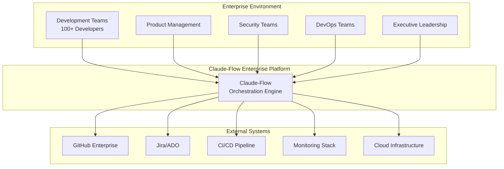
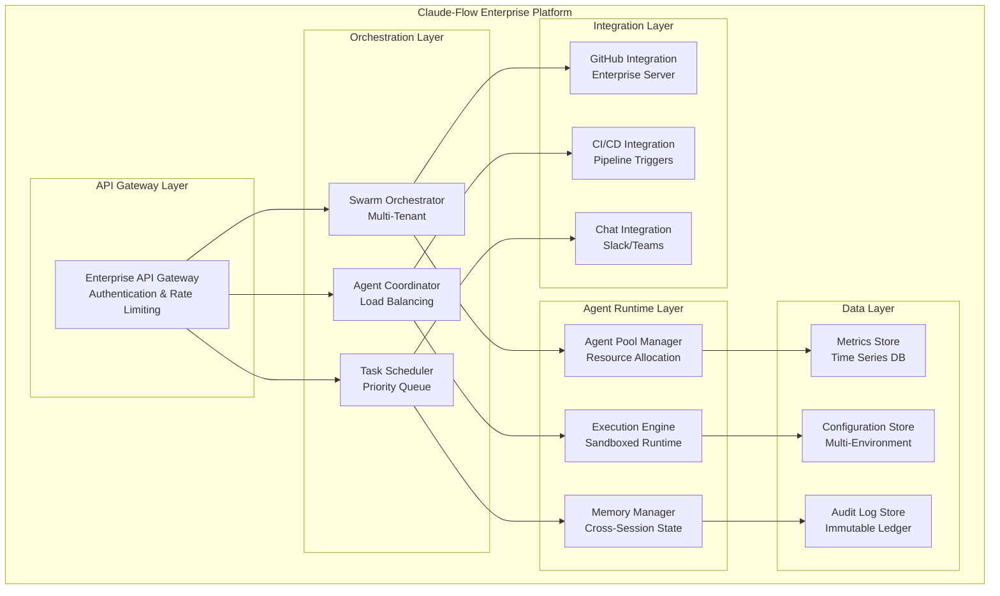
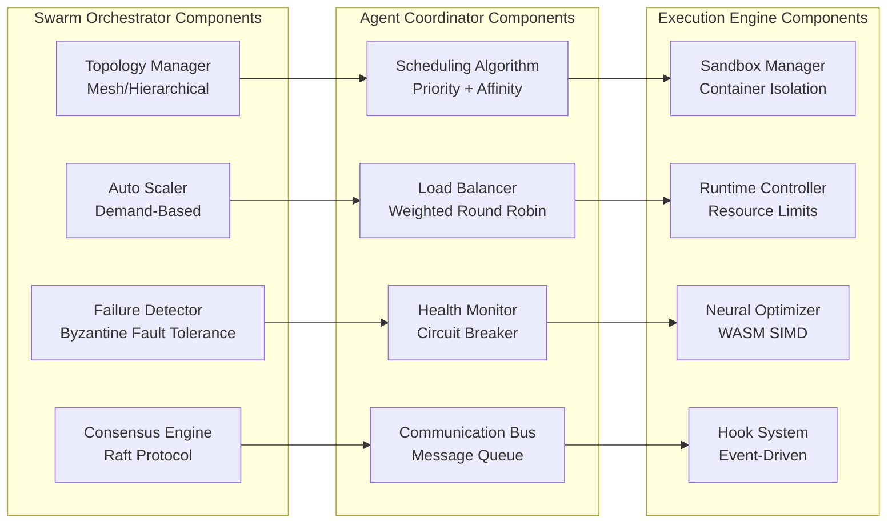
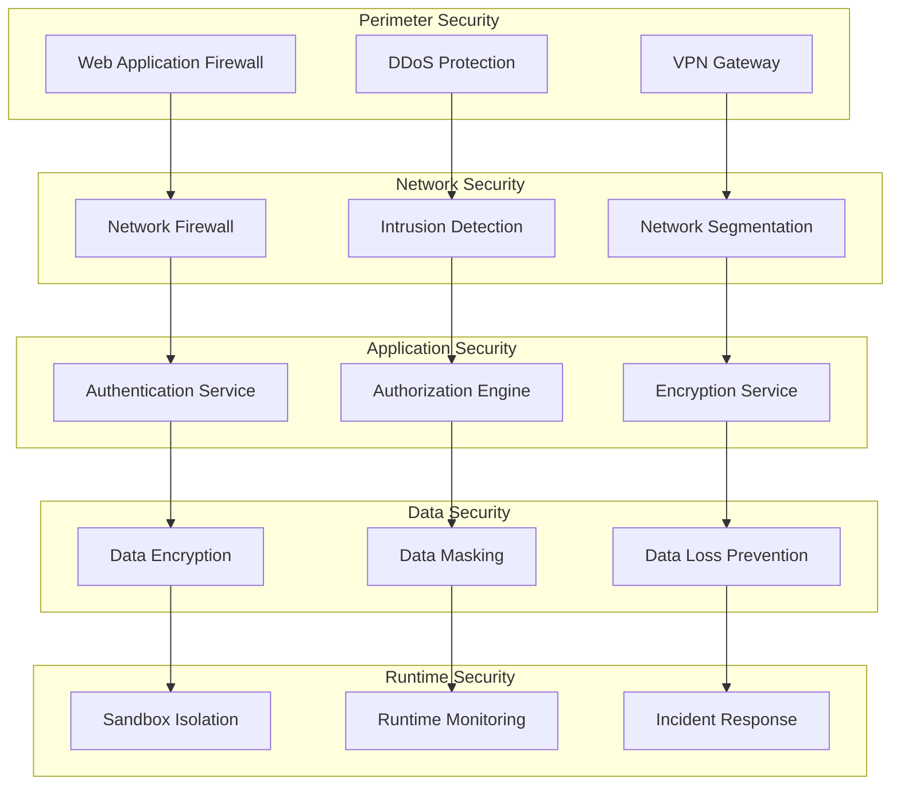

# Enterprise Architecture Overview

## Executive Summary

Claude-Flow provides a comprehensive enterprise-grade platform for orchestrating AI-powered development workflows at scale. This document outlines the architectural patterns, governance frameworks, and operational strategies required to support enterprise teams of 100+ developers across multiple projects and departments.

## Enterprise Architecture Principles

### 1. Scalability-First Design
- **Horizontal Scaling**: Support for unlimited agent spawning across distributed infrastructure
- **Vertical Integration**: Deep integration with enterprise development stacks
- **Resource Elasticity**: Dynamic resource allocation based on workload demands
- **Performance Optimization**: Sub-linear scaling algorithms for large team coordination

### 2. Security & Compliance
- **Zero-Trust Architecture**: All agent communications encrypted and authenticated
- **Audit Trail**: Complete logging of all operations for compliance requirements
- **Role-Based Access Control**: Fine-grained permissions for enterprise users
- **Data Sovereignty**: Support for on-premises and hybrid cloud deployments

### 3. Operational Excellence
- **High Availability**: 99.9% uptime SLA with automatic failover
- **Observability**: Real-time monitoring and alerting across all components
- **Disaster Recovery**: Automated backup and recovery procedures
- **Cost Optimization**: Resource usage tracking and optimization recommendations

## C4 Architecture Model

### Level 1: System Context

### Level 2: Container Architecture

### Level 3: Component Architecture

## Enterprise Deployment Patterns

### 1. Multi-Tenant SaaS
- **Tenant Isolation**: Complete data and resource isolation
- **Shared Infrastructure**: Cost-effective resource utilization
- **Elastic Scaling**: Per-tenant scaling policies
- **Global Distribution**: Multi-region deployment support

### 2. Hybrid Cloud
- **On-Premises Core**: Sensitive workloads on-premises
- **Cloud Burst**: Scale to cloud during peak demand
- **Data Residency**: Compliance with data sovereignty requirements
- **Secure Connectivity**: VPN/ExpressRoute integration

### 3. Private Cloud
- **Full Control**: Complete infrastructure ownership
- **Custom Security**: Organization-specific security policies
- **Compliance**: Meet strict regulatory requirements
- **Performance**: Optimized for specific workloads

## Integration Architecture

### Enterprise System Integration

```mermaid
graph TB
    subgraph "Claude-Flow Platform"
        CF_CORE[Claude-Flow Core]
        CF_API[Enterprise API]
        CF_WEB[Web Dashboard]
    end

    subgraph "Development Tools"
        GH_ENT[GitHub Enterprise]
        GITLAB[GitLab Enterprise]
        BITBUCKET[Bitbucket Server]
        ADO[Azure DevOps]
    end

    subgraph "Project Management"
        JIRA[Jira Enterprise]
        ADO_PM[Azure DevOps Projects]
        ASANA[Asana Enterprise]
        MONDAY[Monday.com]
    end

    subgraph "CI/CD Platforms"
        JENKINS[Jenkins Enterprise]
        GITHUB_ACTIONS[GitHub Actions]
        AZURE_PIPELINES[Azure Pipelines]
        GITLAB_CI[GitLab CI/CD]
    end

    subgraph "Monitoring & Observability"
        DATADOG[Datadog]
        NEW_RELIC[New Relic]
        SPLUNK[Splunk Enterprise]
        ELK[ELK Stack]
    end

    subgraph "Communication"
        SLACK[Slack Enterprise]
        TEAMS[Microsoft Teams]
        DISCORD[Discord]
        WEBHOOK[Custom Webhooks]
    end

    CF_API --> GH_ENT
    CF_API --> GITLAB
    CF_API --> BITBUCKET
    CF_API --> ADO

    CF_API --> JIRA
    CF_API --> ADO_PM
    CF_API --> ASANA
    CF_API --> MONDAY

    CF_API --> JENKINS
    CF_API --> GITHUB_ACTIONS
    CF_API --> AZURE_PIPELINES
    CF_API --> GITLAB_CI

    CF_CORE --> DATADOG
    CF_CORE --> NEW_RELIC
    CF_CORE --> SPLUNK
    CF_CORE --> ELK

    CF_CORE --> SLACK
    CF_CORE --> TEAMS
    CF_CORE --> DISCORD
    CF_CORE --> WEBHOOK
```

## Performance Characteristics

### Scaling Metrics

| Team Size | Projects | Agents/Hour | Response Time | Resource Usage |
|-----------|----------|-------------|---------------|----------------|
| 1-10      | 1-3      | 100-500     | <100ms        | 2-4 CPU cores  |
| 10-50     | 3-10     | 500-2000    | <200ms        | 8-16 CPU cores |
| 50-100    | 10-25    | 2000-5000   | <300ms        | 32-64 CPU cores|
| 100-500   | 25-100   | 5000-20000  | <500ms        | 128-256 CPU cores|
| 500+      | 100+     | 20000+      | <1000ms       | 512+ CPU cores |

### Performance Optimization Strategies

1. **Agent Pool Management**
   - Pre-warmed agent pools for common tasks
   - Intelligent agent recycling and reuse
   - Dynamic pool sizing based on demand patterns

2. **Caching Strategies**
   - Multi-level caching (L1: Memory, L2: Redis, L3: Disk)
   - Intelligent cache invalidation
   - Distributed cache coherency

3. **Resource Optimization**
   - Container resource limits and quotas
   - CPU and memory affinity optimization
   - Network bandwidth management

## Security Architecture

### Defense in Depth

### Compliance Frameworks

- **SOC 2 Type II**: Security, availability, processing integrity
- **ISO 27001**: Information security management
- **GDPR**: Data protection and privacy
- **HIPAA**: Healthcare information protection
- **FedRAMP**: Federal government cloud security

## Next Steps

1. Review [Multi-Project Coordination](../governance/multi-project-coordination.md)
2. Explore [Enterprise Security Integration](../security/enterprise-security-framework.md)
3. Configure [Performance Monitoring](../monitoring/enterprise-observability.md)
4. Plan [Deployment Strategy](../deployment/enterprise-deployment-patterns.md)

## Related Documentation

- [Team Coordination Patterns](../team-coordination/team-scaling-strategies.md)
- [Cost Optimization Guide](../cost-optimization/enterprise-cost-management.md)
- [Governance Framework](../governance/enterprise-governance-model.md)
- [Security Compliance](../security/compliance-automation.md)