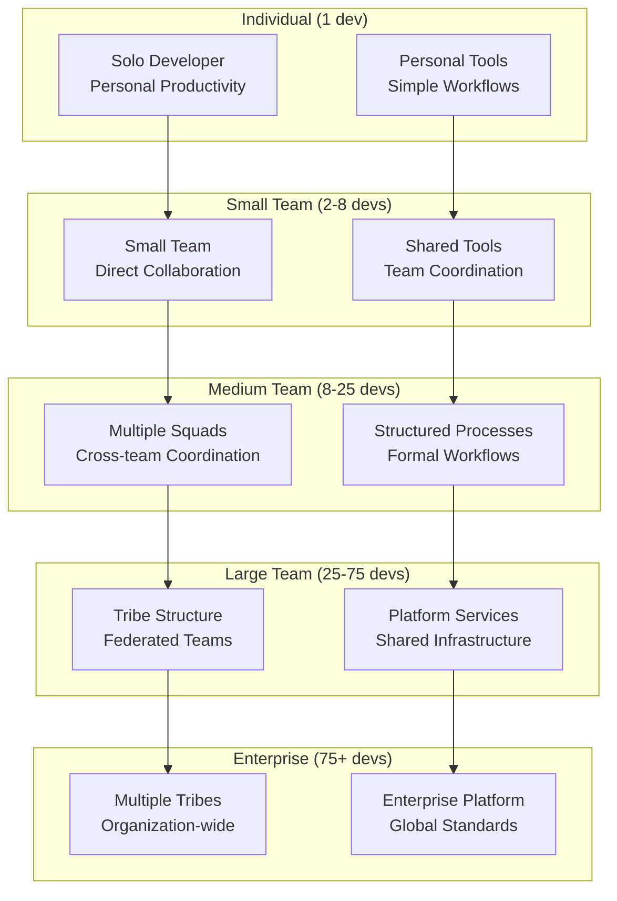

# Enterprise Scaling Patterns: From 1 to 100+ Developers

## Executive Summary

This document provides a comprehensive blueprint for scaling Claude-Flow from individual developers to enterprise teams of 100+ developers. It outlines proven scaling patterns, organizational structures, and technical architectures that enable sustainable growth while maintaining high productivity, code quality, and team coordination.

## Scaling Journey Overview

### Scaling Maturity Model



## Stage 1: Individual Developer (1 Developer)

### Characteristics
- Single developer working independently
- Direct control over entire codebase
- Simple, personal productivity focus
- Minimal coordination overhead

### Claude-Flow Configuration

```yaml
# Individual developer setup
individual_setup:
  claude_flow_config:
    topology: "single_node"
    max_agents: 10
    coordination_overhead: "minimal"

  agent_allocation:
    personal_productivity:
      - "coder": 1
      - "reviewer": 1
      - "tester": 1
      - "documenter": 1

  workflow_patterns:
    development_cycle: "personal_kanban"
    review_process: "self_review_with_ai"
    deployment: "direct_to_production"

  optimization_focus:
    - "personal_productivity"
    - "learning_acceleration"
    - "code_quality_assistance"
    - "automated_testing"

# Sample configuration
single_developer:
  workspace:
    environment: "local_development"
    tools: ["vscode", "git", "docker"]
    claude_flow_integration: "personal_assistant"

  daily_workflow:
    morning_standup: "ai_task_prioritization"
    development: "pair_programming_with_ai"
    code_review: "ai_assisted_review"
    testing: "automated_test_generation"
    documentation: "ai_generated_docs"

  success_metrics:
    productivity: "commits_per_day"
    quality: "ai_code_quality_score"
    learning: "skill_development_velocity"
```

### Scaling Triggers
- **Team Growth**: Hiring first team member
- **Complexity**: Codebase becomes too large for one person
- **Collaboration Needs**: External stakeholder involvement
- **Quality Requirements**: Need for formal review processes

## Stage 2: Small Team (2-8 Developers)

### Characteristics
- Direct communication and collaboration
- Shared codebase with simple branching
- Informal processes and lightweight coordination
- Cross-functional team members

### Claude-Flow Configuration

```yaml
# Small team setup
small_team_setup:
  claude_flow_config:
    topology: "mesh"
    max_agents: 25
    coordination_overhead: "low"

  team_structure:
    tech_lead: 1
    developers: "2-6"
    qa_engineer: "0-1"

  agent_allocation:
    shared_agents:
      - "system_architect": 1
      - "code_reviewer": 2
      - "integration_tester": 1
      - "documentation_manager": 1

    per_developer_agents:
      - "personal_coder": 1
      - "unit_tester": 1

  workflow_patterns:
    development_cycle: "feature_branches"
    review_process: "peer_review_with_ai"
    deployment: "staging_then_production"
    coordination: "daily_standups"

  communication:
    channels: ["slack", "github_prs"]
    meetings: ["daily_standup", "weekly_retrospective"]
    documentation: "shared_wiki"

# Team coordination patterns
coordination_patterns:
  code_ownership:
    strategy: "collective_ownership"
    review_requirements: "one_approval_plus_ai"

  knowledge_sharing:
    - "pair_programming"
    - "code_review_discussions"
    - "weekly_tech_talks"
    - "shared_documentation"

  quality_assurance:
    - "automated_testing_with_ai"
    - "peer_code_review"
    - "continuous_integration"
    - "manual_testing_when_needed"
```

### Scaling Triggers
- **Communication Overhead**: Too many interruptions
- **Coordination Complexity**: Cross-team dependencies
- **Specialization Needs**: Requiring specialized skills
- **Process Formalization**: Need for standardized workflows

## Stage 3: Medium Team (8-25 Developers)

### Characteristics
- Multiple squads or feature teams
- Formal processes and documentation
- Specialized roles and responsibilities
- Cross-team coordination mechanisms

### Claude-Flow Configuration

```yaml
# Medium team setup
medium_team_setup:
  claude_flow_config:
    topology: "hierarchical"
    max_agents: 75
    coordination_overhead: "medium"

  team_structure:
    squads:
      - name: "frontend_squad"
        size: "4-6 developers"
        focus: "user_interface"
        claude_flow_agents: ["frontend_specialist", "ux_optimizer"]

      - name: "backend_squad"
        size: "4-6 developers"
        focus: "api_and_services"
        claude_flow_agents: ["backend_specialist", "api_designer"]

      - name: "platform_squad"
        size: "3-4 developers"
        focus: "infrastructure_and_tools"
        claude_flow_agents: ["devops_specialist", "infrastructure_optimizer"]

    shared_roles:
      - "engineering_manager"
      - "product_manager"
      - "qa_lead"
      - "devops_engineer"

  cross_squad_coordination:
    coordination_agents:
      - "integration_coordinator": 1
      - "dependency_manager": 1
      - "architecture_reviewer": 1

    coordination_mechanisms:
      - "scrum_of_scrums"
      - "architecture_review_board"
      - "cross_squad_planning"

  workflow_patterns:
    development_cycle: "squad_based_sprints"
    release_process: "coordinated_releases"
    quality_gates: "multi_level_testing"

# Advanced coordination features
advanced_coordination:
  dependency_management:
    tracking: "automated_dependency_analysis"
    coordination: "cross_squad_planning_agents"
    resolution: "dependency_conflict_resolver"

  knowledge_management:
    documentation: "centralized_knowledge_base"
    expertise_location: "skill_mapping_agents"
    knowledge_sharing: "cross_squad_rotations"

  quality_assurance:
    testing_strategy: "pyramid_testing_with_ai"
    code_standards: "automated_enforcement"
    performance_monitoring: "continuous_profiling"
```

### Scaling Triggers
- **Squad Autonomy**: Need for more independent teams
- **Platform Services**: Shared infrastructure requirements
- **Governance Needs**: Standardization across squads
- **Technical Complexity**: Architecture coordination requirements

## Stage 4: Large Team (25-75 Developers)

### Characteristics
- Tribe-based organization
- Platform team and shared services
- Formal governance and standards
- Advanced tooling and automation

### Claude-Flow Configuration

```yaml
# Large team setup
large_team_setup:
  claude_flow_config:
    topology: "federated_hierarchical"
    max_agents: 200
    coordination_overhead: "high"

  organizational_structure:
    tribes:
      product_tribe_1:
        squads: 3
        developers: "18-24"
        focus: "customer_experience"
        autonomous_level: "high"

      product_tribe_2:
        squads: 3
        developers: "18-24"
        focus: "business_operations"
        autonomous_level: "high"

      platform_tribe:
        squads: 2
        developers: "12-15"
        focus: "shared_infrastructure"
        service_level: "internal_customers"

    shared_services:
      architecture_guild: "cross_tribe_standards"
      security_guild: "security_standards"
      quality_guild: "quality_standards"

  claude_flow_architecture:
    platform_services:
      - "central_agent_registry"
      - "shared_coordination_services"
      - "cross_tribe_analytics"
      - "enterprise_policy_enforcement"

    tribe_autonomy:
      - "tribe_specific_agent_pools"
      - "customized_workflow_patterns"
      - "tribe_level_optimization"

    governance_layer:
      - "enterprise_standards_enforcement"
      - "cross_tribe_coordination"
      - "resource_allocation_optimization"

# Platform services architecture
platform_services:
  shared_infrastructure:
    ci_cd_platform: "enterprise_jenkins"
    monitoring_platform: "enterprise_observability"
    security_platform: "enterprise_security_suite"
    claude_flow_platform: "enterprise_agent_orchestration"

  shared_capabilities:
    agent_marketplace: "reusable_agent_templates"
    knowledge_base: "enterprise_documentation"
    best_practices: "shared_workflows"
    compliance_automation: "automated_governance"

  service_level_agreements:
    availability: "99.9%"
    performance: "< 100ms response time"
    support: "24/7 platform team"
    updates: "monthly_feature_releases"
```

### Scaling Triggers
- **Multi-Product Complexity**: Multiple product lines
- **Geographic Distribution**: Multiple locations
- **Compliance Requirements**: Enterprise governance needs
- **Scale Efficiency**: Need for enterprise-wide optimization

## Stage 5: Enterprise (75+ Developers)

### Characteristics
- Multiple tribes and divisions
- Enterprise-wide standards and governance
- Global distribution and 24/7 operations
- Advanced analytics and optimization

### Claude-Flow Configuration

```yaml
# Enterprise setup
enterprise_setup:
  claude_flow_config:
    topology: "enterprise_mesh"
    max_agents: 1000
    coordination_overhead: "enterprise"
    global_distribution: true

  organizational_structure:
    divisions:
      product_division:
        tribes: 4
        developers: "60-80"
        regions: ["us", "eu", "apac"]

      platform_division:
        tribes: 2
        developers: "30-40"
        global_services: true

      innovation_division:
        tribes: 1
        developers: "15-20"
        advanced_research: true

    governance_structure:
      engineering_council: "enterprise_technical_leadership"
      architecture_board: "enterprise_architecture_decisions"
      platform_council: "shared_service_governance"

  claude_flow_enterprise_architecture:
    global_platform:
      - "global_agent_orchestration"
      - "cross_region_coordination"
      - "enterprise_analytics_platform"
      - "global_compliance_automation"

    regional_optimization:
      - "region_specific_agent_pools"
      - "local_compliance_requirements"
      - "regional_performance_optimization"

    advanced_capabilities:
      - "predictive_resource_allocation"
      - "global_talent_optimization"
      - "enterprise_knowledge_graph"
      - "advanced_ai_coordination"

# Enterprise governance framework
enterprise_governance:
  standards_enforcement:
    technical_standards: "automated_compliance_checking"
    security_standards: "continuous_security_monitoring"
    quality_standards: "enterprise_quality_gates"

  resource_optimization:
    global_resource_allocation: "ai_powered_optimization"
    cost_optimization: "enterprise_cost_management"
    talent_optimization: "skill_based_allocation"

  performance_management:
    enterprise_metrics: "unified_dashboard"
    predictive_analytics: "trend_forecasting"
    continuous_improvement: "automated_optimization"

# Global coordination patterns
global_coordination:
  time_zone_coverage:
    follow_the_sun: "24_7_development"
    handoff_procedures: "seamless_transitions"
    coordination_agents: "timezone_aware_scheduling"

  cultural_adaptation:
    regional_preferences: "localized_workflows"
    communication_styles: "culturally_aware_coordination"
    compliance_variations: "region_specific_governance"

  knowledge_management:
    global_knowledge_base: "multilingual_documentation"
    expertise_location: "global_skill_mapping"
    best_practice_sharing: "cross_region_learning"
```

## Scaling Challenges and Solutions

### 1. Communication and Coordination

```typescript
// Communication scaling solutions
export interface CommunicationScaling {
  challenges_by_stage: {
    small_team: [
      "information_overload",
      "context_switching",
      "meeting_proliferation"
    ];
    medium_team: [
      "cross_squad_coordination",
      "knowledge_silos",
      "decision_bottlenecks"
    ];
    large_team: [
      "tribe_autonomy_vs_alignment",
      "platform_service_coordination",
      "governance_overhead"
    ];
    enterprise: [
      "global_communication",
      "cultural_differences",
      "time_zone_challenges"
    ];
  };

  solutions: {
    communication_architecture: {
      async_first: "default_to_asynchronous_communication";
      structured_meetings: "purpose_driven_meeting_patterns";
      documentation_culture: "written_communication_preference";
      intelligent_routing: "ai_powered_information_routing";
    };

    coordination_automation: {
      dependency_tracking: "automated_dependency_management";
      conflict_resolution: "ai_assisted_conflict_resolution";
      status_aggregation: "automated_status_reporting";
      decision_support: "ai_powered_decision_recommendations";
    };

    knowledge_management: {
      centralized_documentation: "enterprise_knowledge_base";
      expertise_location: "skill_and_knowledge_mapping";
      automated_updates: "ai_maintained_documentation";
      contextual_search: "intelligent_knowledge_discovery";
    };
  };
}

// Coordination patterns implementation
export class CoordinationPatternManager {

  async implementScalingPattern(
    current_stage: ScalingStage,
    target_stage: ScalingStage,
    organization: Organization
  ): Promise<ScalingImplementationPlan> {

    const scaling_analysis = await this.analyzeScalingRequirements(
      current_stage,
      target_stage,
      organization
    );

    const implementation_plan = await this.createImplementationPlan(
      scaling_analysis.requirements
    );

    const risk_mitigation = await this.createRiskMitigationPlan(
      scaling_analysis.risks
    );

    return {
      scaling_requirements: scaling_analysis.requirements,
      implementation_phases: implementation_plan.phases,
      timeline: implementation_plan.timeline,
      resource_requirements: implementation_plan.resources,
      risk_mitigation_plan: risk_mitigation,
      success_criteria: this.defineSuccessCriteria(target_stage)
    };
  }

  async optimizeCoordinationOverhead(
    team_structure: TeamStructure,
    communication_patterns: CommunicationPattern[]
  ): Promise<CoordinationOptimization> {

    const overhead_analysis = await this.analyzeCoordinationOverhead(
      team_structure,
      communication_patterns
    );

    const optimization_opportunities = await this.identifyOptimizationOpportunities(
      overhead_analysis
    );

    return {
      current_overhead: overhead_analysis.metrics,
      optimization_opportunities: optimization_opportunities.opportunities,
      recommended_changes: optimization_opportunities.recommendations,
      expected_improvements: optimization_opportunities.projected_benefits,
      implementation_guidance: this.createImplementationGuidance(
        optimization_opportunities
      )
    };
  }
}
```

### 2. Technical Architecture Scaling

```yaml
# Technical architecture scaling patterns
technical_scaling:
  architecture_evolution:
    individual_to_small_team:
      changes:
        - "introduce_code_review_process"
        - "implement_continuous_integration"
        - "establish_testing_standards"
        - "create_shared_development_environment"

    small_to_medium_team:
      changes:
        - "implement_microservices_architecture"
        - "establish_api_design_standards"
        - "create_shared_component_library"
        - "implement_feature_flag_system"

    medium_to_large_team:
      changes:
        - "implement_platform_as_a_service"
        - "establish_service_mesh"
        - "create_developer_portal"
        - "implement_advanced_observability"

    large_to_enterprise:
      changes:
        - "implement_enterprise_service_bus"
        - "establish_global_api_gateway"
        - "create_enterprise_data_platform"
        - "implement_zero_trust_security"

  claude_flow_scaling:
    agent_architecture_evolution:
      centralized: "single_orchestrator"
      distributed: "federated_orchestrators"
      hierarchical: "multi_level_coordination"
      mesh: "peer_to_peer_coordination"

    coordination_complexity:
      simple: "direct_communication"
      structured: "message_queue_based"
      advanced: "event_driven_architecture"
      enterprise: "intelligent_routing_and_optimization"

    resource_management:
      basic: "static_allocation"
      dynamic: "demand_based_allocation"
      predictive: "ai_driven_allocation"
      optimized: "global_optimization"

# Scaling best practices
scaling_best_practices:
  organizational:
    team_sizing: "two_pizza_teams"
    autonomy_principle: "high_autonomy_low_coupling"
    communication_patterns: "async_first"
    decision_making: "distributed_decisions"

  technical:
    modularity: "loosely_coupled_services"
    scalability: "horizontal_scaling_default"
    reliability: "failure_isolation"
    observability: "comprehensive_monitoring"

  process:
    automation: "automate_everything_possible"
    standardization: "consistent_patterns"
    flexibility: "adapt_to_local_needs"
    continuous_improvement: "regular_retrospectives"
```

## Stage Transition Strategies

### 1. Transition Planning Framework

```typescript
// Stage transition management
export class StageTransitionManager {

  async planStageTransition(
    current_stage: ScalingStage,
    target_stage: ScalingStage,
    organization_context: OrganizationContext
  ): Promise<TransitionPlan> {

    const readiness_assessment = await this.assessTransitionReadiness(
      current_stage,
      target_stage,
      organization_context
    );

    const transition_requirements = await this.identifyTransitionRequirements(
      current_stage,
      target_stage
    );

    const implementation_strategy = await this.developImplementationStrategy(
      transition_requirements,
      organization_context
    );

    return {
      readiness_score: readiness_assessment.score,
      critical_gaps: readiness_assessment.gaps,
      transition_requirements: transition_requirements,
      implementation_phases: implementation_strategy.phases,
      timeline: implementation_strategy.timeline,
      resource_plan: implementation_strategy.resources,
      risk_management: implementation_strategy.risks,
      success_metrics: this.defineTransitionSuccessMetrics(target_stage)
    };
  }

  async executePhaseTransition(
    transition_phase: TransitionPhase,
    organization: Organization
  ): Promise<PhaseExecutionResult> {

    const pre_transition_state = await this.captureCurrentState(organization);

    const execution_result = await this.executeTransitionActivities(
      transition_phase.activities
    );

    const post_transition_validation = await this.validateTransitionSuccess(
      transition_phase.success_criteria,
      organization
    );

    return {
      phase_name: transition_phase.name,
      execution_summary: execution_result.summary,
      success_validation: post_transition_validation,
      lessons_learned: execution_result.lessons_learned,
      next_phase_readiness: this.assessNextPhaseReadiness(
        post_transition_validation
      )
    };
  }

  // Change management for scaling transitions
  async manageScalingChangeManagement(
    transition_plan: TransitionPlan,
    stakeholders: Stakeholder[]
  ): Promise<ChangeManagementPlan> {

    const impact_analysis = await this.analyzeStakeholderImpact(
      transition_plan,
      stakeholders
    );

    const communication_strategy = await this.developCommunicationStrategy(
      impact_analysis
    );

    const training_plan = await this.createTrainingPlan(
      transition_plan.skill_requirements,
      stakeholders
    );

    return {
      stakeholder_impact_analysis: impact_analysis,
      communication_plan: communication_strategy,
      training_and_development: training_plan,
      resistance_management: this.createResistanceManagementStrategy(
        impact_analysis
      ),
      adoption_tracking: this.createAdoptionTrackingFramework(
        transition_plan
      )
    };
  }
}

// Scaling maturity assessment
export class ScalingMaturityAssessment {

  async assessCurrentMaturity(
    organization: Organization
  ): Promise<MaturityAssessment> {

    const [
      technical_maturity,
      organizational_maturity,
      process_maturity,
      cultural_maturity
    ] = await Promise.all([
      this.assessTechnicalMaturity(organization),
      this.assessOrganizationalMaturity(organization),
      this.assessProcessMaturity(organization),
      this.assessCulturalMaturity(organization)
    ]);

    const overall_maturity = this.calculateOverallMaturity([
      technical_maturity,
      organizational_maturity,
      process_maturity,
      cultural_maturity
    ]);

    return {
      overall_maturity_level: overall_maturity.level,
      dimension_scores: {
        technical: technical_maturity.score,
        organizational: organizational_maturity.score,
        process: process_maturity.score,
        cultural: cultural_maturity.score
      },
      strengths: overall_maturity.strengths,
      improvement_areas: overall_maturity.gaps,
      readiness_for_next_stage: this.assessNextStageReadiness(overall_maturity),
      development_recommendations: this.generateDevelopmentRecommendations(
        overall_maturity
      )
    };
  }

  async createMaturityRoadmap(
    current_maturity: MaturityAssessment,
    target_stage: ScalingStage
  ): Promise<MaturityRoadmap> {

    const maturity_gaps = this.identifyMaturityGaps(
      current_maturity,
      target_stage
    );

    const development_initiatives = await this.prioritizeDevelopmentInitiatives(
      maturity_gaps
    );

    return {
      current_state: current_maturity,
      target_state: this.defineTargetMaturity(target_stage),
      maturity_gaps: maturity_gaps,
      development_roadmap: development_initiatives.roadmap,
      investment_requirements: development_initiatives.investment,
      timeline: development_initiatives.timeline,
      success_metrics: this.defineMaturitySuccessMetrics(target_stage)
    };
  }
}
```

### 2. Risk Management During Scaling

```yaml
# Scaling risk management framework
scaling_risks:
  technical_risks:
    performance_degradation:
      probability: "medium"
      impact: "high"
      mitigation:
        - "performance_monitoring_implementation"
        - "load_testing_automation"
        - "scaling_plan_validation"

    system_complexity:
      probability: "high"
      impact: "medium"
      mitigation:
        - "modular_architecture_design"
        - "documentation_standards"
        - "complexity_monitoring"

    technical_debt_accumulation:
      probability: "high"
      impact: "high"
      mitigation:
        - "technical_debt_tracking"
        - "refactoring_sprints"
        - "code_quality_automation"

  organizational_risks:
    communication_breakdown:
      probability: "high"
      impact: "high"
      mitigation:
        - "structured_communication_patterns"
        - "escalation_procedures"
        - "transparency_tools"

    culture_fragmentation:
      probability: "medium"
      impact: "high"
      mitigation:
        - "culture_reinforcement_programs"
        - "cross_team_rotations"
        - "shared_values_initiatives"

    skill_gaps:
      probability: "medium"
      impact: "medium"
      mitigation:
        - "skill_assessment_programs"
        - "training_and_development"
        - "knowledge_sharing_initiatives"

  process_risks:
    process_overhead:
      probability: "high"
      impact: "medium"
      mitigation:
        - "process_automation"
        - "lean_methodology_adoption"
        - "continuous_process_improvement"

    quality_degradation:
      probability: "medium"
      impact: "high"
      mitigation:
        - "quality_gate_implementation"
        - "automated_testing_expansion"
        - "quality_metric_tracking"

    coordination_failures:
      probability: "medium"
      impact: "high"
      mitigation:
        - "coordination_automation"
        - "dependency_tracking"
        - "escalation_procedures"

# Risk monitoring and early warning systems
risk_monitoring:
  early_warning_indicators:
    technical_indicators:
      - "performance_degradation_trends"
      - "error_rate_increases"
      - "complexity_metric_growth"
      - "technical_debt_ratio_increases"

    organizational_indicators:
      - "communication_frequency_decreases"
      - "cross_team_collaboration_decreases"
      - "employee_satisfaction_decreases"
      - "turnover_rate_increases"

    process_indicators:
      - "cycle_time_increases"
      - "quality_metric_degradation"
      - "process_compliance_decreases"
      - "automation_coverage_decreases"

  automated_monitoring:
    metrics_collection: "real_time_monitoring"
    threshold_alerting: "configurable_thresholds"
    trend_analysis: "predictive_analytics"
    escalation_automation: "automated_escalation_paths"
```

## Success Metrics by Stage

### Stage-Specific KPIs

```typescript
// Success metrics framework
export interface StageSuccessMetrics {
  individual_developer: {
    productivity_metrics: {
      commits_per_day: { target: number; measurement: string };
      features_per_week: { target: number; measurement: string };
      learning_velocity: { target: number; measurement: string };
    };
    quality_metrics: {
      code_quality_score: { target: number; measurement: string };
      test_coverage: { target: number; measurement: string };
      documentation_completeness: { target: number; measurement: string };
    };
  };

  small_team: {
    collaboration_metrics: {
      code_review_cycle_time: { target: string; measurement: string };
      knowledge_sharing_frequency: { target: number; measurement: string };
      pair_programming_adoption: { target: number; measurement: string };
    };
    delivery_metrics: {
      sprint_velocity_consistency: { target: string; measurement: string };
      deployment_frequency: { target: string; measurement: string };
      lead_time: { target: string; measurement: string };
    };
  };

  medium_team: {
    coordination_metrics: {
      cross_squad_dependencies: { target: string; measurement: string };
      integration_success_rate: { target: number; measurement: string };
      coordination_overhead: { target: string; measurement: string };
    };
    scaling_metrics: {
      team_autonomy_index: { target: number; measurement: string };
      process_standardization: { target: number; measurement: string };
      knowledge_distribution: { target: number; measurement: string };
    };
  };

  large_team: {
    platform_metrics: {
      platform_adoption_rate: { target: number; measurement: string };
      platform_service_availability: { target: string; measurement: string };
      developer_satisfaction: { target: number; measurement: string };
    };
    governance_metrics: {
      standards_compliance: { target: number; measurement: string };
      policy_adherence: { target: number; measurement: string };
      audit_readiness: { target: string; measurement: string };
    };
  };

  enterprise: {
    business_metrics: {
      time_to_market: { target: string; measurement: string };
      innovation_rate: { target: number; measurement: string };
      competitive_advantage: { target: string; measurement: string };
    };
    operational_metrics: {
      global_efficiency: { target: number; measurement: string };
      resource_utilization: { target: number; measurement: string };
      cost_per_developer: { target: string; measurement: string };
    };
  };
}

// Metrics tracking and analysis
export class ScalingMetricsTracker {

  async trackStageMetrics(
    stage: ScalingStage,
    organization: Organization,
    time_period: TimePeriod
  ): Promise<StageMetricsReport> {

    const stage_metrics = this.getStageMetrics(stage);
    const actual_performance = await this.measureActualPerformance(
      stage_metrics,
      organization,
      time_period
    );

    const performance_analysis = await this.analyzePerformance(
      stage_metrics,
      actual_performance
    );

    return {
      stage: stage,
      measurement_period: time_period,
      target_metrics: stage_metrics,
      actual_performance: actual_performance,
      performance_gaps: performance_analysis.gaps,
      improvement_trends: performance_analysis.trends,
      next_stage_readiness: this.assessNextStageReadiness(performance_analysis),
      improvement_recommendations: this.generateImprovementRecommendations(
        performance_analysis
      )
    };
  }

  async generateScalingDashboard(
    organization: Organization,
    stakeholder_type: StakeholderType
  ): Promise<ScalingDashboard> {

    const current_stage = await this.identifyCurrentStage(organization);
    const metrics_data = await this.gatherMetricsData(organization);
    const scaling_trends = await this.analyzeScalingTrends(metrics_data);

    return {
      current_stage_summary: this.createStageSummary(current_stage, metrics_data),
      key_performance_indicators: this.createKPIView(
        metrics_data,
        stakeholder_type
      ),
      scaling_progress_tracker: this.createProgressTracker(scaling_trends),
      risk_indicators: this.createRiskIndicators(metrics_data),
      next_stage_preparation: this.createNextStagePreparation(
        current_stage,
        metrics_data
      )
    };
  }
}
```

## Implementation Timeline and Roadmap

### Scaling Implementation Schedule

```yaml
# Comprehensive scaling roadmap
scaling_roadmap:
  stage_1_to_2_transition:
    duration: "3-6 months"
    critical_path:
      month_1:
        - "hire_second_developer"
        - "establish_code_review_process"
        - "implement_basic_ci_cd"

      month_2:
        - "create_shared_development_standards"
        - "implement_automated_testing"
        - "establish_communication_patterns"

      month_3:
        - "optimize_team_workflows"
        - "implement_knowledge_sharing"
        - "prepare_for_third_team_member"

  stage_2_to_3_transition:
    duration: "6-9 months"
    critical_path:
      months_1_2:
        - "form_specialized_squads"
        - "implement_cross_squad_coordination"
        - "establish_technical_leadership"

      months_3_4:
        - "implement_advanced_tooling"
        - "create_shared_component_libraries"
        - "establish_quality_gates"

      months_5_6:
        - "optimize_squad_autonomy"
        - "implement_advanced_monitoring"
        - "prepare_platform_services"

  stage_3_to_4_transition:
    duration: "9-12 months"
    critical_path:
      months_1_3:
        - "establish_platform_team"
        - "implement_tribe_structure"
        - "create_shared_services"

      months_4_6:
        - "implement_advanced_governance"
        - "create_developer_portal"
        - "establish_guild_structure"

      months_7_9:
        - "optimize_tribe_coordination"
        - "implement_advanced_analytics"
        - "prepare_enterprise_capabilities"

  stage_4_to_5_transition:
    duration: "12-18 months"
    critical_path:
      months_1_4:
        - "establish_enterprise_governance"
        - "implement_global_coordination"
        - "create_enterprise_platform"

      months_5_8:
        - "implement_advanced_ai_coordination"
        - "create_global_optimization"
        - "establish_enterprise_analytics"

      months_9_12:
        - "optimize_global_operations"
        - "implement_predictive_systems"
        - "achieve_enterprise_excellence"

# Implementation best practices
implementation_best_practices:
  planning:
    - "start_planning_early"
    - "involve_all_stakeholders"
    - "create_detailed_timeline"
    - "plan_for_contingencies"

  execution:
    - "incremental_implementation"
    - "continuous_feedback_collection"
    - "regular_course_correction"
    - "celebrate_milestones"

  monitoring:
    - "track_progress_continuously"
    - "measure_success_metrics"
    - "identify_risks_early"
    - "adjust_based_on_feedback"

  communication:
    - "transparent_progress_updates"
    - "regular_stakeholder_communication"
    - "document_lessons_learned"
    - "share_best_practices"
```

## Summary and Recommendations

### Key Success Factors

1. **Gradual Evolution**: Scale incrementally, validating each stage before moving to the next
2. **Culture Preservation**: Maintain core values and culture throughout scaling
3. **Technical Excellence**: Invest in platform capabilities and automation
4. **People Development**: Focus on skill development and career growth
5. **Measurement-Driven**: Use metrics to guide scaling decisions

### Common Pitfalls to Avoid

1. **Premature Scaling**: Moving too fast without validating current stage success
2. **Process Over-Engineering**: Implementing too much process too early
3. **Culture Neglect**: Ignoring cultural development during growth
4. **Technical Debt**: Accumulating technical debt without addressing it
5. **Communication Breakdown**: Failing to adapt communication patterns to scale

### Final Recommendations

1. **Assess Current State**: Understand your current scaling stage and maturity
2. **Plan Transition**: Create a detailed transition plan to the next stage
3. **Invest in Platform**: Build platform capabilities early and continuously
4. **Develop People**: Focus on people development and culture
5. **Measure Progress**: Use metrics to track progress and guide decisions

## Related Documentation

- [Enterprise Architecture Overview](../enterprise-architecture/enterprise-architecture-overview.md)
- [Multi-Project Coordination](../governance/multi-project-coordination.md)
- [Team Coordination Strategies](../team-coordination/team-scaling-strategies.md)
- [Cost Management](../cost-optimization/enterprise-cost-management.md)
- [Security Framework](../security/enterprise-security-framework.md)