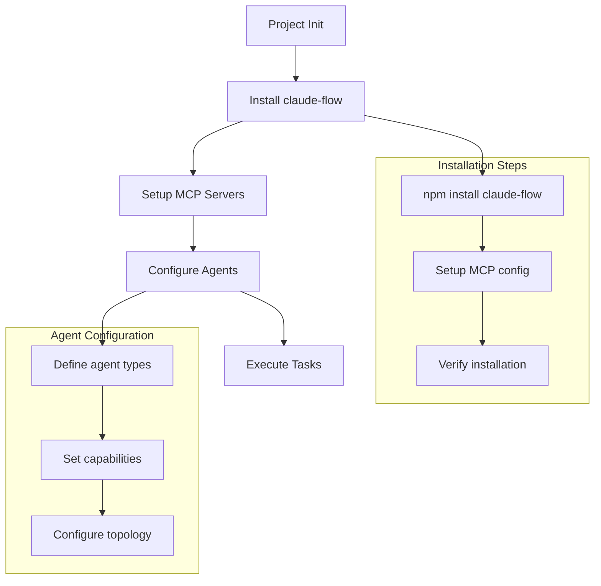
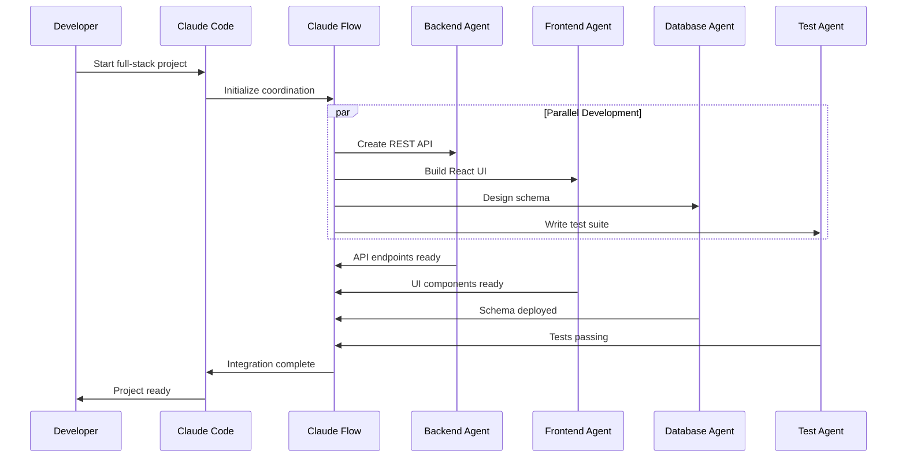
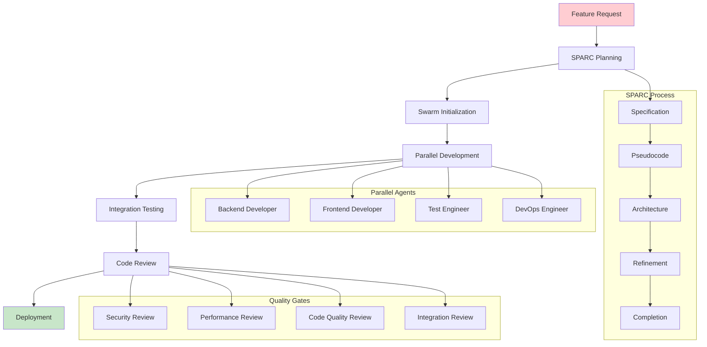
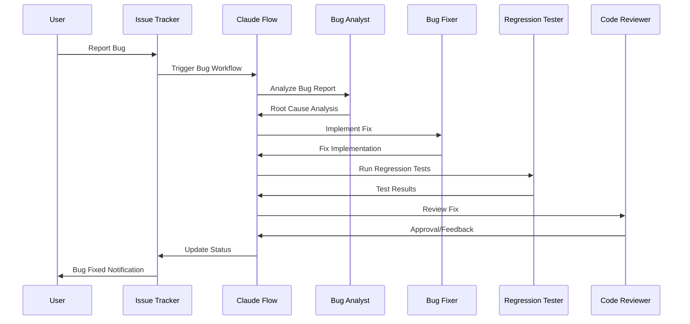
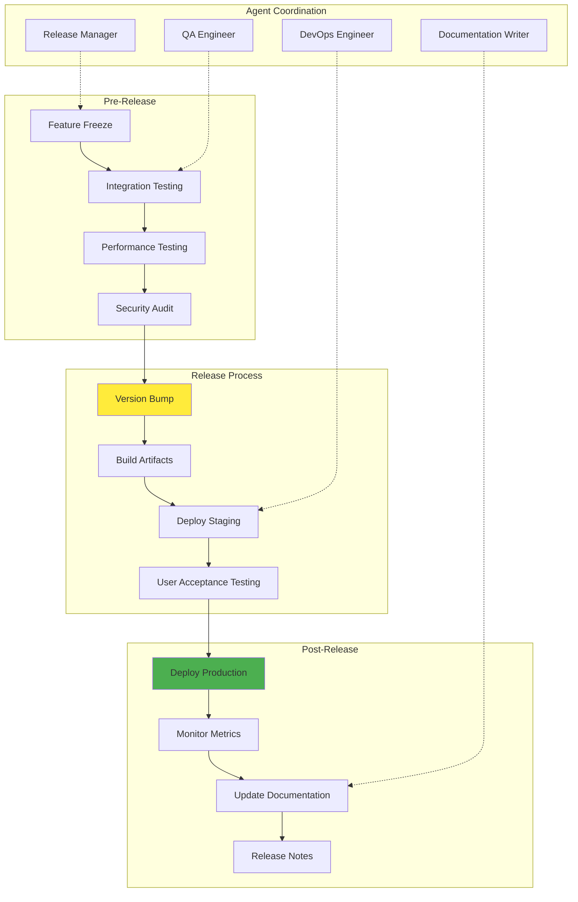
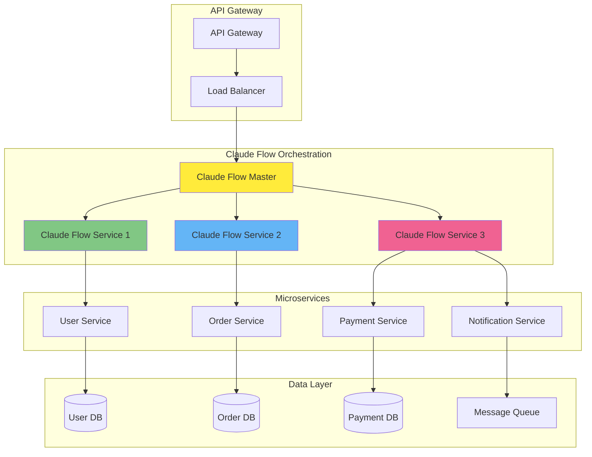

# Integration Patterns and Examples

This document provides practical examples and patterns for integrating claude-flow-novice with various development environments and tools.

## Table of Contents

1. [Basic Integration Examples](#basic-integration-examples)
2. [CI/CD Pipeline Integration](#cicd-pipeline-integration)
3. [Development Workflow Patterns](#development-workflow-patterns)
4. [Multi-Environment Integration](#multi-environment-integration)
5. [Advanced Integration Scenarios](#advanced-integration-scenarios)

## Basic Integration Examples

### Simple Project Setup



### Full-Stack Development Integration



## CI/CD Pipeline Integration

### GitHub Actions Integration

```yaml
# .github/workflows/claude-flow-ci.yml
name: Claude Flow CI/CD Pipeline

on:
  push:
    branches: [main, develop]
  pull_request:
    branches: [main]

jobs:
  setup:
    runs-on: ubuntu-latest
    outputs:
      cache-key: ${{ steps.cache-key.outputs.key }}
    steps:
      - uses: actions/checkout@v4
      - name: Generate cache key
        id: cache-key
        run: echo "key=${{ runner.os }}-claude-flow-${{ hashFiles('**/package.json') }}" >> $GITHUB_OUTPUT

  claude-flow-analysis:
    runs-on: ubuntu-latest
    needs: setup
    strategy:
      matrix:
        agent-type: [coder, tester, reviewer, security-auditor]
    steps:
      - uses: actions/checkout@v4

      - name: Setup Node.js
        uses: actions/setup-node@v4
        with:
          node-version: '18'
          cache: 'npm'

      - name: Install dependencies
        run: |
          npm ci
          npm install -g claude-flow@alpha

      - name: Setup MCP servers
        run: |
          claude mcp add claude-flow-novice npx claude-flow@alpha mcp start
          claude mcp add ruv-swarm npx ruv-swarm mcp start

      - name: Initialize swarm
        run: |
          npx claude-flow-novice sparc init --topology mesh --agents 4

      - name: Execute agent tasks
        run: |
          npx claude-flow-novice sparc run ${{ matrix.agent-type }} "Analyze codebase and report findings"

      - name: Upload results
        uses: actions/upload-artifact@v3
        with:
          name: ${{ matrix.agent-type }}-results
          path: ./reports/${{ matrix.agent-type }}-report.json

  integration:
    runs-on: ubuntu-latest
    needs: [setup, claude-flow-analysis]
    steps:
      - uses: actions/checkout@v4

      - name: Download all results
        uses: actions/download-artifact@v3
        with:
          path: ./reports

      - name: Aggregate results
        run: |
          npx claude-flow-novice sparc batch "coordinator,analyst" "Aggregate and analyze all reports"

      - name: Generate final report
        run: |
          npx claude-flow-novice sparc run documenter "Create comprehensive CI/CD report"

      - name: Publish results
        if: github.ref == 'refs/heads/main'
        run: |
          npx claude-flow-novice hooks notify --message "CI/CD pipeline completed successfully"
```

### Jenkins Pipeline Integration

```groovy
pipeline {
    agent any

    environment {
        CLAUDE_FLOW_VERSION = 'alpha'
        MCP_CONFIG = credentials('mcp-config')
    }

    stages {
        stage('Setup') {
            parallel {
                stage('Install Dependencies') {
                    steps {
                        sh 'npm ci'
                        sh 'npm install -g claude-flow@${CLAUDE_FLOW_VERSION}'
                    }
                }

                stage('Configure MCP') {
                    steps {
                        sh 'claude mcp add claude-flow-novice npx claude-flow@alpha mcp start'
                        sh 'claude mcp add ruv-swarm npx ruv-swarm mcp start'
                    }
                }
            }
        }

        stage('Analysis') {
            matrix {
                axes {
                    axis {
                        name 'AGENT_TYPE'
                        values 'coder', 'tester', 'reviewer', 'security-auditor'
                    }
                }
                stages {
                    stage('Execute Agent') {
                        steps {
                            script {
                                sh """
                                    npx claude-flow-novice sparc run ${AGENT_TYPE} \
                                    "Analyze ${BRANCH_NAME} branch and generate report"
                                """
                            }
                        }
                        post {
                            always {
                                archiveArtifacts artifacts: "reports/${AGENT_TYPE}-*.json"
                            }
                        }
                    }
                }
            }
        }

        stage('Integration') {
            steps {
                sh 'npx claude-flow-novice sparc batch "coordinator,analyst" "Integrate all analysis results"'
            }
        }

        stage('Deploy') {
            when {
                branch 'main'
            }
            steps {
                sh 'npx claude-flow-novice sparc run cicd-engineer "Deploy to production"'
            }
        }
    }

    post {
        always {
            publishHTML([
                allowMissing: false,
                alwaysLinkToLastBuild: true,
                keepAll: true,
                reportDir: 'reports',
                reportFiles: 'index.html',
                reportName: 'Claude Flow Report'
            ])
        }
    }
}
```

## Development Workflow Patterns

### Feature Development Workflow



### Bug Fix Workflow



### Release Management Workflow



## Multi-Environment Integration

### Development Environment Setup

```bash
#!/bin/bash
# Development environment setup script

# Install claude-flow
npm install -g claude-flow@alpha

# Setup MCP servers for development
claude mcp add claude-flow-novice npx claude-flow@alpha mcp start
claude mcp add ruv-swarm npx ruv-swarm mcp start

# Initialize development swarm
npx claude-flow-novice sparc init \
  --topology mesh \
  --agents 6 \
  --strategy adaptive

# Configure development agents
npx claude-flow-novice sparc config \
  --agent-types "coder,tester,reviewer" \
  --memory-persistence true \
  --hooks-enabled true

# Start development session
npx claude-flow-novice sparc session start \
  --name "dev-session-$(date +%Y%m%d)" \
  --auto-save true
```

### Production Environment Setup

```yaml
# docker-compose.production.yml
version: '3.8'

services:
  claude-flow-coordinator:
    image: claude-flow:latest
    environment:
      - NODE_ENV=production
      - CLAUDE_FLOW_MODE=coordinator
      - MCP_SERVERS=claude-flow,ruv-swarm
    volumes:
      - ./config:/app/config:ro
      - claude-flow-data:/app/data
    ports:
      - "3000:3000"
    networks:
      - claude-flow-network

  claude-flow-agents:
    image: claude-flow:latest
    environment:
      - NODE_ENV=production
      - CLAUDE_FLOW_MODE=agent
      - COORDINATOR_URL=http://claude-flow-coordinator:3000
    volumes:
      - ./workspace:/app/workspace
    depends_on:
      - claude-flow-coordinator
    networks:
      - claude-flow-network
    deploy:
      replicas: 4

  mcp-servers:
    image: mcp-servers:latest
    environment:
      - MCP_SERVER_MODE=production
    ports:
      - "3001:3001"
      - "3002:3002"
    networks:
      - claude-flow-network

volumes:
  claude-flow-data:

networks:
  claude-flow-network:
    driver: bridge
```

### Testing Environment Configuration

```javascript
// jest.config.js
module.exports = {
  testEnvironment: 'node',
  setupFilesAfterEnv: ['<rootDir>/tests/setup.js'],
  testMatch: ['**/*.test.js', '**/*.spec.js'],
  coverageDirectory: 'coverage',
  collectCoverageFrom: [
    'src/**/*.{js,ts}',
    '!src/**/*.d.ts',
    '!src/**/*.test.{js,ts}'
  ],
  globalSetup: '<rootDir>/tests/global-setup.js',
  globalTeardown: '<rootDir>/tests/global-teardown.js'
};

// tests/global-setup.js
const { spawn } = require('child_process');

module.exports = async () => {
  // Setup test MCP servers
  const mcpProcess = spawn('npx', ['claude-flow@alpha', 'mcp', 'start', '--test-mode'], {
    detached: true,
    stdio: 'ignore'
  });

  global.__MCP_PROCESS__ = mcpProcess;

  // Initialize test swarm
  await new Promise((resolve) => {
    const initProcess = spawn('npx', ['claude-flow', 'sparc', 'init', '--test'], {
      stdio: 'pipe'
    });

    initProcess.on('close', (code) => {
      if (code === 0) resolve();
    });
  });
};
```

## Advanced Integration Scenarios

### Microservices Architecture Integration



### Multi-Cloud Deployment Pattern

```yaml
# kubernetes-deployment.yml
apiVersion: apps/v1
kind: Deployment
metadata:
  name: claude-flow-deployment
  labels:
    app: claude-flow
spec:
  replicas: 3
  selector:
    matchLabels:
      app: claude-flow
  template:
    metadata:
      labels:
        app: claude-flow
    spec:
      containers:
      - name: claude-flow
        image: claude-flow:v2.0.0
        ports:
        - containerPort: 3000
        env:
        - name: NODE_ENV
          value: "production"
        - name: CLAUDE_FLOW_MODE
          value: "distributed"
        - name: MCP_SERVERS
          valueFrom:
            configMapKeyRef:
              name: claude-flow-config
              key: mcp-servers
        resources:
          requests:
            memory: "256Mi"
            cpu: "250m"
          limits:
            memory: "512Mi"
            cpu: "500m"
        livenessProbe:
          httpGet:
            path: /health
            port: 3000
          initialDelaySeconds: 30
          periodSeconds: 10
        readinessProbe:
          httpGet:
            path: /ready
            port: 3000
          initialDelaySeconds: 5
          periodSeconds: 5

---
apiVersion: v1
kind: Service
metadata:
  name: claude-flow-service
spec:
  selector:
    app: claude-flow
  ports:
  - protocol: TCP
    port: 80
    targetPort: 3000
  type: LoadBalancer
```

### Event-Driven Integration Pattern

```javascript
// Event-driven integration example
const { EventEmitter } = require('events');
const ClaudeFlow = require('claude-flow');

class EventDrivenIntegration extends EventEmitter {
  constructor() {
    super();
    this.claudeFlow = new ClaudeFlow({
      topology: 'mesh',
      eventDriven: true
    });

    this.setupEventHandlers();
  }

  setupEventHandlers() {
    // Code change events
    this.on('code:changed', async (file) => {
      await this.claudeFlow.task.orchestrate({
        task: `Analyze code changes in ${file}`,
        agents: ['code-analyzer', 'security-auditor'],
        strategy: 'parallel'
      });
    });

    // Build events
    this.on('build:started', async (buildId) => {
      await this.claudeFlow.task.orchestrate({
        task: `Monitor build ${buildId}`,
        agents: ['build-monitor', 'performance-analyzer'],
        strategy: 'sequential'
      });
    });

    // Test events
    this.on('test:failed', async (testSuite) => {
      await this.claudeFlow.task.orchestrate({
        task: `Analyze test failures in ${testSuite}`,
        agents: ['test-analyzer', 'bug-fixer'],
        strategy: 'adaptive'
      });
    });

    // Deployment events
    this.on('deploy:completed', async (environment) => {
      await this.claudeFlow.task.orchestrate({
        task: `Validate deployment to ${environment}`,
        agents: ['deployment-validator', 'health-checker'],
        strategy: 'parallel'
      });
    });
  }

  async handleWebhook(event, payload) {
    switch (event) {
      case 'push':
        this.emit('code:changed', payload.commits.map(c => c.modified).flat());
        break;
      case 'build':
        this.emit('build:started', payload.build_id);
        break;
      case 'test_run':
        if (payload.status === 'failed') {
          this.emit('test:failed', payload.test_suite);
        }
        break;
      case 'deployment':
        if (payload.status === 'success') {
          this.emit('deploy:completed', payload.environment);
        }
        break;
    }
  }
}

module.exports = EventDrivenIntegration;
```

## Integration Testing Patterns

### End-to-End Integration Test

```javascript
// e2e-integration.test.js
const { spawn } = require('child_process');
const axios = require('axios');

describe('Claude Flow E2E Integration', () => {
  let claudeFlowProcess;
  let mcpServers;

  beforeAll(async () => {
    // Start MCP servers
    mcpServers = spawn('npx', ['claude-flow@alpha', 'mcp', 'start', '--test']);
    await new Promise(resolve => setTimeout(resolve, 5000));

    // Start Claude Flow
    claudeFlowProcess = spawn('npx', ['claude-flow', 'sparc', 'daemon'], {
      env: { ...process.env, CLAUDE_FLOW_TEST_MODE: 'true' }
    });
    await new Promise(resolve => setTimeout(resolve, 3000));
  });

  afterAll(async () => {
    claudeFlowProcess?.kill();
    mcpServers?.kill();
  });

  test('should orchestrate full-stack development task', async () => {
    const response = await axios.post('http://localhost:3000/api/tasks', {
      task: 'Create a simple REST API with tests',
      agents: ['backend-dev', 'tester', 'reviewer'],
      strategy: 'parallel'
    });

    expect(response.status).toBe(200);
    expect(response.data.taskId).toBeDefined();

    // Poll for completion
    let completed = false;
    let attempts = 0;
    const maxAttempts = 60; // 5 minutes

    while (!completed && attempts < maxAttempts) {
      const status = await axios.get(`http://localhost:3000/api/tasks/${response.data.taskId}/status`);
      completed = status.data.status === 'completed';
      attempts++;
      await new Promise(resolve => setTimeout(resolve, 5000));
    }

    expect(completed).toBe(true);

    // Verify results
    const results = await axios.get(`http://localhost:3000/api/tasks/${response.data.taskId}/results`);
    expect(results.data.agents).toHaveLength(3);
    expect(results.data.files).toContain('server.js');
    expect(results.data.files).toContain('server.test.js');
  });

  test('should handle agent failures gracefully', async () => {
    const response = await axios.post('http://localhost:3000/api/tasks', {
      task: 'Create invalid code to trigger failures',
      agents: ['coder', 'tester'],
      strategy: 'sequential',
      failureHandling: 'graceful'
    });

    expect(response.status).toBe(200);

    // Wait for completion
    await new Promise(resolve => setTimeout(resolve, 30000));

    const results = await axios.get(`http://localhost:3000/api/tasks/${response.data.taskId}/results`);
    expect(results.data.status).toBe('partial_success');
    expect(results.data.errors).toBeDefined();
    expect(results.data.fallbackActions).toBeDefined();
  });
});
```

## Best Practices Summary

### 1. Always Use Parallel Execution
- Batch all related operations in single messages
- Leverage concurrent agent spawning
- Coordinate through shared memory and hooks

### 2. Implement Proper Error Handling
- Use graceful degradation patterns
- Implement retry mechanisms
- Provide fallback options

### 3. Monitor and Optimize Performance
- Track agent execution times
- Monitor memory usage
- Optimize coordination overhead

### 4. Secure Integration Points
- Validate all external inputs
- Implement proper authentication
- Use secure communication channels

### 5. Maintain Observability
- Log all coordination events
- Track performance metrics
- Implement health checks

For more specific integration examples, see the language-specific guides in `/wiki/languages/`.